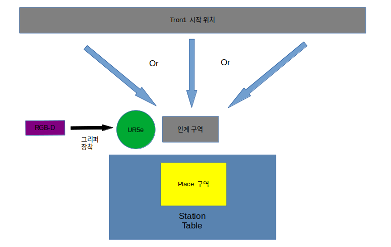
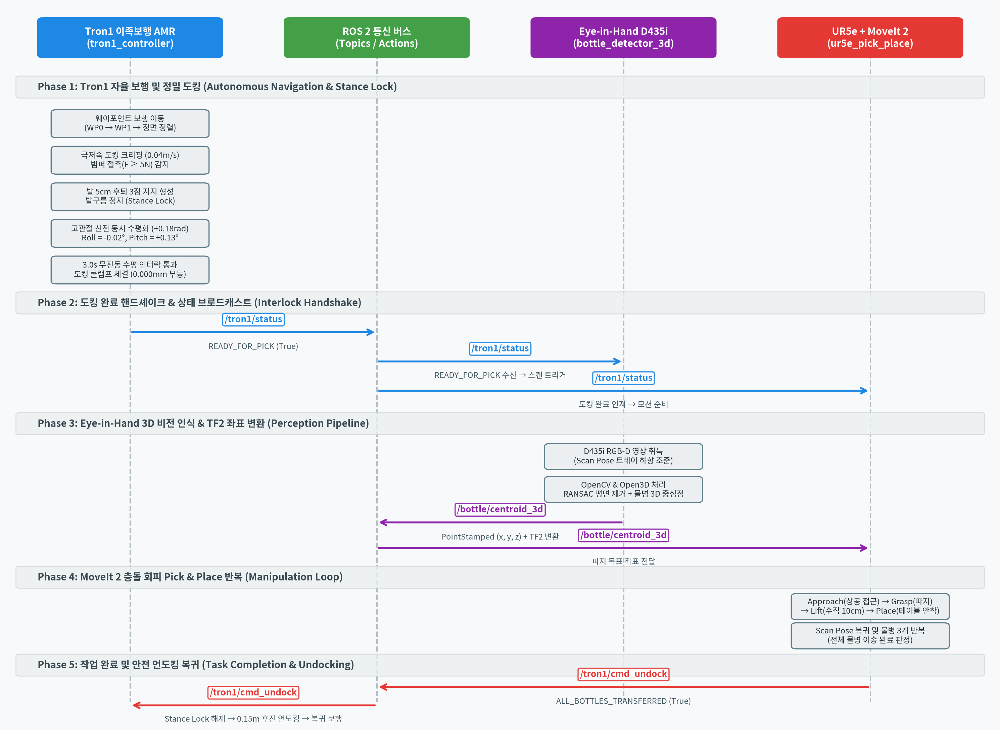
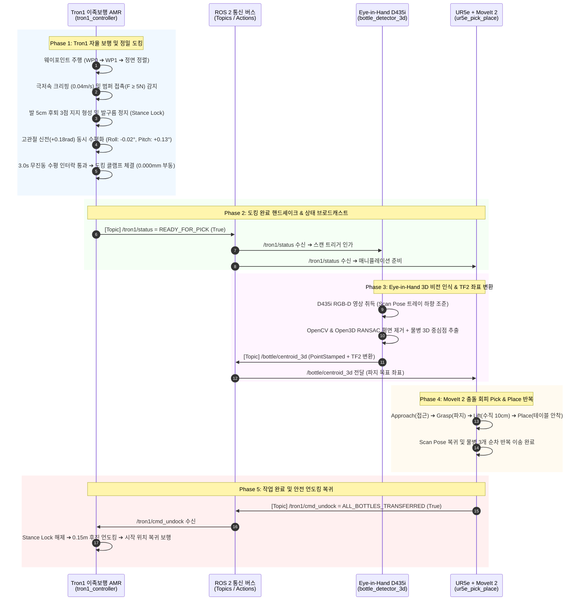

# Proj_Transferring_bottle_from_tron1_to_ur5e_in_mujoco_env
* **Update:** 2026.09.11.
* **GitHub:** https://github.com/Centaucyan/Proj_Transferring_bottle_from_tron1_to_ur5e_in_mujoco_env.git
---

## 1. Description
* **개요:** MuJoCo 환경에서 Tron1(이족 보행 로봇)이 병을 인계 구역으로 이동 후 정지하면 UR5e(로봇팔)가 병을 인식한 후  Pick-and-Place 시스템 구현

* **목적:** MuJoCo 시뮬레이터와 ROS2를 기반으로 Tron1(이족 보행 로봇)을 제어하고, Moveit2 라이브러리 사용법, 객체 인식 및 Pick-and-Place 기능의 구현 프로세스 이해

* **HardWare:** 
    * **Robot:** LimX Dynamics Tron1(2족 보행 로봇), Universal Robots UR5e(로봇팔), Robotiq 2F-85(그리퍼)
    * **Sensor:**  Realsense D435i(RGB-D 카메라)

### 1.1. 작업 공간 및 환경 레이아웃 (Workspace Layout)


### 1.2. 시나리오 상의 실제 ROS 2 상호 통신 흐름 (Multi-Robot Sequence Flow)
Tron1(이족보행 AMR)이 물병 3개를 적재·운반하여 작업대 테이블에 정밀 도킹하고 수평 정적 안정($Roll \approx 0.0^\circ, Pitch \approx 0.0^\circ$, 0.000mm 부동)을 달성하면, **상태 토픽(`/tron1/status: READY_FOR_PICK`)을 발행하여 UR5e 로봇팔에 인계 준비를 알리고, UR5e가 D435i 비전 인식 및 MoveIt 2 충돌 회피 Pick & Place를 수행하는 전체 ROS 2 통신 아키텍처 및 인터락(Interlock) 시퀀스**입니다.



#### 📡 주요 ROS 2 인터페이스 명세

| 구분 | 토픽 / 메시지명 | 메시지 타입 | 송신 노드 ➔ 수신 노드 | 핵심 기능 및 상호 연동 설명 |
| :---: | :--- | :--- | :---: | :--- |
| **도킹 상태** | `/tron1/status` | `std_msgs/String`<br>`(또는 Custom Status)` | `tron1_controller` ➔ `bottle_detector_3d`<br>`ur5e_pick_place` | 발 5cm 후퇴 3점 지지, 동시 수평화 및 3초 무진동 통과 후 **`READY_FOR_PICK` (도킹 고정 완료)** 신호 브로드캐스트 |
| **비전 좌표** | `/bottle/centroid_3d` | `geometry_msgs/PointStamped` | `bottle_detector_3d` ➔ `ur5e_pick_place` | Eye-in-Hand D435i로 트레이 상공을 스캔하여 RANSAC 평면 제거 후 산출된 물병의 3D 중심점($X,Y,Z$) 및 TF2 변환 좌표 전달 |
| **작업 완료** | `/tron1/cmd_undock` | `std_msgs/Bool` | `ur5e_pick_place` ➔ `tron1_controller` | 물병 3개 이송 완료(`ALL_BOTTLES_TRANSFERRED`) 후 Tron1에 클램프 해제, 0.15m 후진 언도킹 및 복귀 보행 지시 |

<details>
<summary><b>🔍 GitHub 인터랙티브 시퀀스 다이어그램 (Mermaid Code) 펼쳐보기</b></summary>



</details>

---

## 2. 환경
* **OS:** Ubuntu 22.04 LTS
* **Language / Env:** Python 3.10.x (Conda 가상환경: `transfer_bottle_by_tron1_py3_10`)
* **Framework:** ROS2 Humble
* **Simulator:** MuJoCo 3.x
* **Core Libraries:** MoveIt 2, OpenCV, Open3D, py_trees
* **Tools:** Colcon, RViz2, MuJoCo Viewer
---

## 3. Pre-to-do
프로젝트 실행 전 아래 절차에 따라 의존성 패키지 설치 및 Conda 가상환경을 구축합니다.  
(자세한 패키지 구성 및 설명은 [documents/required_package.md](documents/required_package.md)를 참고하세요.)

### 3.1. 시스템 업데이트 및 필수 패키지 일괄 설치 (apt)
```bash
sudo apt update
sudo apt install -y \
  python3-colcon-common-extensions \
  python3-rosdep \
  libgl1-mesa-dev \
  libgl1-mesa-glx \
  libosmesa6-dev \
  libglew-dev \
  libglfw3 \
  libglfw3-dev \
  ros-humble-rviz2 \
  ros-humble-moveit \
  ros-humble-cv-bridge \
  ros-humble-sensor-msgs-py \
  ros-humble-ur-description \
  ros-humble-xacro \
  ros-humble-control-msgs \
  ros-humble-trajectory-msgs \
  ros-humble-tf2-ros \
  ros-humble-tf2-geometry-msgs \
  ros-humble-tf-transformations \
  ros-humble-py-trees \
  ros-humble-py-trees-ros
```

#### 💡 apt 설치 패키지 주요 역할 및 기능 요약

| 패키지명 | 분류 | 본 프로젝트에서의 핵심 역할 및 목적 |
| :--- | :--- | :--- |
| **`python3-colcon-common-extensions`** | 빌드 도구 | ROS 2 워크스페이스의 커스텀 메시지, 인터페이스 및 노드 패키지를 빌드(`colcon build`)하는 표준 도구 세트 |
| **`python3-rosdep`** | 의존성 관리 | ROS 2 패키지의 `package.xml`에 명시된 시스템 종속성 라이브러리를 자동 검사 및 설치하는 관리 도구 |
| **`libgl1-mesa-dev`** | 렌더링 코어 | Mesa OpenGL 런타임의 기본 C/C++ 개발 헤더 및 공유 라이브러리 인터페이스 |
| **`libgl1-mesa-glx`** | 렌더링 코어 | X11 윈도우 디스플레이 시스템과 OpenGL 그래픽스 렌더링 컨텍스트를 연결하는 GLX 라이브러리 |
| **`libosmesa6-dev`** | 오프스크린 렌더링 | X-Server 디스플레이가 없는 백그라운드 환경에서도 CPU 기반으로 3D 장면을 렌더링하는 OSMesa 라이브러리 |
| **`libglew-dev`** | OpenGL 확장 | OpenGL Extension Wrangler Library. 고성능 셰이더 및 최신 OpenGL 확장 함수 포인터를 동적으로 탐색/로딩 |
| **`libglfw3`** | 창/입력 관리 | MuJoCo 뷰어 실행 시 크로스 플랫폼 윈도우 생성 및 키보드/마우스 상호작용 이벤트를 처리하는 런타임 |
| **`libglfw3-dev`** | 창/입력 관리 | GLFW3 라이브러리의 C/C++ 개발 헤더 파일 및 빌드용 심볼릭 링크 파일 |
| **`ros-humble-rviz2`** | 3D 시각화 | 로봇 모델(URDF), 센서 포인트클라우드, TF 좌표계, MoveIt 계획 궤적을 3D 그래픽으로 모니터링하는 ROS 2 시각화 도구 |
| **`ros-humble-moveit`** | 모션 플래닝 | UR5e 6축 매니퓰레이터의 기구학(IK/FK), 충돌 감지(OMPL), 모션 플래닝 메타 패키지 (move_group, planning interface, moveit_msgs 포함) |
| **`ros-humble-cv-bridge`** | 비전 인터페이스 | ROS 2 이미지 메시지(`sensor_msgs/msg/Image`)와 OpenCV 이미지 포맷(`numpy.ndarray`) 간의 무손실 고속 상호 변환 |
| **`ros-humble-sensor-msgs-py`** | 센서 데이터 | PointCloud2, LaserScan, Image 등 복잡한 센서 메시지 바이너리를 Python에서 처리하기 위한 유틸리티 |
| **`ros-humble-ur-description`** | 로봇 에셋 | Universal Robots(UR5e 등)의 공식 로봇 모델(URDF/XACRO) 및 3D 시각/충돌 메쉬(`*.dae`, `*.stl`) 파일 세트 |
| **`ros-humble-xacro`** | 로봇 모델링 | XML 매크로 파서. 복잡한 로봇 URDF를 변수화/모듈화하고 MuJoCo 변환용 평탄화(Flattening) URDF 생성 지원 |
| **`ros-humble-control-msgs`** | 제어 인터페이스 | 관절 궤적 추종(`FollowJointTrajectory`), 그리퍼 구동 명령 등 로봇 액터 제어 표준 액션/서비스 정의 |
| **`ros-humble-trajectory-msgs`** | 제어 인터페이스 | 시간에 따른 다관절 위치/속도/가속도/가크 목표점(`JointTrajectoryPoint`)을 표현하는 표준 메시지 |
| **`ros-humble-tf2-ros`** | 좌표계 변환 | Tron1 베이스, 트레이, D435i 카메라, UR5e 베이스, 엔드이펙터 간의 3D 공간 좌표계 트리 브로드캐스트/리스너 |
| **`ros-humble-tf2-geometry-msgs`** | 좌표계 변환 | Point, Pose, Vector3 등 기하학적 데이터 구조를 TF2 좌표 변환 파이프라인에서 직접 변환할 수 있는 헬퍼 |
| **`ros-humble-tf-transformations`** | 좌표계 변환 | 쿼터니언(Quaternion), 회전행렬, 오일러각 간의 수학적 상호 변환을 지원하는 ROS 2 표준 파이썬 라이브러리 |
| **`ros-humble-py-trees`** | 상태 머신 (BT) | 병렬 파이프라이닝(물병 전달 및 사전 스캔 동시 수행)과 6대 예외 복구를 관장하는 Behavior Tree 상태 머신 코어 |
| **`ros-humble-py-trees-ros`** | 상태 머신 (BT) | Behavior Tree 노드에서 ROS 2 토픽, 서비스, 액션을 비동기(Non-blocking)로 직접 호출하고 연동하는 확장 어댑터 |

---

### 3.2. Conda 가상환경 생성 및 활성화
> **주의:** ROS 2 Humble과의 C++ 및 Python ABI 호환을 위해 반드시 **`python=3.10`**으로 생성합니다.

```bash
# 가상환경 생성 및 활성화
conda create -n transfer_bottle_by_tron1_py3_10 python=3.10 -y
conda activate transfer_bottle_by_tron1_py3_10
```

> **[중요] CXXABI 충돌 여부 진단 및 상황별 조치 방법:**  
> Conda 환경을 활성화하면 Conda 내부 라이브러리가 우선 탐색되므로, Conda의 `libstdc++.so.6` 버전이 시스템(Ubuntu 22.04)보다 낮을 경우 `import rclpy` 시 `version GLIBCXX_3.4.30 not found` 에러가 발생할 수 있습니다.
> 
> * **1단계 (진단):** ROS 2 소싱 후 Phase 00 환경 진단 스크립트를 실행합니다.
>   ```bash
>   source /opt/ros/humble/setup.bash
>   python scripts_devel_roadmap/phase00_check_env.py
>   ```
> * **2단계 (조치):** 진단 결과에 따라 다음과 같이 조치합니다.
>   * **정상 (`OK`):** 아무 조치도 필요 없으므로 바로 **3.3절**로 진행합니다.
>   * **심볼 충돌 에러 발생 시 (`GLIBCXX not found`):** 아래 방법 중 하나로 라이브러리를 최신화합니다.
>     * **[방법 1 - 권장] Conda-Forge libstdc++ 최신화:**
>       ```bash
>       conda install -c conda-forge libstdcxx-ng -y
>       ```
>     * **[방법 2 - 확실한 대안] 시스템 libstdc++ 심볼릭 링크 연결:**  
>       *(방법 1 이후에도 버전 불일치 시, 시스템 라이브러리를 직접 가상환경에 링크)*
>       ```bash
>       ln -sf /usr/lib/x86_64-linux-gnu/libstdc++.so.6 $CONDA_PREFIX/lib/libstdc++.so.6
>       ```
> 
> *(보다 상세한 CXXABI 동적 바인딩 이론 및 원리는 [documents/development_roadmap/rm_phase00_runtime_binding.md](documents/development_roadmap/rm_phase00_runtime_binding.md) 문서를 참고하세요.)*

### 3.3. ROS 2 환경 오버레이 및 Python 핵심 패키지 설치
```bash
# ROS 2 환경 로드
source /opt/ros/humble/setup.bash

# 가상환경 내 시뮬레이터 및 비전 라이브러리 설치
python -m pip install --upgrade pip
python -m pip install mujoco mujoco-python-viewer opencv-python open3d numpy scipy transforms3d pyyaml matplotlib typeguard pydot onnxruntime
```

#### 💡 Python 핵심 패키지(pip) 주요 역할 및 기능 요약

| 패키지명 | 분류 | 본 프로젝트에서의 핵심 역할 |
| :--- | :--- | :--- |
| **`mujoco`** | 물리 시뮬레이터 | DeepMind의 고속 다물체 물리 엔진 코어. Tron1의 지면 접촉 및 UR5e/2F-85 그리퍼 접촉 동역학 연산 |
| **`mujoco-python-viewer`** | GUI 시각화 | Python에서 MuJoCo 씬을 실시간 3D 창으로 렌더링하고 시점 이동 및 물리 디버깅을 제공하는 인터랙티브 뷰어 |
| **`opencv-python`** | 2D 비전 | D435i 카메라의 2D 컬러(RGB) 영상 처리, 이미지 필터링 및 포맷 변환 지원 |
| **`open3d`** | 3D 비전 | Depth 데이터 기반 포인트 클라우드 생성, RANSAC 트레이 평면 분할 및 **물병의 3D 기하학적 중심점(Centroid) 계산** |
| **`numpy`** | 수치 연산 | 다차원 배열, 벡터 및 행렬 연산의 기본 코어 라이브러리 |
| **`scipy`** | 과학 계산 | 로봇 궤적 보간(Spline Interpolation), 공간 변환 및 수치 최적화 연산 |
| **`transforms3d`** | 좌표 변환 | 오일러각, 쿼터니언, 회전행렬, 동차변환행렬(Homogeneous Matrix) 간의 상호 변환 계산 |
| **`pyyaml`** | 환경 설정 | 로봇 물리 파라미터, 관절 게인, 씬 설정 등의 YAML 설정 파일 로드 및 파싱 |
| **`matplotlib`** | 데이터 시각화 | Tron1 보행 시 ZMP 궤적, 관절 토크 곡선, 정지 자세 안정화 수렴 시간 등을 2D 그래프로 플롯 분석 |
| **`typeguard`** | 런타임 타입 검증 | ROS 2 파라미터 생성 라이브러리(`generate-parameter-library-py`) 의존성 충족 및 타입 안전성 보장 |
| **`pydot`** | BT 시각화 | `py_trees` 내부의 트리 구조 시각화 및 DOT 그래프 렌더링 지원 (Conda 격리 환경 필수 의존성) |
| **`onnxruntime`** | 기계학습 추론 | LimX Dynamics 공식 사전 훈련 강화학습 정책(policy.onnx, encoder.onnx)을 CPU에서 500Hz로 실시간 추론하여 Tron1 제자리 발구름 및 균형 제어 |

---

### 3.4. 환경 정상 연동 검증
```bash
python -c 'import rclpy; import mujoco; import open3d; import cv2; import tf2_ros; import py_trees; import typeguard; import pydot; import onnxruntime; print("✅ transfer_bottle_by_tron1_py3_10 핵심 환경 구성 완료!")'
```
---

## 4. Reference
* https://github.com/google-deepmind/mujoco_menagerie.git
* https://github.com/limxdynamics/tron1-rl-deploy-python
---


