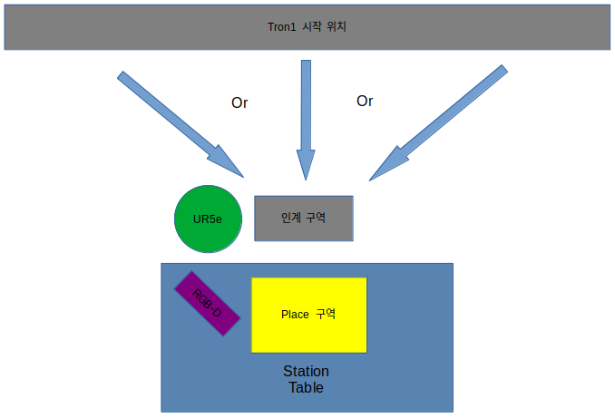

# Proj_Transferring_bottle_from_tron1_to_ur5e_in_mujoco_env
* Update: 2026.09.03.
---

## 1. Description
* **개요:** MuJoCo 환경에서 Tron1(이족 보행 로봇)이 병을 인계 구역으로 이동 후 정지하면 UR5e(로봇팔)가 병을 인식한 후  Pick-and-Place 시스템 구현

* **목적:** MuJoCo 시뮬레이터와 ROS2를 기반으로 Tron1(이족 보행 로봇)을 제어하고, Moveit2 라이브러리 사용법, 객체 인식 및 Pick-and-Place 기능의 구현 프로세스 이해

* **HardWare:** 
    * **Robot:** LimX Dynamics Tron1(2족 보행 로봇), Universal Robots UR5e(로봇팔), Robotiq 2F-85(그리퍼)
    * **Sensor:**  Realsense D435i(RGB-D 카메라)


---

## 2. 환경
* **OS:** Ubuntu 22.04 LTS
* **Language / Env:** Python 3.10.x (Conda 가상환경: `transfer_bottle_by_tron1_py3_10`)
* **Framework:** ROS2 Humble
* **Simulator:** MuJoCo 3.x
* **Core Libraries:** MoveIt 2, OpenCV, Open3D, py_trees
* **Tools:** Colcon, RViz2, MuJoCo Viewer
---

## 3. Pre-to-do
프로젝트 실행 전 아래 절차에 따라 의존성 패키지 설치 및 Conda 가상환경을 구축합니다.  
(자세한 패키지 구성 및 설명은 [documents/required_package.md](documents/required_package.md)를 참고하세요.)

### 3.1. 시스템 및 ROS 2 필수 패키지 설치 (apt)
```bash
sudo apt update
sudo apt install -y \
  ros-humble-moveit \
  ros-humble-moveit-py \
  ros-humble-cv-bridge \
  ros-humble-sensor-msgs-py \
  ros-humble-ur-description \
  ros-humble-py-trees \
  ros-humble-py-trees-ros \
  python3-colcon-common-extensions \
  python3-rosdep
```

### 3.2. Conda 가상환경 생성 및 활성화
> **주의:** ROS 2 Humble과의 호환성을 위해 반드시 **`python=3.10`**으로 생성합니다.

```bash
# 가상환경 생성 및 활성화
conda create -n transfer_bottle_by_tron1_py3_10 python=3.10 -y
conda activate transfer_bottle_by_tron1_py3_10

# (권장) ROS 2 라이브러리 충돌 방지를 위한 libstdc++ 최신화
conda install -c conda-forge libstdcxx-ng -y
```

### 3.3. ROS 2 환경 오버레이 및 Python 핵심 패키지 설치
```bash
# ROS 2 환경 로드
source /opt/ros/humble/setup.bash

# 가상환경 내 시뮬레이터 및 비전 라이브러리 설치
pip install --upgrade pip
pip install mujoco mujoco-python-viewer opencv-python open3d numpy scipy transforms3d pyyaml
```

### 3.4. 환경 정상 연동 검증
```bash
python -c "import rclpy; import mujoco; import open3d; import cv2; print('✅ transfer_bottle_by_tron1_py3_10 환경 구성 완료!')"
```
---

## 4. Reference
* https://github.com/google-deepmind/mujoco_menagerie.git
---


