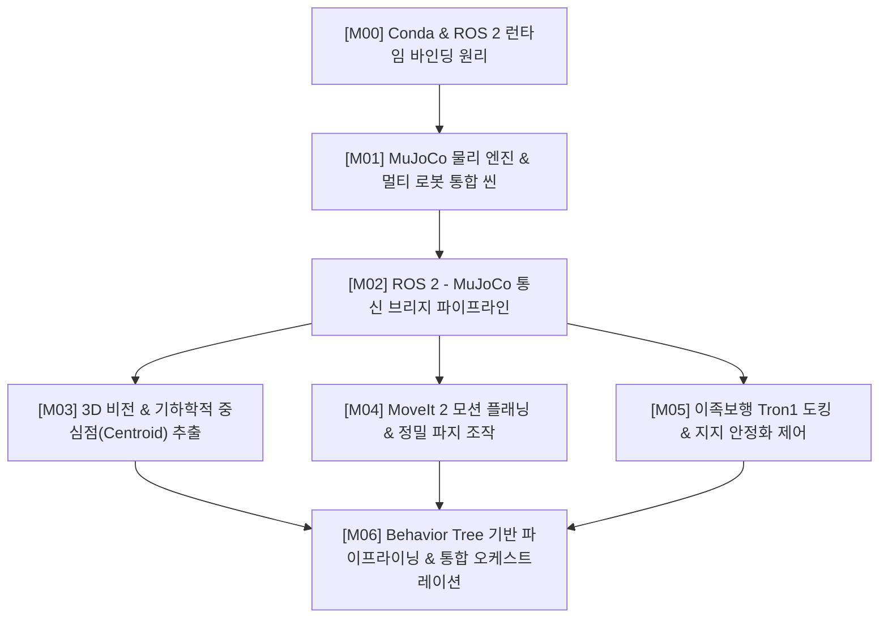

# [Roadmap] 이론 학습 기반 로봇 시뮬레이션 개발 로드맵
# (Learning-Oriented Development Roadmap: Tron1 to UR5e Bottle Transfer System)

* **문서 버전:** v1.0
* **작성일:** 2026-09-03
* **프로젝트:** `Proj_Transferring_bottle_from_tron1_to_ur5e_in_mujoco_env`
* **개발 환경:** Ubuntu 22.04 LTS / ROS 2 Humble / MuJoCo 3.x / Conda (`transfer_bottle_by_tron1_py3_10`)
* **문서 목적:** 단순 구현을 넘어, 각 단계의 **수학적/물리적 원리, 제어 이론, 알고리즘 메커니즘**을 단계별로 직접 실습하고 검증하며 체득하는 것을 최우선 목적으로 합니다.

---

## 목차 (Table of Contents)

* [Milestone 00: Conda 가상환경과 ROS 2 Humble 런타임 바인딩 원리](#milestone-00-conda-가상환경과-ros-2-humble-런타임-바인딩-원리)
* [Milestone 01: MuJoCo 물리 엔진과 멀티 로봇 통합 씬(Scene) 역학](#milestone-01-mujoco-물리-엔진과-멀티-로봇-통합-씬scene-역학)
* [Milestone 02: ROS 2 - MuJoCo 비동기 브리지 및 통신 아키텍처](#milestone-02-ros-2---mujoco-비동기-브리지-및-통신-아키텍처)
* [Milestone 03: 3D 비전 및 기하학적 중심점(Centroid) 추출 알고리즘](#milestone-03-3d-비전-및-기하학적-중심점centroid-추출-알고리즘)
* [Milestone 04: 협동로봇(UR5e) 조작 및 MoveIt 2 모션 플래닝 원리](#milestone-04-협동로봇ur5e-조작-및-moveit-2-모션-플래닝-원리)
* [Milestone 05: 이족 보행 로봇(Tron1) 제어 및 동적 인터락(Interlock)](#milestone-05-이족-보행-로봇tron1-제어-및-동적-인터락interlock)
* [Milestone 06: Behavior Tree 기반 파이프라이닝 및 통합 오케스트레이션](#milestone-06-behavior-tree-기반-파이프라이닝-및-통합-오케스트레이션)
* [부록: 마일스톤별 권장 산출물 체크리스트](#마일스톤별-권장-산출물-체크리스트)

---

## 전체 로드맵 구성 요약

---

## [Milestone 00] Conda 가상환경과 ROS 2 Humble 런타임 바인딩 원리

### 1. 학습 목표
* Linux 시스템에서 공유 라이브러리(`*.so`)가 링커에 의해 동적으로 로드되는 원리를 이해한다.
* ROS 2 C++ 빌드 바이너리와 Conda Python 3.10 가상환경이 충돌 없이 결합되는 메커니즘을 파악한다.

### 2. 핵심 이론 및 원리
* **동적 링킹 및 환경 변수 우선순위:**
  * 리눅스는 `LD_LIBRARY_PATH`와 `RPATH`를 참조하여 공유 라이브러리를 탐색합니다.
  * Conda 환경을 활성화하면 Conda의 `lib/` 경로가 시스템 `/usr/lib`보다 우선순위를 갖게 됩니다.
* **CXXABI 버전 충돌 (`libstdc++.so.6`):**
  * ROS 2 Humble 바이너리는 시스템 GCC(Ubuntu 22.04 기본 GCC 11.4)로 컴파일된 `GLIBCXX_3.4.29` 이상의 심볼을 요구합니다.
  * Conda 환경의 `libstdc++` 버전이 낮을 경우 `undefined symbol` 에러가 발생하므로, `conda-forge libstdcxx-ng`로 최신화해야 하는 원리를 이해합니다.

### 3. 실습 및 구현 단계
1. `transfer_bottle_by_tron1_py3_10` 가상환경 생성 (`python=3.10`).
2. Conda 환경 활성화 후 `/opt/ros/humble/setup.bash` 로드.
3. `ldd` 명령어로 `rclpy`의 C-확장 모듈이 어떤 `libstdc++.so`를 참조하는지 확인.
4. Python 런타임에서 `rclpy`, `mujoco`, `open3d`, `cv2`의 순차 임포트 및 심볼 충돌 여부 진단.

### 4. 원리 검증 자가 진단
* [ ] Python 3.11이나 3.12로 환경을 만들었을 때 `rclpy`에서 발생하는 `ModuleNotFoundError`의 이유를 설명할 수 있는가?
* [ ] `which python`과 `python -c "import sys; print(sys.path)"`를 통해 모듈 탐색 순서를 추적할 수 있는가?

---

## [Milestone 01] MuJoCo 물리 엔진과 멀티 로봇 통합 씬(Scene) 역학

### 1. 학습 목표
* MuJoCo의 볼록 다면체 접촉 역학(Convex Contact Dynamics)과 조인트 자유도(DoF) 모델링 원리를 이해한다.
* `work_space_01.png` 레이아웃에 맞춰 복수의 독립 로봇 모델을 하나의 물리 월드(`scene.xml`)로 통합한다.

### 2. 핵심 이론 및 원리
* **URDF vs MJCF (MuJoCo XML):**
  * URDF는 폐루프(Closed kinematic loop)를 직접 표현하기 어렵지만, MJCF는 `<equality>` 태그(`connect`, `weld`)를 통해 병렬 링크 및 기구학적 구속 조건을 지원합니다.
* **Robotiq 2F-85의 미믹(Mimic) 조인트 원리:**
  * 모터 1개로 양쪽 집게가 대칭 동작하는 4절 링크(Four-bar linkage) 구조를 MJCF의 `<equality><joint>` 구속식으로 모델링하는 원리를 배웁니다.
* **접촉 물리 파라미터 (`solref`, `solimp`, `friction`):**
  * 물병을 파지하거나 트레이에 싣고 걸을 때 물체가 미끄러지지 않도록 슬라이딩 마찰(Sliding), 비틀림 마찰(Torsional), 구름 마찰(Rolling) 계수를 튜닝하는 물리적 배경을 학습합니다.

### 3. 실습 및 구현 단계
1. **모델 탐색:** `model_ori/` 폴더 내의 각 로봇(Tron1, UR5e, 2F-85, D435i) 메쉬 및 XML 계층 구조 분석.
2. **그리퍼 결합:** UR5e의 `wrist_3_link` 끝단에 Robotiq 2F-85 베이스를 `<attach>` 또는 하위 바디로 조립.
3. **환경 배치 (`scene.xml` 생성):**
   * Station Table 생성 (크기 및 재질 정의).
   * D435i 카메라를 테이블 좌상단 모서리에 거치대 기둥과 함께 배치 (높이 +25cm, Pitch -25° Tilt).
   * Place 구역(테이블 상면) 및 인계 구역(테이블 북측 앞) 정의.
   * 원통형 물병(Cylinder/Capsule geom) 생성 및 트레이 위에 적재.
4. **마찰력 튜닝:** 그리퍼 실리콘 패드와 물병 표면의 마찰 계수(`friction="1.5 0.005 0.0001"`) 설정.

### 4. 원리 검증 자가 진단
* [ ] 마찰 계수를 극단적으로 낮추었을 때(예: `0.01`), 로봇팔이 병을 잡으려 할 때 미끄러져 빠지는 현상이 재현되는가?
* [ ] 카메라의 Pitch 각도를 변경하면서 시야각(FOV) 내에 인계 구역과 로봇팔이 어떻게 투영되는지 확인했는가?

---

## [Milestone 02] ROS 2 - MuJoCo 비동기 브리지 및 통신 아키텍처

### 1. 학습 목표
* 시뮬레이션의 동역학 적분 루프(Physics Loop)와 ROS 2의 비동기 이벤트 루프(Executor) 간의 동기화 원리를 학습한다.
* 시뮬레이터 내부 데이터를 ROS 2 표준 메시지(`sensor_msgs`, `trajectory_msgs`)로 변환하는 브리지를 구현한다.

### 2. 핵심 이론 및 원리
* **Sim Time vs Wall Time:**
  * 물리 엔진의 고정 시간 간격(Fixed dt = 0.002s, 500Hz)과 실제 컴퓨터 클럭 간의 괴리를 해결하기 위해 `/clock` 토픽을 발행하고 `use_sim_time:=true`를 설정하는 원리.
* **QoS (Quality of Service) 프로파일:**
  * 대용량 이미지 데이터(Camera): 네트워크 지연을 방지하기 위해 `SensorDataQoS`(Best Effort, Volatile) 사용.
  * 관절 제어 명령(Control Command): 명령 유실 방지를 위해 `ReliableQoS` 사용.
* **오프스크린 렌더링 (Offscreen Rendering):**
  * OpenGL 프레임버퍼(FBO)를 활용하여 화면 디스플레이 없이 가상 카메라의 RGB 버퍼와 Depth 버퍼를 고속으로 읽어오는 파이프라인.

### 3. 실습 및 구현 단계
1. **MuJoCo 시뮬레이션 루프 작성 (`mujoco_sim_node.py`):**
   * `mj_step(model, data)`를 일정 주기로 구동하는 메인 루프 설계.
2. **센서 데이터 퍼블리셔 구현:**
   * 가상 D435i 카메라로부터 RGB 이미지(`sensor_msgs/Image`) 및 Depth 이미지 추출 후 발행 (`cv_bridge` 활용).
   * UR5e 및 Tron1의 각 관절 엔코더 값을 읽어 `sensor_msgs/JointState` 퍼블리시.
3. **제어기 서브스크라이버 구현:**
   * UR5e 관절 제어 명령(`trajectory_msgs/JointTrajectory`) 수신 및 `data.ctrl` 모터 입력 매핑.
   * 그리퍼 개폐 명령 액션 서버(`control_msgs/action/GripperCommand`) 구현.

### 4. 원리 검증 자가 진단
* [ ] RViz2를 실행하여 시뮬레이터 속 D435i 카메라 시점의 영상이 실시간 토픽으로 시각화되는가?
* [ ] `ros2 topic hz /joint_states` 명령을 통해 설정한 발행 주기(예: 50Hz)가 안정적으로 유지되는가?

---

## [Milestone 03] 3D 비전 및 기하학적 중심점(Centroid) 추출 알고리즘

### 1. 학습 목표
* 2D 이미지 좌표를 3D 공간 포인트로 변환하는 핀홀 카메라(Pin-hole Camera) 수학 모델을 이해한다.
* RANSAC 평면 제거 및 유클리드 군집화(Clustering) 알고리즘을 코드로 직접 구현하고 원리를 체득한다.

### 2. 핵심 이론 및 원리
* **핀홀 카메라 모델과 역투영(Back-projection):**
  * 내부 파라미터($f_x, f_y, c_x, c_y$)와 픽셀 좌표 $(u, v)$, 깊이값 $Z$로부터 3D 카메라 좌표 $(X, Y, Z)$를 구하는 공식:
    $$X = \frac{(u - c_x) \cdot Z}{f_x}, \quad Y = \frac{(v - c_y) \cdot Z}{f_y}$$
* **RANSAC (Random Sample Consensus) 평면 제거:**
  * 무작위로 3개 점을 선택하여 평면 방정식을 구성하고, 임계 거리(Distance Threshold) 내의 Inlier 개수를 평가하여 트레이 상판 평면을 분리해 내는 원리.
* **DBSCAN 계열 유클리드 군집화 (Euclidean Clustering):**
  * KD-Tree 공간 분할 자료구조를 활용하여 인접 포인트 간 거리가 $\epsilon$ 이하인 점들을 하나의 물병으로 묶는 원리.
* **기하학적 중심점(Centroid) 계산:**
  * 각 클러스터에 속한 $N$개 포인트의 평균 $(\bar{X}, \bar{Y}, \bar{Z})$을 산출하고, 원통형 물체의 높이/종횡비를 분석하여 직립 상태를 판정하는 원리.

### 3. 실습 및 구현 단계
1. **포인트 클라우드 변환 노드 (`vision_processing_node.py`):**
   * RGB-D 이미지로부터 Open3D `RGBDImage` 생성 및 포인트 클라우드(`PointCloud`) 변환.
2. **노이즈 제거 및 관심 영역(ROI) 크롭:**
   * 트레이 작업 공간 외곽(바닥, 벽 등)을 바운딩 박스로 1차 제거.
3. **RANSAC 평면 분할:**
   * `segment_plane(distance_threshold=0.01, ransac_n=3, num_iterations=1000)`을 적용하여 트레이 상판 제거.
4. **군집화 및 중심점 추출:**
   * `cluster_dbscan`을 수행하여 물병 개수 카운팅.
   * 각 클러스터의 바운딩 박스를 계산하고, 직립 높이가 임계치 이하(쓰러진 병)인 객체 필터링.
   * UR5e 베이스로부터의 거리를 기준으로 소팅하여 1순위 타겟 좌표 선정 및 좌표계 변환(`tf2`).

### 4. 원리 검증 자가 진단
* [ ] RANSAC의 `distance_threshold`를 너무 크게 또는 작게 설정했을 때 물병의 아랫부분이 잘려 나가는 현상을 관찰했는가?
* [ ] 트레이에 병 3개를 두었을 때, 카메라가 각 병의 중심점 3개를 정확히 식별하고 UR5e에 가장 가까운 순서대로 정렬하는가?

---

## [Milestone 04] 협동로봇(UR5e) 조작 및 MoveIt 2 모션 플래닝 원리

### 1. 학습 목표
* 6자유도 매니퓰레이터의 정기구학(FK)과 역기구학(IK), OMPL 기반 경로 계획 알고리즘의 동작 원리를 이해한다.
* 파지 상태 판정(Grasp Feedback)과 미끄러짐(Slip) 감지 로직을 구현한다.

### 2. 핵심 이론 및 원리
* **역기구학(IK)과 솔루션 분기:**
  * 6축 다관절 로봇은 동일한 엔드이펙터 포즈에 대해 최대 8개의 관절 각도 해(Elbow Up/Down, Shoulder Left/Right 등)가 존재합니다. 현재 자세에서 관절 이동량이 가장 작은 해를 선택하는 원리를 배웁니다.
* **C-Space (Configuration Space)와 RRT-Connect:**
  * 3차원 작업 공간의 장애물을 6차원 관절 공간의 장애물 영역으로 변환하고, 시작점과 목표점에서 트리를 동시에 확장(Bidirectional RRT)하여 무충돌 경로를 찾는 원리.
* **Approach & Retreat 벡터 설계:**
  * 파지 지점으로 직접 대각 이동하면 주변 병이나 트레이와 충돌하므로, 사전 접근(Pre-grasp: 물체 상단 10cm) $\rightarrow$ 수직 진입 $\rightarrow$ 파지 $\rightarrow$ 수직 상승(Retreat)의 경유점(Waypoints) 궤적 생성 기법.

### 3. 실습 및 구현 단계
1. **MoveIt 2 환경 설정:**
   * UR5e + Robotiq 2F-85 통합 URDF 기반 SRDF 및 플래닝 그룹(`ur5e_arm`, `gripper`) 정의.
   * Planning Scene에 Station Table 및 Tron1 트레이를 충돌체(Collision Object)로 등록.
2. **파지 모션 노드 작성 (`arm_manipulation_node.py`):**
   * 수신된 중심점 $(x, y, z)$을 기반으로 그리퍼 파지 포즈(수직 아래 방향 쿼터니언) 생성.
   * `MoveItPy` 또는 `MoveGroupActionClient`를 통해 Pre-grasp $\rightarrow$ Grasp $\rightarrow$ Lift $\rightarrow$ Place 궤적 순차 실행.
3. **그리퍼 피드백 검증 로직 구현:**
   * 파지 완료 후 그리퍼 엔코더 값 확인: `닫힘 폭 < 20mm`이면 헛파지(Miss)로 판단하고 즉시 에러 핸들링 호출.
   * 리프트 도중 접촉력 센서(또는 그리퍼 전류치)를 모니터링하여 미끄러짐(Slip) 감지.

### 4. 원리 검증 자가 진단
* [ ] MoveIt 2가 계획한 궤적이 트레이 모서리나 옆에 서 있는 다른 병과 충돌하지 않고 우회하는가?
* [ ] 트레이에 병이 없는 상태에서 파지 명령을 내렸을 때, 그리퍼가 완전히 닫히며 "헛파지(Grasp Miss)" 예외 상태로 정상 분기하는가?

---

## [Milestone 05] 이족 보행 로봇(Tron1) 제어 및 동적 인터락(Interlock)

### 1. 학습 목표
* 2족 보행 로봇의 질량 중심(CoM) 이동과 인계 구역 도킹 시의 자세 제어 원리를 이해한다.
* 물품 인계 중 외란을 억제하기 위한 로봇 간 상태 동기화 및 인터락(Interlock) 메커니즘을 구현한다.

### 2. 핵심 이론 및 원리
* **보행 정지 시의 동적 안정성 (Stance Stabilization):**
  * 2족 로봇은 정지 시에도 균형을 잡기 위해 미세한 발구름(In-place stepping)이 발생할 수 있습니다. 관절 PD 게인을 높이고 지지 모드(Stance Lock)로 전환하여 트레이 진동을 감쇠시키는 원리를 배웁니다.
* **페이로드 변화(Payload Change)에 따른 중력 보상:**
  * 로봇팔이 병(약 300~500g)을 집어 들어 올리는 순간, Tron1 상체의 무게중심이 급격히 변합니다. 이때 쓰러지지 않도록 지지력을 유지하는 동역학 보상 원리를 학습합니다.
* **하드웨어 인터락 (Interlock):**
  * UR5e가 손을 뻗어 조작하는 동안에는 Tron1의 이동 명령을 물리적으로 차단하고, Tron1의 IMU 가속도 급변 감지 시 UR5e를 비상 정지(E-Stop)시키는 상호 안전 메커니즘.

### 3. 실습 및 구현 단계
1. **Tron1 도킹 제어기 작성 (`tron1_docking_controller.py`):**
   * 시작 위치에서 인계 구역 목표 좌표까지 보행 이동 명령 전송.
   * 인계 구역 도달 후 무릎/발목 관절을 굴곡시켜 트레이 높이를 테이블 상면 높이와 정렬.
2. **정지 안정화 (3초 대기) 및 상태 토픽 발행:**
   * 자세 오차 및 속도가 임계치 이하로 수렴함을 확인 후 `/tron1/status` (`READY_FOR_PICK`) 토픽 발행.
3. **IMU 외란 모니터링:**
   * 인계 작업 중 롤/피치 각도가 급변하면 즉시 `/safety/emergency_stop` 토픽 브로드캐스트.
4. **복귀 모션 구현:**
   * 작업 완료 신호 수신 시 트레이 높이를 원복하고 초기 위치로 후진 보행.

### 4. 원리 검증 자가 진단
* [ ] 로봇팔이 병을 들어 올리는 순간 Tron1이 균형을 잃지 않고 자세를 유지하는가?
* [ ] Tron1이 흔들렸을 때 UR5e가 즉시 동작을 멈추고 충돌을 방지하는 안전 정지가 작동하는가?

---

## [Milestone 06] Behavior Tree 기반 파이프라이닝 및 통합 오케스트레이션

### 1. 학습 목표
* 복잡한 멀티 로봇 비동기 제어를 단일 FSM보다 유연한 비헤이비어 트리(Behavior Tree) 구조로 모델링하는 원리를 체득한다.
* 시나리오 3.6.1 & 3.6.2의 **비동기 사전 스캔(Pipelining)**과 6대 예외 처리 복구 로직을 통합 완성한다.

### 2. 핵심 이론 및 원리
* **Behavior Tree (BT) 핵심 제어 노드의 원리:**
  * **Sequence ($\rightarrow$):** 자식 노드가 모두 `SUCCESS`여야 성공 (순차 진행).
  * **Fallback (?):** 자식 노드 중 하나라도 `SUCCESS`면 성공 (예외 발생 시 복구 브랜치 실행).
  * **Parallel ($\rightrightarrows$):** 복수의 자식 노드를 동시에 구동 (로봇팔 Place 모션과 카메라의 다음 병 사전 스캔 동시 수행).
* **파이프라이닝(Pipelining)의 사이클 타임(Cycle Time) 단축 수학:**
  * $T_{\text{total}} = T_{\text{pick}} + \max(T_{\text{place}}, T_{\text{scan}}) + T_{\text{transfer}}$
  * 로봇팔 이동 시간 뒤로 비전 연산 시간을 은닉(Hiding)시켜 생산성을 극대화하는 산업용 제어 아키텍처의 원리를 이해합니다.

### 3. 실습 및 구현 단계
1. **`py_trees_ros` 기반 메인 오케스트레이터 구축 (`system_orchestrator.py`):**
   * Tron1 접근 및 정지 감지 $\rightarrow$ 1번째 병 좌표 송신 $\rightarrow$ 반복 루프 구성.
2. **병렬 파이프라이닝 브랜치 (Parallel Node) 구현:**
   * Branch A: UR5e가 병을 집어 Place 구역으로 이동 후 내려놓기.
   * Branch B: 로봇팔이 트레이 영역을 벗어남을 감지한 직후, D435i가 트레이를 스캔하여 다음 병 중심점을 연산하고 버퍼에 대기.
3. **6대 예외 상황(EH-1 ~ EH-6) Fallback 브랜치 삽입:**
   * 빈 트레이 도착 감지 시 조기 종료 및 복귀.
   * 헛파지/슬립 발생 시 사전 스캔 결과 무효화 및 트레이 재스캔 재시도.
   * 통신 지연 시 타임아웃 틱(Tick) 및 안전 정지.
4. **최종 완료 후 Tron1 복귀 트리거.**

### 4. 원리 검증 자가 진단 및 성능 평가
* [ ] **순차 처리 vs 파이프라이닝 성능 비교:**
  * 사전 스캔 없이 매번 순차적으로 스캔했을 때와, 병렬 파이프라이닝을 적용했을 때의 전체 3병 이송 시간을 측정하여 30% 이상 단축되는지 데이터로 확인했는가?
* [ ] **스트레스 테스트 (Stress Test):**
  * 다양한 병 개수(1개, 2개, 3개) 및 일부러 쓰러뜨려 놓은 예외 상황에서 시스템이 멈추거나 데드락에 걸리지 않고 100% 자가 복구하는가?

---

## 마일스톤별 권장 산출물 체크리스트

| 마일스톤 | 핵심 학습 산출물 | 위치 및 파일명 |
| :--- | :--- | :--- |
| **M00** | 런타임 환경 검증 스크립트 | `scripts/check_env.py` |
| **M01** | 통합 MuJoCo 씬 XML | `models/scene_integrated.xml` |
| **M02** | ROS 2 - MuJoCo 브리지 노드 | `src/sim_bridge/mujoco_ros_bridge.py` |
| **M03** | RANSAC & 클러스터링 비전 노드 | `src/vision/bottle_detector_3d.py` |
| **M04** | MoveIt 2 기반 Pick-and-Place 노드 | `src/manipulation/ur5e_pick_place.py` |
| **M05** | Tron1 도킹 및 Stance 제어 노드 | `src/locomotion/tron1_controller.py` |
| **M06** | Behavior Tree 전체 통합 오케스트레이터 | `src/orchestration/bt_main_orchestrator.py` |
