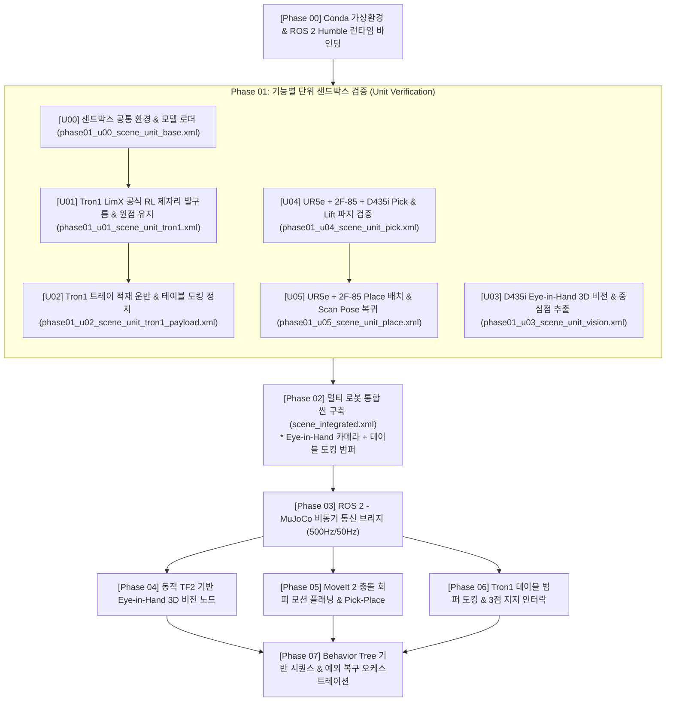

# [Roadmap] 이론 학습 및 단위 검증 기반 로봇 시뮬레이션 개발 로드맵
# (Learning & Unit Verification Oriented Development Roadmap: Tron1 to UR5e Bottle Transfer System)

* **문서 버전:** v2.1 (최신 아키텍처 반영: LimX 공식 RL + 테이블 범퍼 도킹 + Eye-in-Hand 카메라)
* **최종 갱신일:** 2026-09-08
* **프로젝트:** `Proj_Transferring_bottle_from_tron1_to_ur5e_in_mujoco_env`
* **개발 환경:** Ubuntu 22.04 LTS / ROS 2 Humble / MuJoCo 3.12.0 / Conda (`transfer_bottle_by_tron1_py3_10`)
* **핵심 아키텍처 변경사항:**
  1. **Tron1 보행 제어기:** LimX 공식 500Hz/50Hz 사전학습 심층 강화학습(DRL) ONNX 모델(`policy.onnx`, `encoder.onnx`) 및 원점 복원 제어(Origin Position Hold PD) 적용.
  2. **인계 구역 도킹 방식:** 점 발바닥 로봇의 특성을 반영하여, 무릎 단독 착석 대신 **상체 전면 범퍼를 작업대 테이블 모서리에 기대어 3점 지지를 형성하는 '테이블 범퍼 거치 도킹(Table Bumper Rest)'** 및 발구름 정지(`Stance Lock`) 메커니즘 확정.
  3. **3D 비전 카메라:** 작업대 고정식(Eye-to-Hand)에서 **Robotiq 2F-85 그리퍼 베이스 중앙 장착식(Eye-in-Hand)**으로 전환하여 시야 차폐 방지 및 시각 서보잉 정밀도 극대화.
* **문서 목적:** 단순 구현을 넘어, 각 단계의 **수학적/물리적 원리, 제어 이론, 알고리즘 메커니즘**을 단계별로 직접 실습하고 검증하며 체득하는 것을 최우선 목적으로 합니다. 특히 복잡한 전체 시스템을 결합하기 전, **각 기능별 독립 단위 샌드박스 씬(Unit Sandbox Scene)에서 선(先) 검증(Bottom-Up Verification)**을 완수한 후 점진적으로 통합합니다.

---

## 목차 (Table of Contents)

* [전체 파이프라인 구성 요약](#전체-파이프라인-구성-요약)
* [Phase 00: Conda 가상환경과 ROS 2 Humble 런타임 바인딩 원리](#phase-00-conda-가상환경과-ros-2-humble-런타임-바인딩-원리)
* [Phase 01: 기능별 단위 샌드박스 검증 (Unit Sandbox Verification)](#phase-01-기능별-단위-샌드박스-검증-unit-sandbox-verification)
  * [U00: 단위 검증 샌드박스 공통 환경 및 모델 로더 검증](#u00-단위-검증-샌드박스-공통-환경-및-모델-로더-검증)
  * [U01: Tron1 공식 강화학습(RL) 이족보행 및 원점 제자리 발구름 단독 검증](#u01-tron1-공식-강화학습rl-이족보행-및-원점-제자리-발구름-단독-검증)
  * [U02: Tron1 상체 컵홀더 트레이 장착, 물병 적재 운반 및 테이블 도킹 정지 검증](#u02-tron1-상체-컵홀더-트레이-장착-물병-적재-운반-및-테이블-도킹-정지-검증)
  * [U03: RealSense D435i (Eye-in-Hand) 3D 비전 인식 및 기하학적 중심점 추출 단독 검증](#u03-realsense-d435i-eye-in-hand-3d-비전-인식-및-기하학적-중심점-추출-단독-검증)
  * [U04: UR5e + 2F-85 + D435i 조립 및 물병 Pick & Lift 파지 단독 검증](#u04-ur5e--2f-85--d435i-조립-및-물병-pick--lift-파지-단독-검증)
  * [U05: UR5e + 2F-85 물병 Place(배치) 및 관측 포즈 복귀 단독 검증](#u05-ur5e--2f-85-물병-place배치-및-관측-포즈-복귀-단독-검증)
* [Phase 02: 멀티 로봇 통합 씬(Integrated Scene) 구축 및 역학](#phase-02-멀티-로봇-통합-씬integrated-scene-구축-및-역학)
* [Phase 03: ROS 2 - MuJoCo 비동기 브리지 및 통신 아키텍처](#phase-03-ros-2---mujoco-비동기-브리지-및-통신-아키텍처)
* [Phase 04: Eye-in-Hand 3D 비전 파이프라인 및 동적 TF2 좌표 변환](#phase-04-eye-in-hand-3d-비전-파이프라인-및-동적-tf2-좌표-변환)
* [Phase 05: 협동로봇(UR5e) 조작 및 MoveIt 2 모션 플래닝 원리](#phase-05-협동로봇ur5e-조작-및-moveit-2-모션-플래닝-원리)
* [Phase 06: 이족 보행 로봇(Tron1) 테이블 범퍼 도킹 및 동적 인터락(Interlock)](#phase-06-이족-보행-로봇tron1-테이블-범퍼-도킹-및-동적-인터락interlock)
* [Phase 07: Behavior Tree 기반 파이프라이닝 및 통합 오케스트레이션](#phase-07-behavior-tree-기반-파이프라이닝-및-통합-오케스트레이션)
* [부록: 단계별 권장 산출물 체크리스트](#단계별-권장-산출물-체크리스트)

---

## 전체 파이프라인 구성 요약

---

## [Phase 00] Conda 가상환경과 ROS 2 Humble 런타임 바인딩 원리

### 1. 학습 목표
* Linux 시스템에서 공유 라이브러리(`*.so`)가 동적 링커에 의해 로드되는 메커니즘을 이해한다.
* ROS 2 C++ 빌드 바이너리와 Conda Python 3.10 가상환경이 충돌 없이 결합되는 런타임 바인딩 원리를 파악한다.

### 2. 핵심 이론 및 원리
* **동적 링킹 및 환경 변수 우선순위:**
  * 리눅스는 `LD_LIBRARY_PATH`와 `RPATH`를 참조하여 공유 라이브러리를 탐색합니다.
  * Conda 환경을 활성화하면 Conda의 `lib/` 경로가 시스템 `/usr/lib`보다 우선순위를 갖게 됩니다.
* **CXXABI 버전 충돌 (`libstdc++.so.6`):**
  * ROS 2 Humble 바이너리는 시스템 GCC(Ubuntu 22.04 기본 GCC 11.4)로 컴파일된 `GLIBCXX_3.4.29` 이상의 심볼을 요구합니다.
  * Conda 환경의 `libstdc++` 버전이 낮을 경우 `undefined symbol` 에러가 발생하므로, `conda-forge libstdcxx-ng`로 최신화해야 하는 원리를 학습합니다.

### 3. 실습 및 구현 단계
1. `transfer_bottle_by_tron1_py3_10` 가상환경 생성 (`python=3.10`).
2. Conda 환경 활성화 후 `/opt/ros/humble/setup.bash` 로드.
3. `ldd` 명령어로 `rclpy`의 C-확장 모듈이 어떤 `libstdc++.so`를 참조하는지 확인.
4. Python 런타임에서 `rclpy`, `mujoco`, `open3d`, `cv2`, `onnxruntime`의 순차 임포트 및 심볼 충돌 여부 진단.

### 4. 산출물
* 상세 가이드 문서: `documents/development_roadmap/rm_phase00_runtime_binding.md`
* 검증 스크립트: `scripts_devel_roadmap/phase00_check_env.py`

---

## [Phase 01] 기능별 단위 샌드박스 검증 (Unit Sandbox Verification)

시스템 전체를 결합하기 전, 개별 컴포넌트(이족보행, 적재 운반, 3D 비전, 파지, 배치)의 물리·기구학·알고리즘을 격리된 경량 샌드박스 씬에서 독립적으로 검증합니다.

---

### [U00] 단위 검증 샌드박스 공통 환경 및 모델 로더 검증
* **목표:** 개별 단위 씬들이 공통으로 참조할 바닥 평면, 광원, 카메라, 기본 물리 파라미터를 규격화하고, Python에서 MuJoCo 모델을 안전하게 로드·렌더링하는 기본 검증 파이프라인 수립.
* **사용 씬:** `xml_for_unit_test/phase01_u00_scene_unit_base.xml`
* **검증 내용:**
  1. 공통 물리 옵션(중력, 고정 시간 간격 $dt=0.002s$, 적분기 `implicitfast`) 정의 및 로드 테스트.
  2. 대화형 Viewer(`mujoco.viewer`) 및 Headless 렌더러 동작 확인.
* **산출물:**
  * 상세 가이드: `documents/development_roadmap/rm_phase01_u00_sandbox_env.md`
  * 테스트 스크립트: `scripts_devel_roadmap/phase01_u00_test_base_sandbox.py`

---

### [U01] Tron1 공식 강화학습(RL) 이족보행 및 원점 제자리 발구름 단독 검증
* **목표:** LimX Dynamics 공식 상용 사전훈련 ONNX 모델(`policy.onnx`, `encoder.onnx`)을 활용하여, 점 발바닥(Point-foot, $\tau_{\text{ankle}}=0$) 로봇이 외부 외란 속에서도 넘어지지 않고 제자리 발구름(In-place Stepping) 및 원점 위치를 완벽히 유지하는지 물리/제어 검증.
* **사용 씬:** `xml_for_unit_test/phase01_u01_scene_unit_tron1.xml` (Tron1 + 무한 바닥 평면)
* **핵심 이론:**
  * 2단계 ONNX 아키텍처: 10스텝 관측치 히스토리(300차원) $\rightarrow$ 인코더(잠재 3차원) $\rightarrow$ 액터 정책망(36차원 $\rightarrow$ 6차원 잔차 각도).
  * 500Hz 물리 연산과 50Hz RL 정책 추론의 Decimation(=10) 연동 메커니즘.
  * 하드웨어 보호를 위한 LimX 공식 동적 토크 한계 클리핑 ($a_{\text{min}}, a_{\text{max}}$).
  * 전진 드리프트를 상쇄하는 상체 로컬 좌표계 기준 비례-미분(PD) 원점 위치 유지 피드백 (Origin Position Hold PD).
  * 점 발바닥 단독 착석의 한계(발목 토크 결여로 인한 역진자 전도) 규명 및 테이블 범퍼 거치 도킹 방식 도출.
* **검증 내용:**
  1. **초기 안착:** 공중(z=0.80m) 스폰 후 0.15초 이내 착지 충격 흡수 및 RL 발구름 모드(`stepping`) 정상 진입.
  2. **원점 유지 발구름:** 전진하지 않고 $X \approx 0.00\,\text{m}, Y \approx 0.00\,\text{m}$ 원점에서 10초 이상 연속 안정 발구름.
  3. **외란 복원력:** `Ctrl` + 마우스 우클릭 드래그로 상체를 강하게 밀었을 때 오뚝이처럼 중심을 복원하고 원래 위치로 복귀.
  4. **인터랙티브 리셋:** 뷰어 GUI Reset 버튼 또는 키보드 `[R]`, `[Backspace]`, 터미널 `[Enter]` 입력 시 즉시 초기화.
* **성공 기준:** 발구름 10초 이상 지속 중 전도 0건, 원점 이탈 반경 5cm 이내 유지, 외란 인가 후 2초 이내 자세 복원.
* **산출물:**
  * 상세 가이드: `documents/development_roadmap/rm_phase01_u01_tron1_walking.md`
  * 테스트 스크립트: `scripts_devel_roadmap/phase01_u01_test_tron1_walking_rl.py`
  * 이론 학습 보고서: `documents/study/phase01_u01_limx_rl_model_and_mujoco_integration.md`

---

### [U02] Tron1 상체 컵홀더 트레이 장착, 물병 적재 운반 및 테이블 도킹 정지 검증
* **목표:** Tron1 상체(`base_Link`)에 3구 컵홀더 트레이와 전면 완충 범퍼를 장착하고, 실제 물병(`model_ori/bottle/bottle.xml`)을 1~3개 실은 상태에서 500Hz LimX RL 제자리 발구름 및 보행 안정성을 검증함과 동시에, 작업대 테이블 모서리에 상체 전면 범퍼를 살짝 기대어 안착(Table Bumper Rest)시킴으로써 발구름을 완전히 멈추고(`Stance Lock`, stepping OFF) 3점 지지를 통해 진동 0의 무진동 정적 안정 상태(`READY_FOR_PICK`)를 확립하는 도킹 메커니즘까지 단독 샌드박스 씬에서 완벽히 물리 검증.
* **사용 씬:** `xml_for_unit_test/phase01_u02_scene_unit_tron1_payload.xml` (Tron1 + 컵홀더 트레이 + 전면 완충 범퍼 + 물병 1~3개 + 도킹 턱이 구비된 작업대 테이블 모서리 모델)
* **핵심 이론:**
  * 페이로드 질량(개당 150g, 총 450g) 추가에 따른 상체 동역학 및 CoM 상승에 대한 LimX 잠재 인코더의 온라인 외란 추정 강건성.
  * 컵홀더 림(Rim) 높이와 접촉 마찰 계수(`friction="1.2 0.005 0.0001"`)에 의한 전도 모멘트 감쇠.
  * **3점 삼각 지지 역학 (3-Point Tripod Support):** 바닥의 두 점 발바닥(2점) + 테이블 모서리 완충 접촉(1점)을 결합하여, 발목 모터가 없는 로봇이 발구름을 완전히 멈추어도($\tau_{\text{ankle}}=0$) 절대 쓰러지지 않는 정적 지지 다각형(Support Polygon) 형성 원리.
  * **발구름 정지 모드 전환 (Bumpless Stance Lock):** RL 발구름 모드에서 관절 위치 고정 모드로의 부드러운 전환 및 트레이 진동 억제.
* **검증 내용:**
  1. **기구 결합 정합성:** `base_Link` 상단 3구 컵홀더 트레이 및 전면 완충 범퍼 조립.
  2. **적재 발구름 검증:** 물병 1개(비대칭 편하중), 2개, 3개 적재 조건에서 10초 이상 RL 발구름 안정성 테스트 (물병 낙하 및 전도 감시).
  3. **테이블 범퍼 도킹 (Table Bumper Rest):** 로봇이 작업대 테이블 모서리로 접근하여 상체 전면 범퍼를 테이블 턱에 부드럽게 접촉.
  4. **발구름 완전 정지 (Stance Lock) 및 진동 0 검증:** 범퍼 접촉 후 RL 발구름을 끄고(`stepping` OFF), 3점 지지 상태에서 트레이의 잔여 진동이 3초 이내에 정적 상태($< 0.01\,\text{m/s}$, 롤/피치 진동 $< 0.01\,\text{rad}$)로 수렴하는지 확인.
  5. **언도킹 (Undocking):** 발구름을 재개하여 뒤로 한 걸음 물러나 자립 발구름으로 복귀 가능한지 확인.
* **성공 기준:** 물병 적재 발구름 중 물병 낙하 0건, 테이블 범퍼 도킹 성공 및 전도 0건, 발구름 정지 후 3초간 트레이 진동 속도 $0.01\,\text{m/s}$ 이하 수렴 (진동 0의 완벽한 정적 상태 확립).
* **산출물:**
  * 상세 가이드: `documents/development_roadmap/rm_phase01_u02_tron1_payload_transport.md`
  * 테스트 스크립트: `scripts_devel_roadmap/phase01_u02_test_tron1_payload.py`

---

### [U03] RealSense D435i (Eye-in-Hand) 3D 비전 인식 및 기하학적 중심점 추출 단독 검증
* **목표:** 그리퍼 중앙에 장착된 D435i 카메라(Eye-in-Hand) 시점에서 트레이에 적재된 물병을 촬영하여, 정확한 3D 중심점(Centroid)을 산출할 수 있는지 알고리즘 검증.
* **사용 씬:** `xml_for_unit_test/phase01_u03_scene_unit_vision.xml` (D435i + 트레이 거치대 + 물병 1~3개)
* **핵심 이론:**
  * 핀홀 카메라 모델과 역투영(Back-projection):
    $$X = \frac{(u - c_x) \cdot Z}{f_x}, \quad Y = \frac{(v - c_y) \cdot Z}{f_y}$$
  * RANSAC (Random Sample Consensus) 평면 방정식 산출을 통한 트레이 상판 포인트 클라우드 제거.
  * KD-Tree 기반 유클리드 군집화(DBSCAN)를 통한 개별 물병 분리 및 기하학적 중심점 $(\bar{X}, \bar{Y}, \bar{Z})$ 계산.
* **검증 내용:**
  1. **오프스크린 렌더링:** OpenGL FBO 버퍼로부터 RGB(H×W×3) 및 Depth(H×W) 행렬 추출.
  2. **포인트 클라우드 변환:** 카메라 내부 파라미터를 적용하여 3D 점군 생성.
  3. **RANSAC 트레이 상판 제거:** 바닥면 제거 후 물병 점군만 정제.
  4. **3D 중심점 산출:** 클러스터별 평균 좌표를 참값(Ground Truth)과 비교.
* **성공 기준:** 물병 참값 중심 좌표와 비전 추정 좌표 간 오차 **±5mm 이내**.
* **산출물:**
  * 상세 가이드: `documents/development_roadmap/rm_phase01_u03_vision_centroid.md`
  * 테스트 스크립트: `scripts_devel_roadmap/phase01_u03_test_vision_centroid.py`

---

### [U04] UR5e + 2F-85 + D435i 조립 및 물병 Pick & Lift 파지 단독 검증
* **목표:** UR5e 엔드이펙터에 D435i 카메라 브라켓과 Robotiq 2F-85 그리퍼를 일체형으로 결합하고, 주어진 중심점 좌표로 접근하여 물병을 파지 및 수직 상승시키는 기구학 및 접촉 물리 검증.
* **사용 씬:** `xml_for_unit_test/phase01_u04_scene_unit_pick.xml` (UR5e + 2F-85 + D435i + 고정 물병)
* **핵심 이론:**
  * Robotiq 2F-85 4절 링크(Four-bar linkage) 미믹(Mimic) 구속 및 평행 파지 역학.
  * Approach(사전 접근) $\rightarrow$ Grasp $\rightarrow$ Lift(수직 상승) 경유점(Waypoints) 제어.
  * 파지 판정식: `그리퍼 엔코더 피드백 폭 ≈ 병 지름(66mm)`.
* **검증 내용:**
  1. **Eye-in-Hand 기구 조립 정합성:** `wrist_3_link` 끝단에 카메라 마운트 및 2F-85 베이스 결합.
  2. **사전 접근:** 물병 상단 +10cm 지점으로 사전 이동 후 병 몸통 높이로 수직 하강.
  3. **파지 폭 검증:** 닫힘 후 그리퍼 벌림 폭을 측정하여 헛파지(Miss) 감지 분기 테스트.
  4. **수직 리프트 (Slip 검증):** 병을 수직으로 10cm 들어 올린 후 마찰력 유지 여부 확인.
* **성공 기준:** 리프트 완료 후 3초간 병이 그리퍼에서 미끄러지지 않고 공중에 고정 유지.
* **산출물:**
  * 상세 가이드: `documents/development_roadmap/rm_phase01_u04_arm_pick_lift.md`
  * 테스트 스크립트: `scripts_devel_roadmap/phase01_u04_test_arm_pick_lift.py`

---

### [U05] UR5e + 2F-85 물병 Place(배치) 및 관측 포즈 복귀 단독 검증
* **목표:** 파지한 물병을 Station Table의 Place 지정 구역으로 이송하여 넘어뜨리지 않고 직립 안착시킨 후, 그리퍼를 벌리고 다음 스캔을 위한 관측 대기 포즈(Scan Pose)로 안전 복귀하는 동작 검증.
* **사용 씬:** `xml_for_unit_test/phase01_u05_scene_unit_place.xml` (물병을 쥔 UR5e + 작업대 Place 슬롯)
* **핵심 이론:**
  * 직립 배치(Vertical Placement)를 위한 엔드이펙터 수직 하향 쿼터니언 자세 구속.
  * 충격 완화(Soft Touchdown) 및 이탈 후퇴(Retreat) 벡터 설계.
  * Eye-in-Hand 카메라 시야 확보를 위한 관측 대기 자세(Scan Pose: 트레이 상공 하향 조준) 정의.
* **검증 내용:**
  1. **이송 궤적 (Transfer):** 파지 자세를 유지한 채 Place 목표 상공으로 이동.
  2. **안착 하강 (Place Descent):** 테이블 상면 위 접촉 직전까지 저속 하강 및 직립 안착.
  3. **그리퍼 개방 및 복귀 (Release & Retreat to Scan Pose):** 그리퍼를 벌린 후 물병과의 간섭 없이 관측 포즈로 복귀.
* **성공 기준:** 물병이 쓰러지지 않고 수직 직립 유지, 관측 포즈 복귀 후 그리퍼 카메라가 인계 영역을 정면 조준.
* **산출물:**
  * 상세 가이드: `documents/development_roadmap/rm_phase01_u05_arm_place.md`
  * 테스트 스크립트: `scripts_devel_roadmap/phase01_u05_test_arm_place.py`

---

## [Phase 02] 멀티 로봇 통합 씬(Integrated Scene) 구축 및 역학

### 1. 학습 목표
* 단위 검증(U00~U05)을 통과한 독립 로봇/센서 모델들을 `20260908_01_workflow_scenario.txt` 레이아웃에 맞춰 하나의 단일 물리 월드로 통합한다.
* Eye-in-Hand 카메라의 시야각(FOV)과 Tron1 테이블 범퍼 도킹 접촉 지지대를 물리적으로 정합한다.

### 2. 핵심 이론 및 원리
* **멀티 바디 MJCF 통합:**
  * 복수의 독립 로봇 모델을 `<include>` 또는 계층 구조로 결합할 때의 이름 중복(Naming Conflict) 방지 메커니즘.
* **Eye-in-Hand 마운트 역학:**
  * 카메라를 테이블에 고정하지 않고 UR5e 엔드이펙터에 장착함으로써, 로봇팔이나 이미 놓인 물병에 의해 시야가 영구 차폐(Occlusion)되는 문제를 원천 제거.
* **테이블 도킹 레지 (Docking Ledge):**
  * Station Table 모서리에 고마찰 완충 고무 패드가 부착된 L자형 받침 턱을 모델링하여, Tron1 상체 범퍼가 기댈 수 있는 접촉체 정의.

### 3. 실습 및 구현 단계
1. `models/scene_integrated.xml` 작성:
   * Station Table 생성 (테이블 모서리에 도킹 완충 턱 및 Place 구역 정의).
   * UR5e + 2F-85 그리퍼 + 중앙 D435i 카메라 조립체 테이블 배치.
   * Tron1 + 컵홀더 트레이 + 전면 완충 범퍼 + 물병 1~3개 시작 위치 배치.
2. MuJoCo Viewer로 전체 씬 렌더링, 도킹 턱 접촉면 확인, Eye-in-Hand 카메라 FOV 시각화 확인.

### 4. 산출물
* 상세 가이드: `documents/development_roadmap/rm_phase02_integrated_scene.md`
* 통합 씬 파일: `models/scene_integrated.xml`
* 뷰어 스크립트: `scripts_devel_roadmap/view_integrated_scene.py`

---

## [Phase 03] ROS 2 - MuJoCo 비동기 브리지 및 통신 아키텍처

### 1. 학습 목표
* 시뮬레이션의 동역학 적분 루프(Physics Loop, 500Hz)와 ROS 2의 비동기 이벤트 루프(Executor) 간의 동기화 원리를 학습한다.
* Eye-in-Hand 카메라 영상 및 멀티 로봇 상태를 ROS 2 표준 메시지로 변환하는 고속 브리지를 구축한다.

### 2. 핵심 이론 및 원리
* **Sim Time vs Wall Time:**
  * 고정 시간 간격(Fixed dt = 0.002s, 500Hz) 기반 물리 연산과 ROS 2 간의 괴리를 해결하기 위한 `/clock` 토픽 발행 및 `use_sim_time:=true` 파이프라인.
* **QoS (Quality of Service) 프로파일:**
  * 센서 이미지 데이터: 네트워크 지연 방지를 위한 `SensorDataQoS` (Best Effort).
  * 관절 제어 명령 및 상태: 명령 유실 방지를 위한 `ReliableQoS`.

### 3. 실습 및 구현 단계
1. **MuJoCo 시뮬레이션 노드 (`mujoco_sim_node.py`):**
   * `mj_step(model, data)`를 500Hz로 구동하는 고속 C-API 메인 루프 설계.
2. **센서 데이터 퍼블리셔:**
   * D435i Eye-in-Hand RGB/Depth 이미지를 `cv_bridge`로 변환하여 `/d435i/color/image_raw`, `/d435i/depth/image_raw` 발행.
   * UR5e 및 Tron1 관절 상태를 `/joint_states`로 퍼블리시.
3. **제어기 서브스크라이버/액션:**
   * `/ur5e/joint_trajectory` 수신 및 `data.ctrl` 모터 입력 매핑.
   * 그리퍼 제어 액션 서버(`control_msgs/action/GripperCommand`) 구현.

### 4. 산출물
* 상세 가이드: `documents/development_roadmap/rm_phase03_ros2_mujoco_bridge.md`
* 브리지 노드: `src/sim_bridge/mujoco_ros_bridge.py`

---

## [Phase 04] Eye-in-Hand 3D 비전 파이프라인 및 동적 TF2 좌표 변환

### 1. 학습 목표
* U03에서 검증한 비전 알고리즘을 실시간 ROS 2 토픽 기반 비전 노드로 패키징한다.
* 로봇팔이 움직임에 따라 실시간으로 변화하는 그리퍼 카메라 좌표계(`d435i_link`)에서 검출된 물병 중심점을 로봇팔 베이스 좌표계(`ur5e_base`)로 동적 변환하는 `tf2` 파이프라인을 구축한다.

### 2. 핵심 이론 및 원리
* **Eye-in-Hand 동차 변환 행렬 체인:**
  * 카메라가 로봇팔 끝단에 고정되어 있으므로, 카메라-베이스 간 변환은 순방향 기구학(FK)에 의해 매 순간 변화합니다:
    $$T_{\text{base}}^{\text{camera}}(t) = T_{\text{base}}^{\text{wrist\_3}}(t) \cdot T_{\text{wrist\_3}}^{\text{camera}}$$
  * 검출된 물병 좌표 $P^C$의 베이스 변환:
    $$\begin{bmatrix} P^{\text{base}} \\ 1 \end{bmatrix} = T_{\text{base}}^{\text{camera}}(t) \cdot \begin{bmatrix} P^C \\ 1 \end{bmatrix}$$
* **모션 블러 방지 및 정지 시 스캔 트리거 (Vision Idle & Trigger):**
  * 로봇팔이 고속 이동 중일 때는 비전 처리를 일시 대기(`Vision Idle`)시키고, 오직 관측 포즈(Scan Pose)에 정지 도달했을 때만 3D 스캔을 트리거하여 오인식을 원천 차단.

### 3. 실습 및 구현 단계
1. `src/vision/bottle_detector_3d.py` 작성:
   * 이미지 토픽 구독 $\rightarrow$ Open3D 포인트 클라우드 변환 $\rightarrow$ RANSAC 트레이 상판 제거 $\rightarrow$ 클러스터링.
2. `tf2_ros` TransformListener를 활용하여 카메라 좌표 $\rightarrow$ 로봇팔 베이스 좌표 실시간 변환 및 발행 (`geometry_msgs/PointStamped`).

### 4. 산출물
* 상세 가이드: `documents/development_roadmap/rm_phase04_vision_pipeline_tf2.md`
* 비전 노드: `src/vision/bottle_detector_3d.py`

---

## [Phase 05] 협동로봇(UR5e) 조작 및 MoveIt 2 모션 플래닝 원리

### 1. 학습 목표
* 6자유도 매니퓰레이터의 기구학과 OMPL 기반 경로 계획 알고리즘의 동작 원리를 이해한다.
* MoveIt 2 플래닝 씬에 Eye-in-Hand 카메라 브라켓과 Tron1 트레이를 등록하고 충돌 없는 Pick-and-Place를 구현한다.

### 2. 핵심 이론 및 원리
* **역기구학(IK)과 최단 이동 솔루션:**
  * 6축 다관절 로봇의 8가지 해석적 해 중 현재 관절 위치에서 이동량이 가장 적은 최단 거리 해(Minimum Joint Displacement)를 선택.
* **Eye-in-Hand 카메라 간섭 회피 (Collision Clearance):**
  * 그리퍼에 부착된 카메라 바디를 Collision Object로 등록하여 물병 접근 및 회전 시 카메라가 트레이 림이나 타 물병에 충돌하지 않도록 안전 여유(Margin) 확보.

### 3. 실습 및 구현 단계
1. MoveIt 2 구성(SRDF, 플래닝 그룹 `ur5e_arm`, `gripper`) 정의.
2. 중심점 좌표 수신 기반 5단계 궤적 실행 노드(`src/manipulation/ur5e_pick_place.py`):
   * Scan Pose $\rightarrow$ Approach $\rightarrow$ Grasp $\rightarrow$ Lift $\rightarrow$ Place $\rightarrow$ Return to Scan Pose.
3. 파지 센서 피드백: 닫힘 폭 미달 시 헛파지 에러 발생 및 안전 후퇴 로직 구현.

### 4. 산출물
* 상세 가이드: `documents/development_roadmap/rm_phase05_moveit2_manipulation.md`
* 매니퓰레이션 노드: `src/manipulation/ur5e_pick_place.py`

---

## [Phase 06] 이족 보행 로봇(Tron1) 테이블 범퍼 도킹 및 동적 인터락(Interlock)

### 1. 학습 목표
* U01, U02의 보행 제어를 ROS 2 인터페이스로 연결하고, 테이블 범퍼 거치 도킹(Table Bumper Rest) 제어기를 완성한다.
* 물품 인계 중 Tron1과 UR5e 상호 안전을 위한 하드웨어 인터락을 구축한다.

### 2. 핵심 이론 및 원리
* **3점 지지 정적 안정화 (3-Point Tripod Stance Lock):**
  * 인계 구역 도달 시 상체 전면 완충 범퍼를 테이블 모서리 받침 턱에 가볍게 기대어 안착시킴.
  * 바닥의 두 발(2점) + 테이블 모서리(1점) = 총 3점 지지 삼각형이 형성되므로, RL 발구름을 완전히 멈추어도(`stepping` OFF) 로봇이 전혀 쓰러지지 않고 트레이 진동 속도가 $0\,\text{m/s}$로 수렴.
* **하드웨어 인터락 (Interlock) 및 E-Stop:**
  * 로봇팔이 물병을 파지하고 조작하는 동안에는 Tron1의 이동을 원천 차단하고, Tron1 IMU 이상 감지 시 로봇팔을 즉시 비상 정지시키는 상호 안전 프로토콜.

### 3. 실습 및 구현 단계
1. `src/locomotion/tron1_controller.py` 작성:
   * 시작 위치에서 인계 구역까지 보행 이동 액션 서버 구현.
   * 테이블 모서리 범퍼 안착 확인 및 발구름 정지(`Stance Lock`) 후 `/tron1/status` (`READY_FOR_PICK`) 발행.
2. IMU 외란 모니터링: 롤/피치 각도 급변 시 `/safety/emergency_stop` 브로드캐스트.
3. 작업 완료 신호 수신 시 발구름 재개, 뒤로 한 걸음 물러나는 언도킹(Undocking) 후 시작 위치 복귀 모션 구현.

### 4. 산출물
* 상세 가이드: `documents/development_roadmap/rm_phase06_tron1_docking_interlock.md`
* 보행 제어 노드: `src/locomotion/tron1_controller.py`

---

## [Phase 07] Behavior Tree 기반 파이프라이닝 및 통합 오케스트레이션

### 1. 학습 목표
* 복잡한 멀티 로봇 비동기 협업을 유연한 비헤이비어 트리(Behavior Tree) 구조로 모델링한다.
* 시나리오의 순차 Pick & Place 및 7대 예외 처리 복구 로직을 통합 완성한다.

### 2. 핵심 이론 및 원리
* **Behavior Tree (BT) 핵심 제어 노드:**
  * **Sequence ($\rightarrow$):** Tron1 진입 $\rightarrow$ 범퍼 도킹 $\rightarrow$ 안정 정지 확인 $\rightarrow$ Pick & Place 루프 $\rightarrow$ 언도킹 & 복귀.
  * **Fallback (?):** 자식 노드 실패 시 예외 복구 브랜치 실행.
* **Eye-in-Hand 워크플로우 동기화:**
  * UR5e가 물병을 Place하고 다시 트레이 상공의 관측 포즈(Scan Pose)로 복귀(Retreat)한 순간 비전 스캔을 트리거하여 다음 타겟을 지정하는 효율적 시퀀스 제어.

### 3. 실습 및 구현 단계
1. `py_trees_ros` 기반 통합 오케스트레이터(`src/orchestration/bt_main_orchestrator.py`) 구축.
2. 7대 예외 상황(도킹 미흡, 빈 트레이, 전도/겹침, 헛파지/슬립, 시야 왜곡, 외란 흔들림, 통신 지연) Fallback 브랜치 결합.

### 4. 산출물
* 상세 가이드: `documents/development_roadmap/rm_phase07_behavior_tree_orchestration.md`
* 메인 오케스트레이터: `src/orchestration/bt_main_orchestrator.py`

---

## 단계별 권장 산출물 체크리스트

| 단계 (Phase) | 세부 단위 (Unit) | 핵심 작업 및 목표 | 진행 상태 | 상세 가이드 파일 (.md) | 주요 실행 산출물 |
| :---: | :---: | :--- | :---: | :--- | :--- |
| **Phase 00** | - | Conda & ROS 2 Humble 런타임 바인딩 검증 | **완료** | `documents/development_roadmap/rm_phase00_runtime_binding.md` | `scripts_devel_roadmap/phase00_check_env.py` |
| **Phase 01** | **U00** | 단위 검증 샌드박스 공통 환경 및 모델 로더 | **완료** | `documents/development_roadmap/rm_phase01_u00_sandbox_env.md` | `xml_for_unit_test/phase01_u00_scene_unit_base.xml` `scripts_devel_roadmap/phase01_u00_test_base_sandbox.py` |
|  | **U01** | Tron1 LimX 공식 RL 제자리 발구름 및 원점 유지 | **완료** | `documents/development_roadmap/rm_phase01_u01_tron1_walking.md` | `xml_for_unit_test/phase01_u01_scene_unit_tron1.xml` `scripts_devel_roadmap/phase01_u01_test_tron1_walking_rl.py` `documents/study/phase01_u01_limx_rl_model_and_mujoco_integration.md` |
|  | **U02** | Tron1 트레이 장착, 물병 적재 운반 & 테이블 도킹 정지 검증 | **진행 예정** | `documents/development_roadmap/rm_phase01_u02_tron1_payload_transport.md` | `xml_for_unit_test/phase01_u02_scene_unit_tron1_payload.xml` `scripts_devel_roadmap/phase01_u02_test_tron1_payload.py` |
|  | **U03** | D435i (Eye-in-Hand) 3D 비전 인식 및 중심점 추출 | 대기 | `documents/development_roadmap/rm_phase01_u03_vision_centroid.md` | `xml_for_unit_test/phase01_u03_scene_unit_vision.xml` `scripts_devel_roadmap/phase01_u03_test_vision_centroid.py` |
|  | **U04** | UR5e + 2F-85 + D435i 조립 및 물병 Pick & Lift | 대기 | `documents/development_roadmap/rm_phase01_u04_arm_pick_lift.md` | `xml_for_unit_test/phase01_u04_scene_unit_pick.xml` `scripts_devel_roadmap/phase01_u04_test_arm_pick_lift.py` |
|  | **U05** | UR5e + 2F-85 물병 Place 및 Scan Pose 복귀 | 대기 | `documents/development_roadmap/rm_phase01_u05_arm_place.md` | `xml_for_unit_test/phase01_u05_scene_unit_place.xml` `scripts_devel_roadmap/phase01_u05_test_arm_place.py` |
| **Phase 02** | - | 멀티 로봇 통합 씬 구축 (Eye-in-Hand + 도킹 턱) | 대기 | `documents/development_roadmap/rm_phase02_integrated_scene.md` | `models/scene_integrated.xml` `scripts_devel_roadmap/view_integrated_scene.py` |
| **Phase 03** | - | ROS 2 - MuJoCo 비동기 통신 브리지 (500Hz/50Hz) | 대기 | `documents/development_roadmap/rm_phase03_ros2_mujoco_bridge.md` | `src/sim_bridge/mujoco_ros_bridge.py` |
| **Phase 04** | - | Eye-in-Hand 3D 비전 노드 & 동적 TF2 변환 | 대기 | `documents/development_roadmap/rm_phase04_vision_pipeline_tf2.md` | `src/vision/bottle_detector_3d.py` |
| **Phase 05** | - | MoveIt 2 충돌 회피 모션 플래닝 & 조작 | 대기 | `documents/development_roadmap/rm_phase05_moveit2_manipulation.md` | `src/manipulation/ur5e_pick_place.py` |
| **Phase 06** | - | Tron1 테이블 범퍼 도킹 & 3점 지지 인터락 | 대기 | `documents/development_roadmap/rm_phase06_tron1_docking_interlock.md` | `src/locomotion/tron1_controller.py` |
| **Phase 07** | - | Behavior Tree 기반 파이프라이닝 & 오케스트레이션 | 대기 | `documents/development_roadmap/rm_phase07_behavior_tree_orchestration.md` | `src/orchestration/bt_main_orchestrator.py` |
