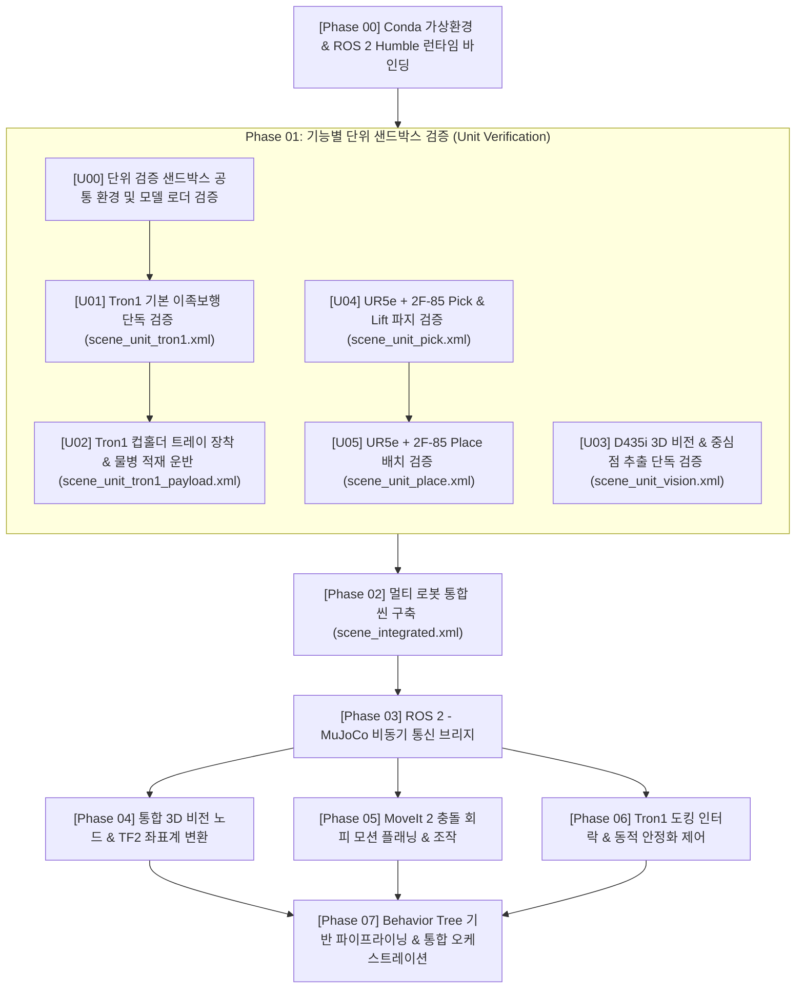

# [Roadmap] 이론 학습 및 단위 검증 기반 로봇 시뮬레이션 개발 로드맵
# (Learning & Unit Verification Oriented Development Roadmap: Tron1 to UR5e Bottle Transfer System)

* **문서 버전:** v2.0
* **작성일:** 2026-09-04
* **프로젝트:** `Proj_Transferring_bottle_from_tron1_to_ur5e_in_mujoco_env`
* **개발 환경:** Ubuntu 22.04 LTS / ROS 2 Humble / MuJoCo 3.x / Conda (`transfer_bottle_by_tron1_py3_10`)
* **문서 목적:** 단순 구현을 넘어, 각 단계의 **수학적/물리적 원리, 제어 이론, 알고리즘 메커니즘**을 단계별로 직접 실습하고 검증하며 체득하는 것을 최우선 목적으로 합니다. 특히 복잡한 전체 시스템을 결합하기 전, **각 기능별 독립 단위 샌드박스 씬(Unit Sandbox Scene)에서 선(先) 검증(Bottom-Up Verification)**을 완수한 후 점진적으로 통합합니다.

---

## 목차 (Table of Contents)

* [전체 파이프라인 구성 요약](#전체-파이프라인-구성-요약)
* [Phase 00: Conda 가상환경과 ROS 2 Humble 런타임 바인딩 원리](#phase-00-conda-가상환경과-ros-2-humble-런타임-바인딩-원리)
* [Phase 01: 기능별 단위 샌드박스 검증 (Unit Sandbox Verification)](#phase-01-기능별-단위-샌드박스-검증-unit-sandbox-verification)
  * [U00: 단위 검증 샌드박스 공통 환경 및 모델 로더 검증](#u00-단위-검증-샌드박스-공통-환경-및-모델-로더-검증)
  * [U01: Tron1 기본 이족보행 및 도킹 정지 단독 검증](#u01-tron1-기본-이족보행-및-도킹-정지-단독-검증)
  * [U02: Tron1 상체 컵홀더 트레이 장착 및 물병 적재 운반 검증](#u02-tron1-상체-컵홀더-트레이-장착-및-물병-적재-운반-검증)
  * [U03: RealSense D435i 3D 비전 인식 및 기하학적 중심점 추출 단독 검증](#u03-realsense-d435i-3d-비전-인식-및-기하학적-중심점-추출-단독-검증)
  * [U04: UR5e + 2F-85 조립 및 물병 Pick & Lift 파지 단독 검증](#u04-ur5e--2f-85-조립-및-물병-pick--lift-파지-단독-검증)
  * [U05: UR5e + 2F-85 물병 Place(배치) 단독 검증](#u05-ur5e--2f-85-물병-place배치-단독-검증)
* [Phase 02: 멀티 로봇 통합 씬(Integrated Scene) 구축 및 역학](#phase-02-멀티-로봇-통합-씬integrated-scene-구축-및-역학)
* [Phase 03: ROS 2 - MuJoCo 비동기 브리지 및 통신 아키텍처](#phase-03-ros-2---mujoco-비동기-브리지-및-통신-아키텍처)
* [Phase 04: 통합 3D 비전 파이프라인 및 TF2 좌표계 변환](#phase-04-통합-3d-비전-파이프라인-및-tf2-좌표계-변환)
* [Phase 05: 협동로봇(UR5e) 조작 및 MoveIt 2 모션 플래닝 원리](#phase-05-협동로봇ur5e-조작-및-moveit-2-모션-플래닝-원리)
* [Phase 06: 이족 보행 로봇(Tron1) 도킹 제어 및 동적 인터락(Interlock)](#phase-06-이족-보행-로봇tron1-도킹-제어-및-동적-인터락interlock)
* [Phase 07: Behavior Tree 기반 파이프라이닝 및 통합 오케스트레이션](#phase-07-behavior-tree-기반-파이프라이닝-및-통합-오케스트레이션)
* [부록: 단계별 권장 산출물 체크리스트 (상세 가이드 파일 매핑)](#단계별-권장-산출물-체크리스트)

---

## 전체 파이프라인 구성 요약

---

## [Phase 00] Conda 가상환경과 ROS 2 Humble 런타임 바인딩 원리

### 1. 학습 목표
* Linux 시스템에서 공유 라이브러리(`*.so`)가 동적 링커에 의해 로드되는 메커니즘을 이해한다.
* ROS 2 C++ 빌드 바이너리와 Conda Python 3.10 가상환경이 충돌 없이 결합되는 런타임 바인딩 원리를 파악한다.

### 2. 핵심 이론 및 원리
* **동적 링킹 및 환경 변수 우선순위:**
  * 리눅스는 `LD_LIBRARY_PATH`와 `RPATH`를 참조하여 공유 라이브러리를 탐색합니다.
  * Conda 환경을 활성화하면 Conda의 `lib/` 경로가 시스템 `/usr/lib`보다 우선순위를 갖게 됩니다.
* **CXXABI 버전 충돌 (`libstdc++.so.6`):**
  * ROS 2 Humble 바이너리는 시스템 GCC(Ubuntu 22.04 기본 GCC 11.4)로 컴파일된 `GLIBCXX_3.4.29` 이상의 심볼을 요구합니다.
  * Conda 환경의 `libstdc++` 버전이 낮을 경우 `undefined symbol` 에러가 발생하므로, `conda-forge libstdcxx-ng`로 최신화해야 하는 원리를 학습합니다.

### 3. 실습 및 구현 단계
1. `transfer_bottle_by_tron1_py3_10` 가상환경 생성 (`python=3.10`).
2. Conda 환경 활성화 후 `/opt/ros/humble/setup.bash` 로드.
3. `ldd` 명령어로 `rclpy`의 C-확장 모듈이 어떤 `libstdc++.so`를 참조하는지 확인.
4. Python 런타임에서 `rclpy`, `mujoco`, `open3d`, `cv2`의 순차 임포트 및 심볼 충돌 여부 진단.

### 4. 산출물
* 상세 가이드 문서: `documents/development_roadmap/rm_phase00_runtime_binding.md`
* 검증 스크립트: `scripts_devel_roadmap/phase00_check_env.py`

---

## [Phase 01] 기능별 단위 샌드박스 검증 (Unit Sandbox Verification)

시스템 전체를 결합하기 전, 개별 컴포넌트(이족보행, 적재 운반, 3D 비전, 파지, 배치)의 물리·기구학·알고리즘을 격리된 경량 샌드박스 씬에서 독립적으로 검증합니다.

---

### [U00] 단위 검증 샌드박스 공통 환경 및 모델 로더 검증
* **목표:** 개별 단위 씬들이 공통으로 참조할 바닥 평면, 광원, 카메라, 기본 물리 파라미터를 규격화하고, Python에서 MuJoCo 모델을 안전하게 로드·렌더링하는 기본 검증 파이프라인 수립.
* **사용 씬:** `unit_test_models/phase01_u00_scene_unit_base.xml`
* **검증 내용:**
  1. 공통 물리 옵션(중력, 고정 시간 간격 $dt=0.002s$) 정의 및 로드 테스트.
  2. 대화형 Viewer(`mujoco-python-viewer`) 및 Headless 렌더러 동작 확인.
* **산출물:**
  * 상세 가이드: `documents/development_roadmap/rm_phase01_u00_sandbox_env.md`
  * 테스트 스크립트: `scripts_devel_roadmap/phase01_u00_test_base_sandbox.py`

---

### [U01] Tron1 기본 이족보행 및 도킹 정지 단독 검증
* **목표:** 외부 적재물 없이 Tron1 베어 로봇 본체만으로 출발 좌표에서 인계 구역까지 보행 이동 후 진동 없이 정지하는 기본 보행 제어기 검증.
* **사용 씬:** `models/units/scene_unit_tron1.xml` (Tron1 + 무한 바닥 평면)
* **핵심 이론:**
  * 2족 보행 로봇의 질량 중심(CoM) 이동과 Zero Moment Point(ZMP) 안정도.
  * 지지 모드(Stance Lock) 전환 시 관절 PD 게인 상향을 통한 미세 발구름(In-place stepping) 진동 억제.
* **검증 내용:**
  1. **초기 안착:** 공중(z=0.82m) 스폰 후 발바닥 접촉 충격 완화 및 직립(Standing) 성공 여부.
  2. **목표 이동 (Locomotion):** 출발점 $(x_0, y_0)$에서 인계 구역 목표점 $(x_g, y_g)$까지 보행 제어.
  3. **자세 안정화 (Stance Lock):** 목표점 도달 후 최소 3초간 진동 없이 정지 상태 유지.
* **성공 기준:** 목표 반경 ±5cm 이내 도달, 정지 후 롤/피치 진동 0.05 rad 이하 수렴.
* **산출물:**
  * 상세 가이드: `documents/development_roadmap/rm_phase01_u01_tron1_walking.md`
  * 테스트 스크립트: `scripts_devel_roadmap/units/test_u01_tron1_walking.py`

---

### [U02] Tron1 상체 컵홀더 트레이 장착 및 물병 적재 운반 검증
* **목표:** Tron1 상체에 컵홀더형 트레이를 장착하고, 실제 물병(`model_ori/bottle/bottle.xml`)을 1~3개 실었을 때 보행 중 병이 넘어지거나 떨어지지 않고 인계 구역까지 안전하게 운반 및 도킹 정지하는지 물리 검증.
* **사용 씬:** `models/units/scene_unit_tron1_payload.xml` (Tron1 + 컵홀더 트레이 + 물병 1~3개)
* **핵심 이론:**
  * 페이로드 질량(개당 150g, 총 450g) 추가에 따른 상체 동역학 및 CoM 상승 보상.
  * 컵홀더 림(Rim) 높이와 접촉 마찰 계수(`friction="1.2 0.005 0.0001"`)에 의한 전도 모멘트 감쇠.
* **검증 내용:**
  1. **기구 결합:** `base_Link` 상단에 병 외경(66mm)에 맞춘 포켓(Pocket)을 가진 컵홀더 트레이 조립.
  2. **보행 외란 견딤:** 보행 시 발생하는 롤/피치 흔들림 속에서 물병의 미끄러짐 및 전도(Topple) 방지 확인.
  3. **인계 높이 정렬 (Squat/Stance):** 인계 구역 도달 시 무릎/발목 관절을 굴곡시켜 트레이 높이를 Station Table 높이와 수평 일치.
  4. **3초 안정 정지:** 인계 구역 정지 후 트레이의 흔들림이 3초 이내에 정적 상태(`READY_FOR_PICK`)로 수렴하는지 확인.
* **성공 기준:** 보행 운반 중 물병 낙하 0건, 인계 구역 트레이 높이 오차 ±1cm 이내, 정지 3초 후 트레이 진동 속도 0.01 m/s 이하 수렴.
* **산출물:**
  * 상세 가이드: `documents/development_roadmap/rm_phase01_u02_tron1_payload_transport.md`
  * 테스트 스크립트: `scripts_devel_roadmap/units/test_u02_tron1_payload_transport.py`

---

### [U03] RealSense D435i 3D 비전 인식 및 기하학적 중심점 추출 단독 검증
* **목표:** 고정된 카메라 뷰에서 트레이 위에 놓인 물병을 스캔하여 정확한 3D 중심점(Centroid)을 산출할 수 있는지 수학적/알고리즘 검증.
* **사용 씬:** `models/units/scene_unit_vision.xml` (D435i + 트레이 거치대 + 물병 1~3개)
* **핵심 이론:**
  * 핀홀 카메라 모델과 역투영(Back-projection):
    $$X = \frac{(u - c_x) \cdot Z}{f_x}, \quad Y = \frac{(v - c_y) \cdot Z}{f_y}$$
  * RANSAC (Random Sample Consensus) 평면 방정식 산출 및 인라이어(Inlier) 평면 제거.
  * KD-Tree 기반 유클리드 군집화(DBSCAN)를 통한 개별 물병 분리.
* **검증 내용:**
  1. **오프스크린 렌더링:** OpenGL FBO 버퍼로부터 RGB(H×W×3) 및 Depth(H×W) 행렬 추출.
  2. **포인트 클라우드 변환:** 카메라 내부 파라미터를 적용하여 3D 점군 생성.
  3. **RANSAC 트레이 상판 제거:** 바닥면 제거 후 물병 점군만 정제.
  4. **3D 중심점(Centroid) 산출:** 클러스터별 평균 좌표 $(\bar{X}, \bar{Y}, \bar{Z})$ 계산 및 참값(Ground Truth)과 비교.
* **성공 기준:** 물병 참값 중심 좌표와 비전 추정 좌표 간 오차 **±5mm 이내**.
* **산출물:**
  * 상세 가이드: `documents/development_roadmap/rm_phase01_u03_vision_centroid.md`
  * 테스트 스크립트: `scripts_devel_roadmap/units/test_u03_vision_centroid.py`

---

### [U04] UR5e + 2F-85 조립 및 물병 Pick & Lift 파지 단독 검증
* **목표:** 주어진 중심점 좌표로 로봇팔이 접근하여 물병을 잡고 들어 올릴 때, 헛파지나 미끄러짐이 없는지 기구학 및 접촉 물리 검증.
* **사용 씬:** `models/units/scene_unit_pick.xml` (UR5e + 2F-85 그리퍼 + 고정 물병)
* **핵심 이론:**
  * Robotiq 2F-85 4절 링크(Four-bar linkage) 미믹(Mimic) 구속 및 평행 파지 역학.
  * Approach(사전 접근) $\rightarrow$ Grasp $\rightarrow$ Lift(수직 상승) 경유점(Waypoints) 제어.
  * 파지 판정식: `그리퍼 엔코더 피드백 폭 ≈ 병 지름(66mm)`.
* **검증 내용:**
  1. **기구 조립 정합성:** UR5e `wrist_3_link` 끝단에 2F-85 베이스 조립 및 미믹 조인트 동작 확인.
  2. **사전 접근:** 물병 상단 +10cm 지점으로 사전 이동 후 병 몸통 높이로 수직 하강.
  3. **파지 폭 검증:** 닫힘 후 그리퍼 벌림 폭을 측정하여 헛파지(Miss) 감지 분기 테스트.
  4. **수직 리프트 (Slip 검증):** 병을 수직으로 10cm 들어 올린 후 마찰력 유지 여부 확인.
* **성공 기준:** 리프트 완료 후 3초간 병이 그리퍼에서 미끄러지지 않고 공중에 고정 유지.
* **산출물:**
  * 상세 가이드: `documents/development_roadmap/rm_phase01_u04_arm_pick_lift.md`
  * 테스트 스크립트: `scripts_devel_roadmap/units/test_u04_arm_pick_lift.py`

---

### [U05] UR5e + 2F-85 물병 Place(배치) 단독 검증
* **목표:** 물병을 파지한 상태에서 Station Table의 Place 지정 구역으로 이동 후, 넘어뜨리지 않고 직립 안착시키는 동작 검증.
* **사용 씬:** `models/units/scene_unit_place.xml` (물병을 쥔 UR5e + 작업대 Place 슬롯)
* **핵심 이론:**
  * 직립 배치(Vertical Placement)를 위한 엔드이펙터 수직 하향 쿼터니언 자세 구속.
  * 충격 완화(Soft Touchdown) 및 이탈 후퇴(Retreat) 벡터 설계.
* **검증 내용:**
  1. **이송 궤적 (Transfer):** 파지 자세를 유지한 채 Place 목표 상공으로 이동.
  2. **안착 하강 (Place Descent):** 테이블 상면 위 접촉 직전까지 저속 하강.
  3. **그리퍼 개방 및 후퇴 (Release & Retreat):** 그리퍼를 벌린 후 물병과의 간섭 없이 수직 상방으로 후퇴.
* **성공 기준:** 물병이 쓰러지지 않고 수직 직립 상태를 유지하며, 그리퍼가 안전 구역으로 복귀.
* **산출물:**
  * 상세 가이드: `documents/development_roadmap/rm_phase01_u05_arm_place.md`
  * 테스트 스크립트: `scripts_devel_roadmap/units/test_u05_arm_place.py`

---

## [Phase 02] 멀티 로봇 통합 씬(Integrated Scene) 구축 및 역학

### 1. 학습 목표
* 단위 검증(U00~U05)을 통과한 독립 로봇/센서 모델들을 `work_space_01.png` 레이아웃에 맞춰 하나의 단일 물리 월드로 통합한다.
* 전체 시스템의 기구학적 간섭(Collision Body Clearance) 및 카메라 시야각(FOV)을 최종 조율한다.

### 2. 핵심 이론 및 원리
* **멀티 바디 MJCF 통합:**
  * 복수의 독립 로봇 모델을 `<include>` 또는 계층 구조로 결합할 때의 이름 중복(Naming Conflict) 방지 메커니즘.
* **시야 차폐(Occlusion) 방지 마운트 역학:**
  * D435i 카메라를 테이블 좌상단 모서리에 거치대 기둥(높이 +25cm, Pitch -25° Tilt)과 함께 배치하여 인계 구역 트레이를 조준함으로써 이미 놓인 병이나 로봇팔에 의한 시야 가림을 최소화하는 원리.

### 3. 실습 및 구현 단계
1. `models/scene_integrated.xml` 작성:
   * Station Table 생성 (크기 및 재질 정의).
   * UR5e + 2F-85 그리퍼 조립체 테이블 배치.
   * D435i 카메라 브라켓 및 카메라 배치.
   * Tron1 + 컵홀더 트레이 + 물병 1~3개 북측 시작 위치 배치.
   * 테이블 상면에 Place 구역 정의.
2. MuJoCo Viewer로 전체 씬 렌더링 및 카메라 FOV 시각화 확인.

### 4. 산출물
* 상세 가이드: `documents/development_roadmap/rm_phase02_integrated_scene.md`
* 통합 씬 파일: `models/scene_integrated.xml`
* 뷰어 스크립트: `scripts_devel_roadmap/view_integrated_scene.py`

---

## [Phase 03] ROS 2 - MuJoCo 비동기 브리지 및 통신 아키텍처

### 1. 학습 목표
* 시뮬레이션의 동역학 적분 루프(Physics Loop)와 ROS 2의 비동기 이벤트 루프(Executor) 간의 동기화 원리를 학습한다.
* 물리 데이터를 ROS 2 표준 메시지(`sensor_msgs`, `trajectory_msgs`)로 변환하는 고속 브리지를 구축한다.

### 2. 핵심 이론 및 원리
* **Sim Time vs Wall Time:**
  * 고정 시간 간격(Fixed dt = 0.002s, 500Hz) 기반 물리 연산과 ROS 2 간의 괴리를 해결하기 위한 `/clock` 토픽 발행 및 `use_sim_time:=true` 파이프라인.
* **QoS (Quality of Service) 프로파일:**
  * 센서 이미지 데이터: 네트워크 지연 방지를 위한 `SensorDataQoS` (Best Effort).
  * 관절 제어 명령: 명령 유실 방지를 위한 `ReliableQoS`.

### 3. 실습 및 구현 단계
1. **MuJoCo 시뮬레이션 노드 (`mujoco_sim_node.py`):**
   * `mj_step(model, data)`를 일정 주기로 구동하는 메인 스레드 설계.
2. **센서 데이터 퍼블리셔:**
   * D435i RGB/Depth 이미지를 `cv_bridge`로 변환하여 `/d435i/color/image_raw`, `/d435i/depth/image_raw` 발행.
   * UR5e 및 Tron1 관절 상태를 `/joint_states`로 퍼블리시.
3. **제어기 서브스크라이버/액션:**
   * `/ur5e/joint_trajectory` 수신 및 `data.ctrl` 모터 입력 매핑.
   * 그리퍼 제어 액션 서버(`control_msgs/action/GripperCommand`) 구현.

### 4. 산출물
* 상세 가이드: `documents/development_roadmap/rm_phase03_ros2_mujoco_bridge.md`
* 브리지 노드: `src/sim_bridge/mujoco_ros_bridge.py`

---

## [Phase 04] 통합 3D 비전 파이프라인 및 TF2 좌표계 변환

### 1. 학습 목표
* U03에서 검증한 비전 알고리즘을 실시간 ROS 2 토픽 기반 비전 노드로 패키징한다.
* 카메라 좌표계에서 검출된 물병 중심점을 로봇팔 베이스 좌표계(`ur5e_base`)로 변환하는 `tf2` 기법을 체득한다.

### 2. 핵심 이론 및 원리
* **동차 변환 행렬 (Homogeneous Transformation Matrix):**
  * 카메라 좌표계 $C$에서 검출된 병 중심점 $P^C$를 로봇팔 베이스 좌표계 $B$로 변환:
    $$\begin{bmatrix} P^B \\ 1 \end{bmatrix} = T_{B}^{W} \cdot T_{W}^{C} \cdot \begin{bmatrix} P^C \\ 1 \end{bmatrix}$$
* **사전 스캔(Pre-scanning) 큐(Queue) 관리:**
  * 트레이 위의 물병들을 로봇팔과의 거리 순으로 소팅(Priority Sorting)하여 1순위 타겟 좌표를 발행하고, 남은 병 좌표를 내부 버퍼에 유지하는 알고리즘.

### 3. 실습 및 구현 단계
1. `src/vision/bottle_detector_3d.py` 작성:
   * 이미지 토픽 구독 $\rightarrow$ Open3D 포인트 클라우드 변환 $\rightarrow$ RANSAC 평면 제거 $\rightarrow$ 클러스터링.
2. `tf2_ros` 버퍼를 활용하여 카메라 좌표 $\rightarrow$ 로봇팔 베이스 좌표 변환 퍼블리시 (`geometry_msgs/PointStamped`).

### 4. 산출물
* 상세 가이드: `documents/development_roadmap/rm_phase04_vision_pipeline_tf2.md`
* 비전 노드: `src/vision/bottle_detector_3d.py`

---

## [Phase 05] 협동로봇(UR5e) 조작 및 MoveIt 2 모션 플래닝 원리

### 1. 학습 목표
* 6자유도 매니퓰레이터의 정기구학(FK)과 역기구학(IK), OMPL 기반 경로 계획 알고리즘의 동작 원리를 이해한다.
* U04, U05의 조작 로직을 MoveIt 2 플래닝 씬(Planning Scene)과 결합하여 충돌 없는 Pick-and-Place를 구현한다.

### 2. 핵심 이론 및 원리
* **역기구학(IK)과 최적 솔루션 선택:**
  * 6축 다관절 로봇의 8가지 해석적 해 중 현재 관절 위치에서 이동량이 가장 적은 최단 거리 해(Minimum Joint Displacement)를 선택하는 원리.
* **C-Space (Configuration Space) 장애물 회피:**
  * Station Table, 카메라 지지대, Tron1 트레이를 Collision Object로 등록하고 RRT-Connect를 통해 무충돌 궤적 생성.

### 3. 실습 및 구현 단계
1. MoveIt 2 구성(SRDF, 플래닝 그룹 `ur5e_arm`, `gripper`) 정의.
2. 비전 노드로부터 수신된 중심점 좌표를 기반으로 Pre-Grasp $\rightarrow$ Grasp $\rightarrow$ Lift $\rightarrow$ Place 궤적 실행 노드(`src/manipulation/ur5e_pick_place.py`) 작성.
3. 파지 피드백 검증: 닫힘 폭 미달 시 헛파지 에러 발생 및 안전 후퇴 로직 구현.

### 4. 산출물
* 상세 가이드: `documents/development_roadmap/rm_phase05_moveit2_manipulation.md`
* 매니퓰레이션 노드: `src/manipulation/ur5e_pick_place.py`

---

## [Phase 06] 이족 보행 로봇(Tron1) 도킹 제어 및 동적 인터락(Interlock)

### 1. 학습 목표
* U01, U02의 보행 제어를 ROS 2 인터페이스로 연결하고, 상호 안전을 위한 하드웨어 인터락을 구축한다.
* 물품 인계 중 외란을 억제하기 위한 로봇 간 상태 동기화 메커니즘을 구현한다.

### 2. 핵심 이론 및 원리
* **보행 정지 시의 동적 안정성 (Stance Stabilization):**
  * 인계 구역 도킹 시 발구름을 멈추고 관절 댐핑을 높여 트레이 진동을 신속히 감쇠시키는 제어 원리.
* **하드웨어 인터락 (Interlock) 및 E-Stop:**
  * 로봇팔이 물병을 파지하고 조작하는 동안에는 Tron1의 이동 명령을 차단하고, Tron1 IMU 이상(외란/흔들림) 감지 시 로봇팔을 즉시 비상 정지시키는 상호 안전 프로토콜.

### 3. 실습 및 구현 단계
1. `src/locomotion/tron1_controller.py` 작성:
   * 시작 위치에서 인계 구역까지 보행 이동 액션 서버 구현.
   * 도킹 완료 후 트레이 높이 조절 및 3초 정지 안정화 확인 후 `/tron1/status` (`READY_FOR_PICK`) 발행.
2. IMU 외란 모니터링: 롤/피치 각도 급변 시 `/safety/emergency_stop` 브로드캐스트.
3. 작업 완료 신호 수신 시 트레이 높이 원복 및 시작 위치 복귀 모션 구현.

### 4. 산출물
* 상세 가이드: `documents/development_roadmap/rm_phase06_tron1_docking_interlock.md`
* 보행 제어 노드: `src/locomotion/tron1_controller.py`

---

## [Phase 07] Behavior Tree 기반 파이프라이닝 및 통합 오케스트레이션

### 1. 학습 목표
* 복잡한 멀티 로봇 비동기 협업을 유연한 비헤이비어 트리(Behavior Tree) 구조로 모델링한다.
* 시나리오 3.6.1 & 3.6.2의 **비동기 사전 스캔(Pipelining)**과 6대 예외 처리(EH-1~EH-6) 복구 로직을 통합 완성한다.

### 2. 핵심 이론 및 원리
* **Behavior Tree (BT) 핵심 제어 노드:**
  * **Sequence ($\rightarrow$):** 자식 노드가 모두 성공해야 진행 (Tron1 진입 $\rightarrow$ 안정 정지 $\rightarrow$ 루프).
  * **Fallback (?):** 자식 노드 실패 시 예외 복구 브랜치 실행.
  * **Parallel ($\rightrightarrows$):** 로봇팔의 Place 모션과 카메라의 다음 병 사전 스캔을 동시 수행.
* **파이프라이닝(Pipelining)에 의한 사이클 타임(Cycle Time) 단축:**
  * $T_{\text{total}} = T_{\text{pick}} + \max(T_{\text{place}}, T_{\text{scan}}) + T_{\text{transfer}}$
  * 로봇팔 이동 시간 뒤로 비전 연산 시간을 은닉(Hiding)시켜 생산성을 30% 이상 향상시키는 산업용 오케스트레이션 원리.

### 3. 실습 및 구현 단계
1. `py_trees_ros` 기반 통합 오케스트레이터(`src/orchestration/bt_main_orchestrator.py`) 구축.
2. Parallel Node를 활용한 비동기 사전 스캔 브랜치 구현:
   * Branch A: UR5e 물병 Place 이송 및 안착.
   * Branch B: 로봇팔이 트레이 영역을 벗어남을 감지한 즉시, D435i가 트레이를 재스캔하여 다음 병 중심점 버퍼링.
3. 6대 예외 상황(빈 트레이, 전도/겹침, 헛파지/슬립, IK 초과, IMU 외란, 통신 지연) Fallback 브랜치 결합.

### 4. 산출물
* 상세 가이드: `documents/development_roadmap/rm_phase07_behavior_tree_orchestration.md`
* 메인 오케스트레이터: `src/orchestration/bt_main_orchestrator.py`

---

## 단계별 권장 산출물 체크리스트

| 단계 (Phase) | 세부 단위 (Unit) | 핵심 작업 및 목표 | 상세 가이드 파일 (.md) | 주요 실행 산출물 |
| :---: | :---: | :--- | :--- | :--- |
| **Phase 00** | - | Conda & ROS 2 Humble 런타임 바인딩 검증 | `documents/development_roadmap/rm_phase00_runtime_binding.md` | `scripts_devel_roadmap/phase00_check_env.py` |
| **Phase 01** | **U00** | 단위 검증 샌드박스 공통 환경 및 모델 로더 | `documents/development_roadmap/rm_phase01_u00_sandbox_env.md` | `unit_test_models/phase01_u00_scene_unit_base.xml` `scripts_devel_roadmap/phase01_u00_test_base_sandbox.py` |
|  | **U01** | Tron1 기본 이족보행 및 도킹 정지 단독 검증 | `documents/development_roadmap/rm_phase01_u01_tron1_walking.md` | `models/units/scene_unit_tron1.xml` |
|  | **U02** | Tron1 컵홀더 트레이 장착 & 물병 적재 운반 검증 | `documents/development_roadmap/rm_phase01_u02_tron1_payload_transport.md` | `models/units/scene_unit_tron1_payload.xml` |
|  | **U03** | D435i 3D 비전 인식 및 기하학적 중심점 추출 | `documents/development_roadmap/rm_phase01_u03_vision_centroid.md` | `models/units/scene_unit_vision.xml` |
|  | **U04** | UR5e + 2F-85 조립 및 물병 Pick & Lift 파지 검증 | `documents/development_roadmap/rm_phase01_u04_arm_pick_lift.md` | `models/units/scene_unit_pick.xml` |
|  | **U05** | UR5e + 2F-85 물병 Place(배치) 단독 검증 | `documents/development_roadmap/rm_phase01_u05_arm_place.md` | `models/units/scene_unit_place.xml` |
| **Phase 02** | - | 멀티 로봇 통합 씬 구축 및 배치 | `documents/development_roadmap/rm_phase02_integrated_scene.md` | `models/scene_integrated.xml` |
| **Phase 03** | - | ROS 2 - MuJoCo 비동기 통신 브리지 | `documents/development_roadmap/rm_phase03_ros2_mujoco_bridge.md` | `src/sim_bridge/mujoco_ros_bridge.py` |
| **Phase 04** | - | 통합 3D 비전 노드 & TF2 좌표 변환 | `documents/development_roadmap/rm_phase04_vision_pipeline_tf2.md` | `src/vision/bottle_detector_3d.py` |
| **Phase 05** | - | MoveIt 2 충돌 회피 모션 플래닝 & 조작 | `documents/development_roadmap/rm_phase05_moveit2_manipulation.md` | `src/manipulation/ur5e_pick_place.py` |
| **Phase 06** | - | Tron1 도킹 인터락 & 동적 안정화 제어 | `documents/development_roadmap/rm_phase06_tron1_docking_interlock.md` | `src/locomotion/tron1_controller.py` |
| **Phase 07** | - | Behavior Tree 기반 파이프라이닝 & 오케스트레이션 | `documents/development_roadmap/rm_phase07_behavior_tree_orchestration.md` | `src/orchestration/bt_main_orchestrator.py` |
