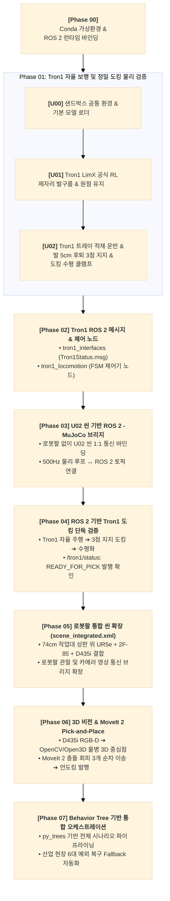

# [Roadmap] 이론 학습 및 점진적 단위 검증 기반 로봇 시뮬레이션 개발 로드맵
# (Learning & Incremental Scenario-Driven ROS 2 Native Development Roadmap: Tron1 to UR5e Bottle Transfer System)

* **문서 버전:** v3.1 (점진적 ROS 2 브리지 구축 및 시나리오 연계 아키텍처)
* **최종 갱신일:** 2026-09-11
* **프로젝트:** `Proj_Transferring_bottle_from_tron1_to_ur5e_in_mujoco_env`
* **개발 환경:** Ubuntu 22.04 LTS / ROS 2 Humble / MuJoCo 3.12.0 / Conda (`transfer_bottle_by_tron1_py3_10`)
* **핵심 아키텍처 원칙:**
  1. **물리 단위 검증 기반 (Phase 01):**
     * Tron1의 500Hz/50Hz RL 제자리 발구름, 컵홀더 트레이 물병 3개 적재 운반, 전방 범퍼 접촉 후 [발 5cm 후퇴 3점 지지 + 능동 반력 순응 제어 + Roll/Pitch 동시 수평화(+0.18 rad) + 3초 정적 안정 인터락 + 정밀 도킹 클램프(0.000mm 부동)] 메커니즘을 물리적으로 정립.
     * 74cm 표준 작업대 높이 및 언더데스크 하향 드롭 도킹 지지대(58cm) 구조 설계 및 XML 반영.
  2. **점진적 ROS 2 전환 (디버깅 변수 분리):**
     * 로봇팔(UR5e)을 바로 얹지 않고, 이미 물리 검증된 U02 환경(트론1 + 작업대)을 먼저 ROS 2 환경으로 1:1 변환하여 트론1의 자율 보행, 도킹 및 토픽 발행(`/tron1/status`)을 완벽히 단독 검증한 후 로봇팔 통합으로 확장.
  3. **역할 분담에 충실한 인터페이스 설계 (SoC):**
     * 물병 개수는 트론1이 관여하지 않고 카메라 비전 시스템이 자체 판정하도록 메시지 구조에서 제외하며, 트론1은 자세 안정성(FSM 상태, 수평 각도, 범퍼 반력, 피킹 준비 플래그)에 집중.
  4. **ROS 2 & MoveIt 2 네이티브 파이프라인:**
     * 임시 IK 중복 코딩을 배제하고, 통합 씬 확장에 맞춰 공식 MoveIt 2 충돌 회피 플래닝과 OpenCV/Open3D 비전 파이프라인으로 직행.

---

## 목차 (Table of Contents)

* [전체 파이프라인 구성 요약](#전체-파이프라인-구성-요약)
* [Phase 00: Conda 가상환경과 ROS 2 Humble 런타임 바인딩 원리](#phase-00-conda-가상환경과-ros-2-humble-런타임-바인딩-원리)
* [Phase 01: Tron1 자율 보행 및 정밀 도킹 물리 단위 검증](#phase-01-tron1-자율-보행-및-정밀-도킹-물리-단위-검증)
  * [U00: 단위 검증 샌드박스 공통 환경 및 모델 로더 검증](#u00-단위-검증-샌드박스-공통-환경-및-모델-로더-검증)
  * [U01: Tron1 공식 강화학습(RL) 이족보행 및 원점 제자리 발구름 검증](#u01-tron1-공식-강화학습rl-이족보행-및-원점-제자리-발구름-검증)
  * [U02: Tron1 트레이 장착, 물병 적재 운반 및 테이블 도킹 정지 검증](#u02-tron1-트레이-장착-물병-적재-운반-및-테이블-도킹-정지-검증)
* [Phase 02: Tron1 ROS 2 인터페이스 패키지 및 FSM 제어기 노드 구축](#phase-02-tron1-ros-2-인터페이스-패키지-및-fsm-제어기-노드-구축)
* [Phase 03: U02 씬 기반 ROS 2 - MuJoCo 시뮬레이션 통신 브리지 구축](#phase-03-u02-씬-기반-ros-2---mujoco-시뮬레이션-통신-브리지-구축)
* [Phase 04: ROS 2 환경 기반 Tron1 자율 도킹 및 토픽 발행 엔드-투-엔드 검증](#phase-04-ros-2-환경-기반-tron1-자율-도킹-및-토픽-발행-엔드-투-엔드-검증)
* [Phase 05: 로봇팔(UR5e + 2F-85 + D435i) 통합 씬 확장 및 통신 바인딩](#phase-05-로봇팔ur5e--2f-85--d435i-통합-씬-확장-및-통신-바인딩)
* [Phase 06: Eye-in-Hand 3D 비전 및 MoveIt 2 기반 Pick-and-Place 매니퓰레이션](#phase-06-eye-in-hand-3d-비전-및-moveit-2-기반-pick-and-place-매니퓰레이션)
* [Phase 07: Behavior Tree 기반 파이프라이닝 및 통합 오케스트레이션](#phase-07-behavior-tree-기반-파이프라이닝-및-통합-오케스트레이션)
* [부록: 단계별 권장 산출물 체크리스트](#단계별-권장-산출물-체크리스트)

---

## 전체 파이프라인 구성 요약

---

## [Phase 00] Conda 가상환경과 ROS 2 Humble 런타임 바인딩 원리

### 1. 학습 목표
* Linux 시스템에서 공유 라이브러리(`*.so`)가 동적 링커에 의해 로드되는 메커니즘을 이해한다.
* ROS 2 C++ 빌드 바이너리와 Conda Python 3.10 가상환경이 충돌 없이 결합되는 런타임 바인딩 원리를 파악한다.

### 2. 핵심 이론 및 원리
* **동적 링킹 및 환경 변수 우선순위:**
  * 리눅스는 `LD_LIBRARY_PATH`와 `RPATH`를 참조하여 공유 라이브러리를 탐색합니다.
  * Conda 환경을 활성화하면 Conda의 `lib/` 경로가 시스템 `/usr/lib`보다 우선순위를 갖게 됩니다.
* **CXXABI 버전 충돌 (`libstdc++.so.6`):**
  * ROS 2 Humble 바이너리는 시스템 GCC(Ubuntu 22.04 기본 GCC 11.4)로 컴파일된 `GLIBCXX_3.4.29` 이상의 심볼을 요구합니다.
  * Conda 환경의 `libstdc++` 버전이 낮을 경우 `undefined symbol` 에러가 발생하므로, `conda-forge libstdcxx-ng`로 최신화해야 하는 원리를 학습합니다.

### 3. 실습 및 구현 단계
1. `transfer_bottle_by_tron1_py3_10` 가상환경 생성 (`python=3.10`).
2. Conda 환경 활성화 후 `/opt/ros/humble/setup.bash` 로드.
3. `ldd` 명령어로 `rclpy`의 C-확장 모듈이 어떤 `libstdc++.so`를 참조하는지 확인.
4. Python 런타임에서 `rclpy`, `mujoco`, `open3d`, `cv2`, `onnxruntime`의 순차 임포트 및 심볼 충돌 여부 진단.

### 4. 산출물
* 상세 가이드 문서: `documents/development_roadmap/rm_phase00_runtime_binding.md`
* 검증 스크립트: `scripts_devel_roadmap/phase00_check_env.py`

---

## [Phase 01] Tron1 자율 보행 및 정밀 도킹 물리 단위 검증

시스템 전체를 결합하기 전, 이족보행 로봇(Tron1)의 고유 물리 특성(역진자 동역학, 발바닥 구체 롤링, 상체 적재 관성, 도킹 접촉 반력)을 독립 단위 샌드박스 씬에서 완벽하게 단독 검증합니다.

---

### [U00] 단위 검증 샌드박스 공통 환경 및 모델 로더 검증
* **목표:** 개별 단위 씬들이 공통으로 참조할 바닥 평면, 광원, 카메라, 기본 물리 파라미터를 규격화하고, Python에서 MuJoCo 모델을 안전하게 로드·렌더링하는 기본 파이프라인 수립.
* **사용 씬:** `xml_for_unit_test/phase01_u00_scene_unit_base.xml`
* **산출물:**
  * 상세 가이드: `documents/development_roadmap/rm_phase01_u00_sandbox_env.md`
  * 테스트 스크립트: `scripts_devel_roadmap/phase01_u00_test_base_sandbox.py`

---

### [U01] Tron1 공식 강화학습(RL) 이족보행 및 원점 제자리 발구름 검증
* **목표:** LimX 공식 상용 사전훈련 ONNX 모델(`policy.onnx`, `encoder.onnx`)을 활용하여, 점 발바닥(Point-foot, $\tau_{\text{ankle}}=0$) 로봇이 외부 외란 속에서도 넘어지지 않고 제자리 발구름(In-place Stepping) 및 원점 위치를 완벽히 유지하는지 물리/제어 검증.
* **사용 씬:** `xml_for_unit_test/phase01_u01_scene_unit_tron1.xml`
* **핵심 이론:** 10스텝 히스토리 잠재 인코더, 500Hz/50Hz Decimation, 상체 로컬 PD 원점 제어.
* **산출물:**
  * 상세 가이드: `documents/development_roadmap/rm_phase01_u01_tron1_walking.md`
  * 테스트 스크립트: `scripts_devel_roadmap/phase01_u01_test_tron1_walking_rl.py`
  * 심층 연구 보고서: `documents/study/phase01_u01_limx_rl_model_and_mujoco_integration.md`

---

### [U02] Tron1 트레이 장착, 물병 적재 운반 및 테이블 도킹 정지 검증
* **목표:** Tron1 상체에 3구 트레이(림 35mm)와 전면 완충 범퍼를 장착하고, 물병 3개를 적재한 상태에서 다단계 내비게이션(WP0 $\rightarrow$ WP1 $\rightarrow$ 테이블 정렬 $\rightarrow$ 크리핑 직진)과 도킹 안착 메커니즘을 물리적으로 완벽히 검증.
* **사용 씬:** `xml_for_unit_test/phase01_u02_scene_unit_tron1_payload.xml`
* **핵심 물리 메커니즘:**
  1. **발 5cm 후퇴 3점 지지 (Feet Retraction Tripod Support):** 범퍼 접촉($F \ge 5\,\text{N}$) 감지 후 즉시 발을 멈추지 않고, 발을 몸체 뒤로 5cm 후퇴 배치(`X_foot = X_base - 0.05m`)하여 전방 기대기 정적 삼각형 형성 후 발구름 완전 정지(`STANCE_LOCK`).
  2. **능동 범퍼 반력 순응 제어 (Continuous Force Compliance Control):** 범퍼 지탱력을 9N으로 일정하게 유지하여 지면 수평 전단력 및 후방 발 밀림(Creep) 방지.
  3. **Roll & Pitch 동시 수평 제어 (Simultaneous Bumpless Leveling):** Roll(차동 모드)과 Pitch(대칭 모드)의 수학적 직교성을 규명하여 고관절 신전(+0.18 rad)을 0.5초간 동시 보간함으로써 $Roll = -0.02^\circ, Pitch = +0.13^\circ$ 완전 수평면 확립.
  4. **산업용 정밀 도킹 클램프 락:** 3초 수평 무진동 판정 후 자세를 고정하여 **0.000mm 완전 부동 상태** 확립.
  5. **표준 작업대(74cm) 및 언더데스크 하향 드롭 도킹 지지대(58cm):** UR5e 표준 작업대 상판(74cm)을 유지하면서 상판 하단에 58cm 드롭 브래킷을 배치하여 로봇 CoM($0.60\,\text{m}$)과의 작용점 불일치로 인한 후방 전복 토크($\tau=0$)를 원천 차단.
* **산출물:**
  * 상세 가이드: `documents/development_roadmap/rm_phase01_u02_tron1_payload_transport.md`
  * 테스트 스크립트: `scripts_devel_roadmap/phase01_u02_test_tron1_payload.py`
  * 단위 씬 모델: `xml_for_unit_test/phase01_u02_scene_unit_tron1_payload.xml`
  * 심층 연구 보고서 7종 (`documents/study/phase01_u02_issue_01~07.md`)

---

## [Phase 02] Tron1 ROS 2 인터페이스 패키지 및 FSM 제어기 노드 구축

### 1. 학습 목표
* Phase 01-U02에서 검증된 Tron1 유한 상태 머신(FSM)을 표준 ROS 2 패키지로 분리·구축한다.
* 트론1 전용 인터페이스 패키지(`tron1_interfaces`)를 신설하여 도킹 및 자세 안정성 데이터를 구조화된 토픽 메시지로 정의한다.

### 2. 핵심 이론 및 원리
* **역할 분담에 따른 메시지 설계 (SoC):**
  * 트론1은 물병 개수를 알 수 없으므로 `bottle_count` 필드는 배제하고, FSM 상태, 피킹 준비 상태 플래그(`is_ready_for_pick`), 자세 각도(Roll/Pitch), 범퍼 반력 데이터에 집중.
* **양방향 인터락 (Handshake & Interlock):**
  * `READY_FOR_PICK` 상태 진입 시 `/tron1/status` 토픽 발행.
  * 상위 시스템으로부터 `/tron1/cmd_undock` 토픽 수신 시 안전하게 언도킹 후진(0.15m) 후 복귀하는 이벤트 구동 구조.

### 3. 실습 및 구현 단계
1. **인터페이스 패키지 (`src/tron1_interfaces`):**
   * `msg/Tron1Status.msg` 정의 (fsm_state, is_ready_for_pick, is_stance_locked, roll_deg, pitch_deg, bumper_force).
   * CMakeLists.txt 및 package.xml 빌드 설정.
2. **제어기 패키지 (`src/tron1_locomotion`):**
   * U02 FSM 코드를 ROS 2 노드(`tron1_controller.py`)로 래핑.
   * `/tron1/status` 퍼블리셔 및 `/tron1/cmd_undock` 서브스크라이버 바인딩.

### 4. 산출물
* FSM 제어 규격서: `documents/development_roadmap/rm_tron1_fsm_state_machine_spec.md`
* 상세 가이드: `documents/development_roadmap/rm_phase02_tron1_ros2_controller.md`
* 인터페이스 패키지: `src/tron1_interfaces/`
* 제어기 패키지: `src/tron1_locomotion/`

---

## [Phase 03] U02 씬 기반 ROS 2 - MuJoCo 시뮬레이션 통신 브리지 구축

### 1. 학습 목표
* 로봇팔이 없는 상태에서, 이미 물리 검증을 마친 **U02 샌드박스 씬(`phase01_u02_scene_unit_tron1_payload.xml`)**을 그대로 실행하는 ROS 2 시뮬레이션 브리지(`sim_bridge`)를 구축한다.
* 복잡한 다중 로봇 간섭 요소를 배제하고 순수하게 트론1 관절 상태와 센서 통신 동기화에만 집중한다.

### 2. 핵심 이론 및 원리
* **Sim Time 동기화 (/clock):**
  * MuJoCo 고정 시간 간격($dt=0.002\,\text{s}$, 500Hz) 물리 적분 루프와 ROS 2 시간 동기화를 위한 `/clock` 토픽 브로드캐스트.
* **트론1 액추에이터 및 센서 I/O 매핑:**
  * 6개 모터 토크 제어 명령 수신(`ctrl`) 및 관절 엔코더/IMU/범퍼 터치 센서 데이터 퍼블리시.

### 3. 실습 및 구현 단계
1. `src/sim_bridge/mujoco_ros_bridge.py` 작성:
   * U02 XML 씬 로드 및 500Hz 물리 스레드 구동.
   * `/clock`, `/joint_states`, `/tron1/bumper_contact` 토픽 퍼블리시.
2. `colcon build` 후 단독 브리지 실행 검증.

### 4. 산출물
* 상세 가이드: `documents/development_roadmap/rm_phase03_ros2_mujoco_bridge_tron1.md`
* 브리지 패키지: `src/sim_bridge/`

---

## [Phase 04] ROS 2 환경 기반 Tron1 자율 도킹 및 토픽 발행 엔드-투-엔드 검증

### 1. 학습 목표
* 순수하게 **[Tron1 제어 노드 ↔ ROS 2 브리지 ↔ MuJoCo 시뮬레이션]** 구조로 전체 시스템을 가동한다.
* ROS 2 토픽 통신 환경에서 트론1이 자율 보행하여 테이블에 도킹하고, 터미널에 `/tron1/status`의 `is_ready_for_pick: true` 신호가 정상 출력되는지 완벽히 단독 검증한다.

### 2. 핵심 검증 항목
1. **자율 보행 및 경유지 추종:** ROS 2 통신 지연 속에서도 ONNX 정책 추론 및 웨이포인트 주행이 원활히 동작하는가?
2. **도킹 및 스탠스 락:** 범퍼 접촉 반력 수신 후 발 5cm 후퇴 및 동시 수평화가 안정적으로 수행되는가?
3. **토픽 발행 검증:** `ros2 topic echo /tron1/status` 명령 시 3초 수평 유지 후 `is_ready_for_pick: true`가 정확히 출력되는가?
4. **언도킹 원격 명령:** `ros2 topic pub /tron1/cmd_undock` 명령 수신 시 정상적으로 후진 언도킹 후 복귀하는가?

### 3. 실습 및 구현 단계
1. 트론1 단독 통합 런치 파일(`launch/tron1_sim_bringup.launch.py`) 작성.
2. 런치 실행 후 `ros2 topic echo`를 통한 실시간 토픽 모니터링 및 핸드셰이크 동작 검증.

### 4. 산출물
* 상세 가이드: `documents/development_roadmap/rm_phase04_tron1_ros2_docking_verification.md`
* 런치 파일: `launch/tron1_sim_bringup.launch.py`

---

## [Phase 05] 로봇팔(UR5e + 2F-85 + D435i) 통합 씬 확장 및 통신 바인딩

### 1. 학습 목표
* ROS 2 상에서 완벽히 검증된 트론1 도킹 씬 위에 **UR5e 로봇팔, Robotiq 2F-85 그리퍼, RealSense D435i(Eye-in-Hand)** 조립체를 얹어 단일 통합 물리 월드(`models/scene_integrated.xml`)로 확장한다.
* `sim_bridge`를 확장하여 로봇팔 6관절 궤적 추종 인터페이스와 카메라 RGB-D 이미지 토픽을 바인딩한다.

### 2. 핵심 이론 및 원리
* **74cm 표준 작업대 상판 위 로봇팔 베이스 배치:**
  * UR5e의 작업 반경(Reach: 850mm)과 트론1 트레이 도킹 지점 간의 작업 공간(Workspace) 기구학적 최적화.
* **Eye-in-Hand 카메라 영상 스트리밍:**
  * D435i 가상 카메라의 OpenGL FBO 버퍼를 `cv_bridge`를 통해 `/camera/color/image_raw` 및 `/camera/depth/image_raw`로 30Hz 퍼블리시.

### 3. 실습 및 구현 단계
1. 통합 씬 작성: `models/scene_integrated.xml`.
2. `src/sim_bridge/mujoco_ros_bridge.py` 확장 (UR5e 조인트/액추에이터 및 카메라 렌더러 추가).
3. MuJoCo 뷰어 및 RViz2에서 트론1과 로봇팔이 동시에 렌더링되고 센서 토픽이 정상 발행되는지 확인.

### 4. 산출물
* 상세 가이드: `documents/development_roadmap/rm_phase05_integrated_scene_and_arm_bridge.md`
* 통합 씬 모델: `models/scene_integrated.xml`
* 뷰어 스크립트: `scripts_devel_roadmap/view_integrated_scene.py`

---

## [Phase 06] Eye-in-Hand 3D 비전 및 MoveIt 2 기반 Pick-and-Place 매니퓰레이션

### 1. 학습 목표
* `/tron1/status`의 `is_ready_for_pick: true` 토픽 수신 시 D435i 카메라 스캔을 자동 트리거한다.
* OpenCV/Open3D로 물병 3D 중심점을 추출하고, 공식 **MoveIt 2**를 가동하여 충돌 회피 Pick-and-Place를 구현한다.

### 2. 핵심 이론 및 원리
* **비전 파이프라인 (OpenCV + Open3D + TF2):**
  * RANSAC 트레이 상판 평면 제거 $\rightarrow$ 유클리드 군집화(DBSCAN) $\rightarrow$ 물병 3D 중심점($X,Y,Z$) 산출 $\rightarrow$ `tf2` 로봇 베이스 변환 좌표 발행 (`/bottle/centroid_3d`).
* **MoveIt 2 충돌 회피 플래닝 (OMPL, Planning Scene):**
  * Eye-in-Hand 카메라 브래킷과 트론1 트레이를 충돌체로 등록하여 카메라 간섭 없는 안전 경로 생성.
  * Approach $\rightarrow$ Grasp $\rightarrow$ Lift $\rightarrow$ Place $\rightarrow$ Retreat 5단계 시퀀스 반복.
  * 물병 3개 이송 종료 판정 시 `/tron1/cmd_undock` (`ALL_BOTTLES_TRANSFERRED = True`) 발행.

### 3. 실습 및 구현 단계
1. 비전 노드 구현: `src/vision/bottle_detector_3d.py`.
2. MoveIt 2 구성(SRDF, 플래닝 그룹) 및 매니퓰레이션 노드 구현: `src/manipulation/ur5e_pick_place.py`.
3. 트론1 도킹 신호 수신 후 물병 3개를 연속으로 집어 작업대에 배치하는 파이프라인 검증.

### 4. 산출물
* 상세 가이드: `documents/development_roadmap/rm_phase06_vision_and_moveit2_manipulation.md`
* 비전 패키지: `src/vision/`
* 매니퓰레이션 패키지: `src/manipulation/`

---

## [Phase 07] Behavior Tree 기반 파이프라이닝 및 통합 오케스트레이션

### 1. 학습 목표
* 다중 로봇 비동기 협업 시스템 전체를 `py_trees_ros` 기반의 유연한 비헤이비어 트리(Behavior Tree) 구조로 통합 오케스트레이션한다.
* 산업 현장의 6대 예외 상황(운반 중 낙하, 겹침 전도, 헛파지/슬립, 도킹 이탈 외란 등)에 대한 안전 복구 Fallback 브랜치를 완성한다.

### 2. 핵심 이론 및 원리
* **Behavior Tree (BT) 핵심 제어 노드:**
  * **Sequence ($\rightarrow$):** Tron1 이동 $\rightarrow$ 도킹 수평화 $\rightarrow$ D435i 스캔 $\rightarrow$ UR5e Pick & Place 루프 $\rightarrow$ 언도킹 & 복귀.
  * **Fallback (?):** 자식 노드 실패 시 안전 정지 및 재시도 브랜치 자동 분기.
* **하드웨어 인터락 및 E-Stop:**
  * 로봇팔이 물병을 파지하고 있는 동안 Tron1 모터 잠금 인터락 유지.
  * Tron1 IMU 이상 또는 트레이 외란 감지 시 UR5e 즉시 일시 정지(Hold).

### 3. 실습 및 구현 단계
1. `src/orchestration/bt_main_orchestrator.py` 작성.
2. 6대 예외 복구 Fallback 트리 구축.
3. 시나리오 시작부터 물병 3개 이송 및 Tron1 안전 복귀까지 원클릭 통합 런치(`ros2 launch main_system.launch.py`) 검증.

### 4. 산출물
* 상세 가이드: `documents/development_roadmap/rm_phase07_behavior_tree_orchestration.md`
* 메인 오케스트레이터: `src/orchestration/bt_main_orchestrator.py`
* 통합 런치 파일: `launch/transfer_system.launch.py`

---

## 단계별 권장 산출물 체크리스트

| 단계 (Phase) | 핵심 작업 및 설계 목표 | 상세 가이드 파일 (.md) | 주요 실행 산출물 |
| :---: | :--- | :--- | :--- |
| **Phase 00** | Conda & ROS 2 Humble 런타임 바인딩 검증 | `documents/development_roadmap/rm_phase00_runtime_binding.md` | `scripts_devel_roadmap/phase00_check_env.py` |
| **Phase 01** | **Tron1 자율 보행 및 정밀 도킹 물리 검증** • U00: 공통 환경 & 모델 로더 • U01: Tron1 RL 제자리 발구름 & 원점 유지 • U02: 트레이 적재 운반, 발 5cm 후퇴 3점 지지, 동시 수평화, 0.000mm 클램프, 74cm 테이블 & 58cm 드롭 브래킷 | `documents/development_roadmap/rm_phase01_u00_sandbox_env.md` `documents/development_roadmap/rm_phase01_u01_tron1_walking.md` `documents/development_roadmap/rm_phase01_u02_tron1_payload_transport.md` | `xml_for_unit_test/phase01_u00`~`u02.xml` `scripts_devel_roadmap/phase01_u00`~`u02.py` `documents/study/phase01_u02_issue_01`~`07.md` (7종) |
| **Phase 02** | **Tron1 ROS 2 인터페이스 패키지 및 FSM 제어기 노드 구축** • `tron1_interfaces` (Tron1Status.msg) • `tron1_locomotion` (FSM 제어기 노드, `/tron1/status` 및 `/tron1/cmd_undock` 바인딩) | `documents/development_roadmap/rm_phase02_tron1_ros2_controller.md` `documents/development_roadmap/rm_tron1_fsm_state_machine_spec.md` | `src/tron1_interfaces/` `src/tron1_locomotion/` |
| **Phase 03** | **U02 씬 기반 ROS 2 - MuJoCo 시뮬레이션 통신 브리지 구축** • 로봇팔 없이 U02 씬 1:1 통신 바인딩 • 500Hz 물리 루프 ↔ ROS 2 토픽/액션 바인딩 | `documents/development_roadmap/rm_phase03_ros2_mujoco_bridge_tron1.md` | `src/sim_bridge/` `src/sim_bridge/mujoco_ros_bridge.py` |
| **Phase 04** | **ROS 2 환경 기반 Tron1 자율 도킹 및 토픽 발행 엔드-투-엔드 검증** • [Tron1 노드 ↔ ROS 2 브리지 ↔ MuJoCo] 단독 가동 • 도킹 안착 후 `/tron1/status: READY_FOR_PICK` 발행 실시간 확인 | `documents/development_roadmap/rm_phase04_tron1_ros2_docking_verification.md` | `launch/tron1_sim_bringup.launch.py` |
| **Phase 05** | **로봇팔(UR5e + 2F-85 + D435i) 통합 씬 확장 및 통신 바인딩** • 74cm 표준 작업대 위 UR5e + 2F-85 + D435i 결합 (`scene_integrated.xml`) • 로봇팔 관절 및 D435i 카메라 RGB-D 영상 통신 브리지 확장 | `documents/development_roadmap/rm_phase05_integrated_scene_and_arm_bridge.md` | `models/scene_integrated.xml` `scripts_devel_roadmap/view_integrated_scene.py` |
| **Phase 06** | **Eye-in-Hand 3D 비전 및 MoveIt 2 기반 Pick-and-Place 매니퓰레이션** • D435i RGB-D ➔ OpenCV/Open3D RANSAC 물병 3D 중심점 TF2 변환 • MoveIt 2 충돌 회피 3개 순차 이송 ➔ `/tron1/cmd_undock` 발행 | `documents/development_roadmap/rm_phase06_vision_and_moveit2_manipulation.md` | `src/vision/` `src/manipulation/` |
| **Phase 07** | **Behavior Tree 기반 파이프라이닝 및 통합 오케스트레이션** • 6대 예외 복구 Fallback 브랜치 및 전공정 자동화 | `documents/development_roadmap/rm_phase07_behavior_tree_orchestration.md` | `src/orchestration/bt_main_orchestrator.py` `launch/transfer_system.launch.py` |
