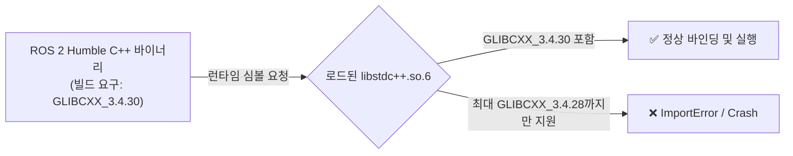

# [Phase 00 Guide] Conda 가상환경과 ROS 2 Humble 런타임 바인딩 원리
# (Runtime Binding Principles: Conda Environment & ROS 2 Humble)

* **문서 버전:** v1.0
* **작성일:** 2026-09-04
* **프로젝트:** `Proj_Transferring_bottle_from_tron1_to_ur5e_in_mujoco_env`
* **대상 환경:** Ubuntu 22.04 LTS / ROS 2 Humble / Conda 가상환경 (`transfer_bottle_by_tron1_py3_10`, Python 3.10.x)
* **문서 목적:** 본 문서는 본격적인 로봇 제어 및 시뮬레이션 구현에 앞서, **Linux 동적 링커의 라이브러리 로딩 메커니즘, C++ ABI(Application Binary Interface) 버전 호환성 원리, 그리고 Conda 가상환경과 시스템 ROS 2 바이너리 간의 무충돌 바인딩 기법**을 이론적으로 이해하고 실습을 통해 직접 검증하는 것을 목적으로 합니다.

---

## 목차 (Table of Contents)

1. [왜 Phase 00이 필요한가? (문제의식 및 배경)](#1-왜-phase-00이-필요한가-문제의식-및-배경)
2. [핵심 이론: Linux 동적 링킹과 C++ ABI 메커니즘](#2-핵심-이론-linux-동적-링킹과-c-abi-메커니즘)
   * [2.1. 정적 링킹 vs 동적 링킹](#21-정적-링킹-vs-동적-링킹)
   * [2.2. 동적 링커(ld-linux.so)의 라이브러리 탐색 우선순위](#22-동적-링커ld-linuxso의-라이브러리-탐색-우선순위)
   * [2.3. C++ ABI와 GNU libstdc++ 심볼 버저닝](#23-c-abi와-gnu-libstdc-심볼-버저닝)
   * [2.4. Conda 가상환경과 ROS 2 간 충돌 메커니즘](#24-conda-가상환경과-ros-2-간-충돌-메커니즘)
   * [2.5. Python C-확장 모듈 로드와 메모리 심볼 해석](#25-python-c-확장-모듈-로드와-메모리-심볼-해석)
3. [단계별 실습: 내 손으로 직접 확인하고 바인딩하기](#3-단계별-실습-내-손으로-직접-확인하고-바인딩하기)
   * [Step 0: 사전 필수 시스템 및 ROS 2 패키지 일괄 설치 (apt)](#step-0-사전-필수-시스템-및-ros-2-패키지-일괄-설치-apt)
   * [Step 1: Conda 가상환경 생성 및 격리](#step-1-conda-가상환경-생성-및-격리)
   * [Step 2: ROS 2 Humble 환경 오버레이 로드](#step-2-ros-2-humble-환경-오버레이-로드)
   * [Step 3: ldd & strings 명령어로 공유 라이브러리 및 심볼 분석](#step-3-ldd--strings-명령어로-공유-라이브러리-및-심볼-분석)
   * [Step 4: 핵심 라이브러리 설치 및 임포트 테스트](#step-4-핵심-라이브러리-설치-및-임포트-테스트)
   * [Step 5: 충돌 발생 시 상황별 2대 해결 전략 실습](#step-5-충돌-발생-시-상황별-2대-해결-전략-실습)
4. [자동화 진단 도구 (scripts_devel_roadmap/phase00_check_env.py) 활용 가이드](#4-자동화-진단-도구-scripts_devel_roadmapphase00_check_envpy-활용-가이드)
   * [4.1. 진단 스크립트 작성 및 코드 학습 (scripts_devel_roadmap/phase00_check_env.py 전체 소스 코드)](#41-진단-스크립트-작성-및-코드-학습-scripts_devel_roadmapphase00_check_envpy-전체-소스-코드)
   * [4.2. 스크립트 실행 방법](#42-스크립트-실행-방법)
   * [4.3. 주요 검사 항목 및 정상 출력 예시](#43-주요-검사-항목-및-정상-출력-예시)
5. [트러블슈팅 가이드 (자주 겪는 에러 및 즉각 조치법)](#5-트러블슈팅-가이드-자주-겪는-에러-및-즉각-조치법)
6. [Phase 00 완료 체크리스트](#6-phase-00-완료-체크리스트)

---

## 1. 왜 Phase 00이 필요한가? (문제의식 및 배경)

로보틱스 프로젝트는 일반적으로 다음과 같은 이기종(Heterogeneous) 소프트웨어 스택이 결합됩니다:

* **미들웨어 계층:** ROS 2 Humble (Ubuntu 시스템 레벨에 C++로 빌드되어 설치됨)
* **시뮬레이터 & 비전 계층:** MuJoCo 3.x, Open3D, OpenCV (Python 패키지 매니저 pip 또는 Conda를 통해 설치됨)
* **딥러닝 / 제어 알고리즘 계층:** PyTorch, NumPy, SciPy (Conda 가상환경에서 주로 구동됨)

> [!WARNING]
> 많은 로봇 개발자들이 Conda 가상환경을 활성화한 상태에서 `import rclpy`를 호출할 때 아래와 같은 치명적인 에러를 만나며 프로젝트 시작부터 난관에 부딪힙니다:
> ```text
> ImportError: /home/user/miniconda3/envs/.../lib/libstdc++.so.6: version `GLIBCXX_3.4.30' not found (required by /opt/ros/humble/lib/librcutils.so)
> ```

이 현상은 단순한 "패키지 미설치" 문제가 아니라, **Linux의 동적 링킹(Dynamic Linking) 메커니즘과 Conda 가상환경의 공유 라이브러리 격리 정책 간의 충돌**에서 비롯됩니다.

원리를 모른 채 인터넷 블로그의 단편적인 해결책(무작정 패키지 재설치, `export LD_LIBRARY_PATH` 남발 등)을 적용하면, 나중에 Open3D를 임포트할 때 세그멘테이션 폴트(Segmentation Fault)가 발생하거나 MuJoCo 렌더링 컨텍스트가 깨지는 등 예측 불가능한 연쇄 장애로 이어집니다.

Phase 00을 완벽히 이해하고 수행함으로써, 우리는 **시스템 ROS 2의 C++ 바이너리와 Conda 가상환경의 고속 시뮬레이션/비전 라이브러리가 메모리 상에서 완벽히 조화롭게 바인딩되도록 통제**할 수 있습니다.

---

## 2. 핵심 이론: Linux 동적 링킹과 C++ ABI 메커니즘

### 2.1. 정적 링킹 vs 동적 링킹

* **정적 링킹 (Static Linking, `*.a`):**  
  컴파일 시점에 참조하는 모든 함수와 라이브러리 코드를 최종 실행 파일(바이너리) 안에 그대로 복사하여 포함합니다. 바이너리 용량이 커지지만 실행 시 외부에 의존하지 않습니다.
* **동적 링킹 (Dynamic Linking, `*.so`):**  
  실행 파일에는 "이 라이브러리의 이 심볼을 쓴다"라는 참조 정보만 기록해 두고, 프로그램이 메모리에 적재(Load)되는 런타임에 OS의 동적 링커(`ld-linux.so`)가 시스템에 존재하는 공유 라이브러리 파일(`*.so`)을 찾아 물리 메모리에 매핑합니다. 메모리 절약과 패키지 업데이트에 유리하므로 Linux 시스템의 거의 모든 라이브러리(C/C++ 표준 라이브러리, ROS 2)가 동적 링킹 방식을 채택합니다.

---

### 2.2. 동적 링커(ld-linux.so)의 라이브러리 탐색 우선순위

리눅스 실행 파일이나 Python C-확장 모듈이 로드될 때, 동적 링커는 엄격하게 정해진 순서대로 공유 라이브러리를 탐색합니다:

```
[1] RPATH (실행 바이너리 헤더에 하드코딩된 탐색 경로)
       ↓ (없거나 실패 시)
[2] LD_LIBRARY_PATH (환경 변수에 지정된 디렉토리 목록)
       ↓ (없거나 실패 시)
[3] RUNPATH (바이너리 헤더에 기록된 대체 런타임 경로)
       ↓ (없거나 실패 시)
[4] /etc/ld.so.cache (/etc/ld.so.conf에 의해 캐싱된 시스템 라이브러리 목록)
       ↓ (없거나 실패 시)
[5] 기본 시스템 디렉토리 (/lib, /usr/lib, /usr/lib/x86_64-linux-gnu 등)
```

> [!NOTE]
> **핵심 포인트:**  
> Conda 가상환경을 활성화(`conda activate`)하면, Conda 가상환경의 `lib/` 경로가 라이브러리 로딩 과정에 지대한 영향을 미치게 됩니다.

---

### 2.3. C++ ABI와 GNU libstdc++ 심볼 버저닝

C++ 언어는 이름 맹글링(Name Mangling), 예외 처리(Exception Handling), 메모리 레이아웃(vtable 등)이 컴파일러 버전 및 표준 라이브러리 버전에 따라 달라집니다. 이를 **C++ ABI (Application Binary Interface)**라고 합니다.

GNU C++ 표준 라이브러리인 **`libstdc++.so.6`**는 하위 호환성을 유지하기 위해 **심볼 버저닝(Symbol Versioning)** 방식을 사용합니다:
* 각 심볼은 `GLIBCXX_3.4`, `GLIBCXX_3.4.29`, `GLIBCXX_3.4.30` 등의 버전 태그를 가집니다.
* 최신 컴파일러로 빌드된 라이브러리는 상위 버전의 `GLIBCXX` 심볼을 요구합니다.
* **불변의 규칙:**  
  런타임에 로드된 `libstdc++.so.6`는 **바이너리가 컴파일될 때 요구한 심볼 버전과 같거나 그보다 최신이어야 합니다.**  
  만약 요구 심볼이 `GLIBCXX_3.4.30`인데 런타임에 로드된 라이브러리가 `GLIBCXX_3.4.28`까지만 지원한다면, 동적 링커는 즉시 실행을 중단하고 `version GLIBCXX_... not found` 에러를 던집니다.



---

### 2.4. Conda 가상환경과 ROS 2 간 충돌 메커니즘

1. **시스템 환경 (Ubuntu 22.04 LTS):**
   * 기본 컴파일러: GCC 11.4.0
   * 시스템 라이브러리: `/usr/lib/x86_64-linux-gnu/libstdc++.so.6`
   * 시스템 제공 심볼: `GLIBCXX_3.4.30`까지 완벽 지원
   * ROS 2 Humble: 이 시스템 GCC 11.4를 기준으로 컴파일되어 배포됨.

2. **Conda 가상환경의 특성:**
   * Conda는 시스템과 독립적인 격리 환경을 구축하기 위해 가상환경 디렉토리(`$CONDA_PREFIX/lib`)에 자체적인 컴파일러 런타임 파일들을 번들링하거나 패키지 의존성에 따라 다운로드합니다.
   * 간혹 기본 채널에서 설치된 Conda 패키지가 구버전 GCC(예: GCC 9 또는 10 기반)로 빌드된 `libstdc++.so.6`를 가상환경 내부에 배치하는 경우가 있습니다. (이 경우 `GLIBCXX_3.4.28`까지만 지원)

3. **충돌 발생 시나리오:**
   * 사용자가 Conda 환경을 활성화합니다.
   * `source /opt/ros/humble/setup.bash`를 실행합니다.
   * Python에서 `import rclpy`를 호출합니다.
   * `rclpy` 내부의 C-확장 모듈(`_rclpy...so`)이 시스템의 ROS 2 공유 라이브러리(`/opt/ros/humble/lib/librcl.so`)를 로드합니다.
   * 이때 `librcl.so`가 필요로 하는 C++ 런타임을 찾는데, 동적 링커가 시스템 `/usr/lib`가 아닌 **Conda 가상환경의 구버전 `libstdc++.so.6`를 먼저 발견하고 로드**해 버립니다!
   * 결과: `version GLIBCXX_3.4.30 not found` 에러 발생.

---

### 2.5. Python C-확장 모듈 로드와 메모리 심볼 해석

Python에서 `import` 문을 실행하면 내부적으로 `dlopen(..., RTLD_NOW | RTLD_GLOBAL/LOCAL)` 시스템 콜이 발생합니다:
* 먼저 로드된 공유 라이브러리가 메모리 공간(Global Symbol Table)에 등록됩니다.
* 뒤이어 로드되는 다른 라이브러리(예: `open3d`, `cv2`, `mujoco`)가 동일한 이름의 심볼(예: 특정 OpenGL 함수, C++ 런타임 함수)을 요구할 경우, 이미 메모리에 올라와 있는 먼저 로드된 라이브러리의 심볼을 재사용합니다.
* 따라서 **어떤 라이브러리를 먼저 임포트하느냐(Import Order)**에 따라 심볼 해석 우선순위가 달라져 프로그램의 안정성에 영향을 줄 수 있습니다.

---

## 3. 단계별 실습: 내 손으로 직접 확인하고 바인딩하기

이제 이론적 배경을 바탕으로 터미널에서 직접 명령어를 실행하며 원리를 확인하고 환경을 구축합니다.

---

### Step 0: 사전 필수 시스템 및 ROS 2 패키지 일괄 설치 (apt)

본 프로젝트는 ROS 2 미들웨어, 3D 시각화(`rviz2`), 로봇 기구학, 상태 머신(`py_trees`), OpenGL/Mesa 헤드리스 렌더링 라이브러리를 우분투 시스템 수준에서 연동합니다.  
Conda 가상환경을 생성하고 패키지를 설치하기 전, 아래 명령어를 터미널에서 실행하여 시스템 레벨 필수 패키지들을 먼저 일괄 설치합니다:

```bash
# 시스템 패키지 색인 업데이트 및 필수 라이브러리 일괄 설치
sudo apt update
sudo apt install -y \
  python3-colcon-common-extensions \
  python3-rosdep \
  libgl1-mesa-dev \
  libgl1-mesa-glx \
  libosmesa6-dev \
  libglew-dev \
  libglfw3 \
  libglfw3-dev \
  ros-humble-rviz2 \
  ros-humble-moveit \
  ros-humble-cv-bridge \
  ros-humble-sensor-msgs-py \
  ros-humble-ur-description \
  ros-humble-xacro \
  ros-humble-control-msgs \
  ros-humble-trajectory-msgs \
  ros-humble-tf2-ros \
  ros-humble-tf2-geometry-msgs \
  ros-humble-tf-transformations \
  ros-humble-py-trees \
  ros-humble-py-trees-ros
```

> [!IMPORTANT]
> **왜 `py_trees`와 `tf2_ros`는 pip가 아닌 apt로 설치하나요?**  
> * `py_trees` 및 `py_trees_ros`는 단순한 독립형 라이브러리가 아니라 ROS 2 Humble의 C++ 런타임/메시지 버스와 긴밀히 결합된 패키지입니다.  
> * 따라서 `pip install py_trees`가 아닌 **우분투 공식 패키지(`ros-humble-py-trees`, `ros-humble-py-trees-ros`)**로 설치해야 시스템 ROS 2 디렉토리(`/opt/ros/humble/...`)에 올바르게 배치되며, 이후 Step 4의 `import py_trees`에서 `ModuleNotFoundError` 없이 정상 로드됩니다.

#### 💡 Step 0 apt 설치 패키지 상세 역할 및 기능 요약

| 패키지명 | 분류 | 본 프로젝트에서의 핵심 역할 및 목적 |
| :--- | :--- | :--- |
| **`python3-colcon-common-extensions`** | 빌드 도구 | ROS 2 워크스페이스의 커스텀 메시지, 인터페이스 및 노드 패키지를 빌드(`colcon build`)하는 표준 도구 세트 |
| **`python3-rosdep`** | 의존성 관리 | ROS 2 패키지의 `package.xml`에 명시된 시스템 종속성 라이브러리를 자동 검사 및 설치하는 관리 도구 |
| **`libgl1-mesa-dev`** | 렌더링 코어 | Mesa OpenGL 런타임의 기본 C/C++ 개발 헤더 및 공유 라이브러리 인터페이스 |
| **`libgl1-mesa-glx`** | 렌더링 코어 | X11 윈도우 디스플레이 시스템과 OpenGL 그래픽스 렌더링 컨텍스트를 연결하는 GLX 라이브러리 |
| **`libosmesa6-dev`** | 오프스크린 렌더링 | X-Server 디스플레이가 없는 백그라운드 환경에서도 CPU 기반으로 3D 장면을 렌더링하는 OSMesa 라이브러리 |
| **`libglew-dev`** | OpenGL 확장 | OpenGL Extension Wrangler Library. 고성능 셰이더 및 최신 OpenGL 확장 함수 포인터를 동적으로 탐색/로딩 |
| **`libglfw3`** | 창/입력 관리 | MuJoCo 뷰어 실행 시 크로스 플랫폼 윈도우 생성 및 키보드/마우스 상호작용 이벤트를 처리하는 런타임 |
| **`libglfw3-dev`** | 창/입력 관리 | GLFW3 라이브러리의 C/C++ 개발 헤더 파일 및 빌드용 심볼릭 링크 파일 |
| **`ros-humble-rviz2`** | 3D 시각화 | 로봇 모델(URDF), 센서 포인트클라우드, TF 좌표계, MoveIt 계획 궤적을 3D 그래픽으로 모니터링하는 ROS 2 시각화 도구 |
| **`ros-humble-moveit`** | 모션 플래닝 | UR5e 6축 매니퓰레이터의 기구학(IK/FK), 충돌 감지(OMPL), 모션 플래닝 메타 패키지 (move_group, planning interface, moveit_msgs 포함) |
| **`ros-humble-cv-bridge`** | 비전 인터페이스 | ROS 2 이미지 메시지(`sensor_msgs/msg/Image`)와 OpenCV 이미지 포맷(`numpy.ndarray`) 간의 무손실 고속 상호 변환 |
| **`ros-humble-sensor-msgs-py`** | 센서 데이터 | PointCloud2, LaserScan, Image 등 복잡한 센서 메시지 바이너리를 Python에서 처리하기 위한 유틸리티 |
| **`ros-humble-ur-description`** | 로봇 에셋 | Universal Robots(UR5e 등)의 공식 로봇 모델(URDF/XACRO) 및 3D 시각/충돌 메쉬(`*.dae`, `*.stl`) 파일 세트 |
| **`ros-humble-xacro`** | 로봇 모델링 | XML 매크로 파서. 복잡한 로봇 URDF를 변수화/모듈화하고 MuJoCo 변환용 평탄화(Flattening) URDF 생성 지원 |
| **`ros-humble-control-msgs`** | 제어 인터페이스 | 관절 궤적 추종(`FollowJointTrajectory`), 그리퍼 구동 명령 등 로봇 액터 제어 표준 액션/서비스 정의 |
| **`ros-humble-trajectory-msgs`** | 제어 인터페이스 | 시간에 따른 다관절 위치/속도/가속도/가크 목표점(`JointTrajectoryPoint`)을 표현하는 표준 메시지 |
| **`ros-humble-tf2-ros`** | 좌표계 변환 | Tron1 베이스, 트레이, D435i 카메라, UR5e 베이스, 엔드이펙터 간의 3D 공간 좌표계 트리 브로드캐스트/리스너 |
| **`ros-humble-tf2-geometry-msgs`** | 좌표계 변환 | Point, Pose, Vector3 등 기하학적 데이터 구조를 TF2 좌표 변환 파이프라인에서 직접 변환할 수 있는 헬퍼 |
| **`ros-humble-tf-transformations`** | 좌표계 변환 | 쿼터니언(Quaternion), 회전행렬, 오일러각 간의 수학적 상호 변환을 지원하는 ROS 2 표준 파이썬 라이브러리 |
| **`ros-humble-py-trees`** | 상태 머신 (BT) | 병렬 파이프라이닝(물병 전달 및 사전 스캔 동시 수행)과 6대 예외 복구를 관장하는 Behavior Tree 상태 머신 코어 |
| **`ros-humble-py-trees-ros`** | 상태 머신 (BT) | Behavior Tree 노드에서 ROS 2 토픽, 서비스, 액션을 비동기(Non-blocking)로 직접 호출하고 연동하는 확장 어댑터 |

---

### Step 1: Conda 가상환경 생성 및 격리

ROS 2 Humble의 기본 파이썬 버전인 **Python 3.10.x**로 가상환경을 생성합니다.

```bash
# 1. 가상환경 생성 (반드시 python=3.10 명시)
conda create -n transfer_bottle_by_tron1_py3_10 python=3.10 -y

# 2. 가상환경 활성화
conda activate transfer_bottle_by_tron1_py3_10

# 3. 파이썬 버전 및 바이너리 경로 확인
python --version
which python
```
* **기대 결과:** `Python 3.10.x`가 출력되고, `which python`의 경로가 `.../envs/transfer_bottle_by_tron1_py3_10/bin/python`이어야 합니다.

---

### Step 2: ROS 2 Humble 환경 오버레이 로드

Conda 가상환경이 활성화된 쉘 세션에서 시스템 ROS 2 Humble 설정을 로드합니다.

```bash
source /opt/ros/humble/setup.bash
```

로드 후 ROS 2 핵심 환경 변수가 정상적으로 설정되었는지 점검합니다:
```bash
echo "ROS_DISTRO: $ROS_DISTRO"
echo "AMENT_PREFIX_PATH: $AMENT_PREFIX_PATH"
echo "PYTHONPATH: $PYTHONPATH"
```
* **기대 결과:**  
  * `ROS_DISTRO` = `humble`
  * `PYTHONPATH`에 `/opt/ros/humble/lib/python3.10/site-packages` 또는 `/opt/ros/humble/local/lib/python3.10/dist-packages`가 포함되어 있어야 합니다.

---

### Step 3: ldd & strings 명령어로 공유 라이브러리 및 심볼 분석

리눅스 바이너리 분석 도구를 사용하여 실제 라이브러리 의존성과 심볼 버전을 직접 눈으로 확인합니다.

#### 3.1. 시스템 vs Conda libstdc++ 심볼 지원 현황 비교 (핵심 원리)

> **💡 3.1 단계의 핵심 요점:**  
> **`시스템(Ubuntu)의 요구 버전` ≤ `Conda 가상환경의 지원 버전`**  
> 우분투 시스템의 `libstdc++.so.6`가 지원하는 **최신 버전 심볼이 Conda 가상환경의 라이브러리 지원 목록에도 반드시 포함되어 있거나 그 이상이어야 합니다.**

```bash
# 1. 시스템 libstdc++의 최신 GLIBCXX 버전 확인 (Ubuntu 22.04 기본: GLIBCXX_3.4.30)
strings /usr/lib/x86_64-linux-gnu/libstdc++.so.6 | grep -E "^GLIBCXX_[0-9]" | sort -V | tail -n 5

# 2. Conda 가상환경 내 libstdc++ 파일 존재 여부 및 전체 버전 목록 확인 (오름차순 정렬)
if [ -f "$CONDA_PREFIX/lib/libstdc++.so.6" ]; then
    echo "=== Conda libstdc++ 발견 ==="
    strings $CONDA_PREFIX/lib/libstdc++.so.6 | grep -E "^GLIBCXX_[0-9]" | sort -V
else
    echo "=== Conda 가상환경에 자체 libstdc++ 없음 (시스템 라이브러리 직접 참조 상태) ==="
fi
```

> [!TIP]
> **왜 2번(Conda)에서는 `tail`을 생략하나요?**  
> `conda install libstdcxx-ng`로 최신 C++ 런타임을 설치하면 버전이 `3.4.34` 등 시스템보다 훨씬 높게 올라갑니다. 이때 `tail -n 5`를 써버리면, 우리가 찾으려는 시스템 기준 버전(`3.4.30`)이 앞쪽으로 밀려나 화면에서 잘려 보이지 않을 수 있습니다. 따라서 전체 목록을 오름차순(`sort -V`)으로 확인하거나, 아래와 같이 특정 버전 존재 여부를 직접 조회하는 것이 안전합니다:
> ```bash
> strings $CONDA_PREFIX/lib/libstdc++.so.6 | grep "GLIBCXX_3.4.30"
> ```

* **기대 결과 및 판정 기준:**
  * **[시스템 출력 (기준점)]:** 맨 끝에 `GLIBCXX_3.4.30`이 출력됩니다:
    ```text
    GLIBCXX_3.4.28
    GLIBCXX_3.4.29
    GLIBCXX_3.4.30   <-- 시스템 요구 최소 기준 버전!
    ```
  * **[Conda 출력 판정 (둘 중 하나)]:**
    * **케이스 A (합격 / 최적):** `=== Conda 가상환경에 자체 libstdc++ 없음 ===`  
      ➔ Conda 자체 파일이 없어 우분투 시스템의 최신 `libstdc++`를 직접 공유하므로 100% 안전합니다.
    * **케이스 B (합격 / 정상):** `=== Conda libstdc++ 발견 ===` 출력 후 목록 전체 중에 **`GLIBCXX_3.4.30` (또는 `3.4.34` 등 그 이상의 최신 버전)이 포함**된 경우.  
      ➔ Conda 내부 라이브러리가 시스템 요구 사양 이상이므로 충돌 없이 정상 동작합니다.
    * **케이스 C (불합격 / 충돌 위험):** `=== Conda libstdc++ 발견 ===`이지만 목록의 맨 마지막이 **`GLIBCXX_3.4.28` 이하(예: 3.4.26)에서 끝나버리는 경우**.  
      ➔ Conda 버전이 시스템 요구 사양보다 낮으므로 즉시 **Step 5**의 조치를 적용합니다.

#### 3.2. rclpy C-확장 모듈의 동적 의존성(ldd) 분석
```bash
# rclpy의 C-확장 모듈 위치 찾기
RCLPY_EXT=$(python -c "import _rclpy_pybind11; print(_rclpy_pybind11.__file__)" 2>/dev/null || \
            find /opt/ros/humble -name "_rclpy_*.so" | head -n 1)

echo "분석 대상 모듈: $RCLPY_EXT"

# 동적 링킹 종속성 확인
ldd "$RCLPY_EXT" | grep -E "libstdc\+\+|librcl|librcutils"
```
* **기대 결과:**
  ```text
  분석 대상 모듈: /opt/ros/humble/local/lib/python3.10/dist-packages/rclpy/_rclpy_pybind11.cpython-310-x86_64-linux-gnu.so
          librcl.so => /opt/ros/humble/lib/librcl.so (0x000078...)
          librcutils.so => /opt/ros/humble/lib/librcutils.so (0x000078...)
          libstdc++.so.6 => /lib/x86_64-linux-gnu/libstdc++.so.6 (0x000078...)
  ```
  * `libstdc++.so.6`가 `/lib/x86_64-linux-gnu/libstdc++.so.6` (시스템 표준 라이브러리, `/usr/lib/...`와 동일) 또는 `GLIBCXX_3.4.30` 이상을 지원하는 Conda 라이브러리를 정상적으로 가리키고 있어야 합니다.
  * *(참고: Ubuntu 데비안 apt 패키징 규칙에 따라 시스템 ROS 2 패키지는 `site-packages`가 아닌 `local/lib/python3.10/dist-packages/rclpy/` 경로에 설치됩니다.)*

---

### Step 4: 핵심 라이브러리 설치 및 임포트 테스트

Conda 가상환경 내에 시뮬레이션 및 비전 핵심 패키지를 설치합니다:

```bash
# 가상환경 격리 보장을 위해 python -m pip 사용 권장
python -m pip install --upgrade pip
python -m pip install mujoco mujoco-python-viewer opencv-python open3d numpy scipy transforms3d pyyaml matplotlib typeguard pydot
```

설치가 완료되면, Python 대화형 인터프리터나 한 줄 명령어로 핵심 라이브러리를 순차적으로 임포트해 봅니다:

```bash
python -c "
import rclpy
print('1. rclpy 로드 성공')
import mujoco
print('2. mujoco 로드 성공')
import open3d
print('3. open3d 로드 성공')
import cv2
print('4. cv2 로드 성공')
import tf2_ros
print('5. tf2_ros 로드 성공')
import py_trees
print('6. py_trees 로드 성공')
import typeguard
print('7. typeguard 로드 성공')
import pydot
print('8. pydot 로드 성공')
print('🎉 모든 이기종 핵심 라이브러리가 메모리 상에 충돌 없이 바인딩되었습니다!')
"
```
* **기대 결과:**
  ```text
  1. rclpy 로드 성공
  2. mujoco 로드 성공
  3. open3d 로드 성공
  4. cv2 로드 성공
  5. tf2_ros 로드 성공
  6. py_trees 로드 성공
  7. typeguard 로드 성공
  8. pydot 로드 성공
  🎉 모든 이기종 핵심 라이브러리가 메모리 상에 충돌 없이 바인딩되었습니다!
  ```
  * 어떠한 `ImportError`, `version not found`, `Segmentation fault` 없이 위 8개 메시지와 축하 문구가 깔끔하게 출력되어야 합니다.

> [!NOTE]
> **만약 1번 `import rclpy`에서 `version 'GLIBCXX_3.4.30' not found` 에러가 발생한다면?**  
> 이는 방금 새로 생성한 Conda 가상환경 내부의 C++ 런타임(`libstdc++.so.6`)이 아직 시스템 ROS 2 요구 버전(`3.4.30`)보다 낮아서 발생하는 **정형적인 CXXABI 충돌 현상**입니다!  
> 전혀 당황하실 필요가 없으며, 즉시 아래 **Step 5의 [전략 1] (`conda install -c conda-forge libstdcxx-ng -y`)**을 실행하여 Conda 런타임을 최신화한 후 다시 임포트를 실행하시면 100% 정상 로드됩니다.  
> *(또는 Step 3.1에서 케이스 C로 판정되었을 때 Step 5를 미리 적용하고 Step 4로 진입하셔도 좋습니다.)*

#### 💡 Step 4 설치 패키지 상세 역할 및 기능 요약

| 패키지명 | 분류 | 본 프로젝트에서의 핵심 역할 |
| :--- | :--- | :--- |
| **`mujoco`** | 물리 시뮬레이터 | DeepMind의 고속 다물체 물리 엔진 코어. Tron1의 지면 접촉 및 UR5e/2F-85 그리퍼 접촉 동역학 연산 |
| **`mujoco-python-viewer`** | GUI 시각화 | Python에서 MuJoCo 씬을 실시간 3D 창으로 렌더링하고 시점 이동 및 물리 디버깅을 제공하는 인터랙티브 뷰어 |
| **`opencv-python`** | 2D 비전 | D435i 카메라의 2D 컬러(RGB) 영상 처리, 이미지 필터링 및 포맷 변환 지원 |
| **`open3d`** | 3D 비전 | Depth 데이터 기반 포인트 클라우드 생성, RANSAC 트레이 평면 분할 및 **물병의 3D 기하학적 중심점(Centroid) 계산** |
| **`numpy`** | 수치 연산 | 다차원 배열, 벡터 및 행렬 연산의 기본 코어 라이브러리 |
| **`scipy`** | 과학 계산 | 로봇 궤적 보간(Spline Interpolation), 공간 변환 및 수치 최적화 연산 |
| **`transforms3d`** | 좌표 변환 | 오일러각, 쿼터니언, 회전행렬, 동차변환행렬(Homogeneous Matrix) 간의 상호 변환 계산 |
| **`pyyaml`** | 환경 설정 | 로봇 물리 파라미터, 관절 게인, 씬 설정 등의 YAML 설정 파일 로드 및 파싱 |
| **`matplotlib`** | 데이터 시각화 | Tron1 보행 시 ZMP 궤적, 관절 토크 곡선, 정지 자세 안정화 수렴 시간 등을 2D 그래프로 플롯 분석 |
| **`typeguard`** | 런타임 타입 검증 | ROS 2 파라미터 생성 라이브러리(`generate-parameter-library-py`) 의존성 충족 및 타입 안전성 보장 |
| **`pydot`** | BT 시각화 | `py_trees` 내부의 트리 구조 시각화 및 DOT 그래프 렌더링 지원 (Conda 격리 환경 필수 의존성) |

---

### Step 5: CXXABI 충돌 발생 및 잠재 위험 시 2대 해결 전략 실습

다음 두 가지 상황 중 하나에 해당한다면 아래 전략을 적용합니다:
1. **[사전 예방] Step 3.1에서 Conda 내부 `libstdc++.so.6`가 구버전(`GLIBCXX_3.4.28` 이하, 예: `GLIBCXX_3.4.26`)으로 확인되어 잠재적 충돌 요소를 미리 제거하고 싶을 때**
2. **[실제 충돌] Step 4(또는 Python 실행)에서 라이브러리 임포트 시 `version GLIBCXX_3.4.30 not found` 에러가 실제로 발생했을 때**

원인은 명확합니다: **Conda 가상환경 내의 `libstdc++.so.6`가 시스템 ROS 2 요구 버전(`GLIBCXX_3.4.30`)보다 낮기 때문**입니다.

아래 2가지 해결책 중 하나를 적용하여 즉시 해결(또는 사전 예방)할 수 있습니다.

#### [전략 1 - 권장] Conda-Forge 채널을 통한 libstdc++ 최신화
Conda 생태계에서 공식 유지보수하는 최신 GCC 툴체인 런타임을 설치합니다:
```bash
conda install -c conda-forge libstdcxx-ng -y
```
* **원리:** Conda 환경 내부의 `libstdc++.so.6`를 시스템 버전(GCC 11.4) 이상의 최신 빌드로 교체하여 요구 심볼을 모두 충족시킵니다.
* **기대 결과:** 패키지 설치 완료 후 `strings $CONDA_PREFIX/lib/libstdc++.so.6 | grep GLIBCXX | tail -n 5` 실행 시 `GLIBCXX_3.4.30` (또는 그 이상)이 정상 확인됩니다.

#### [전략 2 - 가장 확실한 대안] 시스템 libstdc++ 심볼릭 링크 강제 연결
전략 1로도 패키지 간 복잡한 버전 의존성으로 인해 해결되지 않을 경우, Conda 내부의 라이브러리를 Ubuntu 시스템 검증본으로 직접 연결합니다:
```bash
# 1. Conda 가상환경 lib 디렉토리로 이동
cd $CONDA_PREFIX/lib

# 2. 기존 Conda의 libstdc++ 백업
[ -f libstdc++.so.6 ] && mv libstdc++.so.6 libstdc++.so.6.bak

# 3. 우분투 시스템의 libstdc++로 심볼릭 링크 생성
ln -sf /usr/lib/x86_64-linux-gnu/libstdc++.so.6 libstdc++.so.6

# 4. 심볼릭 링크 정상 생성 확인
ls -la libstdc++.so.6
```
* **원리:** Conda가 자체 라이브러리를 찾더라도, 실제로는 완벽히 검증된 우분투 시스템 라이브러리가 로드되므로 CXXABI 불일치가 원천적으로 불가능해집니다.
* **기대 결과:** `ls -la libstdc++.so.6` 출력 결과가 시스템 원본을 가리키는 심볼릭 링크로 확인됩니다:
  ```text
  lrwxrwxrwx 1 user user ... libstdc++.so.6 -> /usr/lib/x86_64-linux-gnu/libstdc++.so.6
  ```

---

## 4. 자동화 진단 도구 (`scripts_devel_roadmap/phase00_check_env.py`) 활용 가이드

위에서 수행한 모든 진단 과정(파이썬 버전, ROS 2 환경변수, GLIBCXX 심볼 버전, 패키지 순차 임포트, MuJoCo 오프스크린 렌더링)을 하나의 스크립트로 자동 검증할 수 있도록 `scripts_devel_roadmap/phase00_check_env.py`를 직접 생성하고 실행합니다.

> [!TIP]
> **직접 스크립트를 작성하며 원리 학습하기:**  
> 본 프로젝트에서는 단순히 스크립트를 실행만 하는 것이 아니라, 각 진단 단계가 어떤 시스템 콜과 파이썬 내부 메커니즘(`sys`, `os`, `subprocess`, `ctypes`)을 활용하여 이기종 런타임을 검증하는지 직접 디렉토리와 파일을 생성하고 코드를 작성하며 학습하는 것을 권장합니다.

### 4.1. 진단 스크립트 작성 및 코드 학습 (`scripts_devel_roadmap/phase00_check_env.py` 전체 소스 코드)

진단 스크립트를 관리할 `scripts_devel_roadmap/` 디렉토리를 생성하고 `phase00_check_env.py` 파일을 생성하여 실행 권한을 부여합니다:

```bash
# 1. 스크립트 디렉토리 생성
mkdir -p scripts_devel_roadmap

# 2. phase00_check_env.py 파일 생성 및 실행 권한 부여
touch scripts_devel_roadmap/phase00_check_env.py
chmod +x scripts_devel_roadmap/phase00_check_env.py
```

생성한 `scripts_devel_roadmap/phase00_check_env.py`에 아래의 전체 소스 코드를 작성합니다:

```python
#!/usr/bin/env python3
"""
scripts_devel_roadmap/phase00_check_env.py
Phase 00 Automated Environment Verification Script
Validates:
1. Python Runtime (3.10.x in Conda environment)
2. ROS 2 Environment (Humble setup sourced, environment variables)
3. CXXABI & libstdc++ Symbol Compatibility (GLIBCXX_3.4.30+)
4. Sequential Imports of Heterogeneous Core Packages:
   rclpy, mujoco, open3d, cv2, tf2_ros, py_trees, typeguard, pydot
5. MuJoCo Headless & Offscreen RGB-D Rendering
"""

import sys
import os
import subprocess

class Colors:
    GREEN = '\033[92m'
    RED = '\033[91m'
    YELLOW = '\033[93m'
    CYAN = '\033[96m'
    BOLD = '\033[1m'
    RESET = '\033[0m'

def print_header(title):
    print(f"\n{Colors.BOLD}{Colors.CYAN}============================================================{Colors.RESET}")
    print(f"{Colors.BOLD}{Colors.CYAN}{title}{Colors.RESET}")
    print(f"{Colors.BOLD}{Colors.CYAN}============================================================{Colors.RESET}")

def check_python_runtime():
    print(f"\n{Colors.BOLD}[CHECK 1] Python Runtime Verification{Colors.RESET}")
    py_ver = sys.version_info
    print(f"  * Python Executable: {sys.executable}")
    print(f"  * Python Version   : {py_ver.major}.{py_ver.minor}.{py_ver.micro}")

    passed = True
    if py_ver.major == 3 and py_ver.minor == 10:
        print(f"  {Colors.GREEN}✓ Python 3.10.x 일치 확인 (ROS 2 Humble 호환) [PASS]{Colors.RESET}")
    else:
        print(f"  {Colors.RED}✗ Python 버전 불일치: 3.10.x여야 하지만 {py_ver.major}.{py_ver.minor}입니다. [FAIL]{Colors.RESET}")
        passed = False

    conda_prefix = os.environ.get("CONDA_PREFIX", "")
    if "transfer_bottle_by_tron1_py3_10" in conda_prefix:
        print(f"  {Colors.GREEN}✓ Conda 환경 활성화 확인: {conda_prefix} [PASS]{Colors.RESET}")
    else:
        print(f"  {Colors.YELLOW}⚠ 현재 활성화된 Conda 환경({conda_prefix})이 'transfer_bottle_by_tron1_py3_10'이 아닙니다.{Colors.RESET}")

    return passed

def check_ros2_env():
    print(f"\n{Colors.BOLD}[CHECK 2] ROS 2 Humble Environment Verification{Colors.RESET}")
    distro = os.environ.get("ROS_DISTRO", "")
    ament_prefix = os.environ.get("AMENT_PREFIX_PATH", "")
    pythonpath = os.environ.get("PYTHONPATH", "")

    print(f"  * ROS_DISTRO       : {distro if distro else '(설정되지 않음)'}")
    print(f"  * AMENT_PREFIX_PATH: {ament_prefix if ament_prefix else '(설정되지 않음)'}")
    print(f"  * PYTHONPATH       : {pythonpath if pythonpath else '(설정되지 않음)'}")

    passed = True
    if distro == "humble":
        print(f"  {Colors.GREEN}✓ ROS 2 Distro ('humble') 확인 [PASS]{Colors.RESET}")
    else:
        print(f"  {Colors.RED}✗ ROS_DISTRO가 'humble'이 아닙니다. 'source /opt/ros/humble/setup.bash'를 실행하세요. [FAIL]{Colors.RESET}")
        passed = False

    if "/opt/ros/humble" in ament_prefix:
        print(f"  {Colors.GREEN}✓ AMENT_PREFIX_PATH에 /opt/ros/humble 포함 확인 [PASS]{Colors.RESET}")
    else:
        print(f"  {Colors.RED}✗ AMENT_PREFIX_PATH에 /opt/ros/humble이 누락되었습니다. [FAIL]{Colors.RESET}")
        passed = False

    return passed

def check_cxxabi_symbols():
    print(f"\n{Colors.BOLD}[CHECK 3] CXXABI & libstdc++ Symbol Compatibility{Colors.RESET}")
    passed = True
    required_symbol = "GLIBCXX_3.4.30"

    # 1. System libstdc++
    sys_lib = "/usr/lib/x86_64-linux-gnu/libstdc++.so.6"
    if os.path.exists(sys_lib):
        try:
            out = subprocess.check_output(f"strings {sys_lib} | grep '{required_symbol}'", shell=True).decode()
            if required_symbol in out:
                print(f"  {Colors.GREEN}✓ 시스템 libstdc++: {required_symbol} 지원 확인 [PASS]{Colors.RESET}")
        except Exception:
            print(f"  {Colors.RED}✗ 시스템 libstdc++에서 {required_symbol}을 찾을 수 없습니다. [FAIL]{Colors.RESET}")
            passed = False
    else:
        print(f"  {Colors.YELLOW}⚠ 시스템 라이브러리 경로({sys_lib})를 찾을 수 없습니다.{Colors.RESET}")

    # 2. Conda libstdc++
    conda_prefix = os.environ.get("CONDA_PREFIX", "")
    conda_lib = os.path.join(conda_prefix, "lib", "libstdc++.so.6")
    if os.path.exists(conda_lib):
        if os.path.islink(conda_lib):
            target = os.readlink(conda_lib)
            print(f"  {Colors.GREEN}✓ Conda libstdc++는 시스템 라이브러리로 심볼릭 링크됨: {target} [PASS]{Colors.RESET}")
        else:
            try:
                out = subprocess.check_output(f"strings {conda_lib} | grep '{required_symbol}'", shell=True).decode()
                if required_symbol in out:
                    print(f"  {Colors.GREEN}✓ Conda libstdc++: {required_symbol} 이상 지원 확인 [PASS]{Colors.RESET}")
                else:
                    print(f"  {Colors.RED}✗ Conda libstdc++에 {required_symbol} 심볼이 없습니다! [FAIL]{Colors.RESET}")
                    print(f"    ➔ 조치: 'conda install -c conda-forge libstdcxx-ng -y'를 실행하세요.")
                    passed = False
            except Exception:
                print(f"  {Colors.RED}✗ Conda libstdc++에 {required_symbol} 심볼이 없습니다! [FAIL]{Colors.RESET}")
                print(f"    ➔ 조치: 'conda install -c conda-forge libstdcxx-ng -y'를 실행하세요.")
                passed = False
    else:
        print(f"  {Colors.GREEN}✓ Conda 내 자체 libstdc++ 없음 (시스템 표준 라이브러리 직접 참조 상태) [PASS]{Colors.RESET}")

    return passed

def check_sequential_imports():
    print(f"\n{Colors.BOLD}[CHECK 4] Sequential Heterogeneous Imports (8 Core Modules){Colors.RESET}")
    modules = [
        ("rclpy", "ROS 2 Python Client Library"),
        ("mujoco", "DeepMind Physics Engine"),
        ("open3d", "3D Point Cloud & Vision Library"),
        ("cv2", "OpenCV Computer Vision"),
        ("tf2_ros", "ROS 2 Transform Library"),
        ("py_trees", "Behavior Tree Framework"),
        ("typeguard", "Runtime Type Validation"),
        ("pydot", "Graphviz DOT Graph Visualization"),
    ]

    all_passed = True
    for idx, (mod_name, desc) in enumerate(modules, 1):
        try:
            mod = __import__(mod_name)
            ver = getattr(mod, "__version__", getattr(mod, "version", "loaded"))
            print(f"  {Colors.GREEN}✓ [{idx}/8] {mod_name:<11} (v{ver}) - {desc} [PASS]{Colors.RESET}")
        except Exception as e:
            print(f"  {Colors.RED}✗ [{idx}/8] {mod_name:<11} 로드 실패: {e} [FAIL]{Colors.RESET}")
            all_passed = False

    return all_passed

def check_mujoco_offscreen_rendering():
    print(f"\n{Colors.BOLD}[CHECK 5] MuJoCo Headless & Offscreen RGB-D Rendering{Colors.RESET}")
    try:
        import mujoco
        import numpy as np

        xml = """
        <mujoco model="test_scene">
            <visual>
                <global offwidth="320" offheight="240"/>
            </visual>
            <worldbody>
                <light diffuse="1 1 1" pos="0 0 3" dir="0 0 -1"/>
                <geom name="ground" type="plane" size="1 1 0.1" rgba="0.8 0.8 0.8 1"/>
                <camera name="test_cam" pos="0 -1 0.8" xyaxes="1 0 0 0 0.6 0.8"/>
                <geom name="bottle" type="cylinder" size="0.04 0.12" pos="0 0 0.12" rgba="0.1 0.7 0.2 1"/>
            </worldbody>
        </mujoco>
        """
        model = mujoco.MjModel.from_xml_string(xml)
        data = mujoco.MjData(model)
        mujoco.mj_forward(model, data)

        renderer = mujoco.Renderer(model, width=320, height=240)
        renderer.update_scene(data, camera="test_cam")
        rgb = renderer.render()

        renderer.enable_depth_rendering()
        renderer.update_scene(data, camera="test_cam")
        depth = renderer.render()
        renderer.disable_depth_rendering()

        if rgb.shape == (240, 320, 3) and depth.shape == (240, 320):
            print(f"  {Colors.GREEN}✓ RGB 버퍼 생성 성공: shape={rgb.shape}, dtype={rgb.dtype} [PASS]{Colors.RESET}")
            print(f"  {Colors.GREEN}✓ Depth 버퍼 생성 성공: shape={depth.shape}, min={depth.min():.2f}m, max={depth.max():.2f}m [PASS]{Colors.RESET}")
            print(f"  {Colors.GREEN}✓ OpenGL 헤드리스 렌더링 컨텍스트 정상 작동 확인 [PASS]{Colors.RESET}")
            return True
        else:
            print(f"  {Colors.RED}✗ 렌더링 버퍼 크기 불일치: RGB {rgb.shape}, Depth {depth.shape} [FAIL]{Colors.RESET}")
            return False
    except Exception as e:
        print(f"  {Colors.RED}✗ MuJoCo 오프스크린 렌더링 실패: {e} [FAIL]{Colors.RESET}")
        print(f"    ➔ 조치: OpenGL/Mesa 헤드리스 라이브러리(libosmesa6-dev, libgl1-mesa-dev) 설치 확인")
        return False

def main():
    print_header("Phase 00: Environment & CXXABI Runtime Binding Diagnostic Tool")
    
    results = [
        ("Python Runtime", check_python_runtime()),
        ("ROS 2 Environment", check_ros2_env()),
        ("CXXABI & libstdc++ Compatibility", check_cxxabi_symbols()),
        ("Sequential Module Imports", check_sequential_imports()),
        ("MuJoCo Offscreen RGB-D Rendering", check_mujoco_offscreen_rendering()),
    ]

    print_header("Diagnostic Summary")
    all_ok = True
    for name, passed in results:
        status = f"{Colors.GREEN}[PASS]{Colors.RESET}" if passed else f"{Colors.RED}[FAIL]{Colors.RESET}"
        print(f"  * {name:<35}: {status}")
        if not passed:
            all_ok = False

    print("\n" + "=" * 60)
    if all_ok:
        print(f"{Colors.BOLD}{Colors.GREEN}🎉 [SUCCESS] 모든 환경 진단 테스트가 성공적으로 통과되었습니다!{Colors.RESET}")
        print(f"{Colors.BOLD}{Colors.GREEN}   Phase 01(기능별 단위 샌드박스 검증)로 진행할 준비가 완료되었습니다.{Colors.RESET}")
        print("=" * 60 + "\n")
        return 0
    else:
        print(f"{Colors.BOLD}{Colors.RED}❌ [FAILED] 일부 검사항목이 실패하였습니다. 위 트러블슈팅 안내를 확인하세요.{Colors.RESET}")
        print("=" * 60 + "\n")
        return 1

if __name__ == "__main__":
    sys.exit(main())
```

### 4.2. 스크립트 실행 방법

작성한 진단 스크립트를 Conda 가상환경 및 ROS 2 오버레이 환경에서 실행합니다:

```bash
# 1. Conda 가상환경 활성화
conda activate transfer_bottle_by_tron1_py3_10

# 2. ROS 2 Humble 환경 오버레이 로드
source /opt/ros/humble/setup.bash

# 3. (필요 시) Conda 격리 환경 내 pydot 설치
python -m pip install pydot

# 4. 자동화 진단 스크립트 실행
python scripts_devel_roadmap/phase00_check_env.py
```

### 4.3. 주요 검사 항목 및 정상 출력 예시

* **[CHECK 1] Python Runtime:** `3.10.x` 일치 여부 확인
* **[CHECK 2] ROS 2 Environment:** `ROS_DISTRO=humble`, `AMENT_PREFIX_PATH` 유효성 확인
* **[CHECK 3] CXXABI & libstdc++:** 시스템 및 Conda의 `GLIBCXX_3.4.30` 이상 심볼 보유 확인
* **[CHECK 4] Sequential Imports:** `rclpy` → `mujoco` → `open3d` → `cv2` → `tf2_ros` → `py_trees` → `typeguard` → `pydot`
* **[CHECK 5] MuJoCo Offscreen Rendering:** 백그라운드에서 가상 카메라 뷰의 RGB/Depth 버퍼를 정상 생성하는지 확인

```text
============================================================
Phase 00: Environment & CXXABI Runtime Binding Diagnostic Tool
============================================================

[CHECK 1] Python Runtime Verification
  * Python Executable: /home/user/miniconda3/envs/transfer_bottle_by_tron1_py3_10/bin/python
  * Python Version   : 3.10.16
  ✓ Python 3.10.x 일치 확인 (ROS 2 Humble 호환) [PASS]
  ✓ Conda 환경 활성화 확인: /home/user/miniconda3/envs/transfer_bottle_by_tron1_py3_10 [PASS]

[CHECK 2] ROS 2 Humble Environment Verification
  * ROS_DISTRO       : humble
  * AMENT_PREFIX_PATH: /opt/ros/humble
  * PYTHONPATH       : /opt/ros/humble/lib/python3.10/site-packages:...
  ✓ ROS 2 Distro ('humble') 확인 [PASS]
  ✓ AMENT_PREFIX_PATH에 /opt/ros/humble 포함 확인 [PASS]

[CHECK 3] CXXABI & libstdc++ Symbol Compatibility
  ✓ 시스템 libstdc++: GLIBCXX_3.4.30 지원 확인 [PASS]
  ✓ Conda libstdc++: GLIBCXX_3.4.30 이상 지원 확인 [PASS]

[CHECK 4] Sequential Heterogeneous Imports (8 Core Modules)
  ✓ [1/8] rclpy       (vloaded) - ROS 2 Python Client Library [PASS]
  ✓ [2/8] mujoco      (v3.2.7)  - DeepMind Physics Engine [PASS]
  ✓ [3/8] open3d      (v0.18.0) - 3D Point Cloud & Vision Library [PASS]
  ✓ [4/8] cv2         (v4.10.0) - OpenCV Computer Vision [PASS]
  ✓ [5/8] tf2_ros     (vloaded) - ROS 2 Transform Library [PASS]
  ✓ [6/8] py_trees    (v2.5.0)  - Behavior Tree Framework [PASS]
  ✓ [7/8] typeguard   (v4.4.2)  - Runtime Type Validation [PASS]
  ✓ [8/8] pydot       (v3.0.4)  - Graphviz DOT Graph Visualization [PASS]

[CHECK 5] MuJoCo Headless & Offscreen RGB-D Rendering
  ✓ RGB 버퍼 생성 성공: shape=(240, 320, 3), dtype=uint8 [PASS]
  ✓ Depth 버퍼 생성 성공: shape=(240, 320), min=0.51m, max=3.42m [PASS]
  ✓ OpenGL 헤드리스 렌더링 컨텍스트 정상 작동 확인 [PASS]

============================================================
Diagnostic Summary
============================================================
  * Python Runtime                     : [PASS]
  * ROS 2 Environment                  : [PASS]
  * CXXABI & libstdc++ Compatibility   : [PASS]
  * Sequential Module Imports          : [PASS]
  * MuJoCo Offscreen RGB-D Rendering   : [PASS]

============================================================
🎉 [SUCCESS] 모든 환경 진단 테스트가 성공적으로 통과되었습니다!
   Phase 01(기능별 단위 샌드박스 검증)로 진행할 준비가 완료되었습니다.
============================================================
```

---

## 5. 트러블슈팅 가이드 (자주 겪는 에러 및 즉각 조치법)

### Q1. `ImportError: ... libstdc++.so.6: version 'GLIBCXX_3.4.30' not found`
* **원인:** Conda 환경 내부의 `libstdc++.so.6` 버전이 시스템 ROS 2 요구 버전보다 낮음.
* **조치:** 위 [Step 5의 전략 1] 또는 [전략 2]를 실행하여 `libstdc++.so.6`를 시스템 버전으로 교체/링크합니다.

### Q2. `ModuleNotFoundError: No module named 'rclpy'`
* **원인:** ROS 2 설정 스크립트가 로드되지 않아 Python 모듈 탐색 경로(`sys.path`)에 ROS 2 라이브러리가 포함되지 않음.
* **조치:** 터미널에서 `source /opt/ros/humble/setup.bash`를 실행합니다.

### Q3. `import open3d` 실행 시 즉시 세그멘테이션 폴트(Segmentation fault) 발생
* **원인:** Open3D 내부의 C++ 런타임과 이미 로드된 다른 C++ 라이브러리 간의 중복 심볼 충돌.
* **조치:**
  1. `pip install --upgrade open3d` (최신 0.18.x 버전 권장)
  2. 코드 최상단에서 `import open3d`를 `import rclpy`보다 먼저 호출하거나, 반대로 `rclpy`를 먼저 호출해 보며 심볼 해석 순서를 조정합니다.

### Q4. MuJoCo 오프스크린 렌더링 시 `GLFW error` 또는 `EGL context creation failed`
* **원인:** 시스템에 헤드리스 렌더링용 OpenGL 라이브러리가 없거나 렌더링 백엔드 미지정.
* **조치:**
  1. 시스템 패키지 설치: `sudo apt install -y libgl1-mesa-dev libosmesa6-dev libglfw3-dev`
  2. 환경 변수 설정 (헤드리스 환경인 경우):
     ```bash
     export MUJOCO_GL=egl      # NVIDIA GPU 환경인 경우
     # 또는
     export MUJOCO_GL=osmesa   # CPU 기반 소프트웨어 렌더링인 경우
     ```

---

## 6. Phase 00 완료 체크리스트

Phase 01(기능별 단위 샌드박스 검증)로 넘어가기 전, 아래 항목을 최종 확인하세요:

- [ ] Conda 가상환경 `transfer_bottle_by_tron1_py3_10`가 Python 3.10으로 생성되었는가?
- [ ] `source /opt/ros/humble/setup.bash`가 정상 로드되어 ROS 2 환경변수가 활성화되는가?
- [ ] 시스템과 가상환경의 `libstdc++.so.6`가 CXXABI 충돌 없이 상호 호환되는가?
- [ ] `rclpy`, `mujoco`, `open3d`, `cv2`, `tf2_ros`, `py_trees`가 오류 없이 순차 임포트되는가?
- [ ] `python scripts_devel_roadmap/phase00_check_env.py`를 실행하여 모든 항목이 `[PASS]`를 기록하는가?

위 체크리스트가 모두 완료되면, 다음 단계인 **[Phase 01: 기능별 단위 샌드박스 검증 (Unit Sandbox Verification)]**의 U00 단계로 진입할 준비가 끝납니다.
