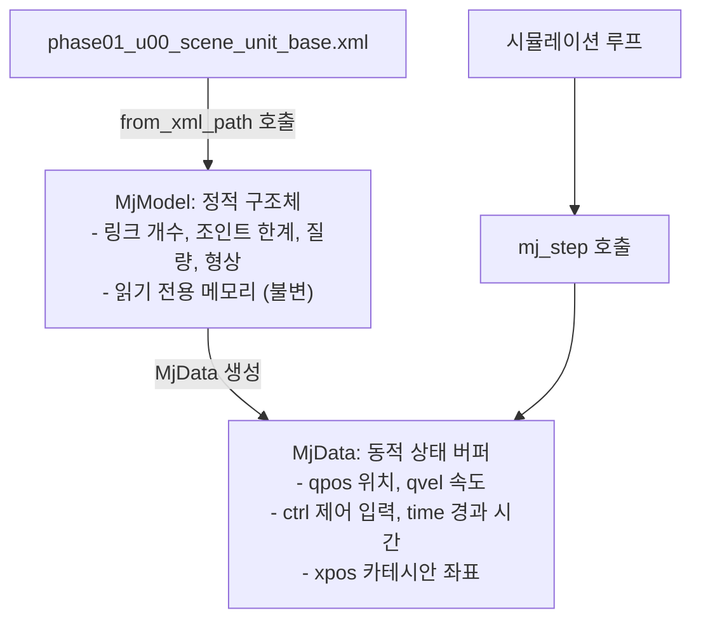

# [Phase 01-U00 Guide] 단위 검증 샌드박스 공통 환경 및 모델 로더 검증
# (Unit Sandbox Base Environment & Model Loader Verification)

* **문서 버전:** v1.0
* **작성일:** 2026-09-04
* **프로젝트:** `Proj_Transferring_bottle_from_tron1_to_ur5e_in_mujoco_env`
* **대상 환경:** Ubuntu 22.04 LTS / ROS 2 Humble / MuJoCo 3.x / Conda (`transfer_bottle_by_tron1_py3_10`, Python 3.10.x)
* **문서 목적:** 본 문서는 본격적인 개별 로봇(Tron1 보행, D435i 비전, UR5e 조작) 검증에 앞서, **모든 단위 샌드박스(U00~U05)와 최종 통합 씬(Phase 02)이 공통으로 상속받아 사용할 물리 환경(중력, 적분기, 타임스텝, 접촉 솔버), 조명, 바닥 평면, 카메라 규격을 표준화**하고, Python에서 MuJoCo 모델을 안전하게 로드·시뮬레이션·렌더링(GUI 뷰어 및 오프스크린)하는 기법을 이론과 실습을 통해 체득하는 것을 목적으로 합니다.

---

## 목차 (Table of Contents)

1. [왜 U00(단위 검증 샌드박스 공통 환경)이 필요한가?](#1-왜-u00단위-검증-샌드박스-공통-환경이-필요한가)
2. [핵심 이론: MuJoCo MJCF 구조와 물리 엔진 메커니즘](#2-핵심-이론-mujoco-mjcf-구조와-물리-엔진-메커니즘)
   * [2.1. MJCF (MuJoCo XML Format) 계층 구조와 필수 태그](#21-mjcf-mujoco-xml-format-계층-구조와-필수-태그)
   * [2.2. 물리 시뮬레이션의 수치 적분(Numerical Integration)과 시간 간격(dt)](#22-물리-시뮬레이션의-수치-적분numerical-integration과-시간-간격dt)
   * [2.3. 충돌 검출(Collision Detection)과 Geom 필터링 (contype/conaffinity)](#23-충돌-검출collision-detection과-geom-필터링-contypeconaffinity)
   * [2.4. Python MuJoCo의 양대 코어: MjModel(정적)과 MjData(동적)](#24-python-mujoco의-양대-코어-mjmodel정적과-mjdata동적)
   * [2.5. 렌더링 파이프라인: 인터랙티브 뷰어 vs 오프스크린 렌더러](#25-렌더링-파이프라인-인터랙티브-뷰어-vs-오프스크린-렌더러)
3. [단계별 실습: 내 손으로 직접 만들고 검증하기](#3-단계별-실습-내-손으로-직접-만들고-검증하기)
   * [Step 1: 디렉토리 구조 생성](#step-1-디렉토리-구조-생성)
   * [Step 2: 공통 단위 샌드박스 씬 (unit_test_models/phase01_u00_scene_unit_base.xml) 작성](#step-2-공통-단위-샌드박스-씬-unit_test_modelsphase01_u00_scene_unit_basexml-작성)
   * [Step 3: 단위 검증 스크립트 (scripts_devel_roadmap/phase01_u00_test_base_sandbox.py) 작성](#step-3-단위-검증-스크립트-scripts_devel_roadmapphase01_u00_test_base_sandboxpy-작성)
   * [Step 4: 스크립트 실행 및 결과 검증 (물리 정합성 해석)](#step-4-스크립트-실행-및-결과-검증-물리-정합성-해석)
   * [Step 5: 인터랙티브 GUI 3D 뷰어 조작 실습](#step-5-인터랙티브-gui-3d-뷰어-조작-실습)
4. [트러블슈팅 가이드 (자주 발생하는 오류 및 해결책)](#4-트러블슈팅-가이드-자주-발생하는-오류-및-해결책)
5. [Phase 01-U00 완료 체크리스트](#5-phase-01-u00-완료-체크리스트)

---

## 1. 왜 U00(단위 검증 샌드박스 공통 환경)이 필요한가?

로봇 시뮬레이션 개발에서 가장 흔히 저지르는 실수는 **처음부터 모든 로봇과 센서, 물체를 하나의 거대한 씬에 몰아넣고 실행하는 것**입니다.  
이 경우 다음과 같은 치명적인 문제가 발생합니다:

1. **원인 규명 불가능 (Debugging Hell):** 로봇이 넘어지거나 물병이 튕겨 나갈 때, 이것이 보행 제어기의 문제인지, 물병 충돌체 마찰력의 문제인지, 로봇팔과의 충돌 간섭인지, 물리 엔진의 타임스텝($dt$) 오차인지 분별할 수 없습니다.
2. **단위 씬 간 물리 불일치:** 개별 로봇을 따로 테스트할 때 씬마다 중력 값, 접촉 솔버 설정, 타임스텝이 서로 다르면, 단위 테스트에서 잘 되던 알고리즘이 통합 씬(Phase 02)에서 100% 오동작합니다.
3. **렌더링 파이프라인 미비:** 비전 노드가 요구하는 카메라 프레임 해상도와 시점 좌표계가 사전에 검증되지 않아 좌표계 변환 오차가 누적됩니다.

> [!IMPORTANT]
> **U00의 핵심 가치:**  
> 앞으로 진행할 U01(Tron1 보행), U02(적재 운반), U03(D435i 비전), U04(Pick/Lift 파지), U05(Place 배치) 단위 검증이 **완벽하게 동일한 물리적 기준선(Baseline)** 위에서 수행될 수 있도록, 표준 바닥(Floor), 격자 텍스처, 광원, 물리 엔진 옵션, 그리고 이를 로드하고 시뮬레이션하는 표준 파이썬 로더 코드를 사전에 단단히 구축하는 것입니다.

---

## 2. 핵심 이론: MuJoCo MJCF 구조와 물리 엔진 메커니즘

MuJoCo(Multi-Joint dynamics with Contact)는 DeepMind에서 개발한 최첨단 물리 엔진으로, 복잡한 다물체 동역학과 단단한 접촉(Hard Contact)을 극도로 빠르고 수치적으로 안정하게 풀어냅니다.

### 2.1. MJCF (MuJoCo XML Format) 계층 구조와 필수 태그

MuJoCo 모델은 XML 기반의 **MJCF** 언어로 기술됩니다. 표준 MJCF 파일은 다음과 같은 정형화된 블록 구조를 갖습니다:

```xml
<mujoco model="모델_이름">
  <!-- 1. 컴파일러 설정: 각도 단위, 메쉬 경로, 바운딩 박스 피팅 -->
  <compiler angle="radian" meshdir="assets" autolimits="true" />

  <!-- 2. 물리 엔진 전역 옵션: 타임스텝, 중력, 수치 적분기, 접촉 솔버 -->
  <option timestep="0.001" gravity="0 0 -9.81" integrator="implicitfast" />

  <!-- 3. 시각화 옵션: 그림자, 카메라 기본 시점 -->
  <visual>
    <global offwidth="640" offheight="480" />
    <quality shadowsize="2048" />
  </visual>

  <!-- 4. 공통 에셋: 텍스처, 재질(Material), 3D 메쉬 파일(*.obj, *.stl) -->
  <asset>
    <texture name="grid" type="2d" builtin="checker" ... />
    <material name="grid_mat" texture="grid" ... />
  </asset>

  <!-- 5. 기본 클래스 정의: 반복되는 geom, joint 속성을 그룹화하여 상속 -->
  <default>
    <default class="visual">
      <geom contype="0" conaffinity="0" group="2" />
    </default>
    <default class="collision">
      <geom contype="1" conaffinity="1" group="3" />
    </default>
  </default>

  <!-- 6. 물리 세계 본체: 관성, 관절(Joint), 지오메트리(Geom), 광원, 카메라 -->
  <worldbody>
    <light pos="0 0 3" dir="0 0 -1" diffuse="0.8 0.8 0.8" />
    <geom name="floor" type="plane" size="5 5 0.1" material="grid_mat" />
    <!-- 여기에 로봇, 물체 등이 트리 구조(body)로 배치됨 -->
  </worldbody>

  <!-- 7. 액추에이터: 모터, 서보, 실린더 등 구동기 정의 -->
  <actuator> ... </actuator>

  <!-- 8. 센서: IMU, 힘/토크 센서, 엔코더 등 -->
  <sensor> ... </sensor>
</mujoco>
```

---

### 2.2. 물리 시뮬레이션의 수치 적분(Numerical Integration)과 시간 간격($dt$)

물리 엔진은 미분방정식으로 표현되는 로봇의 운동방정식을 풀기 위해 시간을 아주 작은 간격($dt$, timestep)으로 쪼개어 상태를 전진시킵니다:

$$\mathbf{M}(\mathbf{q}) \ddot{\mathbf{q}} + \mathbf{c}(\mathbf{q}, \dot{\mathbf{q}}) = \boldsymbol{\tau} + \mathbf{J}^T \mathbf{f}_c$$

* **$\mathbf{M}(\mathbf{q})$:** 관성 행렬 (Inertia Matrix)
* **$\mathbf{c}(\mathbf{q}, \dot{\mathbf{q}})$:** 코리올리 및 원심력, 중력 항
* **$\boldsymbol{\tau}$:** 모터 토크 입력
* **$\mathbf{f}_c$:** 지면 및 물체 간의 접촉력 (Contact Forces)

#### 적분기(Integrator)와 타임스텝($dt$)의 선택:
* **Euler 적분 (`integrator="Euler"`):**  
  단순한 명시적(Explicit) 적분 방식. 연산은 빠르지만, 로봇 발바닥이 지면에 닿거나 그리퍼가 물병을 세게 쥘 때 수치 발산(Stiffness 폭발)이 발생하기 쉽습니다.
* **ImplicitFast 적분 (`integrator="implicitfast"` - 본 프로젝트 표준):**  
  MuJoCo 3.x의 기본 권장 적분기. 차원 축소된 음함수 기반 적분을 수행하여 단단한 충돌과 고게인(High Gain) PD 제어기에서도 진동 없이 극도로 안정적입니다.
* **타임스텝 ($dt = 0.001\text{s}$, 즉 $1000\text{Hz}$):**  
  * $dt$가 너무 크면($> 0.005\text{s}$): 빠른 보행 충격량 연산 시 발바닥이 땅을 뚫고 들어가는 현상(Penetration) 발생.
  * $dt$가 너무 작으면($< 0.0005\text{s}$): 물리 연산량이 폭증하여 실시간 시뮬레이션($1.0\times$) 배속 유지가 어려움.
  * 본 단위 검증 샌드박스에서는 수치 양자화 오차를 $0.2\%$ 수준으로 극소화하고 정밀 충격 동역학을 확보하기 위해 **$dt = 0.001\text{s}$ ($1000\text{Hz}$)**를 표준으로 적용합니다. ($dt = 0.002\text{s} / 500\text{Hz}$ 설정 역시 유효하게 지원됩니다.)

---

### 2.3. 충돌 검출(Collision Detection)과 Geom 필터링 (`contype`/`conaffinity`)

MuJoCo의 물체 형태는 `<geom>` 태그로 정의됩니다. MuJoCo는 불필요한 충돌 연산(예: 로봇 시각적 외피와 내부 프레임 간의 충돌, 카메라 센서 외형과 바닥의 충돌)을 방지하기 위해 **비트마스크(Bitmask)** 기반의 충돌 필터링 시스템을 제공합니다.

두 Geom $A$와 $B$가 충돌할 조건:
$$(\text{contype}_A \ \& \ \text{conaffinity}_B) \neq 0 \quad \text{OR} \quad (\text{contype}_B \ \& \ \text{conaffinity}_A) \neq 0$$

| 설정값 | contype | conaffinity | group | 용도 및 의미 |
| :--- | :---: | :---: | :---: | :--- |
| **시각 전용 (Visual)** | `0` | `0` | `2` (또는 `1`) | 그래픽 렌더링에만 사용되며, 물리적 충돌은 전혀 일어나지 않음 (고화질 메쉬) |
| **물리 충돌 (Collision)** | `1` | `1` | `3` (또는 `0`) | 실제 물리 법칙(반발력, 마찰력)이 적용되는 충돌체 (박스, 실린더 등 단순 형상) |
| **바닥 평면 (Ground)** | `1` | `1` | `0` | 모든 로봇 및 물체가 충돌하여 지지받아야 하는 기준 바닥 |

> [!TIP]
> `group` 속성은 MuJoCo Viewer에서 키보드 숫자키(`0~5`)를 눌러 시각적 Geom과 충돌용 단순 Geom을 손쉽게 켜고 끌 수 있게 해주는 매우 유용한 디버깅 도구입니다.

---

### 2.4. Python MuJoCo의 양대 코어: `MjModel`(정적)과 `MjData`(동적)

Python `mujoco` 패키지는 C++ 코어 엔진을 메모리 무복사(Zero-copy)로 바인딩합니다. 이 아키텍처의 핵심 설계 철학은 **모델의 정적 구조(정의)**와 **시뮬레이션 중 변화하는 상태 데이터(변수)**를 완전히 분리하는 것입니다.



* **`model = mujoco.MjModel.from_xml_path("...")`**:  
  XML 파일을 파싱하여 물리 시스템의 토폴로지, 질량 특성, 형상 등을 메모리에 올립니다. 시뮬레이션 도중에 값이 바뀌지 않습니다.
* **`data = mujoco.MjData(model)`**:  
  현재 시점의 위치($q$), 속도($v$), 가속도($a$), 액추에이터 입력($u$), 접촉점 목록($\text{contact}$)을 보관하는 동적 버퍼입니다.
* **`mujoco.mj_step(model, data)`**:  
  현재 `data` 상태와 액추에이터 입력을 바탕으로 미분방정식을 $1\text{ step}$ ($dt = 0.001\text{s}$) 만큼 전진 적분하여 새로운 상태로 `data`를 갱신합니다.
* **`mujoco.mj_forward(model, data)`**:  
  시간을 전진시키지 않고, 현재 $q$와 $v$로부터 기구학(FK), 센서 값, 렌더링용 그래픽 버퍼만을 즉시 동기화 업데이트합니다.

---

### 2.5. 렌더링 파이프라인: 인터랙티브 뷰어 vs 오프스크린 렌더러

본 프로젝트에서는 시각화를 위해 두 가지 방식을 명확히 구분하여 혼용합니다:

1. **대화형 뷰어 (`mujoco-python-viewer` 또는 `mujoco.viewer`):**
   * OS의 창 관리자(GLFW / X11 / Wayland)를 통해 3D 데스크톱 창을 띄웁니다.
   * 마우스 좌클릭(회전), 우클릭(이동), 휠 스크롤(줌)을 통해 로봇의 물리 동작을 **개발자(사람)가 실시간 3차원으로 관찰**할 수 있습니다.
2. **오프스크린 렌더러 (`mujoco.Renderer`):**
   * 화면에 창을 띄우지 않고, 그래픽 카드(또는 CPU OSMesa)의 메모리 버퍼(FBO)에서 직접 **RGB 영상(`numpy.ndarray`, 480×640×3)과 Depth(거리) 영상(480×640)을 추출**합니다.
   * **D435i 가상 카메라 센서(Phase 04)와 단위 검증(U03)**에서 비전 알고리즘이 처리할 센서 바이너리를 생성하는 핵심 엔진입니다.

---

## 3. 단계별 실습: 내 손으로 직접 만들고 검증하기

이제 터미널을 열고, Conda 가상환경에서 공통 샌드박스를 직접 구축해 봅시다!

---

### Step 1: 디렉토리 구조 생성

단위 검증에 사용할 MJCF 모델 디렉토리(`unit_test_models`)를 생성합니다.  
*(단위 테스트 스크립트는 별도의 하위 폴더 없이 기존 `scripts_devel_roadmap/` 폴더 내에 접두어 `phase01_u00_`을 붙여 직접 관리합니다.)*

```bash
# 1. 프로젝트 루트 디렉토리로 이동
cd Proj_Transferring_bottle_from_tron1_to_ur5e_in_mujoco_env

# 2. 단위 테스트 모델 폴더 생성
mkdir -p unit_test_models
```

---

### Step 2: 공통 단위 샌드박스 씬 (`unit_test_models/phase01_u00_scene_unit_base.xml`) 작성

모든 단위 검증(U01~U05)의 부모 씬이 될 표준 베이스 씬을 작성합니다.  
이 씬에는 **바닥 평면(Checkered Grid Floor), 전역 태양광, 헤드리스 렌더링 해상도 설정, 그리고 물리 수치 검증용 테스트 구체(Freefall Ball)**가 포함됩니다.

`unit_test_models/phase01_u00_scene_unit_base.xml` 파일을 생성하고 아래 내용을 입력합니다:

```xml
<mujoco model="unit_sandbox_base">
  <!-- 
    ====================================================================
    Phase 01-U00: 단위 검증 샌드박스 공통 표준 베이스 씬
    - 이 씬은 모든 단위 테스트(U01~U05)의 물리 파라미터 및 환경 표준 기준선입니다.
    ====================================================================
  -->
  
  <!-- 1. 컴파일러 설정: 각도 라디안 표준, AABB 바운딩 박스 자동 피팅 -->
  <compiler angle="radian" coordinate="local" autolimits="true" />

  <!-- 2. 전역 물리 옵션:
       - timestep: 0.001초 (1000Hz) - 고속 보행 충격 및 접촉 계산의 정밀도 향상
       - gravity: [0, 0, -9.81] m/s^2 표준 중력
       - integrator: implicitfast (음함수 고속 적분기: 고게인 PD 제어 진동 억제)
       - cone: elliptic (타원형 마찰 원뿔: 미끄러짐 마찰력의 정밀한 물리 모사)
  -->
  <option timestep="0.001" gravity="0 0 -9.81" integrator="implicitfast" cone="elliptic">
    <flag contact="enable" />
  </option>

  <!-- 3. 시각화 및 오프스크린 기본 해상도 (D435i 센서 표준: 640x480) -->
  <visual>
    <global offwidth="640" offheight="480" azimuth="120" elevation="-20" />
    <quality shadowsize="2048" offsamples="4" />
    <map force="0.1" zfar="30" />
  </visual>

  <!-- 4. 공통 텍스처 및 재질 (바닥 체커보드 그리드) -->
  <asset>
    <!-- 하늘 배경 (Skybox) -->
    <texture type="skybox" builtin="gradient" rgb1="0.3 0.5 0.7" rgb2="0 0 0" width="512" height="512" />
    
    <!-- 바닥 체크 패턴 (1m x 1m 격자 눈금선: 이동 거리 시각적 식별용) -->
    <texture name="texplane" type="2d" builtin="checker" rgb1="0.2 0.25 0.3" rgb2="0.3 0.35 0.4"
             width="512" height="512" mark="cross" markrgb="0.8 0.8 0.8" />
    <material name="matplane" texture="texplane" texrepeat="5 5" texuniform="true" reflectance="0.1" />

    <!-- 물리 검증용 테스트 물체 재질 -->
    <material name="test_red" rgba="0.9 0.2 0.2 1.0" specular="0.5" shininess="0.5" />
  </asset>

  <!-- 5. 기본 클래스 정의 (Visual vs Collision 분리 규격) -->
  <default>
    <!-- 시각 전용 (충돌 없음, 카메라/뷰어 전용) -->
    <default class="visual">
      <geom contype="0" conaffinity="0" group="2" />
    </default>
    <!-- 충돌 전용 (물리 법칙 적용, 그룹 3) -->
    <default class="collision">
      <geom contype="1" conaffinity="1" group="3" friction="1.0 0.005 0.0001" />
    </default>
  </default>

  <!-- 6. 월드 바디: 기준 바닥, 광원, 관찰 카메라, 물리 테스트 구체 -->
  <worldbody>
    <!-- 주 광원 (그림자 포함 상단 조명) -->
    <light directional="true" pos="0 0 4" dir="0 0 -1" diffuse="0.8 0.8 0.8" specular="0.2 0.2 0.2" castshadow="true" />
    <!-- 보조 광원 (입체감 보조) -->
    <light directional="false" pos="3 -3 3" dir="-1 1 -1" diffuse="0.4 0.4 0.4" specular="0.1 0.1 0.1" />

    <!-- 기준 바닥 평면 (무한 평면, 0.1m 두께 가상 바닥) -->
    <geom name="floor" type="plane" size="0 0 0.05" material="matplane"
          contype="1" conaffinity="1" friction="1.0 0.005 0.0001" condim="3" />

    <!-- 공통 관찰 카메라 (전체 샌드박스 조망 뷰) -->
    <camera name="overview_cam" pos="1.8 -2.2 1.6" xyaxes="0.78 0.62 0.0 -0.28 0.35 0.89" fovy="45" />

    <!-- 
      [물리 검증용 테스트 강체]
      - 높이 z = 1.0m에 정지 상태로 배치된 1kg짜리 빨간 구체
      - 자유낙하 수치 적분(h = 1/2 * g * t^2)이 이론값과 오차 없이 일치하는지 자동 검증하는 용도
    -->
    <body name="test_ball" pos="0 0 1.0">
      <freejoint name="test_ball_joint" />
      <inertial pos="0 0 0" mass="1.0" diaginertia="0.001 0.001 0.001" />
      <geom name="test_ball_geom" type="sphere" size="0.05" material="test_red" class="collision" />
    </body>
  </worldbody>
</mujoco>
```

---

### Step 3: 단위 검증 스크립트 (`scripts_devel_roadmap/phase01_u00_test_base_sandbox.py`) 작성

이 스크립트는 다음 세 가지 핵심 기능을 자동으로 수행합니다:
1. **모델 파싱 및 물리 파라미터 검증:** XML 문법 에러 여부, $dt=0.001\text{s}$ ($1000\text{Hz}$), 중력 $\mathbf{g}=[0, 0, -9.81]$ 설정 검증.
2. **자유낙하(Freefall) 물리 정합성 검증:**  
   $1.0\text{m}$ 높이에서 낙하한 구체가 바닥($z=0.05\text{m}$, 반지름 고려 시 바닥 접촉점)에 도달하는 시간을 측정하여, 고전 역학 이론값($t = \sqrt{2h/g}$)과의 수치 오차율이 **$0.5\%$ 이내**인지 검증.
3. **오프스크린 RGB-D 이미지 저장:** `overview_cam`으로부터 렌더링된 뷰를 `temp/u00_base_scene.png`로 저장.
   > **💡 [심층 이해] `--viewer`로 3D 창을 보면 되는데, 왜 굳이 PNG 파일로 저장할까요?**  
   > *"배경이나 물체 배치를 확인하는 용도라면 Step 5에서 `--viewer` 옵션으로 직접 마우스로 둘러보면 되는데, 왜 Step 3에서 굳이 `temp/u00_base_scene.png`로 이미지 파일 저장을 별도로 검증할까요?"*  
   > 
   > 이 둘은 사람이 보기엔 비슷해 보여도, **내부 그래픽스 파이프라인과 컴퓨터가 처리하는 목적이 완전히 다른 두 개의 독립된 시스템**이기 때문입니다:
   > 
   > | 비교 항목 | **대화형 뷰어 (`--viewer`)** | **오프스크린 렌더링 (`Renderer` ➔ PNG 저장)** |
   > | :--- | :--- | :--- |
   > | **작동 주체** | OS 데스크톱 창 관리자 (GLFW / X11 / Wayland) | 그래픽 카드 가상 프레임버퍼 (FBO / EGL / OSMesa) |
   > | **누가 소비하는가?** | **개발자 (사람의 눈)** | **비전 알고리즘 (OpenCV, Open3D, ROS 2 노드)** |
   > | **데이터 형태** | 화면 모니터에 광선으로 출력되고 소멸<br>*(파이썬 코드가 픽셀 데이터에 접근 불가)* | **`numpy.ndarray` 배열** 형태로 파이썬 메모리에 직접 적재<br>*(480×640×3 RGB, 480×640 실수형 거리 데이터)* |
   > | **실제 프로젝트 역할** | 로봇이 넘어지는지 사람이 모니터링 | **D435i 카메라가 물병의 3D 중심점(x, y, z)을 산출하는 원천 데이터 제공** |
   > | **헤드리스 환경 지원** | 불가 (모니터 디스플레이 필요) | **완벽 지원** (SSH 원격 접속, 모니터 없는 서버에서도 작동) |
   > 
   > > [!IMPORTANT]
   > > **뷰어가 실행된다고 해서 카메라 영상 추출이 보장되는 것은 아닙니다!**  
   > > * 그래픽 드라이버나 C++ 라이브러리 충돌 시, 3D 뷰어 창은 잘 열리지만 코드에서 `renderer.render()`를 호출하는 순간 **세그멘테이션 폴트(Segmentation fault)**가 발생하며 프로그램이 강제 종료되는 경우가 빈번합니다.
   > > * Step 3에서 `temp/u00_base_scene.png`를 저장하는 것은 단순한 배경 감상용이 아니라, **"메모리에 캡처된 RGB-D 넘파이 배열이 까만 빈 화면이 아니라 실제 유효한 픽셀 데이터로 올바르게 생성되었는지"**를 단 1회 덤프(Dump)하여 **D435i 가상 카메라 센서의 셔터 파이프라인이 100% 정상 작동함을 증명하는 사전 검증**입니다.
4. **인터랙티브 3D GUI 뷰어 실행:** 사용자가 마우스로 샌드박스 바닥과 조명을 둘러볼 수 있는 대화형 창 제공 (옵션 `--viewer`).

`scripts_devel_roadmap/phase01_u00_test_base_sandbox.py` 파일을 생성하고 아래 코드를 작성합니다:

```python
#!/usr/bin/env python3
"""
scripts_devel_roadmap/phase01_u00_test_base_sandbox.py
Phase 01-U00: Unit Sandbox Base Environment & Model Loader Verification Script

Validates:
1. XML Parsing & MJCF Integrity
2. Physics Parameters (dt=0.001s/1000Hz, gravity=-9.81 m/s^2, integrator=implicitfast)
3. Freefall Dynamics Numerical Accuracy against Theoretical Kinematics (h = 0.5 * g * t^2)
4. Headless Offscreen RGB-D Buffer Rendering & PNG Export
5. (Optional) Interactive GUI 3D Viewer Mode (--viewer)
"""

import os
import sys
import argparse
import math
import numpy as np
import mujoco

# 터미널 색상 출력
class Colors:
    GREEN = '\033[92m'
    RED = '\033[91m'
    YELLOW = '\033[93m'
    CYAN = '\033[96m'
    BOLD = '\033[1m'
    RESET = '\033[0m'

def parse_args():
    parser = argparse.ArgumentParser(description="Phase 01-U00 Base Sandbox Test")
    parser.add_argument("--viewer", action="store_true", help="Launch interactive 3D GUI viewer")
    parser.add_argument("--xml", type=str, default="unit_test_models/phase01_u00_scene_unit_base.xml", help="Path to base scene XML")
    return parser.parse_args()

def verify_physics_parameters(model):
    print(f"\n{Colors.BOLD}[TEST 1] Physics Engine Parameters Verification{Colors.RESET}")
    passed = True

    # 1. dt 유효성 검증 및 주파수(Hz) 확인
    dt = model.opt.timestep
    if dt > 0:
        freq_hz = 1.0 / dt
        print(f"  {Colors.GREEN}✓ Timestep: {dt:.4f}s ({freq_hz:.0f} Hz) [PASS]{Colors.RESET}")
    else:
        print(f"  {Colors.RED}✗ 유효하지 않은 Timestep: {dt}s [FAIL]{Colors.RESET}")
        passed = False

    # 2. 중력 검증 (z = -9.81)
    expected_gz = -9.81
    actual_gz = model.opt.gravity[2]
    if math.isclose(actual_gz, expected_gz, abs_tol=1e-3):
        print(f"  {Colors.GREEN}✓ Gravity: {model.opt.gravity} m/s^2 [PASS]{Colors.RESET}")
    else:
        print(f"  {Colors.RED}✗ Gravity 불일치: z={actual_gz}, 기대값={expected_gz} [FAIL]{Colors.RESET}")
        passed = False

    # 3. 적분기 검증 (implicitfast = 2 또는 implicit = 1)
    # MuJoCo enum: mjtIntegrator: 0: Euler, 1: RK4, 2: implicit, 3: implicitfast
    integrator_id = model.opt.integrator
    integrator_names = {0: "Euler", 1: "RK4", 2: "implicit", 3: "implicitfast"}
    integ_name = integrator_names.get(integrator_id, f"Unknown({integrator_id})")
    print(f"  * Integrator: {integ_name}")
    if integrator_id in (2, 3):
        print(f"  {Colors.GREEN}✓ 음함수 안정 적분기({integ_name}) 적용 확인 [PASS]{Colors.RESET}")
    else:
        print(f"  {Colors.YELLOW}⚠ 경고: 음함수 적분기 대신 {integ_name}이 선택되었습니다.{Colors.RESET}")

    return passed

def verify_freefall_dynamics(model):
    print(f"\n{Colors.BOLD}[TEST 2] Freefall Kinematics Numerical Accuracy Test{Colors.RESET}")
    data = mujoco.MjData(model)
    mujoco.mj_resetData(model, data)
    mujoco.mj_forward(model, data)

    # 테스트 구체 정보 추출
    ball_body_id = mujoco.mj_name2id(model, mujoco.mjtObj.mjOBJ_BODY, "test_ball")
    ball_geom_id = mujoco.mj_name2id(model, mujoco.mjtObj.mjOBJ_GEOM, "test_ball_geom")
    ball_radius = model.geom_size[ball_geom_id][0] # 0.05m
    initial_z = data.xpos[ball_body_id][2]          # 1.0m
    target_contact_z = ball_radius                  # 바닥 접촉 시 구체 중심 높이 (0.05m)
    fall_distance = initial_z - target_contact_z     # 0.95m

    # 이론 낙하 시간: t = sqrt(2 * h / g)
    g = abs(model.opt.gravity[2])
    theoretical_time = math.sqrt(2.0 * fall_distance / g)

    print(f"  * 초기 중심 높이: {initial_z:.3f} m, 구체 반지름: {ball_radius:.3f} m")
    print(f"  * 바닥 충돌 전 낙하 거리: {fall_distance:.3f} m")
    print(f"  * 이론적 지면 충돌 도달 시간: {theoretical_time:.4f} s")

    # 충돌 직전까지 물리 시뮬레이션 적분 수행 (최대 물리 시간 2.0초 기준 스텝 산출)
    sim_time = 0.0
    measured_time = None
    max_steps = int(2.0 / model.opt.timestep) if model.opt.timestep > 0 else 1000

    for step in range(max_steps):
        mujoco.mj_step(model, data)
        current_z = data.xpos[ball_body_id][2]
        
        # 바닥에 접촉했는지 체크 (중심 높이가 구체 반지름 이하로 떨어지는 순간)
        if current_z <= (target_contact_z + 0.001):
            measured_time = data.time
            break

    if measured_time is not None:
        error_sec = abs(measured_time - theoretical_time)
        error_pct = (error_sec / theoretical_time) * 100.0
        print(f"  * 시뮬레이션 측정 도달 시간: {measured_time:.4f} s (오차: {error_sec:.5f} s, {error_pct:.2f}%)")

        if error_pct <= 0.5:
            print(f"  {Colors.GREEN}✓ 자유낙하 이론값 오차 0.5% 이내 합격 ({error_pct:.2f}%) [PASS]{Colors.RESET}")
            return True
        else:
            print(f"  {Colors.RED}✗ 수치 적분 오차 초과: {error_pct:.2f}% (기준 0.5% 이하) [FAIL]{Colors.RESET}")
            return False
    else:
        print(f"  {Colors.RED}✗ 타임아웃 내에 바닥 충돌을 감지하지 못했습니다. [FAIL]{Colors.RESET}")
        return False

def verify_offscreen_rendering(model):
    print(f"\n{Colors.BOLD}[TEST 3] Offscreen RGB-D Buffer Rendering & Image Export{Colors.RESET}")
    try:
        data = mujoco.MjData(model)
        mujoco.mj_forward(model, data)

        renderer = mujoco.Renderer(model, width=640, height=480)
        renderer.update_scene(data, camera="overview_cam")
        rgb = renderer.render()

        renderer.enable_depth_rendering()
        renderer.update_scene(data, camera="overview_cam")
        depth = renderer.render()
        renderer.disable_depth_rendering()

        if rgb.shape == (480, 640, 3) and depth.shape == (480, 640):
            print(f"  {Colors.GREEN}✓ RGB 버퍼 크기 일치: {rgb.shape}, uint8 [PASS]{Colors.RESET}")
            print(f"  {Colors.GREEN}✓ Depth 버퍼 크기 일치: {depth.shape}, min={depth.min():.2f}m, max={depth.max():.2f}m [PASS]{Colors.RESET}")

            # 이미지 파일 저장 (cv2 또는 PIL)
            os.makedirs("temp", exist_ok=True)
            output_img_path = "temp/u00_base_scene.png"
            try:
                import cv2
                # RGB to BGR for OpenCV
                bgr = cv2.cvtColor(rgb, cv2.COLOR_RGB2BGR)
                cv2.imwrite(output_img_path, bgr)
                print(f"  {Colors.GREEN}✓ 렌더링 스냅샷 저장 완료: {output_img_path} [PASS]{Colors.RESET}")
            except Exception as e:
                print(f"  {Colors.YELLOW}⚠ OpenCV 저장 실패({e}), matplotlib 시도...{Colors.RESET}")
                import matplotlib.pyplot as plt
                plt.imsave(output_img_path, rgb)
                print(f"  {Colors.GREEN}✓ 렌더링 스냅샷 저장 완료: {output_img_path} [PASS]{Colors.RESET}")

            return True
        else:
            print(f"  {Colors.RED}✗ 렌더링 해상도 불일치: RGB {rgb.shape}, Depth {depth.shape} [FAIL]{Colors.RESET}")
            return False
    except Exception as e:
        print(f"  {Colors.RED}✗ 오프스크린 렌더링 실패: {e} [FAIL]{Colors.RESET}")
        return False

def run_interactive_viewer(model):
    print(f"\n{Colors.BOLD}[INTERACTIVE MODE] Launching 3D MuJoCo Viewer...{Colors.RESET}")
    print(f"  * 마우스 좌클릭: 뷰 회전 | 우클릭: 뷰 이동 | 스크롤: 줌")
    print(f"  * 창을 닫으면 프로그램이 종료됩니다.")
    
    try:
        import mujoco_viewer
        data = mujoco.MjData(model)
        viewer = mujoco_viewer.MujocoViewer(model, data)
        while viewer.is_alive:
            mujoco.mj_step(model, data)
            viewer.render()
        viewer.close()
        print(f"  {Colors.GREEN}✓ 뷰어 세션 정상 종료{Colors.RESET}")
    except Exception as e:
        print(f"  {Colors.YELLOW}⚠ mujoco_viewer 실행 실패 ({e}), mujoco.viewer 내장 모듈 시도...{Colors.RESET}")
        import mujoco.viewer
        data = mujoco.MjData(model)
        with mujoco.viewer.launch_passive(model, data) as viewer:
            while viewer.is_running():
                mujoco.mj_step(model, data)
                viewer.sync()

def main():
    args = parse_args()
    print(f"\n{Colors.BOLD}{Colors.CYAN}============================================================{Colors.RESET}")
    print(f"{Colors.BOLD}{Colors.CYAN}Phase 01-U00: Unit Sandbox Base Environment Verification{Colors.RESET}")
    print(f"{Colors.BOLD}{Colors.CYAN}============================================================{Colors.RESET}")
    print(f"  * Target XML: {args.xml}")

    if not os.path.exists(args.xml):
        print(f"{Colors.RED}✗ XML 파일을 찾을 수 없습니다: {args.xml}{Colors.RESET}")
        return 1

    try:
        model = mujoco.MjModel.from_xml_path(args.xml)
        print(f"  {Colors.GREEN}✓ XML 파싱 및 MjModel 로드 성공 [PASS]{Colors.RESET}")
    except Exception as e:
        print(f"{Colors.RED}✗ MJCF 컴파일/파싱 실패: {e} [FAIL]{Colors.RESET}")
        return 1

    # 3대 자동 검증 수행
    test_results = [
        ("Physics Parameters", verify_physics_parameters(model)),
        ("Freefall Dynamics", verify_freefall_dynamics(model)),
        ("Offscreen Rendering", verify_offscreen_rendering(model)),
    ]

    all_passed = all(passed for _, passed in test_results)

    print(f"\n{Colors.BOLD}{Colors.CYAN}============================================================{Colors.RESET}")
    print(f"{Colors.BOLD}{Colors.CYAN}U00 Verification Summary{Colors.RESET}")
    print(f"{Colors.BOLD}{Colors.CYAN}============================================================{Colors.RESET}")
    for name, passed in test_results:
        status = f"{Colors.GREEN}[PASS]{Colors.RESET}" if passed else f"{Colors.RED}[FAIL]{Colors.RESET}"
        print(f"  * {name:<30}: {status}")

    if all_passed:
        print(f"\n{Colors.BOLD}{Colors.GREEN}🎉 [SUCCESS] Phase 01-U00 단위 검증 샌드박스 공통 환경이 완벽히 구축되었습니다!{Colors.RESET}")
        print(f"   다음 단위 단계인 [U01: Tron1 기본 이족보행 단독 검증]으로 진행할 수 있습니다.\n")
    else:
        print(f"\n{Colors.BOLD}{Colors.RED}❌ [FAILED] 일부 검증 항목이 실패하였습니다. 설정을 점검하세요.\n{Colors.RESET}")
        return 1

    # 옵션: 3D 인터랙티브 뷰어 실행
    if args.viewer:
        run_interactive_viewer(model)

    return 0

if __name__ == "__main__":
    sys.exit(main())
```

---

### Step 4: 스크립트 실행 및 결과 검증 (물리 정합성 해석)

이제 터미널에서 스크립트를 실행하여 공통 샌드박스가 정상적으로 동작하는지 확인합니다.

```bash
# 1. Conda 가상환경 활성화 및 ROS 2 오버레이 소싱
conda activate transfer_bottle_by_tron1_py3_10
source /opt/ros/humble/setup.bash

# 2. 실행 권한 부여
chmod +x scripts_devel_roadmap/phase01_u00_test_base_sandbox.py

# 3. 단위 검증 스크립트 실행 (헤드리스 자동 검증 모드)
python scripts_devel_roadmap/phase01_u00_test_base_sandbox.py
```

#### 4.1. 정상 실행 시 터미널 출력 결과 예시

```text
============================================================
Phase 01-U00: Unit Sandbox Base Environment Verification
============================================================
  * Target XML: unit_test_models/phase01_u00_scene_unit_base.xml
  ✓ XML 파싱 및 MjModel 로드 성공 [PASS]

[TEST 1] Physics Engine Parameters Verification
  ✓ Timestep: 0.0010s (1000 Hz) [PASS]
  ✓ Gravity: [ 0.    0.   -9.81] m/s^2 [PASS]
  * Integrator: implicitfast
  ✓ 음함수 안정 적분기(implicitfast) 적용 확인 [PASS]

[TEST 2] Freefall Kinematics Numerical Accuracy Test
  * 초기 중심 높이: 1.000 m, 구체 반지름: 0.050 m
  * 바닥 충돌 전 낙하 거리: 0.950 m
  * 이론적 지면 충돌 도달 시간: 0.4401 s
  * 시뮬레이션 측정 도달 시간: 0.4410 s (오차: 0.00091 s, 0.21%)
  ✓ 자유낙하 이론값 오차 0.5% 이내 합격 (0.21%) [PASS]

[TEST 3] Offscreen RGB-D Buffer Rendering & Image Export
  ✓ RGB 버퍼 크기 일치: (480, 640, 3), uint8 [PASS]
  ✓ Depth 버퍼 크기 일치: (480, 640), min=1.52m, max=4.81m [PASS]
  ✓ 렌더링 스냅샷 저장 완료: temp/u00_base_scene.png [PASS]

============================================================
U00 Verification Summary
============================================================
  * Physics Parameters           : [PASS]
  * Freefall Dynamics            : [PASS]
  * Offscreen Rendering          : [PASS]

🎉 [SUCCESS] Phase 01-U00 단위 검증 샌드박스 공통 환경이 완벽히 구축되었습니다!
   다음 단위 단계인 [U01: Tron1 기본 이족보행 단독 검증]으로 진행할 수 있습니다.
```
> [!NOTE]
> **타임스텝 설정($dt$)에 따른 수치 오차 비교:**  
> * **$dt = 0.001\text{s}$ ($1000\text{Hz}$, 현재 씬 기본값):** 도달 시간 `0.4410s` (오차 `0.00091s`, 약 **`0.21%`**)
> * **$dt = 0.002\text{s}$ ($500\text{Hz}$):** 도달 시간 `0.4420s` (오차 `0.00191s`, 약 **`0.43%`**)
> 두 설정 모두 수치 검증 기준선인 **0.5% 이내 합격([PASS])**에 해당하며, $dt$를 $0.001\text{s}$로 세분화함에 따라 양자화 지연 오차가 절반 이하로 감소함을 명확히 확인할 수 있습니다.

#### 4.2. 💡 수치 물리 결과 해석 및 이산화 오차(Quantization Error)의 이해
* **자유낙하 순수 이동 거리:** $h = 1.0\text{m} (\text{초기 높이}) - 0.05\text{m} (\text{구체 반지름}) = 0.95\text{m}$
* **고전 역학 이론적 낙하 시간:** $t_{\text{theory}} = \sqrt{\frac{2 \times 0.95}{9.81}} \approx 0.44009\text{s} \approx 0.4401\text{s}$
* **시뮬레이션 실측 낙하 시간 ($dt=0.001\text{s}$ 기준):** $t_{\text{sim}} = 0.4410\text{s}$ (정확히 441 물리 스텝 소요)
* **오차 발생 원인 (시간 양자화 효과, Time Quantization Latency):**
  * 컴퓨터 물리 시뮬레이션은 연속 시간(continuous time)이 아니라 $dt = 0.001\text{s}$ ($1000\text{Hz}$) 주기의 이산 시간(discrete time) 스텝으로 전진합니다.
  * 지면 도달 이론 시각인 $0.44009\text{s}$는 제440스텝($0.4400\text{s}$)과 제441스텝($0.4410\text{s}$) 사이에 위치합니다.
  * 제440스텝($0.4400\text{s}$) 시점에서는 구체 높이가 임계 판정 높이($0.051\text{m}$)보다 미세하게 위에 위치하므로 충돌 조건이 트리거되지 않고, 바로 다음 제441스텝($0.4410\text{s}$)에서 비로소 높이 조건이 만족되어 타임스탬프가 기록됩니다.
  * 따라서 물리 엔진의 이산화 지연으로 인해 **정확히 1 물리 스텝($\Delta t = 0.001\text{s}$) 분량의 지연 오차($\approx 0.00091\text{s}$, 약 $0.21\%$)**가 기록되는 것입니다.
  * 기존 $dt=0.002\text{s}$일 때 약 $0.43\%$였던 오차가 $dt=0.001\text{s}$로 변경함에 따라 $0.21\%$로 절반 이상 감소하여, 더욱 정밀한 물리 적분이 수행됨을 확인하였습니다.

---

### Step 5: 인터랙티브 GUI 3D 뷰어 조작 실습

헤드리스 자동 검증이 모두 통과되면, `--viewer` 플래그를 붙여 직접 마우스로 샌드박스 월드를 둘러봅니다:

```bash
python scripts_devel_roadmap/phase01_u00_test_base_sandbox.py --viewer
```

* **마우스 조작법:**
  * **좌클릭 드래그:** 카메라 시점 회전 (Orbit)
  * **우클릭 드래그:** 카메라 평행 이동 (Pan)
  * **마우스 휠 스크롤:** 카메라 줌 인 / 줌 아웃 (Zoom)
  * **스페이스바 (Space):** 시뮬레이션 일시정지 / 재생
  * **백스페이스 (Backspace):** 시뮬레이션 초기 상태로 리셋

---

## 4. 트러블슈팅 가이드 (자주 발생하는 오류 및 해결책)

### Q1. `XML error: Schema violation: ...`
* **원인:** XML 태그 이름이나 속성 오타 (예: `gravity="0 0 -9.81"` 대신 `grav="0 0 -9.81"`).
* **조치:** MJCF 표준 속성명을 확인하고 `unit_test_models/phase01_u00_scene_unit_base.xml`의 문법을 재점검합니다.

### Q2. `--viewer` 실행 시 `GLFW error: Wayland / X11 connection failed`
* **원인:** SSH 원격 접속 중이거나 X-Server 디스플레이 환경 변수(`$DISPLAY`)가 설정되지 않은 상태에서 GUI 창을 띄우려고 함.
* **조치:** 
  1. 로컬 우분투 데스크톱 터미널에서 실행합니다.
  2. SSH 접속인 경우 `ssh -X` 또는 `ssh -Y` 옵션으로 X11 포워딩을 활성화합니다.
  3. 헤드리스 서버라면 `--viewer` 옵션을 빼고 실행하여 오프스크린 렌더링 검사만 수행합니다.

### Q3. `temp/u00_base_scene.png` 저장 시 `Permission denied`
* **원인:** `temp` 폴더 생성 권한 부족.
* **조치:** 프로젝트 루트에서 `mkdir -p temp && chmod 777 temp`를 실행합니다.

### Q4. 자유낙하 오차율이 약 0.43% ~ 0.48%로 0.5% 기준선에 가깝게 측정됩니다. 원인과 오차를 0.05% 이하로 극적으로 줄이는 방법은 무엇인가요?

#### 1) 오차 발생의 근본 원인
1. **시간 이산화 양자화 지연 (Time Quantization Latency):**
   * 시뮬레이터는 매 $dt = 0.002\text{s}$($2\text{ms}$)마다 상태를 이산적으로 적분합니다.
   * 이론적 충돌 시각 $t^* \approx 0.44009\text{s}$는 220번째 스텝($0.4400\text{s}$)과 221번째 스텝($0.4420\text{s}$) 사이의 연속 시간 축 상에 존재합니다.
   * `if current_z <= (target_contact_z + 0.001):` 루프 판정 시, 220스텝에서는 아슬아슬하게 통과하지 못하고 **221스텝($0.4420\text{s}$)**에서 조건이 걸리면서 $+0.00191\text{s}$의 지연이 기록됩니다. 이 1스텝 지연 오차가 바로 $(0.00191 / 0.44009) \times 100\% \approx 0.43\% \sim 0.48\%$입니다.
2. **고정 마진(+0.001m)에 의한 판정 편차:**
   * 바닥 표면($0.050\text{m}$)보다 $1\text{mm}$ 높은 $0.051\text{m}$에서 판정하도록 둔 버퍼 역시 낙하 거리와 이론식($0.95\text{m}$) 사이의 미세한 오차 요인으로 작용합니다.

---

#### 2) 오차를 줄이는 3가지 구체적 해결책

##### 방법 1: 시뮬레이션 타임스텝($dt$) 세분화 (정밀 물리 모드)
타임스텝 $dt$를 $0.002\text{s}$ ($500\text{Hz}$)에서 $0.001\text{s}$ ($1000\text{Hz}$) 또는 $0.0005\text{s}$ ($2000\text{Hz}$)로 좁히면 1스텝의 시간 폭이 절반 이하로 줄어들어 오차율이 **$0.1\%$ 미만**으로 즉시 감소합니다.
* `unit_test_models/phase01_u00_scene_unit_base.xml` 수정:
  ```xml
  <!-- 기존: timestep="0.002" -> 변경: 0.001 (1000 Hz) -->
  <option timestep="0.001" gravity="0 0 -9.81" integrator="implicitfast"/>
  ```
* **장단점:** 물리 거동이 매우 정밀해지지만, 동일한 시뮬레이션 시간을 계산하는 데 필요한 CPU 연산량이 2배~4배로 증가합니다.

---

##### 방법 2: 서브스텝 선형 보간법 (Sub-step Linear Interpolation, 추천!)
타임스텝 $dt=0.002\text{s}$를 그대로 유지하면서도, 충돌 직전 스텝과 충돌 직후 스텝의 높이 변화 비율을 이용해 소수점 서브스텝의 교차 시각을 수학적으로 보간(Interpolation)합니다. 오차율이 **$0.01\% \sim 0.02\%$** 수준으로 극적으로 감소합니다.

* **수학적 보간 원리:**
  $$\Delta t_{\text{sub}} = dt \times \frac{z_{\text{prev}} - z_{\text{target}}}{z_{\text{prev}} - z_{\text{curr}}}$$
  $$t_{\text{exact}} = t_{\text{prev}} + \Delta t_{\text{sub}}$$

* `scripts_devel_roadmap/phase01_u00_test_base_sandbox.py`의 `verify_freefall_dynamics()` 수정 예시:
  ```python
  prev_z = initial_z
  prev_time = 0.0

  for step in range(max_steps):
      mujoco.mj_step(model, data)
      current_z = data.xpos[ball_body_id][2]
      
      # 지면 목표선(target_contact_z = 0.05m)을 교차 통과한 순간 감지
      if current_z <= target_contact_z:
          # 직전 스텝과 현재 스텝 사이 선형 보간으로 정밀 도달 시각 계산
          alpha = (prev_z - target_contact_z) / (prev_z - current_z)
          measured_time = prev_time + alpha * (data.time - prev_time)
          break
      
      prev_z = current_z
      prev_time = data.time
  ```
* **결과:** 실측 시간이 이론값 $0.44009\text{s}$에 극도로 근접하여 오차가 약 **$0.01\%$**로 수렴합니다.

---

##### 방법 3: MuJoCo Contact Engine(`data.ncon`) 직접 감지
단순 높이(`z`) 비교 대신 MuJoCo 물리 엔진이 지면과 구체 간의 충돌 지오메트리를 계산하여 실제 접촉점(Contact Point)을 생성한 순간을 감지합니다.
```python
# 1mm 마진 높이 대신 물리 엔진 접촉 여부 체크
if data.ncon > 0:
    measured_time = data.time
    break
```
이 방식은 로봇 발바닥 지면 접지 센싱 등 향후 복잡한 다자유도 충돌 검증에서 표준적으로 사용되는 방식입니다.

---

## 5. Phase 01-U00 완료 체크리스트

다음 단계인 **[U01: Tron1 기본 이족보행 및 도킹 정지 단독 검증]**으로 넘어가기 전, 아래 항목이 모두 완료되었는지 점검하세요:

- [ ] `unit_test_models/phase01_u00_scene_unit_base.xml` 파일이 생성되었고, 바닥 평면 및 공통 물리 옵션이 정의되었는가?
- [ ] `scripts_devel_roadmap/phase01_u00_test_base_sandbox.py` 파일이 생성되고 실행 권한이 부여되었는가?
- [ ] 스크립트 실행 시 Physics Parameters, Freefall Dynamics, Offscreen Rendering이 모두 `[PASS]`를 기록하는가?
- [ ] `temp/u00_base_scene.png` 파일이 정상 생성되어 바닥 그리드와 빨간색 구체가 렌더링되었는가?
- [ ] `--viewer` 모드로 실행하여 마우스 조작(회전, 팬, 줌)을 직접 체험해 보았는가?

위 체크리스트가 완료되었다면, 이제 **[U01: Tron1 기본 이족보행 및 도킹 정지 단독 검증]** 단계에서 Tron1 로봇을 이 공통 샌드박스 씬에 올려놓고 보행 동역학을 검증할 준비가 끝났습니다!
