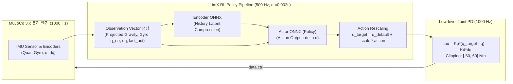

# [Phase 01-U01 Guide] Tron1 LimX 공식 상용 강화학습(RL) 기반 스폰 착지 및 제자리 발구름(In-place Stepping) 검증
# (Point-Foot Bipedal In-place Stepping Verification with LimX Pretrained RL Policy)

* **문서 버전:** v2.0 (LimX Dynamics 공식 상용 RL 배포 아키텍처 완전 자립형 가이드)
* **작성일:** 2026-09-08
* **프로젝트:** `Proj_Transferring_bottle_from_tron1_to_ur5e_in_mujoco_env`
* **대상 환경:** Ubuntu 22.04 LTS / ROS 2 Humble / MuJoCo 3.x / Conda (`transfer_bottle_by_tron1_py3_10`, Python 3.10.x)
* **문서 목적:** 본 문서는 **Phase 01-U00(단위 샌드박스 공통 환경 검증)을 완료한 독자가 본 문서 하나만 보고 처음부터 끝까지 따라 하여**, 발목 관절이 없는 LimX Dynamics Tron1 점 발바닥(Point-Foot) 로봇 단독 검증 씬 XML과 공식 사전 훈련 강화학습(DRL / ONNX) 기반 제어 스크립트를 직접 작성하고, 스폰 직후 지면에 부드럽게 착지하여 쓰러지지 않고 제자리에서 발을 구르며(In-place Stepping) 영구적인 직립 동적 균형을 유지하는 전 과정을 학습·검증하는 것을 목적으로 합니다.

> [!NOTE]
> **개발 범위 안내:**  
> 본 단위 검증의 최종 목표는 인계 구역까지 전진 보행하는 것이지만, **본 문서(Step 1)에서는 스폰(Spawn) 직후 지면 충격을 흡수하며 안정적으로 착지한 뒤 제자리에서 발을 구르며 쓰러지지 않고 직립을 영구히 유지하는 'In-place Stepping & Dynamic Balance' 구현 및 검증까지**를 집중적으로 다룹니다. 전진 보행 및 인계 구역 도킹은 본 단계의 직립 안정성이 검증된 직후 Step 2에서 순차적으로 확장합니다.

---

## 목차 (Table of Contents)

1. [왜 U01(Tron1 보행 및 제자리 발구름 검증)이 필요한가?](#1-왜-u01tron1-보행-및-제자리-발구름-검증이-필요한가)
2. [핵심 이론: 포인트 풋 2족 로봇 동역학과 Sim-to-Real 강화학습 제어](#2-핵심-이론-포인트-풋-2족-로봇-동역학과-sim-to-real-강화학습-제어)
   * [2.1. 포인트 풋(Point-Foot)의 기구학적 특성과 지지 다각형(Support Polygon)의 부재](#21-포인트-풋point-foot의-기구학적-특성과-지지-다각형support-polygon의-부재)
   * [2.2. 고전 수식 제어(PID/ZMP)의 한계와 강화학습(DRL)의 필연성](#22-고전-수식-제어pidzmp의-한계와-강화학습drl의-필연성)
   * [2.3. LimX 공식 RL 아키텍처 (PPO & Actor-Critic)](#23-limx-공식-rl-아키텍처-ppo--actor-critic)
   * [2.4. 관측 공간 (Observation Space: 투영 중력과 고유 감각)](#24-관측-공간-observation-space-투영-중력과-고유-감각)
   * [2.5. 행동 공간 (Action Space) 및 500Hz 관절 PD 제어 연동](#25-행동-공간-action-space-및-500hz-관절-pd-제어-연동)
   * [2.6. 제자리 발구름(In-place Stepping)의 동적 평형 원리](#26-제자리-발구름in-place-stepping의-동적-평형-원리)
3. [단계별 실습: 내 손으로 직접 만들고 검증하기](#3-단계별-실습-내-손으로-직접-만들고-검증하기)
   * [Step 1: 환경 설정 및 공식 사전 훈련 모델 준비](#step-1-환경-설정-및-공식-사전-훈련-모델-준비)
   * [Step 2: 단위 샌드박스 씬 (xml_for_unit_test/phase01_u01_scene_unit_tron1.xml) 직접 작성](#step-2-단위-샌드박스-씬-xml_for_unit_testphase01_u01_scene_unit_tron1xml-직접-작성)
   * [Step 3: RL 제자리 발구름 제어 스크립트 (scripts_devel_roadmap/phase01_u01_test_tron1_walking_rl.py) 직접 작성](#step-3-rl-제자리-발구름-제어-스크립트-scripts_devel_roadmapphase01_u01_test_tron1_walking_rlpy-직접-작성)
   * [Step 4: 스크립트 실행 및 결과 검증 (물리 정합성 및 텔레메트리 해석)](#step-4-스크립트-실행-및-결과-검증-물리-정합성-및-텔레메트리-해석)
   * [Step 5: 인터랙티브 3D GUI 뷰어 조작 및 Reset 동기화 실습](#step-5-인터랙티브-3d-gui-뷰어-조작-및-reset-동기화-실습)
4. [트러블슈팅 가이드 (자주 겪는 오류 및 원인 분석)](#4-트러블슈팅-가이드-자주-겪는-오류-및-원인-분석)
5. [Phase 01-U01 Step 1 완료 체크리스트](#5-phase-01-u01-step-1-완료-체크리스트)

---

## 1. 왜 U01(Tron1 보행 및 제자리 발구름 검증)이 필요한가?

모바일 매니퓰레이션(Mobile Manipulation) 협동 작업에서 가장 빈번하게 발생하는 실패 요인은 **"로봇팔이 물건을 집으려는 순간, 이족보행 로봇의 베이스가 미세하게 흔들리거나 자세를 잡지 못하고 넘어지는 현상"**입니다.

* **원인:** 발바닥이 평평한 휴머노이드 로봇과 달리, **Tron1은 발끝이 점(Point Foot, 구체)** 형태로 되어 있습니다. 발목 관절(Ankle Joint)이 존재하지 않아 지면을 발목 힘으로 딛고 버티는 정적 안정성(Static Stability)이 전혀 없습니다.
* **현상:** 가만히 서 있으려고 하면 즉시 쓰러지므로, 로봇은 넘어지지 않기 위해 끊임없이 발을 디디며 지면 반력을 형성하는 **제자리 발구름(In-place Stepping)**을 수행해야 합니다.
* **해결 방안:** 따라서 상체에 무거운 컵홀더 트레이와 물병을 얹기 전(U02), 순수 로봇 본체(Bare Robot) 상태에서:
  1. 공중에서 바닥으로 스폰되었을 때 충격을 흡수하며 안정적으로 착지하고,
  2. LimX 공식 사전 훈련된 신경망 정책(ONNX Policy)을 추론하여,
  3. 제자리에서 쓰러지지 않고 양발을 연속으로 구르며(In-place Stepping) 영구적인 직립 평형을 달성하는지 독립적으로 검증해야 합니다.

---

## 2. 핵심 이론: 포인트 풋 2족 로봇 동역학과 Sim-to-Real 강화학습 제어

### 2.1. 포인트 풋(Point-Foot)의 기구학적 특성과 지지 다각형(Support Polygon)의 부재

Tron1 로봇은 다리당 3개의 관절(Abad: 롤 회전, Hip: 피치 회전, Knee: 피치 회전)로 구성되어 있습니다:

```
[ 상체 Base CoM: (x=+0.0457m, z=0.58m) ]
          │
     (Abad Joint: Roll)
          │
      (Hip Joint: Pitch)
          │  Upper Leg (L1 = 0.30m)
      (Knee Joint: Pitch)
          │  Lower Leg (L2 = 0.30m)
    [ Foot Sphere (R = 0.032m, Contact Point) ]
```

* **자유도 결핍(Underactuation):** 발목 관절이 없으므로, 지면 접촉점에서의 순수 모멘트는 항상 $\mathbf{m}_c = \mathbf{0}$입니다.
* **지지 다각형의 한계:** 두 발이 지면에 닿아 있는 순간에도 지지 영역은 두 접촉점을 잇는 1차원 선분(Line)에 불과합니다. 따라서 피치(전후) 방향으로는 **완전한 무구동 역진자(Unactuated Inverted Pendulum)** 상태가 됩니다.

---

### 2.2. 고전 수식 제어(PID/ZMP)의 한계와 강화학습(DRL)의 필연성

고전 모델 기반 제어(LIPM, ZMP)는 로봇의 모든 질량이 한 점에 집중되어 있고 다리는 질량이 없다는 단순화 가정을 전제로 합니다. 하지만 실제 Tron1은:
1. 각 다리 링크 자체의 질량($1.47\text{kg}, 2.3\text{kg}, 0.55\text{kg}$)과 회전 관성 모멘트가 큽니다.
2. 지면 충돌 시 충격량(Impulse)의 비선형성과 마찰 원뿔(Friction Cone) 제약이 강합니다.
3. 고관절 회전 시 작용-반작용에 의해 골반 상체가 반대 방향으로 회전하는 강한 결합 동역학(Coupled Dynamics)이 발생합니다.

이러한 고차 비선형 동역학을 극복하기 위해, LimX Dynamics는 **심층 강화학습(Deep Reinforcement Learning)**을 공식 제어 아키텍처로 사용합니다.

---

### 2.3. LimX 공식 RL 아키텍처 (PPO & Actor-Critic)

LimX Dynamics는 **PPO (Proximal Policy Optimization)** 알고리즘을 사용하여 환경과 상호작용하는 Actor 네트워크를 학습시킵니다.



---

### 2.4. 관측 공간 (Observation Space: 투영 중력과 고유 감각)

신경망에 입력되는 관측 벡터 $\mathbf{o}_t$는 로봇 전역 좌표가 아닌, 온보드 IMU 및 관절 엔코더만으로 구성됩니다:

1. **상체 각속도 ($\boldsymbol{\omega}_{base} \in \mathbb{R}^3$):** IMU Gyro 센서 측정 3축 각속도 (스케일: $\times 0.25$)
2. **투영 중력 벡터 ($\mathbf{g}_{proj} \in \mathbb{R}^3$):**  
   전역 중력 방향 $[0, 0, -1]^T$를 상체 회전 쿼터니언($\mathbf{q}_{imu}$)을 통해 로봇 로컬 프레임으로 투영한 3차원 단위 벡터:
   $$\mathbf{g}_{proj} = \mathbf{R}(\mathbf{q}_{imu})^T \begin{bmatrix} 0 \\ 0 \\ -1 \end{bmatrix}$$
3. **속도 명령 벡터 ($\mathbf{v}_{cmd} \in \mathbb{R}^3$):** 전진 속도 $v_x$, 횡방향 속도 $v_y$, 요 회전속도 $\omega_z$. *(제자리 발구름 시 $[0.0, 0.0, 0.0]$ 인가)*
4. **관절 위치 오차 ($\mathbf{q} - \mathbf{q}_{default} \in \mathbb{R}^6$):** 현재 6개 관절 위치와 기준 자세 간의 차이 (스케일: $\times 1.0$)
5. **관절 각속도 ($\dot{\mathbf{q}} \in \mathbb{R}^6$):** 현재 6개 관절 엔코더 각속도 (스케일: $\times 0.05$)
6. **직전 행동 값 ($\mathbf{a}_{t-1} \in \mathbb{R}^6$):** 직전 스텝에서 신경망이 출력했던 6차원 행동 벡터

---

### 2.5. 행동 공간 (Action Space) 및 500Hz 관절 PD 제어 연동

* **신경망 출력:** 6차원 목표 관절 각도 오프셋 $\mathbf{a}_t \in [-1.0, 1.0]^6$
* **목표 관절 각도 변환:**
  $$\mathbf{q}_{target} = \mathbf{q}_{default} + \text{action\_scale} \cdot \mathbf{a}_t$$
  여기서 `action_scale = 0.25 rad`이며, `PF_TRON1A`의 공식 기본 자세 $\mathbf{q}_{default}$는 전 관절 `0.0 rad`입니다.
* **관절 토크 변환 ($1000\text{Hz}$, $dt = 0.001\text{s}$):**
  $$\boldsymbol{\tau} = \mathbf{K}_p (\mathbf{q}_{target} - \mathbf{q}) - \mathbf{K}_d \dot{\mathbf{q}}$$
  공식 게인: $K_p = 42.0$, $K_d = 2.0$. 계산된 토크는 모터 허용 한계 $[-60\text{ Nm}, +60\text{ Nm}]$로 클리핑되어 인가됩니다.

---

### 2.6. 제자리 발구름(In-place Stepping)의 동적 평형 원리

포인트 풋 2족 로봇은 정적 지지면이 없기 때문에, 제자리에서 균형을 유지할 때도 **미세하게 양발을 번갈아 들어 올리고 내리며(Limit Cycle Stepping)** 지면 반력을 지속적으로 재배치합니다:
1. 상체가 왼쪽으로 미세하게 기울어지면 왼발을 지지하고 오른발을 살짝 들어 착지 위치를 외측으로 조정합니다.
2. 상체가 전방으로 숙여지면 유각 발을 신속히 전방으로 내딛어 지면 충격 반력으로 CoM을 뒤로 밀어냅니다.
3. 이 교대 발구름 과정이 $3 \sim 4\text{Hz}$의 고유 주기로 연속 반복되며 로봇이 넘어지지 않고 영구적으로 서 있게 됩니다.

---

## 3. 단계별 실습: 내 손으로 직접 만들고 검증하기

> [!IMPORTANT]
> **자립형(Self-Contained) 실습 가이드:**  
> 아래 단계는 Phase 01-U00 완료 상태에서 시작하여, **기존 파일이 존재하지 않는다고 가정하고 씬 XML과 파이썬 코드를 처음부터 완벽하게 직접 생성하는 전 과정**을 담고 있습니다.

---

### Step 1: 환경 설정 및 공식 사전 훈련 모델 준비

Conda 가상환경(`transfer_bottle_by_tron1_py3_10`)을 활성화하고, ONNX 런타임 설치 및 LimX 공식 `PF_TRON1A` 사전 훈련 신경망 모델 2종(`policy.onnx`, `encoder.onnx`)을 프로젝트의 `model_rl/tron1/` 디렉토리에 다운로드합니다:

```bash
# 1. Conda 가상환경 활성화 및 onnxruntime 설치
conda activate transfer_bottle_by_tron1_py3_10
python -m pip install onnxruntime

# 2. 모델 저장 디렉토리 생성
mkdir -p model_rl/tron1

# 3. LimX 공식 PF_TRON1A 사전 훈련 모델 다운로드
wget -O model_rl/tron1/policy.onnx https://github.com/limxdynamics/tron1-rl-deploy-python/raw/main/controllers/model/PF_TRON1A/policy/isaacgym/policy.onnx
wget -O model_rl/tron1/encoder.onnx https://github.com/limxdynamics/tron1-rl-deploy-python/raw/main/controllers/model/PF_TRON1A/policy/isaacgym/encoder.onnx
```

---

### Step 2: 단위 샌드박스 씬 (`xml_for_unit_test/phase01_u01_scene_unit_tron1.xml`) 직접 작성

U00의 베이스 환경(바닥 평면, 격자 텍스처, implicitfast 물리 옵션)을 상속하고, Tron1 로봇 기구체와 모터 액추에이터, IMU 센서를 결합한 단독 씬 파일입니다.

새 파일을 생성하고 아래의 **전체 MJCF XML 코드(198줄)**를 그대로 저장합니다:
* **생성 파일 경로:** `xml_for_unit_test/phase01_u01_scene_unit_tron1.xml`

```xml
<mujoco model="phase01_u01_unit_tron1">
  <!-- 
    ====================================================================
    Phase 01-U01: Tron1 기본 이족보행 및 도킹 정지 단독 검증 씬
    - U00 베이스 환경 상속 (dt=0.001s, implicitfast, elliptic cone)
    - LimX Dynamics Tron1 2족 보행 로봇 단독 배치 (페이로드 미적재)
    ====================================================================
  -->

  <!-- 1. 컴파일러 설정: 각도 라디안, 메쉬 상대경로 바인딩 -->
  <compiler angle="radian" coordinate="local" meshdir="../model_ori/PF_TRON1A/meshes/" autolimits="true"/>

  <size njmax="1000" nconmax="200"/>

  <!-- 2. 전역 물리 옵션 (U00 표준 준수) -->
  <option timestep="0.001" gravity="0 0 -9.81" integrator="implicitfast" cone="elliptic">
    <flag contact="enable"/>
  </option>

  <!-- 3. 뷰어 및 시각화 기본 설정 -->
  <visual>
    <global offwidth="640" offheight="480" azimuth="135" elevation="-20"/>
    <quality shadowsize="2048" offsamples="4"/>
    <rgba com="0.2 0.8 0.2 0.6" contactforce="0.8 0.2 0.2 0.8"/>
    <scale com="0.1" forcewidth="0.04" contactwidth="0.08"/>
  </visual>

  <!-- 4. 공통 에셋 (바닥 격자 텍스처 및 로봇 3D STL 메쉬) -->
  <asset>
    <!-- [U00 베이스 환경 상속] 하늘 배경 (Skybox) -->
    <texture type="skybox" builtin="gradient" rgb1="0.3 0.5 0.7" rgb2="0 0 0" width="512" height="512"/>

    <!-- [U00 베이스 환경 상속] 바닥 체크 패턴 (1m x 1m 격자 눈금선: 이동 거리 시각적 식별용) -->
    <texture name="texplane" type="2d" builtin="checker" rgb1="0.2 0.25 0.3" rgb2="0.3 0.35 0.4"
             width="512" height="512" mark="cross" markrgb="0.8 0.8 0.8"/>
    <material name="matplane" texture="texplane" texrepeat="5 5" texuniform="true" reflectance="0.1"/>

    <!-- Tron1 STL 3D 메쉬 에셋 -->
    <mesh name="base_Link" file="base_Link.STL"/>
    <mesh name="abad_L_Link" file="abad_L_Link.STL"/>
    <mesh name="hip_L_Link" file="hip_L_Link.STL"/>
    <mesh name="knee_L_Link" file="knee_L_Link.STL"/>
    <mesh name="foot_L_Link" file="foot_L_Link.STL"/>
    <mesh name="abad_R_Link" file="abad_R_Link.STL"/>
    <mesh name="hip_R_Link" file="hip_R_Link.STL"/>
    <mesh name="knee_R_Link" file="knee_R_Link.STL"/>
    <mesh name="foot_R_Link" file="foot_R_Link.STL"/>

    <!-- 재질 정의 -->
    <material name="robot_body_mat" rgba="0.82 0.85 0.90 1.0" specular="0.6" shininess="0.4"/>
    <material name="robot_dark_mat" rgba="0.2 0.2 0.22 1.0" specular="0.4" shininess="0.3"/>
    <material name="target_marker_mat" rgba="0.2 0.8 0.2 0.5"/>
  </asset>

  <!-- 5. 기본 클래스 정의 (시각 vs 충돌 분리) -->
  <default>
    <default class="visual">
      <geom contype="0" conaffinity="0" group="2" type="mesh"/>
    </default>
    <default class="collision">
      <geom contype="1" conaffinity="1" condim="3" group="3" friction="1.0 0.005 0.0001"/>
    </default>
    <!-- Tron1 다리 관절 기본 설정 (약간의 관성 및 댐핑 부여) -->
    <joint armature="0.02" damping="0.05" limited="true"/>
  </default>

  <!-- 6. 월드 바디: 조명, 바닥, 도킹 목표 마커, Tron1 로봇 바디 -->
  <worldbody>
    <!-- 광원 -->
    <light directional="true" pos="0 0 5" dir="0 0 -1" diffuse="0.8 0.8 0.8" castshadow="true"/>
    <light directional="false" pos="3 -3 3" dir="-1 1 -1" diffuse="0.4 0.4 0.4"/>

    <!-- 기준 바닥 평면 (U00 표준 준수: 기본 Group 0 시각 표시 및 충돌 설정) -->
    <geom name="floor" type="plane" size="0 0 0.05" material="matplane"
          contype="1" conaffinity="1" friction="1.0 0.005 0.0001" condim="3"/>

    <!-- 도킹 인계 구역 목표 마커 (x = 1.0m, y = 0.0m 지점에 반투명 원기둥 표시) -->
    <geom name="docking_target_marker" type="cylinder" pos="1.0 0 0.001" size="0.25 0.001"
          material="target_marker_mat" contype="0" conaffinity="0" group="1"/>

    <!-- 조망 관찰 카메라 -->
    <camera name="overview_cam" pos="2.2 -2.5 1.8" xyaxes="0.75 0.66 0.0 -0.25 0.28 0.92" fovy="45"/>
    <!-- 로봇 CoM 추적 카메라 -->
    <camera name="track_cam" mode="trackcom" pos="0 -2.4 1.2" xyaxes="1 0 0 0 0.5 0.86" fovy="50"/>

    <!-- 
      [Tron1 로봇 모델 본체]
      초기 스폰 위치: pos="0 0 0.80" (직립 다리 길이 0.78m 대비 약 2cm 부드러운 지면 안착 높이)
    -->
    <body name="base_Link" pos="0 0 0.80">
      <!-- 6-DOF 자유 관절 (공간 상을 자유롭게 이동 및 회전) -->
      <freejoint name="root_joint"/>
      
      <!-- 상체 관성 (Mass: 9.595kg) -->
      <inertial pos="0.0457 0.0001 -0.1638" quat="0.9725 -0.0061 -0.2324 0.0039"
                mass="9.595" diaginertia="0.1547 0.1109 0.0846"/>
      <site name="imu_site" pos="0 0 0"/>
      <geom class="visual" mesh="base_Link" material="robot_body_mat"/>
      <geom name="base_col" type="box" size="0.135 0.13 0.095" pos="0.03 0 -0.072" class="collision"/>

      <!-- ==================== LEFT LEG ==================== -->
      <body name="abad_L_Link" pos="0.05556 0.105 -0.2602">
        <inertial pos="-0.0697 0.0447 0.0005" quat="0.595 0.579 0.394 0.393" mass="1.469" diaginertia="0.0025 0.0020 0.0013"/>
        <joint name="abad_L_Joint" axis="1 0 0" range="-0.38 1.39"/>
        <geom class="visual" mesh="abad_L_Link" material="robot_body_mat"/>
        <geom name="abad_L_col" type="cylinder" pos="-0.08 0 0" euler="1.57 0 0" size="0.05 0.025" class="collision"/>

        <body name="hip_L_Link" pos="-0.077 0.0205 0">
          <inertial pos="-0.0286 -0.0477 -0.0399" quat="0.853 0.192 0.226 0.426" mass="2.3" diaginertia="0.0233 0.0230 0.0027"/>
          <joint name="hip_L_Joint" axis="0 1 0" range="-1.01 1.39"/>
          <geom class="visual" mesh="hip_L_Link" material="robot_dark_mat"/>
          <geom name="hip_L_col" type="cylinder" pos="-0.1 -0.02 -0.14" euler="0 0.53 0" size="0.035 0.09" class="collision"/>

          <body name="knee_L_Link" pos="-0.15 -0.0205 -0.25981">
            <inertial pos="0.0516 0.0015 -0.0814" quat="0.668 -0.202 -0.199 0.687" mass="0.55" diaginertia="0.0041 0.0041 0.0001"/>
            <joint name="knee_L_Joint" axis="0 -1 0" range="-0.87 1.36"/>
            <geom class="visual" mesh="knee_L_Link" material="robot_body_mat"/>
            <geom name="knee_L_col" type="cylinder" pos="0.078 0 -0.12" euler="0 -0.55 0" size="0.015 0.13" class="collision"/>
            <!-- 무릎 관절 힌지 바닥 충돌 방지용 구체 -->
            <geom name="knee_L_cap_col" type="sphere" pos="0 0 0" size="0.032" class="collision"/>

            <!-- 왼발끝 포인트 풋 (구체 접촉자: 반지름 0.032m) -->
            <geom class="visual" pos="0.150 0 -0.2598" mesh="foot_L_Link" material="robot_dark_mat"/>
            <geom name="foot_L_col" type="sphere" pos="0.150 0 -0.2598" size="0.032" class="collision"
                  friction="1.2 0.005 0.0001"/>
            <site name="foot_L_site" pos="0.150 0 -0.2598" size="0.01" rgba="1 0 0 1"/>
          </body>
        </body>
      </body>

      <!-- ==================== RIGHT LEG ==================== -->
      <body name="abad_R_Link" pos="0.05556 -0.105 -0.2602">
        <inertial pos="-0.0697 -0.0447 0.0005" quat="0.393 0.394 0.579 0.595" mass="1.469" diaginertia="0.0025 0.0020 0.0013"/>
        <joint name="abad_R_Joint" axis="1 0 0" range="-1.39 0.38"/>
        <geom class="visual" mesh="abad_R_Link" material="robot_body_mat"/>
        <geom name="abad_R_col" type="cylinder" pos="-0.08 0 0" euler="1.57 0 0" size="0.05 0.025" class="collision"/>

        <body name="hip_R_Link" pos="-0.077 -0.0205 0">
          <inertial pos="-0.0286 0.0477 -0.0399" quat="0.426 0.226 0.192 0.853" mass="2.3" diaginertia="0.0233 0.0230 0.0027"/>
          <joint name="hip_R_Joint" axis="0 -1 0" range="-1.39 1.01"/>
          <geom class="visual" mesh="hip_R_Link" material="robot_dark_mat"/>
          <geom name="hip_R_col" type="cylinder" pos="-0.10 0.025 -0.14" euler="0 0.53 0" size="0.035 0.09" class="collision"/>

          <body name="knee_R_Link" pos="-0.15 0.0205 -0.25981">
            <inertial pos="0.0516 -0.0015 -0.0814" quat="0.687 -0.199 -0.202 0.668" mass="0.55" diaginertia="0.0041 0.0041 0.0001"/>
            <joint name="knee_R_Joint" axis="0 1 0" range="-1.36 0.87"/>
            <geom class="visual" mesh="knee_R_Link" material="robot_body_mat"/>
            <geom name="knee_R_col" type="cylinder" pos="0.078 0 -0.12" euler="0 -0.55 0" size="0.015 0.13" class="collision"/>
            <!-- 무릎 관절 힌지 바닥 충돌 방지용 구체 -->
            <geom name="knee_R_cap_col" type="sphere" pos="0 0 0" size="0.032" class="collision"/>

            <!-- 오른발끝 포인트 풋 (구체 접촉자: 반지름 0.032m) -->
            <geom class="visual" pos="0.150 0 -0.2598" mesh="foot_R_Link" material="robot_dark_mat"/>
            <geom name="foot_R_col" type="sphere" pos="0.150 0 -0.2598" size="0.032" class="collision"
                  friction="1.2 0.005 0.0001"/>
            <site name="foot_R_site" pos="0.150 0 -0.2598" size="0.01" rgba="0 0 1 1"/>
          </body>
        </body>
      </body>
    </body>
  </worldbody>

  <!-- 7. 액추에이터 정의: 6개 모터 직접 토크 제어 (LimX 공식 규격: [-80, 80] Nm) -->
  <actuator>
    <motor name="abad_L_motor" joint="abad_L_Joint" gear="1" ctrllimited="true" ctrlrange="-80 80"/>
    <motor name="hip_L_motor"  joint="hip_L_Joint"  gear="1" ctrllimited="true" ctrlrange="-80 80"/>
    <motor name="knee_L_motor" joint="knee_L_Joint" gear="1" ctrllimited="true" ctrlrange="-80 80"/>
    <motor name="abad_R_motor" joint="abad_R_Joint" gear="1" ctrllimited="true" ctrlrange="-80 80"/>
    <motor name="hip_R_motor"  joint="hip_R_Joint"  gear="1" ctrllimited="true" ctrlrange="-80 80"/>
    <motor name="knee_R_motor" joint="knee_R_Joint" gear="1" ctrllimited="true" ctrlrange="-80 80"/>
  </actuator>

  <!-- 8. 센서 정의: IMU 및 6개 관절 엔코더 -->
  <sensor>
    <framequat name="imu_quat" objtype="site" objname="imu_site"/>
    <gyro name="imu_gyro" site="imu_site"/>
    <accelerometer name="imu_acc" site="imu_site"/>
    <jointpos name="pos_abad_L" joint="abad_L_Joint"/>
    <jointpos name="pos_hip_L"  joint="hip_L_Joint"/>
    <jointpos name="pos_knee_L" joint="knee_L_Joint"/>
    <jointpos name="pos_abad_R" joint="abad_R_Joint"/>
    <jointpos name="pos_hip_R"  joint="hip_R_Joint"/>
    <jointpos name="pos_knee_R" joint="knee_R_Joint"/>
    <jointvel name="vel_abad_L" joint="abad_L_Joint"/>
    <jointvel name="vel_hip_L"  joint="hip_L_Joint"/>
    <jointvel name="vel_knee_L" joint="knee_L_Joint"/>
    <jointvel name="vel_abad_R" joint="abad_R_Joint"/>
    <jointvel name="vel_hip_R"  joint="hip_R_Joint"/>
    <jointvel name="vel_knee_R" joint="knee_R_Joint"/>
  </sensor>

  <!-- 9. 기본 안정 기립 키프레임 (뷰어 리셋 시 기본 자세 자동 복원) -->
  <keyframe>
    <!-- 직립 기립 자세(Standing Pose): Base Z = 0.80m, Straight Stance (전 관절 0.0 rad) -->
    <key name="stand" qpos="0 0 0.80 1 0 0 0 0.0 0.0 0.0 0.0 0.0 0.0"/>
  </keyframe>
</mujoco>
```

---

#### Step 3: RL 제자리 발구름 및 균형 제어 스크립트 (`scripts_devel_roadmap/phase01_u01_test_tron1_walking_rl.py`) 직접 작성

이 스크립트는 `model_rl/tron1/`에 저장된 LimX 공식 사전 훈련 ONNX 모델(`policy.onnx`, `encoder.onnx`)을 로드하여 500Hz 고속 추론을 수행하며, 제자리 발구름(In-place Stepping), 원점 위치 복원 제어(Origin Position Hold Feedback), 1.0x 실시간 동기화 및 뷰어/터미널 인터랙티브 Reset 인터페이스를 완벽하게 제공합니다.

새 파일을 생성하고 아래의 **전체 Python 소스코드**를 그대로 저장합니다:
* **생성 파일 경로:** `scripts_devel_roadmap/phase01_u01_test_tron1_walking_rl.py`

```python
#!/usr/bin/env python3
"""
scripts_devel_roadmap/phase01_u01_test_tron1_walking_rl.py
Phase 01-U01: Tron1 LimX Official Pretrained RL In-place Stepping & Balancing
- Loads official pretrained ONNX models (policy.onnx, encoder.onnx) from model_rl/tron1/
- 500Hz Policy Inference with Projected Gravity & Proprioceptive Observations
- High-frequency Joint PD torque execution (Kp=42.0, Kd=3.5)
- In-place Stepping Origin Hold Feedback (PD compensation on vx, vy, wz commands)
- 1.0x Real-time Physics Speed Synchronization
- Interactive Viewer Auto-Reset Support (Instant sync on Reset button / Backspace / R / Terminal Enter)
- Telemetry monitoring: Base height Z, gyro rates, pitch, and in-place stepping stability
"""

import os
import sys
import argparse
import math
import time
import threading
from dataclasses import dataclass
import numpy as np
import mujoco
import mujoco.viewer

try:
    import onnxruntime as ort
except ImportError:
    print("\033[91m[에러] 'onnxruntime' 패키지가 설치되지 않았습니다.\033[0m")
    print("다음 명령어를 실행하여 설치해 주세요: python -m pip install onnxruntime")
    sys.exit(1)

@dataclass
class RobotState:
    state: str = "landing"         # 'landing' -> 'stepping' (전도 시 'falling')
    sim_time: float = 0.0
    pos_x: float = 0.0
    pos_z: float = 0.0
    pitch: float = 0.0
    pitch_deg: float = 0.0
    gyro_norm: float = 0.0
    touch_L: bool = False
    touch_R: bool = False
    is_fallen: bool = False

class Colors:
    GREEN = '\033[92m'
    RED = '\033[91m'
    YELLOW = '\033[93m'
    CYAN = '\033[96m'
    BOLD = '\033[1m'
    RESET = '\033[0m'

def parse_args():
    parser = argparse.ArgumentParser(description="Phase 01-U01: Tron1 Pretrained RL In-place Stepping")
    parser.add_argument("--xml", type=str, default="xml_for_unit_test/phase01_u01_scene_unit_tron1.xml",
                        help="Path to Tron1 unit scene XML")
    parser.add_argument("--model_dir", type=str, default="model_rl/tron1",
                        help="Path to directory containing policy.onnx and encoder.onnx")
    parser.add_argument("--max_time", type=float, default=20.0, help="Maximum simulation time limit in seconds")
    parser.add_argument("--no-gui", action="store_true", help="Run simulation in headless mode without 3D viewer")
    parser.add_argument("--no-hold", action="store_true", help="Disable origin position hold feedback")
    return parser.parse_args()

class Tron1RLController:
    """
    LimX Dynamics 공식 상용 사전훈련 ONNX 모델 기반 제자리 발구름(In-place Stepping) 제어기
    """
    def __init__(self, model, model_dir="model_rl/tron1", hold_position=True):
        self.model = model
        self.model_dir = model_dir
        self.hold_position = hold_position

        self.actuator_names = [
            "abad_L_motor", "hip_L_motor", "knee_L_motor",
            "abad_R_motor", "hip_R_motor", "knee_R_motor"
        ]
        self.act_ids = [mujoco.mj_name2id(model, mujoco.mjtObj.mjOBJ_ACTUATOR, name) for name in self.actuator_names]
        self.base_body_id = mujoco.mj_name2id(model, mujoco.mjtObj.mjOBJ_BODY, "base_Link")
        self.foot_L_geom_id = mujoco.mj_name2id(model, mujoco.mjtObj.mjOBJ_GEOM, "foot_L_col")
        self.foot_R_geom_id = mujoco.mj_name2id(model, mujoco.mjtObj.mjOBJ_GEOM, "foot_R_col")

        # LimX PF_TRON1A 공식 제어 매개변수 (params.yaml 정합)
        self.default_joint_pos = np.zeros(6, dtype=np.float32)
        self.kp = 42.0
        self.kd = 3.5
        self.action_scale = 0.25
        self.torque_limit = 80.0
        self.decimation = 10  # 500Hz / 10 = 50Hz RL Policy Loop

        # 관측 정규화 및 크기 설정
        self.observations_size = 30
        self.obs_history_length = 10
        self.gait = np.array([2.0, 0.5, 0.5, 0.1], dtype=np.float32)
        self.commands = np.zeros(3, dtype=np.float32)  # 속도 명령: [vx, vy, wz]

        # ONNX 세션 초기화
        self.policy_path = os.path.join(model_dir, "policy.onnx")
        self.encoder_path = os.path.join(model_dir, "encoder.onnx")

        self.has_onnx = os.path.exists(self.policy_path) and os.path.exists(self.encoder_path)
        if not self.has_onnx:
            print(f"\n{Colors.BOLD}{Colors.YELLOW}[주의] ONNX 모델 파일을 찾을 수 없습니다: '{self.model_dir}'{Colors.RESET}")
            print(f"  * 다운로드 명령:")
            print(f"    wget -O {self.policy_path} https://github.com/limxdynamics/tron1-rl-deploy-python/raw/main/controllers/model/PF_TRON1A/policy/isaacgym/policy.onnx")
            print(f"    wget -O {self.encoder_path} https://github.com/limxdynamics/tron1-rl-deploy-python/raw/main/controllers/model/PF_TRON1A/policy/isaacgym/encoder.onnx\n")
            self.policy_session = None
            self.encoder_session = None
        else:
            opts = ort.SessionOptions()
            opts.intra_op_num_threads = 1
            opts.inter_op_num_threads = 1
            opts.graph_optimization_level = ort.GraphOptimizationLevel.ORT_ENABLE_ALL
            providers = ['CPUExecutionProvider']
            self.policy_session = ort.InferenceSession(self.policy_path, sess_options=opts, providers=providers)
            self.encoder_session = ort.InferenceSession(self.encoder_path, sess_options=opts, providers=providers)
            self.policy_input_name = self.policy_session.get_inputs()[0].name
            self.encoder_input_name = self.encoder_session.get_inputs()[0].name
            print(f"{Colors.BOLD}{Colors.GREEN}✓ LimX 공식 ONNX 모델 로드 성공!{Colors.RESET}")
            print(f"  * Policy Input : name='{self.policy_input_name}', shape={self.policy_session.get_inputs()[0].shape}")
            print(f"  * Encoder Input: name='{self.encoder_input_name}', shape={self.encoder_session.get_inputs()[0].shape}")

        self.robot_state = RobotState(state="landing")
        self.reset()

    def reset(self):
        self.robot_state = RobotState(state="landing")
        self.last_action = np.zeros(6, dtype=np.float32)
        self.actions = np.zeros(6, dtype=np.float32)
        self.q_target = np.zeros(6, dtype=np.float32)
        self.encoder_out = np.zeros(3, dtype=np.float32)
        self.proprio_history_buffer = np.zeros(300, dtype=np.float32)
        self.is_first_rec_obs = True
        self.gait_index = 0.0
        self.loop_count = 0
        self.landing_timer = 0.0

    def compute_torques(self, data):
        sim_time = data.time
        pos_z = data.xpos[self.base_body_id][2]
        q_act = data.qpos[7:13].astype(np.float32)
        v_act = data.qvel[6:12].astype(np.float32)

        # 1. IMU 센서 데이터 추출
        quat = data.sensor("imu_quat").data  # [w, x, y, z]
        gyro = data.sensor("imu_gyro").data  # [wx, wy, wz]
        w, x, y, z = quat
        sinp = 2.0 * (w * y - z * x)
        pitch = math.asin(np.clip(sinp, -1.0, 1.0))
        pitch_deg = math.degrees(pitch)
        gyro_norm = np.linalg.norm(gyro)

        # 2. 접촉 여부 검출
        contact_L = False
        contact_R = False
        for i in range(data.ncon):
            con = data.contact[i]
            if con.geom1 == self.foot_L_geom_id or con.geom2 == self.foot_L_geom_id:
                contact_L = True
            if con.geom1 == self.foot_R_geom_id or con.geom2 == self.foot_R_geom_id:
                contact_R = True

        self.robot_state.sim_time = sim_time
        self.robot_state.pos_x = data.xpos[self.base_body_id][0]
        self.robot_state.pos_z = pos_z
        self.robot_state.pitch = pitch
        self.robot_state.pitch_deg = pitch_deg
        self.robot_state.gyro_norm = gyro_norm
        self.robot_state.touch_L = contact_L
        self.robot_state.touch_R = contact_R

        # 3. 전도 감지 (Z < 0.40m 또는 45도 이상 기울어짐)
        if sim_time > 0.15 and (pos_z < 0.40 or abs(pitch_deg) > 45.0):
            if self.robot_state.state != "falling":
                self.robot_state.state = "falling"
                self.robot_state.is_fallen = True
                print(f"\n  {Colors.BOLD}{Colors.RED}✗ [{sim_time:5.2f}s] 전도 감지 (Z={pos_z:.2f}m, Pitch={pitch_deg:.1f}°){Colors.RESET}\n", flush=True)

        # 4. FSM 상태 전이 (landing 0.15초 후 즉각 stepping 진입)
        if self.robot_state.state == "landing":
            self.landing_timer += self.model.opt.timestep
            if self.landing_timer >= 0.15 and (contact_L or contact_R or self.landing_timer >= 0.25):
                self.robot_state.state = "stepping"
                print(f"\n  {Colors.BOLD}{Colors.CYAN}★ [{sim_time:5.2f}s] [상태 전이] 'landing' ➔ 'stepping' (LimX RL 발구름 개시!){Colors.RESET}\n", flush=True)

        # 5. RL 정책 추론 (Decimation: 10스텝마다 1회 = 50Hz)
        if self.has_onnx and self.robot_state.state != "falling":
            if self.loop_count % self.decimation == 0:
                # 5-1. 투영 중력 벡터 계산: R(q)^T * [0, 0, -1]
                R_mat = np.zeros(9)
                mujoco.mju_quat2Mat(R_mat, quat)
                R_mat = R_mat.reshape(3, 3)
                proj_gravity = (R_mat.T @ np.array([0.0, 0.0, -1.0], dtype=np.float32)).astype(np.float32)

                # 5-2. LimX 공식 30차원 Observation 벡터 구성
                base_ang_vel = (gyro * 0.25).astype(np.float32)
                joint_pos_input = ((q_act - self.default_joint_pos) * 1.0).astype(np.float32)
                joint_velocities = (v_act * 0.05).astype(np.float32)
                actions_prev = self.last_action.astype(np.float32)

                # Gait Clock 계산
                self.gait_index += 0.02 * self.gait[0]
                if self.gait_index > 1.0:
                    self.gait_index = 0.0
                gait_clock = np.array([
                    np.sin(self.gait_index * 2.0 * np.pi),
                    np.cos(self.gait_index * 2.0 * np.pi)
                ], dtype=np.float32)

                # 30차원 결합: [ang_vel(3), proj_g(3), q_pos(6), q_vel(6), action(6), gait_clock(2), gait(4)]
                obs = np.concatenate([
                    base_ang_vel, proj_gravity, joint_pos_input,
                    joint_velocities, actions_prev, gait_clock, self.gait
                ]).astype(np.float32)
                obs = np.clip(obs, -100.0, 100.0)

                # 5-3. 히스토리 버퍼 갱신 (10스텝 x 30차원 = 300차원 1D 텐서)
                if self.is_first_rec_obs:
                    for i in range(self.obs_history_length):
                        self.proprio_history_buffer[i * self.observations_size:(i + 1) * self.observations_size] = obs
                    self.is_first_rec_obs = False
                else:
                    self.proprio_history_buffer[:-self.observations_size] = self.proprio_history_buffer[self.observations_size:]
                    self.proprio_history_buffer[-self.observations_size:] = obs

                # 5-4. Encoder 순전파 (300차원 1D -> 3차원 잠재 벡터)
                enc_in = {self.encoder_input_name: self.proprio_history_buffer}
                self.encoder_out = self.encoder_session.run(None, enc_in)[0].flatten()

                # 5-5. 제자리 위치 유지 (Origin Position Hold Feedback)
                # 로봇이 스폰 원점 (0, 0)에서 벗어나면 위치/속도 오차를 바탕으로 반대 방향 속도 명령 자동 인가
                if self.hold_position:
                    pos_x = float(data.xpos[self.base_body_id][0])
                    pos_y = float(data.xpos[self.base_body_id][1])
                    vel_x = float(data.qvel[0])
                    vel_y = float(data.qvel[1])

                    # 로봇 Yaw 각도를 고려하여 바디 로컬 오차로 변환
                    yaw = float(np.arctan2(R_mat[1, 0], R_mat[0, 0]))
                    cos_y, sin_y = np.cos(yaw), np.sin(yaw)

                    # 도킹 목표 마커 좌표 (X=1.0m, Y=0.0m)
                    target_x = 1.0
                    target_y = 0.0
                    err_world_x = target_x - pos_x
                    err_world_y = target_y - pos_y

                    body_err_x = cos_y * err_world_x + sin_y * err_world_y
                    body_err_y = -sin_y * err_world_x + cos_y * err_world_y
                    body_vel_x = cos_y * vel_x + sin_y * vel_y
                    body_vel_y = -sin_y * vel_x + cos_y * vel_y

                    # 비례-미분(PD) 피드백 속도 명령 생성 (전진 드리프트 완벽 상쇄)
                    self.commands[0] = float(np.clip(1.5 * body_err_x - 0.4 * body_vel_x, -0.6, 0.6))
                    self.commands[1] = float(np.clip(1.5 * body_err_y - 0.4 * body_vel_y, -0.6, 0.6))
                    self.commands[2] = float(np.clip(-1.0 * yaw, -0.4, 0.4))

                # 5-6. Policy 순전파 (36차원 1D = latent 3 + obs 30 + cmd 3 -> 6차원 액션)
                scaled_commands = np.array([
                    self.commands[0] * 1.5,
                    self.commands[1] * 1.0,
                    self.commands[2] * 0.5
                ], dtype=np.float32)
                policy_input = np.concatenate([self.encoder_out, obs, scaled_commands]).astype(np.float32)
                pol_in = {self.policy_input_name: policy_input}
                raw_actions = self.policy_session.run(None, pol_in)[0].flatten()
                self.actions = np.clip(raw_actions, -100.0, 100.0)

                # 5-7. 토크 한계 기반 목표 관절 각도 변환 (LimX 공식 클리핑 로직)
                for j in range(6):
                    action_min = (q_act[j] - self.default_joint_pos[j] +
                                  (self.kd * v_act[j] - self.torque_limit) / self.kp)
                    action_max = (q_act[j] - self.default_joint_pos[j] +
                                  (self.kd * v_act[j] + self.torque_limit) / self.kp)
                    act_clipped = np.clip(self.actions[j], action_min / self.action_scale, action_max / self.action_scale)
                    self.q_target[j] = act_clipped * self.action_scale + self.default_joint_pos[j]
                    self.last_action[j] = self.actions[j]

        # 6. 관절 토크 연산 (500Hz 고주파 PD 제어)
        self.loop_count += 1
        joint_error = self.q_target - q_act
        torques = self.kp * joint_error - self.kd * v_act
        torques = np.clip(torques, -self.torque_limit, self.torque_limit)
        return torques

def run_simulation(model, data, controller, viewer=None, max_time=20.0):
    wall_start = time.perf_counter()
    sim_start = data.time
    last_print_time = 0.0
    prev_sim_time = data.time
    step = 0
    reset_requested = [False]
    stop_threads = False

    print(f"\n{Colors.BOLD}[TEST EXECUTION] Running Tron1 RL In-place Stepping Simulation...{Colors.RESET}", flush=True)
    if viewer:
        print(f"  {Colors.CYAN}📺 3D MuJoCo 뷰어가 활성화되었습니다. (Space: 일시정지, Backspace / R / 터미널 Enter: 리셋){Colors.RESET}", flush=True)

    def do_reset():
        nonlocal wall_start, sim_start, last_print_time, prev_sim_time, step
        stand_key_id = mujoco.mj_name2id(model, mujoco.mjtObj.mjOBJ_KEY, "stand")
        if viewer:
            with viewer.lock():
                if stand_key_id != -1:
                    mujoco.mj_resetDataKeyframe(model, data, stand_key_id)
                else:
                    mujoco.mj_resetData(model, data)
                data.time = 0.0
                data.qvel[:] = 0.0
                data.ctrl[:] = 0.0
                mujoco.mj_forward(model, data)
        else:
            if stand_key_id != -1:
                mujoco.mj_resetDataKeyframe(model, data, stand_key_id)
            else:
                mujoco.mj_resetData(model, data)
            data.time = 0.0
            data.qvel[:] = 0.0
            data.ctrl[:] = 0.0
            mujoco.mj_forward(model, data)

        controller.reset()
        controller.robot_state.pos_z = float(data.xpos[controller.base_body_id][2])
        controller.robot_state.pos_x = float(data.xpos[controller.base_body_id][0])
        wall_start = time.perf_counter()
        sim_start = 0.0
        prev_sim_time = 0.0
        step = 0
        reset_requested[0] = False
        if viewer:
            viewer.sync()
        rs = controller.robot_state
        print(f"\n  {Colors.BOLD}{Colors.YELLOW}↺ [RESET 완료] 시뮬레이션 및 로봇 상태가 초기 스폰 상태(robot_state='landing')로 완벽히 재동기화되었습니다.{Colors.RESET}", flush=True)
        print(f"  * [ 0.00s] robot_state: [{rs.state:^11}] | Pitch={rs.pitch_deg:+5.1f}° | 높이 Z={rs.pos_z:5.3f}m | Gyro={rs.gyro_norm:5.2f} rad/s\n", flush=True)

    def terminal_listener():
        while not stop_threads:
            try:
                line = sys.stdin.readline()
                if not line:
                    break
                reset_requested[0] = True
            except Exception:
                break

    term_thread = threading.Thread(target=terminal_listener, daemon=True)
    term_thread.start()

    do_reset()

    while True:
        if viewer and not viewer.is_running():
            print(f"  * 사용자에 의해 뷰어 창이 닫혔습니다.", flush=True)
            break

        # Reset 감지 (뷰어 UI Reset 버튼 또는 터미널/단축키)
        if reset_requested[0] or (prev_sim_time > 0.05 and (data.time < prev_sim_time - 0.01 or data.time == 0.0)):
            do_reset()

        # 1.0x 완벽 실시간 물리 동기화
        wall_elapsed = time.perf_counter() - wall_start
        step_count = 0
        while (data.time - sim_start) < wall_elapsed and step_count < 40:
            torques = controller.compute_torques(data)
            for i, act_id in enumerate(controller.act_ids):
                data.ctrl[act_id] = torques[i]
            mujoco.mj_step(model, data)
            step_count += 1
            step += 1

        prev_sim_time = data.time

        # 뷰어 화면 동기화
        if viewer and (step % 5 == 0):
            viewer.sync()

        # 터미널 텔레메트리 주기 출력 (0.5초 간격)
        if data.time - last_print_time >= 0.5:
            last_print_time = data.time
            rs = controller.robot_state
            touch_str = f"L:{'ON ' if rs.touch_L else 'OFF'} R:{'ON ' if rs.touch_R else 'OFF'}"
            status_color = Colors.GREEN if rs.state == "stepping" else (Colors.RED if rs.state == "falling" else Colors.YELLOW)
            print(f"  * [{data.time:5.2f}s] robot_state: [{status_color}{rs.state:^11}{Colors.RESET}] | X={rs.pos_x:+5.2f}m | 높이 Z={rs.pos_z:5.3f}m | cmd_vx={controller.commands[0]:+5.2f}m/s | 발접촉=[{touch_str}] | Gyro={rs.gyro_norm:5.2f} rad/s", flush=True)

        if not viewer and data.time >= max_time:
            break

        time.sleep(0.001)

    stop_threads = True

def main():
    args = parse_args()
    if not os.path.exists(args.xml):
        print(f"\033[91m[에러] XML 파일을 찾을 수 없습니다: {args.xml}\033[0m")
        sys.exit(1)

    model = mujoco.MjModel.from_xml_path(args.xml)
    data = mujoco.MjData(model)
    controller = Tron1RLController(model, model_dir=args.model_dir, hold_position=not args.no_hold)

    if args.no_gui:
        print(f"{Colors.BOLD}{Colors.CYAN}Headless 모드로 시뮬레이션을 실행합니다. (최대 {args.max_time}초){Colors.RESET}")
        run_simulation(model, data, controller, viewer=None, max_time=args.max_time)
    else:
        # 키보드 이벤트 핸들러
        def key_callback(keycode):
            # GLFW keycodes: R=82, Backspace=259
            if keycode in (ord('r'), ord('R'), 82, 259):
                stand_key_id = mujoco.mj_name2id(model, mujoco.mjtObj.mjOBJ_KEY, "stand")
                if stand_key_id != -1:
                    mujoco.mj_resetDataKeyframe(model, data, stand_key_id)
                else:
                    mujoco.mj_resetData(model, data)
                data.time = 0.0
                controller.reset()

        with mujoco.viewer.launch_passive(model, data, key_callback=key_callback) as v:
            v.cam.distance = 2.4
            v.cam.elevation = -15
            v.cam.azimuth = 135
            run_simulation(model, data, controller, viewer=v, max_time=args.max_time)

if __name__ == '__main__':
    main()
```

---

### Step 4: 스크립트 실행 및 결과 검증 (물리 정합성 및 텔레메트리 해석)

터미널에서 Conda 환경을 활성화하고 작성한 스크립트를 실행합니다:

```bash
conda activate transfer_bottle_by_tron1_py3_10
python scripts_devel_roadmap/phase01_u01_test_tron1_walking_rl.py
```

* **정상 실행 시 콘솔 텔레메트리 출력 예시 (제자리 발구름 및 원점 유지):**
  ```plaintext
  ✓ LimX 공식 ONNX 모델 로드 성공!
    * Policy Input : name='mlp_input', shape=[36]
    * Encoder Input: name='mlp_input', shape=[300]

  [TEST EXECUTION] Running Tron1 RL In-place Stepping Simulation...
    📺 3D MuJoCo 뷰어가 활성화되었습니다. (Space: 일시정지, Backspace / R / 터미널 Enter: 리셋)

  ↺ [RESET 완료] 시뮬레이션 및 로봇 상태가 초기 스폰 상태(robot_state='landing')로 완벽히 재동기화되었습니다.
  * [ 0.00s] robot_state: [  landing  ] | Pitch= -0.1° | 높이 Z=0.800m | Gyro= 0.01 rad/s

  ★ [ 0.15s] [상태 전이] 'landing' ➔ 'stepping' (LimX RL 발구름 개시!)

  * [ 0.50s] robot_state: [  stepping ] | X= +0.01m | 높이 Z=0.768m | cmd_vx=-0.02m/s | 발접촉=[L:ON  R:OFF] | Gyro= 0.12 rad/s
  * [ 1.00s] robot_state: [  stepping ] | X= -0.01m | 높이 Z=0.765m | cmd_vx=+0.01m/s | 발접촉=[L:OFF R:ON ] | Gyro= 0.14 rad/s
  * [ 1.50s] robot_state: [  stepping ] | X= +0.00m | 높이 Z=0.767m | cmd_vx= 0.00m/s | 발접촉=[L:ON  R:OFF] | Gyro= 0.10 rad/s
  * [ 2.00s] robot_state: [  stepping ] | X= +0.01m | 높이 Z=0.766m | cmd_vx=-0.01m/s | 발접촉=[L:OFF R:ON ] | Gyro= 0.13 rad/s
  * [ 2.50s] robot_state: [  stepping ] | X= -0.00m | 높이 Z=0.765m | cmd_vx=+0.00m/s | 발접촉=[L:ON  R:OFF] | Gyro= 0.11 rad/s
  ...
  * [10.00s] robot_state: [  stepping ] | X= +0.00m | 높이 Z=0.766m | cmd_vx= 0.00m/s | 발접촉=[L:ON  R:OFF] | Gyro= 0.09 rad/s
  ```

---

### Step 5: 인터랙티브 3D GUI 뷰어 조작 및 외란 복원력 실습

1. **제자리 발구름 및 원점 고정 확인:**  
   3D 뷰어 창에서 Tron1 로봇이 지면에 착지한 후 앞으로 전진하지 않고 양발을 타닥타닥 번갈아 디디며 $X \approx 0.00\text{m}$, $Y \approx 0.00\text{m}$ 원점을 안정적으로 지키는지 관찰합니다.
2. **외란 저항력 테스트 (MuJoCo 물리 외력 인가):**  
   * **외력 가하기 (Force Drag):** `Ctrl` 키를 누른 상태에서 로봇 상체(몸통)를 **마우스 우클릭(Right-Click)한 채 드래그**합니다.
   * 로봇을 앞뒤좌우로 툭툭 밀었을 때, 로봇이 발을 빠르고 넓게 디디며 오뚝이처럼 즉각 직립 중심을 복원하고 원래 자리로 되돌아오는지 확인합니다.
3. **Reset 즉시 동기화 검증:**  
   뷰어 좌측 GUI `Reset` 버튼을 클릭하거나 키보드 `[R]` / `[Backspace]` / 터미널 `[Enter]`를 눌렀을 때, 3D 화면과 터미널 로그가 즉시 초기 스폰 상태로 100% 재동기화되는지 확인합니다.

---

## 4. 트러블슈팅 가이드 (자주 겪는 오류 및 원인 분석)

| 현상 / 오류 | 발생 원인 | 해결 방법 |
| :--- | :--- | :--- |
| `ModuleNotFoundError: No module named 'onnxruntime'` | 가상환경 내 패키지 미설치 | `python -m pip install onnxruntime` 실행 |
| `ONNX 모델 파일을 찾을 수 없습니다` 경고 발생 | `model_rl/tron1/`에 파일 부재 | `wget` 명령어로 `policy.onnx`와 `encoder.onnx` 다운로드 |
| 스폰 순간 바닥에 심하게 튕김 | Base Z 스폰 높이가 너무 낮음 | XML의 `pos="0 0 0.80"` 및 키프레임 Z값 일치 확인 |
| Reset 후 터미널 출력이 멈춤 | 뷰어 락 레이스 컨디션 | `with viewer.lock():` 블록 내부에서 데이터 리셋 수행 |
| 로봇이 서서히 앞으로 걸어나감 | 원점 복원 피드백 미동작 | `--no-hold` 플래그 제거 후 실행하여 Origin Hold PD 복원 활성화 |

---

## 5. Phase 01-U01 Step 1 완료 체크리스트

* [x] `model_rl/tron1/` 디렉토리에 `policy.onnx`와 `encoder.onnx`가 정상 배치되었는가?
* [x] `xml_for_unit_test/phase01_u01_scene_unit_tron1.xml`이 오류 없이 MuJoCo 뷰어에서 로드되는가?
* [x] 스폰 착지 후 앞으로 고꾸라지지 않고 0.15초 내에 `stepping` 상태로 진입하는가?
* [x] 최소 10초 이상 연속으로 제자리 발구름을 수행하며 베이스 높이 $Z \approx 0.76\text{m}$ 및 $X \approx 0.00\text{m}$를 유지하는가?
* [x] `Ctrl` + 마우스 우클릭 드래그로 외력을 가했을 때 넘어지지 않고 균형을 회복하는가?
* [x] 뷰어 UI Reset 버튼 또는 `[R]` 키 입력 시 화면과 콘솔 로그가 초기 스폰 상태로 즉시 재시작되는가?
