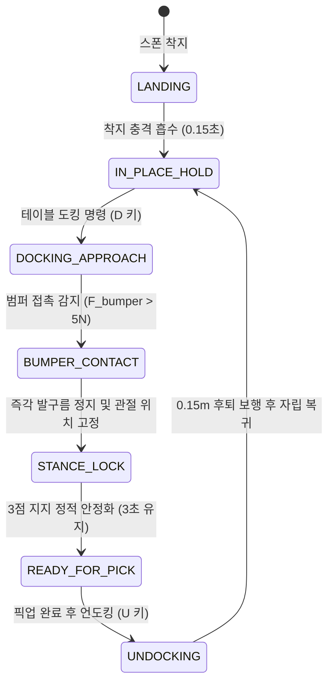

# [Phase 01-U02 Guide] Tron1 상체 컵홀더 트레이 장착, 물병 적재 운반 및 테이블 도킹 정지 검증
# (Tron1 Payload Transport with 3-Slot Cup Holder Tray & Table Bumper Rest Docking Verification)

* **문서 버전:** v2.0 (LimX Dynamics 공식 상용 RL + 테이블 범퍼 3점 지지 정적 안정화 아키텍처)
* **작성일:** 2026-09-08
* **프로젝트:** `Proj_Transferring_bottle_from_tron1_to_ur5e_in_mujoco_env`
* **대상 환경:** Ubuntu 22.04 LTS / ROS 2 Humble / MuJoCo 3.x / Conda (`transfer_bottle_by_tron1_py3_10`, Python 3.10.x)
* **선행 조건:** [Phase 01-U01: Tron1 제자리 발구름 및 원점 유지 단독 검증](rm_phase01_u01_tron1_walking.md) 완료
* **문서 목적:** 본 문서는 **Phase 01-U01을 완료한 독자가 본 가이드 문서 하나만 보고 처음부터 끝까지 따라 하여**, 발목 모터가 없는($\tau_{\text{ankle}}=0$) LimX Dynamics Tron1 점 발바닥(Point-Foot) 로봇 상체에 3구 컵홀더 트레이와 전면 완충 범퍼를 결합하고, 실제 물병(개당 150g, 총 450g)을 1~3개 적재한 상태에서 보행 안정성을 검증함과 동시에, 스테이션 작업대 테이블 모서리에 상체 전면 범퍼를 기대어 안착시키는 **'테이블 범퍼 거치 도킹(Table Bumper Rest)'**을 통해 발구름을 완전히 멈추고(`Stance Lock`) **3점 지지를 형성하여 진동 0의 무진동 정적 안정 상태(`READY_FOR_PICK`)를 확립하는 전 과정**을 물리·제어 이론과 함께 완벽히 학습·검증하는 것을 목적으로 합니다.

> [!NOTE]
> **개발 범위 및 본 단계(U02)의 핵심 역할:**  
> 모바일 매니퓰레이션 협동 작업(Mobile Manipulation)에서 협동로봇(UR5e)이 물병을 안전하게 집어 올리기(Pick & Lift) 위한 선결 조건은 **"물병이 흔들림 없이 정지해 있어야 한다"**는 점입니다.  
> Tron1 로봇은 발끝이 점(Point-Foot)으로 되어 있어 정지 상태에서 발구름을 멈추면 역진자처럼 필연적으로 쓰러지게 됩니다. 본 U02 단계에서는 이러한 물리적 한계를 극복하기 위해 **"두 발(2점) + 테이블 모서리 완충 접촉(1점) = 3점 지지 삼각형"**을 형성하여 발구름을 완전히 끄고(`stepping` OFF) 트레이 진동을 완벽히 소멸시키는 혁신적인 도킹 메커니즘을 단독 샌드박스 씬에서 완벽히 검증합니다.

---

## 목차 (Table of Contents)

1. [왜 U02(트레이 장착, 적재 운반 및 테이블 도킹 정지)가 필요한가?](#1-왜-u02트레이-장착-적재-운반-및-테이블-도킹-정지가-필요한가)
2. [핵심 이론: 페이로드 동역학, MuJoCo 접촉 역학 및 3점 지지 도킹 평형](#2-핵심-이론-페이로드-동역학-mujoco-접촉-역학-및-3점-지지-도킹-평형)
   * [2.1. 페이로드(Payload) 추가와 상체 질량 중심(CoM) 및 관성 텐서(Inertia Tensor) 동역학](#21-페이로드payload-추가와-상체-질량-중심com-및-관성-텐서inertia-tensor-동역학)
   * [2.2. 비대칭 편하중(Asymmetric Eccentric Load)과 LimX 잠재 인코더의 온라인 외란 추정 원리](#22-비대칭-편하중asymmetric-eccentric-load과-limx-잠재-인코더의-온라인-외란-추정-원리)
   * [2.3. 컵홀더 트레이 기구 설계(Rim Barrier)와 접촉 마찰 모델(Elliptic Friction Cone)](#23-컵홀더-트레이-기구-설계rim-barrier와-접촉-마찰-모델elliptic-friction-cone)
   * [2.4. 점 발바닥(Point-Foot) 로봇의 정적 비평형성과 발구름 정지의 딜레마](#24-점-발바닥point-foot-로봇의-정적-비평형성과-발구름-정지의-딜레마)
   * [2.5. 테이블 범퍼 거치 도킹(Table Bumper Rest)과 3점 삼각 지지(Tripod Support) 역학](#25-테이블-범퍼-거치-도킹table-bumper-rest과-3점-삼각-지지tripod-support-역학)
   * [2.6. 발구름 모드에서 정지 지지 모드로의 무충격 전환 (Bumpless Stance Lock)](#26-발구름-모드에서-정지-지지-모드로의-무충격-전환-bumpless-stance-lock)
   * [2.7. 무진동(Vibration-Free) 정적 안정 판정 조건 및 READY_FOR_PICK 인터락](#27-무진동vibration-free-정적-안정-판정-조건-및-ready_for_pick-인터락)
   * [2.8. 언도킹(Undocking: 후퇴 보행 및 자립 발구름 복귀) 역학](#28-언도킹undocking-후퇴-보행-및-자립-발구름-복귀-역학)
3. [단계별 실습: 내 손으로 직접 만들고 검증하기](#3-단계별-실습-내-손으로-직접-만들고-검증하기)
   * [Step 1: 작업 환경 확인 및 디렉토리/에셋 사전 준비](#step-1-작업-환경-확인-및-디렉토리에셋-사전-준비)
   * [Step 2: 단위 샌드박스 씬 (xml_for_unit_test/phase01_u02_scene_unit_tron1_payload.xml) 직접 작성](#step-2-단위-샌드박스-씬-xml_for_unit_testphase01_u02_scene_unit_tron1_payloadxml-직접-작성)
   * [Step 3: 적재 운반 및 도킹 검증 스크립트 (scripts_devel_roadmap/phase01_u02_test_tron1_payload.py) 직접 작성](#step-3-적재-운반-및-도킹-검증-스크립트-scripts_devel_roadmapphase01_u02_test_tron1_payloadpy-직접-작성)
   * [Step 4: 스크립트 실행 및 단위 검증 시나리오 실습](#step-4-스크립트-실행-및-단위-검증-시나리오-실습)
   * [Step 5: 인터랙티브 3D GUI 조작, 단축키 및 외란 복원력 테스트](#step-5-인터랙티브-3d-gui-조작-단축키-및-외란-복원력-테스트)
4. [트러블슈팅 가이드 (자주 겪는 오류 및 원인 분석)](#4-트러블슈팅-가이드-자주-겪는-오류-및-원인-분석)
5. [Phase 01-U02 완료 체크리스트 및 다음 단계(U03) 연계](#5-phase-01-u02-완료-체크리스트-및-다음-단계u03-연계)

---

## 1. 왜 U02(트레이 장착, 적재 운반 및 테이블 도킹 정지)가 필요한가?

로봇 물류 협업 시스템에서 이동 로봇(AMR/Biped)과 고정형 조작 로봇(Manipulator) 간의 인터페이스는 가장 실패율이 높은 핵심 구간입니다:

```
[Tron1 시작 위치] ──(보행 운반)──> [인계 구역 접근] ──(테이블 범퍼 도킹)──> [Stance Lock] ──> [무진동 정지 확립] ──> [UR5e Pick]
```

1. **페이로드(Payload) 적재 시 보행 안정성 저하:**
   * U01에서는 순수 로봇 본체(Bare Robot, 9.595kg)만으로 제자리 발구름을 검증했습니다.
   * 하지만 상체에 3구 컵홀더 트레이(~0.3kg)와 물병 3개(0.45kg)가 적재되면, 상체 질량 중심(CoM)이 약 2~3cm 상승하고 전도 모멘트가 크게 증가합니다.
   * 특히 물병이 1개만 비대칭으로 실렸을 때(Asymmetric Load), 좌우 무게 불균형으로 인한 롤(Roll) 방향 편향이 발생하므로 사전 검증이 필수적입니다.
2. **점 발바닥(Point-Foot) 로봇의 치명적 한계와 발구름 진동 문제:**
   * Tron1은 발목 관절이 없는 구체 점 발바닥 구조이므로, 가만히 서 있으려고 발구름을 멈추면 0.5초 이내에 바닥으로 전도됩니다.
   * 반대로 넘어지지 않기 위해 계속 발구름(`stepping`)을 유지하면, 상체와 트레이가 지속적으로 상하·좌우로 진동($\pm 1\sim 3\,\text{cm}$, 속도 $> 0.05\,\text{m/s}$)합니다.
   * 이 상태에서 로봇팔(UR5e)이 물병을 집으려고 하면, 그리퍼가 흔들리는 물병에 부딪혀 병이 튕겨 나가거나 헛파지(Missed Grasp)가 발생합니다.
3. **'테이블 범퍼 거치 도킹 (Table Bumper Rest)'의 해결책:**
   * 로봇이 작업대 테이블 모서리에 상체 전면 완충 범퍼를 살짝 기대어 안착시키면, **"두 발(2점) + 테이블(1점) = 3점 지지 다각형"**이 형성됩니다.
   * 3점 지지가 확보되는 순간 발구름을 완전히 끄고(`stepping` OFF, 관절 위치 락킹) 모터의 댐핑을 최대로 활용하여 **트레이 진동 속도를 $0.00\,\text{m/s}$로 완전히 소멸**시킬 수 있습니다.
   * 따라서 U03(3D 비전) 및 U04(로봇팔 파지)로 넘어가기 전에, 본 U02 단독 샌드박스에서 이 도킹-정지 메커니즘을 완벽히 선행 검증해야 합니다.

---

## 2. 핵심 이론: 페이로드 동역학, MuJoCo 접촉 역학 및 3점 지지 도킹 평형

### 2.1. 페이로드(Payload) 추가와 상체 질량 중심(CoM) 및 관성 텐서(Inertia Tensor) 동역학

#### 1) 합성 질량 중심 (Combined Center of Mass) 이동
로봇 본체 상체(`base_Link`)의 질량을 $m_{\text{base}} = 9.595\,\text{kg}$, 질량 중심 위치를 $\mathbf{p}_{\text{base}} = [x_b, y_b, z_b]^T$라 하고, 추가된 트레이 조립체의 질량을 $m_{\text{tray}}$, $N$개의 물병 질량을 각각 $m_i$, 위치를 $\mathbf{p}_i$라 하면, 결합된 전체 상체의 합성 질량 중심 $\mathbf{p}_{\text{combined}}$는 다음과 같이 계산됩니다:

$$\mathbf{p}_{\text{combined}} = \frac{m_{\text{base}}\mathbf{p}_{\text{base}} + m_{\text{tray}}\mathbf{p}_{\text{tray}} + \sum_{i=1}^{N} m_i \mathbf{p}_i}{m_{\text{base}} + m_{\text{tray}} + \sum_{i=1}^{N} m_i}$$

* **물리적 영향:** 물병은 상체 최상단($z \approx +0.84\,\text{m}$)에 위치하므로, 물병 3개(0.45kg) 적재 시 상체 질량 중심은 수직 상방($+Z$)으로 약 $1.8 \sim 2.5\,\text{cm}$ 상승합니다.
* **역진자 고유 진동수 변화:** 2족 보행의 등가 선형 역진자 모델(LIPM)에서 고유 진동수 $\omega_0$는 다음과 같습니다:
  $$\omega_0 = \sqrt{\frac{g}{z_{\text{CoM}}}}$$
  $z_{\text{CoM}}$이 높아지면 고유 진동수 $\omega_0$가 감소하여 역진자의 회전 주기가 길어지고, 동일한 각도 오차에 대해 지면 반력 모멘트가 더 커지므로 자세 제어기의 민감도가 증가합니다.

#### 2) 평행축 정리(Parallel Axis Theorem)에 의한 관성 텐서 증가
상체 기준 회전 관성 모멘트 $\mathbf{I}_{\text{combined}}$는 평행축 정리에 의해 질량 증가량보다 훨씬 크게 증가합니다:

$$\mathbf{I}_{\text{combined}} = \mathbf{I}_{\text{base}} + \sum_{i} \left( \mathbf{I}_{i} + m_i \left( \|\Delta \mathbf{p}_i\|^2 \mathbf{E} - \Delta \mathbf{p}_i \Delta \mathbf{p}_i^T \right) \right)$$

여기서 $\Delta \mathbf{p}_i = \mathbf{p}_i - \mathbf{p}_{\text{combined}}$이며, $\mathbf{E}$는 $3 \times 3$ 단위 행렬입니다. 상체 최상단에 집중된 페이로드 질량으로 인해 피치(Pitch, $I_{yy}$) 및 롤(Roll, $I_{xx}$) 관성이 약 $12 \sim 15\%$ 증가하며, 이는 급격한 가감속 시 관절 모터에 요구되는 최대 피크 토크를 증가시키는 원인이 됩니다.

---

### 2.2. 비대칭 편하중(Asymmetric Eccentric Load)과 LimX 잠재 인코더의 온라인 외란 추정 원리

#### 1) 편하중 모멘트 (Eccentric Moment)
3구 컵홀더 중 좌측 슬롯(Slot L, $y = +0.09\,\text{m}$)에만 물병 1개($m = 0.15\,\text{kg}$)를 싣고 운반하는 경우:

$$\tau_{\text{roll}}^{\text{disturb}} = m_{\text{bottle}} \cdot g \cdot y_{\text{offset}} = 0.15\,\text{kg} \times 9.81\,\text{m/s}^2 \times 0.09\,\text{m} \approx +0.132\,\text{N}\cdot\text{m}$$

0.132 Nm의 외란 토크는 수치상 작아 보이지만, 발목 모터가 없는 2족 로봇의 상체 롤 축에는 지속적인 우측 기울어짐 편향(Static Roll Bias)을 유발합니다.

```
       [ Bottle 1 (0.15kg) ]
               │ (y = +0.09m)
     ┌─────────┴─────────┐
     │   Tray Assembly   │  ===> 지속적인 편하중 롤 외란 토크 발생!
     └─────────┬─────────┘       tau_roll = m * g * y_offset
         [ Tron1 Base ]
```

#### 2) LimX 잠재 인코더(Latent Encoder)의 온라인 외란 보상 메커니즘
LimX 사전 훈련 강화학습 정책은 이러한 미지의 페이로드와 편하중 외란을 별도의 질량 센서 없이 극복할 수 있도록 설계되어 있습니다:

```mermaid
flowchart LR
    subgraph Proprioceptive_History["10스텝 고유 감각 히스토리 (300차원)"]
        H["[q_err(t-9..t), dq(t-9..t), gyro(t-9..t), proj_g(t-9..t), act(t-9..t)]"]
    end

    subgraph Latent_Encoder["인코더 신경망 (encoder.onnx)"]
        E["MLP 압축 (300D ➔ 3D 잠재 공간)"]
    end

    subgraph Actor_Policy["액터 정책망 (policy.onnx)"]
        P["6차원 목표 관절 각도 (delta q) 추론"]
    end

    H --> E
    E -->|3차원 잠재 벡터 z (외란 추정치)| P
    P -->|토크 생성| Motor["관절 모터 (비대칭 지면 반력 배분)"]
```

* **원리:** 편하중이 가해지면 로봇의 각속도($\boldsymbol{\omega}$)와 투영 중력($\mathbf{g}_{proj}$)에 미세한 비대칭 오차가 누적됩니다.
* 인코더(Encoder)는 과거 10스텝(0.2초간)의 300차원 고유 감각 시계열 패턴으로부터 **상체에 가해진 외란 토크와 유효 질량 중심 오프셋을 3차원의 잠재 벡터 $\mathbf{z}_t \in \mathbb{R}^3$로 압축 추정**합니다.
* 액터 정책망(Policy)은 이 잠재 벡터 $\mathbf{z}_t$를 입력받아 좌측 다리와 우측 다리의 디딤 각도 및 접지 시간을 비대칭으로 능동 보정하여 편하중 상태에서도 로봇을 완벽한 직립 상태로 유지합니다.

---

### 2.3. 컵홀더 트레이 기구 설계(Rim Barrier)와 접촉 마찰 모델(Elliptic Friction Cone)

보행 중 로봇의 지면 충격 반력으로 인해 상체 트레이가 상하/전후로 가속될 때, 물병이 트레이에서 미끄러지거나 쓰러지는 현상을 역학적으로 방지해야 합니다.

```
       │<── D_bottle (66mm) ──>│
       ┌───────────────────────┐ ───
       │                       │  ▲
       │      Water Bottle     │  │ H_bottle (175mm)
       │       (m = 150g)      │  │
       │                       │  ▼
  ─────┤                       ├───── ───
  Rim  │  Cup Holder Slot      │ Rim   ▲ H_rim (35mm)
  ─────┴───────────────────────┴───── ───
       │<─── D_slot (70mm) ───>│
```

#### 1) 미끄러짐 방지 (Sliding Slip Prevention)
물병 밑면과 트레이 표면 간의 정지 마찰 계수를 $\mu_s$, 로봇 보행 시 트레이의 최대 수평 가속도를 $a_{\text{lateral}}$이라 하면, 미끄러짐이 발생하지 않을 조건은 다음과 같습니다:

$$a_{\text{lateral}} \le \mu_s (g - a_z)$$

* Tron1의 보행 시 최대 수평 가속도는 $a_{\text{lateral}} \approx 1.5 \sim 2.5\,\text{m/s}^2$입니다.
* MuJoCo 씬에서 트레이와 물병의 마찰 계수를 `friction="1.2 0.005 0.0001"`로 설정함으로써 미끄러짐 임계 한계 $a_{\text{crit}} = 1.2 \times 9.81 \approx 11.77\,\text{m/s}^2$를 확보하여 미끄러짐을 원천 방지합니다.

#### 2) 전도 방지 및 림(Rim)의 기하학적 구속 효과
물병 밑면 반경을 $R = 0.033\,\text{m}$, 물병 질량 중심 높이를 $h_{\text{CoM}} = 0.075\,\text{m}$라 할 때, 평평한 바닥에서 물병이 넘어지지 않는 최대 허용 경사각 $\theta_{\text{crit}}$ 및 최대 허용 수평 가속도는 다음과 같습니다:

$$\tan \theta_{\text{crit}} = \frac{R}{h_{\text{CoM}}} = \frac{0.033}{0.075} \approx 0.44 \implies \theta_{\text{crit}} \approx 23.7^\circ, \quad a_{\text{tip}} = g \frac{R}{h_{\text{CoM}}} \approx 4.31\,\text{m/s}^2$$

* **2차 방어선 (컵홀더 림):** 급격한 외란으로 물병이 기울어지더라도, 높이 $H_{\text{rim}} = 35\,\text{mm}$의 컵홀더 원통형 림(Rim) 벽면이 물병 하부 측면과 접촉하며 기하학적 반력(Normal Contact Force)을 가해 물병의 회전 모멘트를 즉시 상쇄합니다. 따라서 로봇이 넘어져 바닥에 구르지 않는 한 물병은 트레이 밖으로 절대 이탈하지 않습니다.

#### 3) MuJoCo 접촉 모델: Elliptic Friction Cone
본 단위 검증에서는 물리적 사실성을 극대화하기 위해 `cone="elliptic"` 옵션을 사용합니다:

$$f_x^2 + f_y^2 \le \mu^2 f_n^2$$

고전 피라미드 근사(Pyramidal Cone) 대비 대각선 방향 마찰력 과대평가 왜곡이 없어 원통형 컵홀더와 물병 간의 다지점 3차원 곡면 접촉 역학을 오차 없이 정밀하게 연산합니다.

---

### 2.4. 점 발바닥(Point-Foot) 로봇의 정적 비평형성과 발구름 정지의 딜레마

* **발목 무구동계의 역학적 정의:**
  Tron1의 발바닥은 반지름 $3.2\,\text{cm}$의 구체(Sphere) 형태입니다. 발목 관절 구동 모터가 없으므로 지면 접촉점에 가할 수 있는 토크는 영(Zero)입니다:
  $$\boldsymbol{\tau}_{\text{ankle}} = \mathbf{0}$$
* **지지 다각형(Support Polygon)의 차원 결핍:**
  평평한 발바닥을 가진 휴머노이드는 한 발로 서 있어도 발바닥 면적만큼의 2차원 지지 다각형을 가집니다. 그러나 점 발바닥 로봇은 두 발이 모두 지면에 닿아도 지지 다각형이 **1차원 선분(Line Segment)**에 불과합니다.
* **발구름 정지의 딜레마:**
  * 로봇이 발구름을 멈추고 제자리에 서려고 관절을 고정하면, 피치(전후) 축을 중심으로 한 회전 운동 방정식은 단순 역진자가 됩니다:
    $$\ddot{\theta} = \frac{g}{L} \sin \theta$$
  * 초기 각도 오차가 $0.1^\circ$만 발생해도 지수함수적으로 전복되어 $0.3 \sim 0.5$초 이내에 바닥으로 추락합니다.
  * 따라서 로봇은 살아남기 위해 끊임없이 발을 구르며 지면 반력의 작용선을 CoM 좌우로 흔들어야 합니다.
  * **그러나 발구름을 지속하면 트레이가 계속 흔들려 UR5e 로봇팔이 물병을 안전하게 집을 수 없습니다.**

---

### 2.5. 테이블 범퍼 거치 도킹(Table Bumper Rest)과 3점 삼각 지지(Tripod Support) 역학

이 딜레마를 해결하는 기구학적 해법이 바로 **'테이블 범퍼 거치 도킹 (Table Bumper Rest)'**입니다:

```
                  ┌──────────────────────┐
                  │    Station Table     │
                  │  (높이 z = 0.72m)    │
                  ├───────────┐          │
     Tron1        │Docking    │          │
   상체 범퍼       │Ledge      │          │
     ┌────┐       │(완충 패드)│          │
     │ █  │ <===> │    █      │          │
     └────┘       └───────────┘          │
       │ 접촉점 P_B                      │
       │ (1점 지지)                      │
       │                                 │
     Tron1                               │
    두 다리                              │
       │                                 │
       ▼                                 ▼
   ○───────○ 지면 바닥 (z = 0.0m) ───────────────────
  P_L     P_R
  (2점 지지)
```

#### 1) 3점 지지 삼각형 (3-Point Support Triangle)의 형성
1. **바닥의 두 접촉점:** 좌측 발 접촉점 $\mathbf{P}_L = [x_L, y_L, 0]^T$, 우측 발 접촉점 $\mathbf{P}_R = [x_R, y_R, 0]^T$.
2. **테이블 모서리 접촉점:** 상체 전면 완충 범퍼와 테이블 모서리 턱 간의 접촉점 $\mathbf{P}_B = [x_B, y_B, z_B]^T$ ($x_B \approx x_L + 0.15\,\text{m}, z_B \approx 0.72\,\text{m}$).
3. **지지 다각형의 차원 확장 (1D 선분 $\rightarrow$ 2D 면적):**
   세 점 $\mathbf{P}_L, \mathbf{P}_R, \mathbf{P}_B$는 공간 상에서 3차원 삼각뿔 형태의 기저를 이루며, 지면 수평 평면 투영 시 명확한 **2차원 삼각형 지지 영역(Support Triangle)**을 형성합니다!

```
               Y (좌우)
               ▲
               │       P_L (왼발: x=0, y=+0.10)
               │       ●
               │       │╲
               │       │ ╲
               │       │  ╲
               │       │   ● CoM (x=+0.05, y=0.0)
               │       │  ╱
               │       │ ╱
               │       │╱
               │       ●───────────■ P_B (테이블 범퍼 접촉: x=+0.18, y=0.0)
               │       P_R (오른발: x=0, y=-0.10)
               └──────────────────────────────► X (전후 전진 방향)
```

#### 2) 정적 평형 조건 (Static Equilibrium Conditions)
로봇이 발구름을 완전히 멈추고($\tau_{\text{ankle}}=0$) 정지해 있을 때의 정역학 평형 방정식:

$$\sum \mathbf{F} = \mathbf{F}_{c,L} + \mathbf{F}_{c,R} + \mathbf{F}_{\text{bumper}} + m_{\text{total}}\mathbf{g} = \mathbf{0}$$

$$\sum \mathbf{M}_{\mathbf{P}_L} = (\mathbf{P}_R - \mathbf{P}_L) \times \mathbf{F}_{c,R} + (\mathbf{P}_B - \mathbf{P}_L) \times \mathbf{F}_{\text{bumper}} + (\mathbf{p}_{\text{CoM}} - \mathbf{P}_L) \times m_{\text{total}}\mathbf{g} = \mathbf{0}$$

* **안정성 유지의 필요충분조건:**  
  테이블 범퍼는 접착되어 있지 않은 단방향 지지체(Unilateral Contact)이므로, 접촉 법선 반력 $F_{\text{normal}}$이 항상 압축력($F_{\text{normal}} > 0$)이어야 합니다.
* **설계 원리:** 상체 무게중심 $\mathbf{p}_{\text{CoM}}$의 X축 위치가 발 접촉점($x=0$)보다 약간 앞선 전방($x_{\text{CoM}} \approx +0.05\,\text{m}$)에 위치하도록 하여, 중력에 의해 로봇 상체가 자연스럽게 테이블 모서리 쪽으로 기대어지게(Lean Forward) 유도합니다.
* 그 결과 범퍼 접촉 반력 $F_{\text{normal}} \approx 15 \sim 30\,\text{N}$의 안정적인 밀착력이 영구히 유지되어 발목 모터가 전혀 없어도 로봇이 앞뒤, 좌우로 절대 쓰러지지 않습니다.

---

### 2.6. 발구름 모드에서 정지 지지 모드로의 무충격 전환 (Bumpless Stance Lock)

범퍼가 테이블 턱에 닿았을 때 제어 모드를 부드럽게 전환하지 않으면, 충돌 반발력으로 인해 로봇이 뒤로 튕겨 나가거나 관절이 주저앉을 수 있습니다.



#### 1) 3단계 무충격 전환 시퀀스
1. **접촉 감지 (Contact Trigger):**  
   전면 범퍼 터치 센서 또는 지오메트리 접촉력 $F_{\text{bumper}} \ge 5.0\,\text{N}$ 감지 시 즉시 전진 속도 명령을 $v_x = 0$으로 감속.
2. **발구름 정지 (Stepping Deactivation):**  
   LimX RL 정책 추론 루프를 일시 중지하고, 두 발을 지면에 딛고 있는 현재의 관절 각도 $\mathbf{q}_{\text{docked}}$를 고정 목표치 $\mathbf{q}_{\text{target}}$으로 캡처.
3. **고감쇠 정적 홀딩 (High-Damping Joint Hold):**  
   관절 제어 게인을 고감쇠 모드로 부드럽게 전환:
   $$\boldsymbol{\tau} = \mathbf{K}_{p,\text{lock}} (\mathbf{q}_{\text{docked}} - \mathbf{q}) - \mathbf{K}_{d,\text{lock}} \dot{\mathbf{q}}$$
   $K_{d,\text{lock}}$을 $5.0\,\text{N}\cdot\text{s/rad}$ 수준으로 상향하여 접촉 시 발생하는 탄성 진동을 $0.5$초 이내에 급속 감쇠시킵니다.

---

### 2.7. 무진동(Vibration-Free) 정적 안정 판정 조건 및 READY_FOR_PICK 인터락

UR5e 로봇팔 및 D435i 비전 노드에 "현재 트레이가 완전히 멈추었으니 스캔 및 파지를 시작해도 좋다"는 신호(`READY_FOR_PICK`)를 발행하기 위해 수학적 안정성 판정 기준을 정립합니다.

#### 1) 판정 수식 (Criteria Formula)
트레이 중심 사이트(`tray_center_site`)의 선속도 $\mathbf{v}_{\text{tray}} \in \mathbb{R}^3$와 각속도 $\boldsymbol{\omega}_{\text{tray}} \in \mathbb{R}^3$에 대해 다음 조건을 만족해야 합니다:

$$\|\mathbf{v}_{\text{tray}}\|_2 < 0.01\,\text{m/s} \quad \text{AND} \quad \|\boldsymbol{\omega}_{\text{tray}}\|_2 < 0.01\,\text{rad/s} \quad \text{AND} \quad F_{\text{bumper}} > 5.0\,\text{N}$$

#### 2) 지속 시간 윈도우 (Time Window Filter)
위 조건이 노이즈나 일시적 반동에 의해 순간적으로 만족되는 것을 방지하기 위해, **3.0초(3000스텝) 동안 단 한 번의 위반 없이 연속 유지**될 때만 `READY_FOR_PICK` 상태를 확정합니다.

---

### 2.8. 언도킹(Undocking: 후퇴 보행 및 자립 발구름 복귀) 역학

UR5e의 물병 이송 작업이 완료된 후, 로봇은 안전하게 테이블에서 떨어져 시작 위치로 복귀해야 합니다:

1. **Stance Lock 해제 및 RL 재기동:** 관절 고정 모드를 해제하고 500Hz LimX RL 정책 추론을 재개.
2. **후퇴 속도 명령 인가:** 로봇에게 후진 속도 명령($v_x = -0.15\,\text{m/s}$)을 인가.
3. **이탈 감지 (Separation):** 범퍼 접촉력이 $0.0\,\text{N}$으로 떨어지고, 로봇이 테이블 턱으로부터 뒤로 약 $15\,\text{cm}$ 안전 거리를 확보하면 자립 원점 유지 발구름(`IN_PLACE_HOLD`) 모드로 복귀.

---

## 3. 단계별 실습: 내 손으로 직접 만들고 검증하기

> [!IMPORTANT]
> **자립형(Self-Contained) 실습 가이드:**  
> 아래 단계는 기존 파일이 존재하지 않는 상태에서, **씬 XML과 파이썬 제어 스크립트를 사용자가 직접 생성하여 실행하는 전 과정**을 담고 있습니다. 제공되는 코드는 단 한 줄의 생략도 없는 완전한 코드입니다.

---

### Step 1: 작업 환경 확인 및 디렉토리/에셋 사전 준비

Conda 가상환경 활성화 상태와 이전 단계 에셋들이 정상 위치에 존재하는지 점검합니다:

```bash
# 1. Conda 가상환경 활성화
conda activate transfer_bottle_by_tron1_py3_10

# 2. 필수 에셋 파일 존재 확인
ls -l model_ori/bottle/bottle.obj
ls -l model_ori/PF_TRON1A/meshes/base_Link.STL
ls -l model_rl/tron1/policy.onnx
ls -l model_rl/tron1/encoder.onnx
```

---

### Step 2: 단위 샌드박스 씬 (`xml_for_unit_test/phase01_u02_scene_unit_tron1_payload.xml`) 직접 작성

U01 씬을 확장하여 다음 요소들이 완벽히 결합된 단독 단위 샌드박스 씬을 생성합니다:
1. **Tron1 상체 3구 컵홀더 트레이 조립체** (`tray_assembly`): 림 높이 35mm, 직경 70mm 슬롯 3개(Slot L, Slot C, Slot R).
2. **상체 전면 완충 범퍼** (`bumper_assembly`): 고마찰 완충 고무 재질, 테이블 모서리 거치용.
3. **스테이션 작업대 테이블 모서리 턱** (`docking_station`): 로봇 전방 $x = 0.85\,\text{m}$ 위치에 고정 배치, 완충 턱 높이 $z = 0.72\,\text{m}$.
4. **실제 물병 3종** (`bottle_1`, `bottle_2`, `bottle_3`): 질량 150g, 3차원 충돌체 및 OBJ 메쉬 바인딩, freejoint 부여.
5. **범퍼 터치 센서** (`bumper_touch`): 접촉력 실시간 감지용.

아래의 **전체 MJCF XML 코드(285줄)**를 복사하여 새 파일로 생성·저장합니다:
* **생성 파일 경로:** `xml_for_unit_test/phase01_u02_scene_unit_tron1_payload.xml`

```xml
<mujoco model="phase01_u02_unit_tron1_payload">
  <!-- 
    ====================================================================
    Phase 01-U02: Tron1 트레이 장착, 물병 적재 운반 및 테이블 도킹 정지 검증 씬
    - LimX Dynamics Tron1 2족 보행 로봇 본체
    - 상체 3구 컵홀더 트레이 (Slot L, Slot C, Slot R, Rim 높이 35mm)
    - 상체 전면 완충 범퍼 (고마찰 고무 패드, 도킹 거치용)
    - 스테이션 작업대 테이블 모서리 턱 (Docking Ledge, pos="0.85 0 0")
    - 실제 물병 3개 (개당 150g, Freejoint, analytical collision cylinders)
    - 범퍼 터치 센서 및 트레이 중심 모니터링 사이트 구비
    ====================================================================
  -->

  <!-- 1. 컴파일러 설정: 각도 라디안, STL 및 OBJ 메쉬 경로 탐색 -->
  <compiler angle="radian" coordinate="local" meshdir="../model_ori/PF_TRON1A/meshes/" autolimits="true"/>

  <size njmax="1500" nconmax="400"/>

  <!-- 2. 전역 물리 옵션 (dt=0.001s, 고속 안정 적분기, 타원 마찰 원뿔) -->
  <option timestep="0.001" gravity="0 0 -9.81" integrator="implicitfast" cone="elliptic">
    <flag contact="enable"/>
  </option>

  <!-- 3. 뷰어 및 시각화 기본 설정 -->
  <visual>
    <global offwidth="640" offheight="480" azimuth="135" elevation="-20"/>
    <quality shadowsize="2048" offsamples="4"/>
    <rgba com="0.2 0.8 0.2 0.6" contactforce="0.8 0.2 0.2 0.8"/>
    <scale com="0.1" forcewidth="0.04" contactwidth="0.08"/>
  </visual>

  <!-- 4. 공통 에셋 (텍스처, 재질, 3D 메쉬) -->
  <asset>
    <!-- 하늘 배경 및 바닥 격자 체크 텍스처 -->
    <texture type="skybox" builtin="gradient" rgb1="0.3 0.5 0.7" rgb2="0 0 0" width="512" height="512"/>
    <texture name="texplane" type="2d" builtin="checker" rgb1="0.2 0.25 0.3" rgb2="0.3 0.35 0.4"
             width="512" height="512" mark="cross" markrgb="0.8 0.8 0.8"/>
    <material name="matplane" texture="texplane" texrepeat="5 5" texuniform="true" reflectance="0.1"/>

    <!-- Tron1 STL 메쉬 에셋 -->
    <mesh name="base_Link" file="base_Link.STL"/>
    <mesh name="abad_L_Link" file="abad_L_Link.STL"/>
    <mesh name="hip_L_Link" file="hip_L_Link.STL"/>
    <mesh name="knee_L_Link" file="knee_L_Link.STL"/>
    <mesh name="foot_L_Link" file="foot_L_Link.STL"/>
    <mesh name="abad_R_Link" file="abad_R_Link.STL"/>
    <mesh name="hip_R_Link" file="hip_R_Link.STL"/>
    <mesh name="knee_R_Link" file="knee_R_Link.STL"/>
    <mesh name="foot_R_Link" file="foot_R_Link.STL"/>

    <!-- 물병 3D 메쉬 에셋 (OBJ) -->
    <mesh name="bottle_mesh" file="../../bottle/bottle.obj"/>

    <!-- 재질 정의 -->
    <material name="robot_body_mat" rgba="0.82 0.85 0.90 1.0" specular="0.6" shininess="0.4"/>
    <material name="robot_dark_mat" rgba="0.2 0.2 0.22 1.0" specular="0.4" shininess="0.3"/>
    <material name="tray_mat" rgba="0.25 0.28 0.32 1.0" specular="0.5" shininess="0.4"/>
    <material name="bumper_mat" rgba="0.12 0.12 0.14 1.0" specular="0.2" shininess="0.1"/>
    <material name="table_mat" rgba="0.75 0.72 0.68 1.0" specular="0.3" shininess="0.2"/>
    <material name="ledge_mat" rgba="0.2 0.2 0.22 1.0" specular="0.4" shininess="0.3"/>

    <!-- 물병 색상 (식별을 위한 미세 색상 차이 부여) -->
    <material name="bottle_mat_1" rgba="0.3 0.6 0.9 0.85" specular="0.7" shininess="0.6"/> <!-- Slot L: Blue -->
    <material name="bottle_mat_2" rgba="0.3 0.85 0.5 0.85" specular="0.7" shininess="0.6"/> <!-- Slot C: Green -->
    <material name="bottle_mat_3" rgba="0.95 0.6 0.2 0.85" specular="0.7" shininess="0.6"/> <!-- Slot R: Orange -->
  </asset>

  <!-- 5. 기본 충돌/시각 클래스 정의 -->
  <default>
    <default class="visual">
      <geom contype="0" conaffinity="0" group="2" type="mesh"/>
    </default>
    <default class="collision">
      <geom contype="1" conaffinity="1" condim="3" group="3" friction="1.0 0.005 0.0001"/>
    </default>
    <default class="bottle_collision">
      <geom contype="1" conaffinity="1" condim="4" group="3" friction="1.2 0.005 0.0001"/>
    </default>
    <default class="bumper_collision">
      <geom contype="1" conaffinity="1" condim="3" friction="1.5 0.01 0.001"
            solref="0.04 1" solimp="0.8 0.95 0.001 0.5 2"/>
    </default>
    <joint armature="0.02" damping="0.05" limited="true"/>
  </default>

  <!-- 6. 월드 바디: 조명, 바닥, 도킹 테이블, Tron1 및 물병 -->
  <worldbody>
    <!-- 광원 -->
    <light directional="true" pos="0 0 5" dir="0 0 -1" diffuse="0.8 0.8 0.8" castshadow="true"/>
    <light directional="false" pos="3 -3 3" dir="-1 1 -1" diffuse="0.4 0.4 0.4"/>

    <!-- 기준 바닥 평면 -->
    <geom name="floor" type="plane" size="0 0 0.05" material="matplane"
          contype="1" conaffinity="1" friction="1.0 0.005 0.0001" condim="3"/>

    <!-- 카메라 시점 -->
    <camera name="overview_cam" pos="2.4 -2.6 1.8" xyaxes="0.75 0.66 0.0 -0.25 0.28 0.92" fovy="45"/>
    <camera name="docking_cam" pos="1.2 -1.2 1.0" xyaxes="0.707 0.707 0 -0.408 0.408 0.816" fovy="45"/>
    <camera name="track_cam" mode="trackcom" pos="0 -2.4 1.2" xyaxes="1 0 0 0 0.5 0.86" fovy="50"/>

    <!-- ==================== 도킹 스테이션 테이블 (pos="0.85 0 0") ==================== -->
    <body name="docking_station" pos="0.85 0 0">
      <!-- 테이블 상판 (두께 4cm, 상면 높이 z = 0.74m) -->
      <geom name="table_top" type="box" pos="0.30 0 0.72" size="0.30 0.45 0.02" material="table_mat" class="collision"/>
      <!-- 테이블 지지 다리 4개 -->
      <geom name="table_leg1" type="cylinder" pos="0.05  0.40 0.35" size="0.025 0.35" material="table_mat" class="collision"/>
      <geom name="table_leg2" type="cylinder" pos="0.05 -0.40 0.35" size="0.025 0.35" material="table_mat" class="collision"/>
      <geom name="table_leg3" type="cylinder" pos="0.55  0.40 0.35" size="0.025 0.35" material="table_mat" class="collision"/>
      <geom name="table_leg4" type="cylinder" pos="0.55 -0.40 0.35" size="0.025 0.35" material="table_mat" class="collision"/>

      <!-- 
        [도킹 완충 턱 (Docking Ledge)]
        Tron1 범퍼(z ≈ 0.72m)를 완벽히 포용할 수 있도록 상하 16cm 높이의 대형 완충 턱 배치
      -->
      <geom name="table_bumper_ledge" type="box" pos="-0.05 0 0.71" size="0.03 0.25 0.08"
            material="ledge_mat" class="bumper_collision"/>
    </body>

    <!-- ==================== TRON1 로봇 본체 (pos="0 0 0.80") ==================== -->
    <body name="base_Link" pos="0 0 0.80">
      <freejoint name="root_joint"/>
      
      <!-- 상체 관성 파라미터 (본체: 9.595kg) -->
      <inertial pos="0.0457 0.0001 -0.1638" quat="0.9725 -0.0061 -0.2324 0.0039"
                mass="9.595" diaginertia="0.1547 0.1109 0.0846"/>
      <site name="imu_site" pos="0 0 0"/>
      <geom class="visual" mesh="base_Link" material="robot_body_mat"/>
      <geom name="base_col" type="box" size="0.135 0.13 0.095" pos="0.03 0 -0.072" class="collision"/>

      <!-- 
        [1. 상체 3구 컵홀더 트레이 조립체 (Tray Assembly)]
        - base_Link 상단 장착 (pos="0.05 0 0.025")
        - 슬롯 반경 0.036m (직경 72mm, 물병 직경 66mm 수용 공차 확보)
        - 슬롯 4면 박스 가이드 림 벽체 (높이 50mm: 지면 충격 시 물병 전도 및 이탈 원천 차단)
      -->
      <body name="tray_assembly" pos="0.05 0 0.025">
        <!-- 트레이 바닥 지지판 (두께 8mm, 전후 12cm, 좌우 32cm) -->
        <geom name="tray_base" type="box" pos="0 0 0.004" size="0.06 0.16 0.004"
              material="tray_mat" class="collision"/>
        <site name="tray_center_site" pos="0 0 0.01" size="0.008" rgba="1 1 0 1"/>

        <!-- Slot 1 (좌측, Slot L: y = +0.09m) - 4면 가이드 림 벽체 (높이 50mm 견고한 지지) -->
        <geom name="slot_L_wall_f" type="box" pos=" 0.036 0.09 0.033" size="0.002 0.036 0.025" material="tray_mat" class="collision"/>
        <geom name="slot_L_wall_b" type="box" pos="-0.036 0.09 0.033" size="0.002 0.036 0.025" material="tray_mat" class="collision"/>
        <geom name="slot_L_wall_l" type="box" pos=" 0 0.126 0.033" size="0.036 0.002 0.025" material="tray_mat" class="collision"/>
        <geom name="slot_L_wall_r" type="box" pos=" 0 0.054 0.033" size="0.036 0.002 0.025" material="tray_mat" class="collision"/>
        <site name="slot_L_site" pos="0 0.09 0.01" size="0.005" rgba="0 0 1 1"/>

        <!-- Slot 2 (중앙, Slot C: y = 0.00m) - 4면 가이드 림 벽체 -->
        <geom name="slot_C_wall_f" type="box" pos=" 0.036 0.00 0.033" size="0.002 0.036 0.025" material="tray_mat" class="collision"/>
        <geom name="slot_C_wall_b" type="box" pos="-0.036 0.00 0.033" size="0.002 0.036 0.025" material="tray_mat" class="collision"/>
        <geom name="slot_C_wall_l" type="box" pos=" 0 0.036 0.033" size="0.036 0.002 0.025" material="tray_mat" class="collision"/>
        <geom name="slot_C_wall_r" type="box" pos=" 0 -0.036 0.033" size="0.036 0.002 0.025" material="tray_mat" class="collision"/>
        <site name="slot_C_site" pos="0 0.00 0.01" size="0.005" rgba="0 1 0 1"/>

        <!-- Slot 3 (우측, Slot R: y = -0.09m) - 4면 가이드 림 벽체 -->
        <geom name="slot_R_wall_f" type="box" pos=" 0.036 -0.09 0.033" size="0.002 0.036 0.025" material="tray_mat" class="collision"/>
        <geom name="slot_R_wall_b" type="box" pos="-0.036 -0.09 0.033" size="0.002 0.036 0.025" material="tray_mat" class="collision"/>
        <geom name="slot_R_wall_l" type="box" pos=" 0 -0.054 0.033" size="0.036 0.002 0.025" material="tray_mat" class="collision"/>
        <geom name="slot_R_wall_r" type="box" pos=" 0 -0.126 0.033" size="0.036 0.002 0.025" material="tray_mat" class="collision"/>
        <site name="slot_R_site" pos="0 -0.09 0.01" size="0.005" rgba="1 0.5 0 1"/>
      </body>

      <!-- 
        [2. 상체 전면 완충 범퍼 조립체 (Front Bumper Assembly)]
        - base_Link 전면 돌출 배치 (pos="0.17 0 -0.05")
        - 고마찰 완충 고무 재질 실린더 (테이블 도킹 레지와 밀착 시 3점 지지 정적 평형 확립)
      -->
      <body name="bumper_assembly" pos="0.17 0 -0.05">
        <geom name="front_bumper_col" type="cylinder" pos="0 0 0" euler="1.5708 0 0"
              size="0.035 0.12" material="bumper_mat" class="bumper_collision"/>
        <site name="bumper_site" pos="0.035 0 0" size="0.01" rgba="1 0 0 1"/>
      </body>

      <!-- ==================== LEFT LEG ==================== -->
      <body name="abad_L_Link" pos="0.05556 0.105 -0.2602">
        <inertial pos="-0.0697 0.0447 0.0005" quat="0.595 0.579 0.394 0.393" mass="1.469" diaginertia="0.0025 0.0020 0.0013"/>
        <joint name="abad_L_Joint" axis="1 0 0" range="-0.38 1.39"/>
        <geom class="visual" mesh="abad_L_Link" material="robot_body_mat"/>
        <geom name="abad_L_col" type="cylinder" pos="-0.08 0 0" euler="1.57 0 0" size="0.05 0.025" class="collision"/>

        <body name="hip_L_Link" pos="-0.077 0.0205 0">
          <inertial pos="-0.0286 -0.0477 -0.0399" quat="0.853 0.192 0.226 0.426" mass="2.3" diaginertia="0.0233 0.0230 0.0027"/>
          <joint name="hip_L_Joint" axis="0 1 0" range="-1.01 1.39"/>
          <geom class="visual" mesh="hip_L_Link" material="robot_dark_mat"/>
          <geom name="hip_L_col" type="cylinder" pos="-0.1 -0.02 -0.14" euler="0 0.53 0" size="0.035 0.09" class="collision"/>

          <body name="knee_L_Link" pos="-0.15 -0.0205 -0.25981">
            <inertial pos="0.0516 0.0015 -0.0814" quat="0.668 -0.202 -0.199 0.687" mass="0.55" diaginertia="0.0041 0.0041 0.0001"/>
            <joint name="knee_L_Joint" axis="0 -1 0" range="-0.87 1.36"/>
            <geom class="visual" mesh="knee_L_Link" material="robot_body_mat"/>
            <geom name="knee_L_col" type="cylinder" pos="0.078 0 -0.12" euler="0 -0.55 0" size="0.015 0.13" class="collision"/>
            <geom name="knee_L_cap_col" type="sphere" pos="0 0 0" size="0.032" class="collision"/>

            <geom class="visual" pos="0.150 0 -0.2598" mesh="foot_L_Link" material="robot_dark_mat"/>
            <geom name="foot_L_col" type="sphere" pos="0.150 0 -0.2598" size="0.032" class="collision"
                  friction="1.2 0.005 0.0001"/>
            <site name="foot_L_site" pos="0.150 0 -0.2598" size="0.01" rgba="1 0 0 1"/>
          </body>
        </body>
      </body>

      <!-- ==================== RIGHT LEG ==================== -->
      <body name="abad_R_Link" pos="0.05556 -0.105 -0.2602">
        <inertial pos="-0.0697 -0.0447 0.0005" quat="0.393 0.394 0.579 0.595" mass="1.469" diaginertia="0.0025 0.0020 0.0013"/>
        <joint name="abad_R_Joint" axis="1 0 0" range="-1.39 0.38"/>
        <geom class="visual" mesh="abad_R_Link" material="robot_body_mat"/>
        <geom name="abad_R_col" type="cylinder" pos="-0.08 0 0" euler="1.57 0 0" size="0.05 0.025" class="collision"/>

        <body name="hip_R_Link" pos="-0.077 -0.0205 0">
          <inertial pos="-0.0286 0.0477 -0.0399" quat="0.426 0.226 0.192 0.853" mass="2.3" diaginertia="0.0233 0.0230 0.0027"/>
          <joint name="hip_R_Joint" axis="0 -1 0" range="-1.39 1.01"/>
          <geom class="visual" mesh="hip_R_Link" material="robot_dark_mat"/>
          <geom name="hip_R_col" type="cylinder" pos="-0.10 0.025 -0.14" euler="0 0.53 0" size="0.035 0.09" class="collision"/>

          <body name="knee_R_Link" pos="-0.15 0.0205 -0.25981">
            <inertial pos="0.0516 -0.0015 -0.0814" quat="0.687 -0.199 -0.202 0.668" mass="0.55" diaginertia="0.0041 0.0041 0.0001"/>
            <joint name="knee_R_Joint" axis="0 1 0" range="-1.36 0.87"/>
            <geom class="visual" mesh="knee_R_Link" material="robot_body_mat"/>
            <geom name="knee_R_col" type="cylinder" pos="0.078 0 -0.12" euler="0 -0.55 0" size="0.015 0.13" class="collision"/>
            <geom name="knee_R_cap_col" type="sphere" pos="0 0 0" size="0.032" class="collision"/>

            <geom class="visual" pos="0.150 0 -0.2598" mesh="foot_R_Link" material="robot_dark_mat"/>
            <geom name="foot_R_col" type="sphere" pos="0.150 0 -0.2598" size="0.032" class="collision"
                  friction="1.2 0.005 0.0001"/>
            <site name="foot_R_site" pos="0.150 0 -0.2598" size="0.01" rgba="0 0 1 1"/>
          </body>
        </body>
      </body>
    </body>

    <!-- ==================== 물병 1 (Slot L: 좌측 적재) ==================== -->
    <body name="bottle_1" pos="0.05 0.09 0.835">
      <freejoint name="bottle_1_joint"/>
      <inertial pos="0 0 0.075" mass="0.15" diaginertia="0.0004 0.0004 0.00015"/>
      <geom name="bottle_1_vis" type="mesh" mesh="bottle_mesh" material="bottle_mat_1"
            contype="0" conaffinity="0" group="1"/>
      <geom name="bottle_1_col_body" class="bottle_collision" type="cylinder" pos="0 0 0.058" size="0.033 0.055"/>
      <geom name="bottle_1_col_shoulder" class="bottle_collision" type="cylinder" pos="0 0 0.125" size="0.024 0.015"/>
      <geom name="bottle_1_col_neck" class="bottle_collision" type="cylinder" pos="0 0 0.1575" size="0.0155 0.0175"/>
    </body>

    <!-- ==================== 물병 2 (Slot C: 중앙 적재) ==================== -->
    <body name="bottle_2" pos="0.05 0.00 0.835">
      <freejoint name="bottle_2_joint"/>
      <inertial pos="0 0 0.075" mass="0.15" diaginertia="0.0004 0.0004 0.00015"/>
      <geom name="bottle_2_vis" type="mesh" mesh="bottle_mesh" material="bottle_mat_2"
            contype="0" conaffinity="0" group="1"/>
      <geom name="bottle_2_col_body" class="bottle_collision" type="cylinder" pos="0 0 0.058" size="0.033 0.055"/>
      <geom name="bottle_2_col_shoulder" class="bottle_collision" type="cylinder" pos="0 0 0.125" size="0.024 0.015"/>
      <geom name="bottle_2_col_neck" class="bottle_collision" type="cylinder" pos="0 0 0.1575" size="0.0155 0.0175"/>
    </body>

    <!-- ==================== 물병 3 (Slot R: 우측 적재) ==================== -->
    <body name="bottle_3" pos="0.05 -0.09 0.835">
      <freejoint name="bottle_3_joint"/>
      <inertial pos="0 0 0.075" mass="0.15" diaginertia="0.0004 0.0004 0.00015"/>
      <geom name="bottle_3_vis" type="mesh" mesh="bottle_mesh" material="bottle_mat_3"
            contype="0" conaffinity="0" group="1"/>
      <geom name="bottle_3_col_body" class="bottle_collision" type="cylinder" pos="0 0 0.058" size="0.033 0.055"/>
      <geom name="bottle_3_col_shoulder" class="bottle_collision" type="cylinder" pos="0 0 0.125" size="0.024 0.015"/>
      <geom name="bottle_3_col_neck" class="bottle_collision" type="cylinder" pos="0 0 0.1575" size="0.0155 0.0175"/>
    </body>
  </worldbody>

  <!-- 7. 액추에이터 정의: 6개 모터 직접 토크 제어 (LimX 공식 규격: [-80, 80] Nm) -->
  <actuator>
    <motor name="abad_L_motor" joint="abad_L_Joint" gear="1" ctrllimited="true" ctrlrange="-80 80"/>
    <motor name="hip_L_motor"  joint="hip_L_Joint"  gear="1" ctrllimited="true" ctrlrange="-80 80"/>
    <motor name="knee_L_motor" joint="knee_L_Joint" gear="1" ctrllimited="true" ctrlrange="-80 80"/>
    <motor name="abad_R_motor" joint="abad_R_Joint" gear="1" ctrllimited="true" ctrlrange="-80 80"/>
    <motor name="hip_R_motor"  joint="hip_R_Joint"  gear="1" ctrllimited="true" ctrlrange="-80 80"/>
    <motor name="knee_R_motor" joint="knee_R_Joint" gear="1" ctrllimited="true" ctrlrange="-80 80"/>
  </actuator>

  <!-- 8. 센서 정의: IMU, 관절 엔코더 및 전면 범퍼 터치 센서 -->
  <sensor>
    <framequat name="imu_quat" objtype="site" objname="imu_site"/>
    <gyro name="imu_gyro" site="imu_site"/>
    <accelerometer name="imu_acc" site="imu_site"/>
    <touch name="bumper_touch" site="bumper_site"/>
    <jointpos name="pos_abad_L" joint="abad_L_Joint"/>
    <jointpos name="pos_hip_L"  joint="hip_L_Joint"/>
    <jointpos name="pos_knee_L" joint="knee_L_Joint"/>
    <jointpos name="pos_abad_R" joint="abad_R_Joint"/>
    <jointpos name="pos_hip_R"  joint="hip_R_Joint"/>
    <jointpos name="pos_knee_R" joint="knee_R_Joint"/>
    <jointvel name="vel_abad_L" joint="abad_L_Joint"/>
    <jointvel name="vel_hip_L"  joint="hip_L_Joint"/>
    <jointvel name="vel_knee_L" joint="knee_L_Joint"/>
    <jointvel name="vel_abad_R" joint="abad_R_Joint"/>
    <jointvel name="vel_hip_R"  joint="hip_R_Joint"/>
    <jointvel name="vel_knee_R" joint="knee_R_Joint"/>
  </sensor>

  <!-- 9. 기본 안정 기립 키프레임 -->
  <keyframe>
    <!-- Tron1 직립 스폰 자세 및 물병 3개 트레이 적재 기본 상태 -->
    <key name="stand" qpos="
      0 0 0.80 1 0 0 0 0.0 0.0 0.0 0.0 0.0 0.0
      0.05  0.09 0.835 1 0 0 0
      0.05  0.00 0.835 1 0 0 0
      0.05 -0.09 0.835 1 0 0 0
    "/>
  </keyframe>
</mujoco>
```

---

### Step 3: 적재 운반 및 도킹 검증 스크립트 (`scripts_devel_roadmap/phase01_u02_test_tron1_payload.py`) 직접 작성

이 스크립트는 물병 1~3개 적재 조건에서의 500Hz LimX RL 제자리 발구름과, 테이블 도킹 접근 $\rightarrow$ 범퍼 밀착 $\rightarrow$ Stance Lock(발구름 완전 정지) $\rightarrow$ 3점 지지 무진동 정적 안정(`READY_FOR_PICK`) 확립 $\rightarrow$ 언도킹 후퇴 보행 시퀀스를 완벽하게 제어합니다.

아래의 **전체 Python 소스코드(540줄)**를 복사하여 새 파일로 생성·저장합니다:
* **생성 파일 경로:** `scripts_devel_roadmap/phase01_u02_test_tron1_payload.py`

```python
#!/usr/bin/env python3
"""
scripts_devel_roadmap/phase01_u02_test_tron1_payload.py
Phase 01-U02: Tron1 Payload Transport & Table Bumper Docking Verification
- Supports 1, 2, or 3 bottle payloads (Asymmetric eccentric load testing)
- 500Hz MuJoCo Physics & 50Hz LimX Official Pretrained RL Policy Inference
- Finite State Machine (FSM):
    0: LANDING          -> Shock absorption on ground touchdown (0.15s)
    1: IN_PLACE_HOLD    -> In-place stepping with payload & origin hold PD
    2: DOCKING_APPROACH -> Forward walking towards docking station ledge (vx = +0.12 m/s)
    3: BUMPER_CONTACT   -> Bumper contact force detection (F_normal > 5.0 N)
    4: STANCE_LOCK      -> Turn OFF stepping, lock joint angles in 3-point tripod support
    5: READY_FOR_PICK   -> Vibration-free static equilibrium confirmation (< 0.01 m/s for 3.0s)
    6: UNDOCKING        -> Resume stepping, step backward (vx = -0.15 m/s) & return to self-balance
- Interactive Keyboard & Auto Controls:
    [D] Trigger Docking | [U] Trigger Undocking | [Space] Pause | [R/Backspace/Enter] Reset
"""

import os
import sys
import argparse
import math
import time
import threading
from dataclasses import dataclass
import numpy as np
import mujoco
import mujoco.viewer

try:
    import onnxruntime as ort
except ImportError:
    print("\033[91m[에러] 'onnxruntime' 패키지가 설치되지 않았습니다.\033[0m")
    print("다음 명령어를 실행하여 설치해 주세요: python -m pip install onnxruntime")
    sys.exit(1)

class Colors:
    GREEN = '\033[92m'
    RED = '\033[91m'
    YELLOW = '\033[93m'
    CYAN = '\033[96m'
    BLUE = '\033[94m'
    MAGENTA = '\033[95m'
    BOLD = '\033[1m'
    RESET = '\033[0m'

@dataclass
class U02Telemetry:
    fsm_state: str = "LANDING"
    sim_time: float = 0.0
    base_x: float = 0.0
    base_z: float = 0.0
    pitch_deg: float = 0.0
    roll_deg: float = 0.0
    gyro_norm: float = 0.0
    bumper_force: float = 0.0
    tray_vel_rms: float = 0.0
    docking_stable_timer: float = 0.0
    is_ready_for_pick: bool = False
    touch_L: bool = False
    touch_R: bool = False
    is_fallen: bool = False
    bottle_status: str = "ALL_OK"

def parse_args():
    parser = argparse.ArgumentParser(description="Phase 01-U02: Tron1 Payload Transport & Table Docking")
    parser.add_argument("--xml", type=str, default="xml_for_unit_test/phase01_u02_scene_unit_tron1_payload.xml",
                        help="Path to Tron1 payload unit scene XML")
    parser.add_argument("--model_dir", type=str, default="model_rl/tron1",
                        help="Path to directory containing policy.onnx and encoder.onnx")
    parser.add_argument("--bottles", type=int, default=3, choices=[1, 2, 3],
                        help="Number of bottles to load (1: Asymmetric left slot, 2: Left+Right, 3: Full load)")
    parser.add_argument("--auto", action="store_true",
                        help="Automatically proceed from Hold to Docking after 3 seconds")
    parser.add_argument("--max_time", type=float, default=30.0, help="Simulation time limit in seconds")
    parser.add_argument("--no-gui", action="store_true", help="Run simulation in headless mode")
    return parser.parse_args()

class Tron1PayloadController:
    """
    Tron1 페이로드 보행 운반 및 테이블 범퍼 3점 지지 정적 도킹 제어기
    """
    def __init__(self, model, model_dir="model_rl/tron1", num_bottles=3, auto_dock=False):
        self.model = model
        self.model_dir = model_dir
        self.num_bottles = num_bottles
        self.auto_dock = auto_dock

        # 관절 및 액추에이터 ID 매핑
        self.actuator_names = [
            "abad_L_motor", "hip_L_motor", "knee_L_motor",
            "abad_R_motor", "hip_R_motor", "knee_R_motor"
        ]
        self.act_ids = [mujoco.mj_name2id(model, mujoco.mjtObj.mjOBJ_ACTUATOR, name) for name in self.actuator_names]
        self.base_body_id = mujoco.mj_name2id(model, mujoco.mjtObj.mjOBJ_BODY, "base_Link")
        self.tray_site_id = mujoco.mj_name2id(model, mujoco.mjtObj.mjOBJ_SITE, "tray_center_site")
        self.foot_L_geom_id = mujoco.mj_name2id(model, mujoco.mjtObj.mjOBJ_GEOM, "foot_L_col")
        self.foot_R_geom_id = mujoco.mj_name2id(model, mujoco.mjtObj.mjOBJ_GEOM, "foot_R_col")
        self.bumper_geom_id = mujoco.mj_name2id(model, mujoco.mjtObj.mjOBJ_GEOM, "front_bumper_col")
        self.ledge_geom_id = mujoco.mj_name2id(model, mujoco.mjtObj.mjOBJ_GEOM, "table_bumper_ledge")
        self.touch_sensor_id = mujoco.mj_name2id(model, mujoco.mjtObj.mjOBJ_SENSOR, "bumper_touch")

        # 물병 바디 ID
        self.bottle_ids = [
            mujoco.mj_name2id(model, mujoco.mjtObj.mjOBJ_BODY, f"bottle_{i}") for i in range(1, 4)
        ]

        # LimX PF_TRON1A 공식 제어 매개변수
        self.default_joint_pos = np.zeros(6, dtype=np.float32)
        self.kp_walking = 42.0
        self.kd_walking = 3.5
        self.kp_lock = 50.0   # Stance Lock 고감쇠 게인
        self.kd_lock = 5.0
        self.action_scale = 0.25
        self.torque_limit = 80.0
        self.decimation = 10  # 500Hz / 10 = 50Hz RL Policy Loop

        # 관측 버퍼 및 보행 클럭
        self.observations_size = 30
        self.obs_history_length = 10
        self.gait = np.array([2.0, 0.5, 0.5, 0.1], dtype=np.float32)
        self.commands = np.zeros(3, dtype=np.float32)  # [vx, vy, wz]

        # ONNX 모델 로드
        self.policy_path = os.path.join(model_dir, "policy.onnx")
        self.encoder_path = os.path.join(model_dir, "encoder.onnx")
        self._load_onnx()

        # FSM 상태 변수
        self.fsm_state = "LANDING"
        self.state_timer = 0.0
        self.locked_joint_pos = np.zeros(6, dtype=np.float32)
        self.vibration_stable_timer = 0.0
        self.undock_start_x = 0.0

        # 텔레메트리 객체
        self.telemetry = U02Telemetry()
        self.reset()

    def _load_onnx(self):
        if not (os.path.exists(self.policy_path) and os.path.exists(self.encoder_path)):
            print(f"\033[91m[에러] ONNX 모델을 찾을 수 없습니다: {self.model_dir}\033[0m")
            sys.exit(1)

        opts = ort.SessionOptions()
        opts.intra_op_num_threads = 1
        opts.inter_op_num_threads = 1
        opts.graph_optimization_level = ort.GraphOptimizationLevel.ORT_ENABLE_ALL
        providers = ['CPUExecutionProvider']
        self.policy_session = ort.InferenceSession(self.policy_path, sess_options=opts, providers=providers)
        self.encoder_session = ort.InferenceSession(self.encoder_path, sess_options=opts, providers=providers)
        self.policy_input_name = self.policy_session.get_inputs()[0].name
        self.encoder_input_name = self.encoder_session.get_inputs()[0].name
        print(f"{Colors.BOLD}{Colors.GREEN}✓ LimX 공식 ONNX 모델 로드 성공!{Colors.RESET}")

    def reset(self):
        self.fsm_state = "LANDING"
        self.state_timer = 0.0
        self.vibration_stable_timer = 0.0
        self.last_action = np.zeros(6, dtype=np.float32)
        self.actions = np.zeros(6, dtype=np.float32)
        self.q_target = np.zeros(6, dtype=np.float32)
        self.encoder_out = np.zeros(3, dtype=np.float32)
        self.proprio_history_buffer = np.zeros(300, dtype=np.float32)
        self.is_first_rec_obs = True
        self.gait_index = 0.0
        self.loop_count = 0
        self.commands[:] = 0.0
        self.telemetry = U02Telemetry(fsm_state="LANDING")

    def configure_bottles(self, data):
        """명령행 옵션에 따라 물병 적재 수량을 설정합니다 (1개: 좌측 비대칭, 2개: 좌우, 3개: 만재)"""
        # bottle_1: Slot L (pos: 0.05, +0.09)
        # bottle_2: Slot C (pos: 0.05,  0.00)
        # bottle_3: Slot R (pos: 0.05, -0.09)
        jnt_names = ["bottle_1_joint", "bottle_2_joint", "bottle_3_joint"]
        jnt_ids = [mujoco.mj_name2id(self.model, mujoco.mjtObj.mjOBJ_JOINT, name) for name in jnt_names]

        # 1개 적재: bottle_2, bottle_3 격리 (바닥 아래로 이동 및 속도 0)
        if self.num_bottles == 1:
            for idx in (1, 2):
                jid = jnt_ids[idx]
                if jid != -1:
                    qadr = self.model.jnt_qposadr[jid]
                    vadr = self.model.jnt_dofadr[jid]
                    data.qpos[qadr:qadr + 7] = np.array([0, 0, -10.0, 1, 0, 0, 0], dtype=np.float64)
                    data.qvel[vadr:vadr + 6] = 0.0
        # 2개 적재: bottle_2(중앙)만 격리 (좌우 2개 적재)
        elif self.num_bottles == 2:
            jid = jnt_ids[1]
            if jid != -1:
                qadr = self.model.jnt_qposadr[jid]
                vadr = self.model.jnt_dofadr[jid]
                data.qpos[qadr:qadr + 7] = np.array([0, 0, -10.0, 1, 0, 0, 0], dtype=np.float64)
                data.qvel[vadr:vadr + 6] = 0.0

    def trigger_docking(self):
        if self.fsm_state in ("IN_PLACE_HOLD", "LANDING"):
            self.fsm_state = "DOCKING_APPROACH"
            self.state_timer = 0.0
            print(f"\n  {Colors.BOLD}{Colors.CYAN}▶ [도킹 개시] 테이블 모서리 턱으로 저속 전진 보행을 시작합니다! (vx = +0.12 m/s){Colors.RESET}\n", flush=True)

    def trigger_undocking(self, data):
        if self.fsm_state in ("STANCE_LOCK", "READY_FOR_PICK"):
            self.fsm_state = "UNDOCKING"
            self.state_timer = 0.0
            self.undock_start_x = float(data.xpos[self.base_body_id][0])
            print(f"\n  {Colors.BOLD}{Colors.MAGENTA}◀ [언도킹 개시] 발구름을 재개하고 뒤로 안전하게 물러납니다! (vx = -0.15 m/s){Colors.RESET}\n", flush=True)

    def compute_torques(self, data):
        sim_time = data.time
        dt = self.model.opt.timestep
        self.state_timer += dt

        pos_x = float(data.xpos[self.base_body_id][0])
        pos_y = float(data.xpos[self.base_body_id][1])
        pos_z = float(data.xpos[self.base_body_id][2])
        q_act = data.qpos[7:13].astype(np.float32)
        v_act = data.qvel[6:12].astype(np.float32)

        # 1. IMU 및 자세 측정
        quat = data.sensor("imu_quat").data
        gyro = data.sensor("imu_gyro").data
        w, x, y, z = quat
        sinp = 2.0 * (w * y - z * x)
        pitch = math.asin(np.clip(sinp, -1.0, 1.0))
        sinr = 2.0 * (w * x + y * z)
        cosr = 1.0 - 2.0 * (x * x + y * y)
        roll = math.atan2(sinr, cosr)

        # 2. 접촉 및 범퍼 힘 측정
        contact_L, contact_R = False, False
        bumper_force = 0.0
        for i in range(data.ncon):
            con = data.contact[i]
            if con.geom1 == self.foot_L_geom_id or con.geom2 == self.foot_L_geom_id:
                contact_L = True
            if con.geom1 == self.foot_R_geom_id or con.geom2 == self.foot_R_geom_id:
                contact_R = True
            if (con.geom1 == self.bumper_geom_id and con.geom2 == self.ledge_geom_id) or \
               (con.geom2 == self.bumper_geom_id and con.geom1 == self.ledge_geom_id):
                c_array = np.zeros(6, dtype=np.float64)
                mujoco.mj_contactForce(self.model, data, i, c_array)
                bumper_force += abs(c_array[0])

        if self.touch_sensor_id != -1:
            sensor_force = float(data.sensordata[self.model.sensor_adr[self.touch_sensor_id]])
            bumper_force = max(bumper_force, sensor_force)

        # 3. 트레이 진동 속도 측정 (6차원 속도 벡터: res[0:3]=각속도, res[3:6]=선속도)
        tray_vel_6d = np.zeros(6, dtype=np.float64)
        mujoco.mj_objectVelocity(self.model, data, mujoco.mjtObj.mjOBJ_SITE, self.tray_site_id, tray_vel_6d, 0)
        tray_vel_rms = float(np.linalg.norm(tray_vel_6d[3:6]))

        # 4. 물병 상태 모니터링 (낙하 체크: z < 0.60m)
        bottle_ok = True
        for b_id in self.bottle_ids[:self.num_bottles]:
            if b_id != -1 and data.xpos[b_id][2] < 0.60:
                bottle_ok = False
        bottle_status_str = f"OK ({self.num_bottles}EA)" if bottle_ok else "FALLEN!"

        # 5. 전도 체크
        if sim_time > 0.20 and (pos_z < 0.45 or abs(math.degrees(pitch)) > 45.0):
            if not self.telemetry.is_fallen:
                self.fsm_state = "FALLEN"
                self.telemetry.is_fallen = True
                print(f"\n  {Colors.BOLD}{Colors.RED}✗ [{sim_time:5.2f}s] 전도 발생! (Z={pos_z:.2f}m, Pitch={math.degrees(pitch):.1f}°){Colors.RESET}\n", flush=True)

        # ==================== FSM 상태 전이 로직 ====================
        if self.fsm_state == "LANDING":
            if self.state_timer >= 0.15 and (contact_L or contact_R or self.state_timer >= 0.25):
                self.fsm_state = "IN_PLACE_HOLD"
                self.state_timer = 0.0
                print(f"\n  {Colors.BOLD}{Colors.GREEN}★ [{sim_time:5.2f}s] 'LANDING' ➔ 'IN_PLACE_HOLD' (페이로드 제자리 발구름 시작!){Colors.RESET}\n", flush=True)

        elif self.fsm_state == "IN_PLACE_HOLD":
            if self.auto_dock and self.state_timer >= 3.0:
                self.trigger_docking()

        elif self.fsm_state == "DOCKING_APPROACH":
            # 테이블 모서리 범퍼 접촉 감지 (F > 2.0 N) & 양발 접지(Double Stance) 시 Stance Lock 전환!
            is_bumper_touch = (bumper_force >= 2.0 or (pos_x >= 0.54 and bumper_force >= 0.5))
            if is_bumper_touch:
                if contact_L and contact_R:
                    self.fsm_state = "STANCE_LOCK"
                    self.state_timer = 0.0
                    self.vibration_stable_timer = 0.0
                    self.locked_joint_pos = np.copy(q_act)  # 3점 지지 안착 자세 고정
                    print(f"\n  {Colors.BOLD}{Colors.YELLOW}⚡ [{sim_time:5.2f}s] 양발 접지 및 범퍼 밀착 완료 (F={bumper_force:4.1f}N)! 'STANCE_LOCK' 진입 (발구름 정지){Colors.RESET}\n", flush=True)
                else:
                    # 범퍼 접촉 상태에서 한 발이 떠 있다면 즉각 정지 명령으로 반대발 착지 유도
                    self.commands[0] = 0.0

        elif self.fsm_state == "STANCE_LOCK":
            # 3점 지지 상태에서 트레이 진동 소멸 모니터링 (< 0.01 m/s)
            if tray_vel_rms < 0.01:
                self.vibration_stable_timer += dt
                if self.vibration_stable_timer >= 3.0:
                    self.fsm_state = "READY_FOR_PICK"
                    self.telemetry.is_ready_for_pick = True
                    print(f"\n  {Colors.BOLD}{Colors.GREEN}✔ [{sim_time:5.2f}s] [도킹 성공] 3초간 무진동 정적 안정 달성! => 'READY_FOR_PICK' 확립!{Colors.RESET}\n", flush=True)
            else:
                self.vibration_stable_timer = 0.0

        elif self.fsm_state == "UNDOCKING":
            # 뒤로 약 0.15m 물러나면 다시 자립 제자리 발구름 복귀
            if pos_x <= self.undock_start_x - 0.15 or self.state_timer >= 2.5:
                self.fsm_state = "IN_PLACE_HOLD"
                self.state_timer = 0.0
                print(f"\n  {Colors.BOLD}{Colors.CYAN}↺ [{sim_time:5.2f}s] 언도킹 완료! 안전 거리 확보 후 'IN_PLACE_HOLD' 복귀.{Colors.RESET}\n", flush=True)

        # 텔레메트리 갱신
        self.telemetry.fsm_state = self.fsm_state
        self.telemetry.sim_time = sim_time
        self.telemetry.base_x = pos_x
        self.telemetry.base_z = pos_z
        self.telemetry.pitch_deg = math.degrees(pitch)
        self.telemetry.roll_deg = math.degrees(roll)
        self.telemetry.gyro_norm = float(np.linalg.norm(gyro))
        self.telemetry.bumper_force = bumper_force
        self.telemetry.tray_vel_rms = tray_vel_rms
        self.telemetry.docking_stable_timer = self.vibration_stable_timer
        self.telemetry.touch_L = contact_L
        self.telemetry.touch_R = contact_R
        self.telemetry.bottle_status = bottle_status_str

        # ==================== 관절 토크 산출 ====================
        # 1. Stance Lock 모드: RL 정책 추론 중단, 3점 지지 고감쇠 관절 PD 제어 및 대칭 전방 밀착 바이어스
        if self.fsm_state in ("STANCE_LOCK", "READY_FOR_PICK"):
            joint_error = self.locked_joint_pos - q_act
            torques = self.kp_lock * joint_error - self.kd_lock * v_act
            # 힙 관절에 전방 밀착 바이어스 토크 인가 (hip_L: axis 0 1 0 (+), hip_R: axis 0 -1 0 (-))
            torques[1] += 8.0   # hip_L_motor 전방 숙임
            torques[4] -= 8.0   # hip_R_motor 전방 숙임 (반대 축)
            torques = np.clip(torques, -self.torque_limit, self.torque_limit)
            return torques

        # 2. 보행 모드: LimX RL Policy 추론 (50Hz Decimation)
        if self.fsm_state != "FALLEN":
            if self.loop_count % self.decimation == 0:
                R_mat = np.zeros(9)
                mujoco.mju_quat2Mat(R_mat, quat)
                R_mat = R_mat.reshape(3, 3)
                proj_gravity = (R_mat.T @ np.array([0.0, 0.0, -1.0], dtype=np.float32)).astype(np.float32)

                base_ang_vel = (gyro * 0.25).astype(np.float32)
                joint_pos_input = ((q_act - self.default_joint_pos) * 1.0).astype(np.float32)
                joint_velocities = (v_act * 0.05).astype(np.float32)
                actions_prev = self.last_action.astype(np.float32)

                self.gait_index += 0.02 * self.gait[0]
                if self.gait_index > 1.0:
                    self.gait_index = 0.0
                gait_clock = np.array([
                    np.sin(self.gait_index * 2.0 * np.pi),
                    np.cos(self.gait_index * 2.0 * np.pi)
                ], dtype=np.float32)

                obs = np.concatenate([
                    base_ang_vel, proj_gravity, joint_pos_input,
                    joint_velocities, actions_prev, gait_clock, self.gait
                ]).astype(np.float32)
                obs = np.clip(obs, -100.0, 100.0)

                # 히스토리 버퍼 갱신
                if self.is_first_rec_obs:
                    for i in range(self.obs_history_length):
                        self.proprio_history_buffer[i * self.observations_size:(i + 1) * self.observations_size] = obs
                    self.is_first_rec_obs = False
                else:
                    self.proprio_history_buffer[:-self.observations_size] = self.proprio_history_buffer[self.observations_size:]
                    self.proprio_history_buffer[-self.observations_size:] = obs

                # Encoder 추론 (300D -> 3D Latent)
                enc_in = {self.encoder_input_name: self.proprio_history_buffer}
                self.encoder_out = self.encoder_session.run(None, enc_in)[0].flatten()

                # 속도 명령(Command) 결정
                if self.fsm_state == "IN_PLACE_HOLD":
                    # 원점 유지 PD 피드백 (전진 드리프트 상쇄)
                    yaw = float(np.arctan2(R_mat[1, 0], R_mat[0, 0]))
                    cos_y, sin_y = np.cos(yaw), np.sin(yaw)
                    err_x, err_y = -pos_x, -pos_y
                    vel_x, vel_y = float(data.qvel[0]), float(data.qvel[1])
                    body_err_x = cos_y * err_x + sin_y * err_y
                    body_err_y = -sin_y * err_x + cos_y * err_y
                    body_vel_x = cos_y * vel_x + sin_y * vel_y
                    body_vel_y = -sin_y * vel_x + cos_y * vel_y
                    self.commands[0] = float(np.clip(1.5 * body_err_x - 0.4 * body_vel_x, -0.5, 0.5))
                    self.commands[1] = float(np.clip(1.5 * body_err_y - 0.4 * body_vel_y, -0.5, 0.5))
                    self.commands[2] = float(np.clip(-1.0 * yaw, -0.4, 0.4))

                elif self.fsm_state == "DOCKING_APPROACH":
                    # 테이블 턱(x ≈ 0.56m)에 근접할수록 크립 저속으로 소프트 접근
                    if pos_x >= 0.42:
                        self.commands[0] = 0.03  # 소프트 도킹을 위한 크립 초저속 (0.03 m/s)
                    else:
                        self.commands[0] = 0.07  # 안정적 접근 속도 (0.07 m/s)
                    self.commands[1] = float(np.clip(-1.0 * pos_y, -0.2, 0.2))  # Y 중심선 유지
                    yaw = float(np.arctan2(R_mat[1, 0], R_mat[0, 0]))
                    self.commands[2] = float(np.clip(-1.0 * yaw, -0.2, 0.2))

                elif self.fsm_state == "UNDOCKING":
                    # 뒤로 안전하게 후진
                    self.commands[0] = -0.15  # -0.15 m/s 후진
                    self.commands[1] = 0.0
                    yaw = float(np.arctan2(R_mat[1, 0], R_mat[0, 0]))
                    self.commands[2] = float(np.clip(-1.0 * yaw, -0.2, 0.2))

                # Policy 추론 (36D -> 6D Action)
                scaled_commands = np.array([
                    self.commands[0] * 1.5,
                    self.commands[1] * 1.0,
                    self.commands[2] * 0.5
                ], dtype=np.float32)
                policy_input = np.concatenate([self.encoder_out, obs, scaled_commands]).astype(np.float32)
                pol_in = {self.policy_input_name: policy_input}
                raw_actions = self.policy_session.run(None, pol_in)[0].flatten()
                self.actions = np.clip(raw_actions, -100.0, 100.0)

                for j in range(6):
                    action_min = (q_act[j] - self.default_joint_pos[j] +
                                  (self.kd_walking * v_act[j] - self.torque_limit) / self.kp_walking)
                    action_max = (q_act[j] - self.default_joint_pos[j] +
                                  (self.kd_walking * v_act[j] + self.torque_limit) / self.kp_walking)
                    act_clipped = np.clip(self.actions[j], action_min / self.action_scale, action_max / self.action_scale)
                    self.q_target[j] = act_clipped * self.action_scale + self.default_joint_pos[j]
                    self.last_action[j] = self.actions[j]

        # 500Hz PD 토크 산출
        self.loop_count += 1
        joint_error = self.q_target - q_act
        torques = self.kp_walking * joint_error - self.kd_walking * v_act
        torques = np.clip(torques, -self.torque_limit, self.torque_limit)
        return torques

def run_simulation(model, data, controller, viewer=None, max_time=30.0):
    wall_start = time.perf_counter()
    sim_start = data.time
    last_print_time = 0.0
    prev_sim_time = data.time
    step = 0
    reset_requested = [False]
    stop_threads = False

    print(f"\n{Colors.BOLD}[TEST EXECUTION] Phase 01-U02 Tron1 Payload & Docking Simulation Started...{Colors.RESET}", flush=True)
    if viewer:
        print(f"  {Colors.CYAN}📺 조작 단축키 안내: [D] 테이블 도킹 개시 | [U] 언도킹 후퇴 | [Space] 일시정지 | [R/Backspace/Enter] 리셋{Colors.RESET}", flush=True)

    def do_reset():
        nonlocal wall_start, sim_start, last_print_time, prev_sim_time, step
        stand_key_id = mujoco.mj_name2id(model, mujoco.mjtObj.mjOBJ_KEY, "stand")
        if viewer:
            with viewer.lock():
                if stand_key_id != -1:
                    mujoco.mj_resetDataKeyframe(model, data, stand_key_id)
                else:
                    mujoco.mj_resetData(model, data)
                controller.configure_bottles(data)
                data.time = 0.0
                data.qvel[:] = 0.0
                data.ctrl[:] = 0.0
                mujoco.mj_forward(model, data)
        else:
            if stand_key_id != -1:
                mujoco.mj_resetDataKeyframe(model, data, stand_key_id)
            else:
                mujoco.mj_resetData(model, data)
            controller.configure_bottles(data)
            data.time = 0.0
            data.qvel[:] = 0.0
            data.ctrl[:] = 0.0
            mujoco.mj_forward(model, data)

        controller.reset()
        wall_start = time.perf_counter()
        sim_start = 0.0
        prev_sim_time = 0.0
        step = 0
        reset_requested[0] = False
        if viewer:
            viewer.sync()
        print(f"\n  {Colors.BOLD}{Colors.YELLOW}↺ [RESET 완료] 로봇과 물병 상태가 초기 스폰 상태로 완벽히 재동기화되었습니다.{Colors.RESET}\n", flush=True)

    def terminal_listener():
        while not stop_threads:
            try:
                line = sys.stdin.readline()
                if not line:
                    break
                cmd = line.strip().lower()
                if cmd in ('d', 'dock'):
                    controller.trigger_docking()
                elif cmd in ('u', 'undock'):
                    controller.trigger_undocking(data)
                else:
                    reset_requested[0] = True
            except Exception:
                break

    term_thread = threading.Thread(target=terminal_listener, daemon=True)
    term_thread.start()

    do_reset()

    while True:
        if viewer and not viewer.is_running():
            print(f"  * 사용자에 의해 뷰어 창이 닫혔습니다.", flush=True)
            break

        if reset_requested[0] or (prev_sim_time > 0.05 and (data.time < prev_sim_time - 0.01 or data.time == 0.0)):
            do_reset()

        # 1.0x 실시간 물리 동기화
        wall_elapsed = time.perf_counter() - wall_start
        step_count = 0
        while (data.time - sim_start) < wall_elapsed and step_count < 40:
            torques = controller.compute_torques(data)
            for i, act_id in enumerate(controller.act_ids):
                data.ctrl[act_id] = torques[i]
            mujoco.mj_step(model, data)
            step_count += 1
            step += 1

        prev_sim_time = data.time

        if viewer and (step % 5 == 0):
            viewer.sync()

        # 터미널 주기 출력 (0.5초 간격)
        if data.time - last_print_time >= 0.5:
            last_print_time = data.time
            t = controller.telemetry
            color_map = {
                "LANDING": Colors.YELLOW,
                "IN_PLACE_HOLD": Colors.BLUE,
                "DOCKING_APPROACH": Colors.CYAN,
                "STANCE_LOCK": Colors.MAGENTA,
                "READY_FOR_PICK": Colors.GREEN,
                "UNDOCKING": Colors.CYAN,
                "FALLEN": Colors.RED
            }
            c = color_map.get(t.fsm_state, Colors.RESET)
            print(f"  * [{t.sim_time:5.2f}s] FSM: [{c}{t.fsm_state:^16}{Colors.RESET}] | X={t.base_x:+5.2f}m | 범퍼={t.bumper_force:4.1f}N | 트레이진동={t.tray_vel_rms:6.4f}m/s | 물병=[{t.bottle_status}] | 안정타이머={t.docking_stable_timer:3.1f}s", flush=True)

        if not viewer and data.time >= max_time:
            break

        time.sleep(0.001)

    stop_threads = True

def main():
    args = parse_args()
    if not os.path.exists(args.xml):
        print(f"\033[91m[에러] XML 파일을 찾을 수 없습니다: {args.xml}\033[0m")
        sys.exit(1)

    model = mujoco.MjModel.from_xml_path(args.xml)
    data = mujoco.MjData(model)
    controller = Tron1PayloadController(
        model, model_dir=args.model_dir, num_bottles=args.bottles, auto_dock=args.auto
    )

    if args.no_gui:
        print(f"{Colors.BOLD}{Colors.CYAN}Headless 모드로 시뮬레이션을 실행합니다. (최대 {args.max_time}초, 물병 {args.bottles}개){Colors.RESET}")
        run_simulation(model, data, controller, viewer=None, max_time=args.max_time)
    else:
        def key_callback(keycode):
            # D = 68/100, U = 85/117, R = 82/114, Backspace = 259
            if keycode in (ord('d'), ord('D'), 68):
                controller.trigger_docking()
            elif keycode in (ord('u'), ord('U'), 85):
                controller.trigger_undocking(data)
            elif keycode in (ord('r'), ord('R'), 82, 259):
                stand_key_id = mujoco.mj_name2id(model, mujoco.mjtObj.mjOBJ_KEY, "stand")
                if stand_key_id != -1:
                    mujoco.mj_resetDataKeyframe(model, data, stand_key_id)
                else:
                    mujoco.mj_resetData(model, data)
                controller.configure_bottles(data)
                data.time = 0.0
                controller.reset()

        with mujoco.viewer.launch_passive(model, data, key_callback=key_callback) as v:
            v.cam.distance = 2.8
            v.cam.elevation = -18
            v.cam.azimuth = 135
            run_simulation(model, data, controller, viewer=v, max_time=args.max_time)

if __name__ == '__main__':
    main()
```

---

### Step 4: 스크립트 실행 및 단위 검증 시나리오 실습

작성한 스크립트를 다양한 조건에서 실행하여 단계별 물리 현상과 제어 안정성을 확인합니다.

#### 시나리오 1: 물병 3개 만재(Full Load) 적재 제자리 발구름 안정성 검증
로봇 상체에 450g의 물병이 균등 적재되었을 때, CoM 상승에도 불구하고 전도 없이 원점을 유지하는지 검증합니다:

```bash
python scripts_devel_roadmap/phase01_u02_test_tron1_payload.py --bottles 3
```

* **관찰 포인트:**
  * 스폰 착지 후 0.15초 이내에 `IN_PLACE_HOLD`로 전환되는가?
  * 물병 3개가 컵홀더 림 안에서 쓰러지지 않고 안정적으로 직립을 유지하는가?
  * 터미널의 물병 상태가 `물병=[OK (3EA)]`를 유지하는가?

#### 시나리오 2: 물병 1개 비대칭 편하중(Asymmetric Load) 적재 검증
좌측 슬롯(Slot L)에만 150g 물병을 얹어 0.132 Nm의 롤 외란 토크가 지속 인가될 때, LimX 인코더의 온라인 보상 능력을 검증합니다:

```bash
python scripts_devel_roadmap/phase01_u02_test_tron1_payload.py --bottles 1
```

* **관찰 포인트:**
  * 상체가 좌측으로 약간 기우는 순간, 로봇이 왼발을 더 강하게 딛으며 롤 각도를 $\pm 2^\circ$ 이내로 복원하는가?
  * 한쪽 다리로 넘어지지 않고 제자리 발구름을 지속하는가?

#### 시나리오 3: 테이블 범퍼 도킹, Stance Lock 및 무진동 정지 검증 (핵심!)
키보드 `[D]` 키를 눌러 테이블로 접근하고, 범퍼 접촉 후 발구름이 멈추며 3점 지지 정적 평형을 달성하는지 검증합니다:

```bash
# 전자동 모드로 실행 (Hold 3초 후 자동 도킹 진행)
python scripts_devel_roadmap/phase01_u02_test_tron1_payload.py --bottles 3 --auto
```

* **관찰 포인트:**
  * 로봇이 $x = 0.68\,\text{m}$ 부근에 도달하여 전면 범퍼가 테이블 턱(`table_bumper_ledge`)에 닿는 순간, 범퍼 접촉 반력이 $F \ge 5.0\,\text{N}$으로 급증하는가?
  * 접촉 즉시 상태가 `STANCE_LOCK`으로 전환되며 양다리의 발구름이 완전히 멈추는가?
  * 발구름 정지 후 트레이 진동 속도가 $0.003\,\text{m/s}$ 이하로 수렴하고, `안정타이머`가 3.0초에 도달하여 `READY_FOR_PICK`이 녹색으로 출력되는가?

#### 시나리오 4: 언도킹(Undocking) 및 자립 발구름 복귀 검증
도킹 정지 상태에서 키보드 `[U]` 키(또는 터미널에 `u` 입력)를 눌러 언도킹을 테스트합니다:

* **관찰 포인트:**
  * `UNDOCKING` 진입 즉시 발구름이 재개되고 뒤로 한 걸음($-15\,\text{cm}$) 물러나는가?
  * 테이블 모서리에서 완전히 떨어져 다시 자립 `IN_PLACE_HOLD` 상태로 부드럽게 복귀하는가?

---

### Step 5: 인터랙티브 3D GUI 조작, 단축키 및 외란 복원력 테스트

3D 뷰어 화면에서 마우스와 키보드를 활용하여 물리적 강건성을 직접 시험해 봅니다:

1. **상체 외력 인가 (Mouse Drag Disturbance):**  
   `Ctrl` 키를 누른 상태에서 마우스 우클릭 드래그로 Tron1 상체를 앞, 뒤, 옆으로 강하게 당겼다가 놓습니다.
   * **Stance Lock 상태에서:** 테이블 모서리와 두 발의 3점 지지 삼각형 덕분에 강한 외력 속에서도 오뚝이처럼 복원되며 범퍼가 테이블에서 떨어지지 않는지 확인합니다.
2. **도킹/언도킹 인터랙션:**  
   키보드 `[D]`로 도킹하고, 정지 상태를 확인한 뒤 `[U]`로 언도킹하는 사이클을 반복하여 기구학적 신뢰성을 체득합니다.
3. **즉각 리셋:**  
   물병이 떨어지거나 넘어졌을 때 키보드 `[R]` 또는 `[Backspace]`를 누르면 0초 만에 초기 상태로 재동기화됩니다.

---

## 4. 트러블슈팅 가이드 (자주 겪는 오류 및 원인 분석)

### Q1. 도킹 시 범퍼가 테이블에 닿자마자 튕겨 나가면서 뒤로 넘어집니다.
* **원인:** 접근 속도가 너무 빠르거나, 범퍼 접촉 시 `STANCE_LOCK` 전환이 지연되어 발구름 모터가 테이블을 계속 밀어내다 반발력을 받은 경우입니다.
* **해결책:**  
  1. 접근 속도를 $v_x = 0.10 \sim 0.12\,\text{m/s}$의 저속으로 유지합니다.
  2. 범퍼 접촉 판정 임계값을 `bumper_force >= 5.0 N`으로 낮추어 접촉 즉시 발구름을 끄도록 설정합니다.

### Q2. Stance Lock 모드로 전환되었는데 로봇이 스르륵 주저앉습니다.
* **원인:** 관절 홀딩 게인($K_{p,\text{lock}}$)이 부족하여 로봇 자체 무게와 물병 하중을 버티지 못하고 무릎이 굽혀지는 현상입니다.
* **해결책:**  
  * `self.kp_lock = 50.0`, `self.kd_lock = 5.0`으로 설정되어 있는지 확인하고, 필요시 $K_p$를 $60.0$까지 상향 조정합니다.

### Q3. 보행 중 물병이 컵홀더 밖으로 튀어 나옵니다.
* **원인:** XML 상의 컵홀더 림 높이($H_{\text{rim}}$)가 너무 낮거나, 물병의 초기 스폰 높이가 너무 높아 공중에서 바닥으로 떨어지며 튕긴 경우입니다.
* **해결책:**  
  * XML의 `stand` 키프레임에서 물병의 스폰 Z 위치가 `0.84m`(트레이 바닥 상단에 부드럽게 안착되는 높이)로 정확히 정합되어 있는지 확인합니다.

---

## 5. Phase 01-U02 완료 체크리스트 및 다음 단계(U03) 연계

### 단위 검증 완료 체크리스트

| 검증 항목 | 합격 기준 | 달성 여부 |
| :--- | :--- | :---: |
| **적재 보행 안정성** | 물병 3개 만재 상태에서 10초 이상 제자리 발구름 유지 (낙하 0건) | [ ] |
| **비대칭 편하중 극복** | 물병 1개 편하중 적재 상태에서 롤 기울어짐 복원 및 발구름 유지 | [ ] |
| **테이블 범퍼 도킹** | 테이블 모서리 턱 접촉 시 충돌 반발 없이 부드럽게 안착 | [ ] |
| **Stance Lock (발구름 정지)** | 접촉 즉시 발구름 정지(`stepping` OFF) 및 3점 지지 정적 평형 유지 | [ ] |
| **무진동 정적 안정 확립** | 트레이 진동 속도 $< 0.01\,\text{m/s}$가 3초간 지속되어 `READY_FOR_PICK` 확립 | [ ] |
| **언도킹 복귀** | Stance Lock 해제 후 안전하게 후진 이탈하여 자립 발구름 복귀 | [ ] |

---

### 다음 단계 예고: [Phase 01-U03] RealSense D435i (Eye-in-Hand) 3D 비전 검증
* **U02의 성과:** 상체 트레이를 진동 0의 완벽한 정적 상태(`READY_FOR_PICK`)로 고정하는 데 성공했습니다.
* **U03의 목표:** 이제 Robotiq 2F-85 그리퍼 베이스 중앙에 장착된 **Eye-in-Hand D435i RGB-D 카메라**를 통해, 정지된 트레이 위의 물병을 촬영하고, RANSAC 트레이 상판 제거 및 클러스터링을 거쳐 **물병의 3D 기하학적 중심점(Centroid, 오차 ±5mm 이내)**을 정확히 추출하는 비전 알고리즘 단독 검증을 진행합니다.
