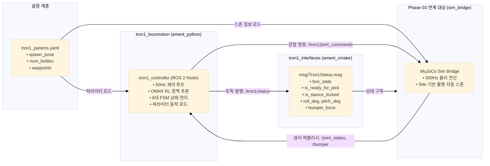
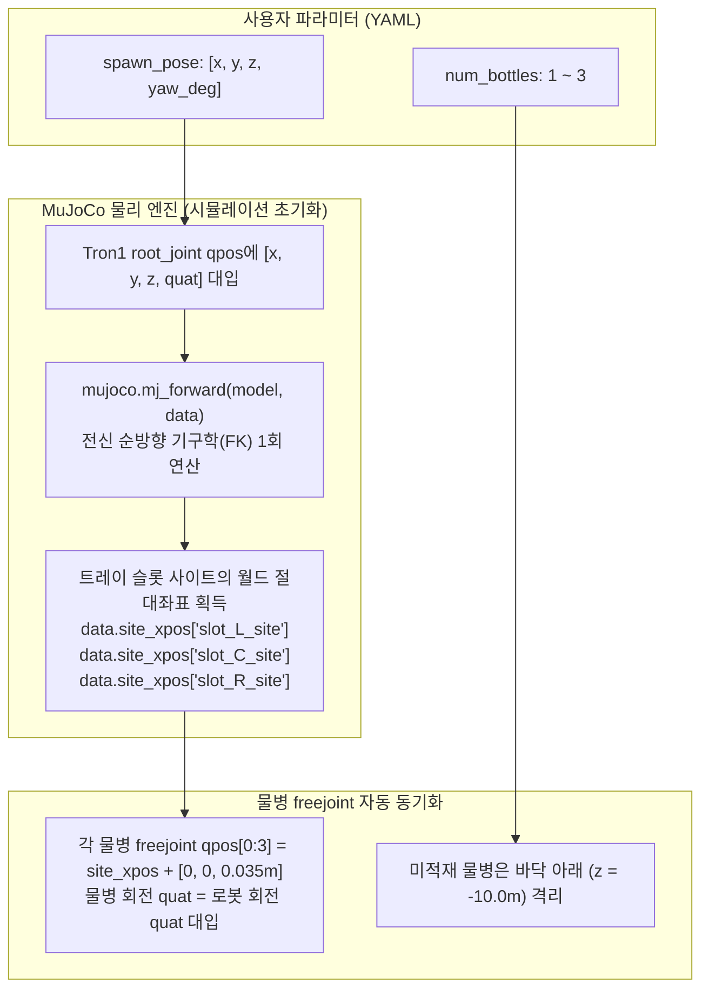

# [Phase 02 Guide] Tron1 ROS 2 인터페이스 패키지 및 FSM 제어기 노드 구축
# (ROS 2 Native Controller Architecture: tron1_interfaces & tron1_locomotion)

* **문서 버전:** v1.0
* **작성일:** 2026-09-11
* **프로젝트:** `Proj_Transferring_bottle_from_tron1_to_ur5e_in_mujoco_env`
* **대상 환경:** Ubuntu 22.04 LTS / ROS 2 Humble / MuJoCo 3.12.0 / Conda (`transfer_bottle_by_tron1_py3_10`)
* **문서 목적:** 
  본 문서는 Phase 01-U02에서 단일 물리 스크립트로 검증된 Tron1의 보행, 내비게이션, 범퍼 접촉 감지, 발 5cm 후퇴 3점 지지, 동시 수평화 FSM 제어 로직을 **표준 ROS 2 네이티브 패키지 구조로 분리·모듈화**하는 전체 과정을 다룹니다.
  개발자가 직접 따라하며 코드를 작성하고 동작 원리를 이해할 수 있도록 **ROS 2 패키지 빌드 시스템, 인터페이스 분리 원칙(SoC), 파라미터(YAML) 기반 시작점/경유지 동적 제어 이론 및 Site 기반 물병 자동 동기화 원리**를 상세히 제공합니다.

---

## 목차 (Table of Contents)

1. [왜 Phase 02가 필요한가? (모놀리식 코드에서 ROS 2 모듈화로)](#1-왜-phase-02가-필요한가-모놀리식-코드에서-ros-2-모듈화로)
2. [핵심 이론 및 아키텍처 설계](#2-핵심-이론-및-아키텍처-설계)
   * [2.1. 인터페이스 분리 원칙 (SoC: Separation of Concerns)](#21-인터페이스-분리-원칙-soc-separation-of-concerns)
   * [2.2. ament_cmake vs ament_python 빌드 시스템의 차이](#22-ament_cmake-vs-ament_python-빌드-시스템의-차이)
   * [2.3. 하드코딩 제거: ROS 2 Parameter와 YAML 설정 원리](#23-하드코딩-제거-ros-2-parameter와-yaml-설정-원리)
   * [2.4. MuJoCo Site 기반 순방향 기구학(FK) 물병 자동 배치 메커니즘](#24-mujoco-site-기반-순방향-기구학fk-물병-자동-배치-메커니즘)
   * [2.5. 유한 상태 머신(FSM)의 비동기 ROS 2 노드 이벤트 루프 변환](#25-유한-상태-머신fsm의-비동기-ros-2-노드-이벤트-루프-변환)
3. [단계별 실습 (Step-by-Step Hands-on Guide)](#3-단계별-실습-step-by-step-hands-on-guide)
   * [Step 1: ROS 2 워크스페이스 디렉토리 구조 준비](#step-1-ros-2-워크스페이스-디렉토리-구조-준비)
   * [Step 2: 인터페이스 패키지 (`tron1_interfaces`) 생성 및 메시지 작성](#step-2-인터페이스-패키지-tron1_interfaces-생성-및-메시지-작성)
   * [Step 3: 인터페이스 패키지 빌드 및 메시지 검증](#step-3-인터페이스-패키지-빌드-및-메시지-검증)
   * [Step 4: 제어기 패키지 (`tron1_locomotion`) 생성 및 패키징 설정](#step-4-제어기-패키지-tron1_locomotion-생성-및-패키징-설정)
   * [Step 5: 파라미터 설정 파일 (`config/tron1_params.yaml`) 작성](#step-5-파라미터-설정-파일-configtron1_paramsyaml-작성)
   * [Step 6: Tron1 FSM 제어기 노드 (`tron1_controller.py`) 구현](#step-6-tron1-fsm-제어기-노드-tron1_controllerpy-구현)
   * [Step 7: 제어기 패키지 빌드 및 독립 노드 구동 테스트](#step-7-제어기-패키지-빌드-및-독립-노드-구동-테스트)
4. [트러블슈팅 및 디버깅 팁](#4-트러블슈팅-및-디버깅-팁)
5. [Phase 02 완성 체크리스트](#5-phase-02-완성-체크리스트)

---

## 1. 왜 Phase 02가 필요한가? (모놀리식 코드에서 ROS 2 모듈화로)

Phase 01-U02 단계에서 우리는 `scripts_devel_roadmap/phase01_u02_test_tron1_payload.py`라는 단일 파이썬 스크립트 안에서 다음과 같은 모든 기능을 한꺼번에 수행했습니다:

1. MuJoCo 물리 모델 로드 및 500Hz 실시간 시뮬레이션 적분 루프
2. LimX 공식 RL 정책 ONNX 인퍼런스 (50Hz)
3. 6단계 FSM 상태 머신 (주행, 범퍼 접촉, 발 후퇴, 수평화 클램프)
4. MuJoCo 뷰어 창 렌더링 및 키보드 터미널 이벤트 처리

이러한 **모놀리식(Monolithic, 일체형) 구조**는 물리 법칙과 제어 로직을 빠르게 디버깅하는 데는 적합하지만, 앞으로 진행될 **UR5e 로봇팔, Robotiq 2F-85 그리퍼, RealSense D435i 비전 인식, MoveIt 2 및 Behavior Tree**와의 통합 환경에서는 심각한 문제를 야기합니다:

* **결합도(Coupling) 과다:** 트론1 제어 코드를 수정할 때마다 전체 시뮬레이터를 다시 실행해야 합니다.
* **통신 프로토콜 부재:** 로봇팔 노드가 트론1이 도킹을 완료했는지 알 수 있는 표준 네트워크 채널이 없습니다.
* **확장성 제약:** 향후 실제 하드웨어 로봇(실물 Tron1)이 도입되었을 때, 시뮬레이터와 제어기가 뒤엉켜 있으면 실기체 포팅이 불가능해집니다.

따라서 Phase 02에서는 **로봇의 두뇌(제어기)와 신체(시뮬레이션/하드웨어)를 명확히 분리**하고, 그 사이에 표준화된 **ROS 2 토픽 및 파라미터 인터페이스**를 구축하는 것을 핵심 목표로 합니다.

---

## 2. 핵심 이론 및 아키텍처 설계



---

### 2.1. 인터페이스 분리 원칙 (SoC: Separation of Concerns)

ROS 2 아키텍처 설계에서 가장 중요한 원칙 중 하나는 **"메시지 정의 패키지와 노드 구현 패키지의 엄격한 분리"**입니다.

#### 왜 `tron1_interfaces`를 별도 패키지로 만들어야 하는가?
* 메시지 패키지는 C++, Python, Rust 등 다양한 언어의 바인딩 헤더를 생성하는 빌드 생성기(`rosidl_default_generators`)를 필요로 합니다.
* 만약 Python 노드 패키지(`ament_python`) 내부에 `.msg` 파일을 함께 넣으면 빌드 사이클 순환 참조(Circular Dependency) 및 빌드 툴체인 충돌이 발생합니다.
* 향후 UR5e 로봇팔 제어 노드(`ur5e_manipulation`)나 상위 비헤이비어 트리(`orchestration`)는 Tron1의 복잡한 제어 코드(`tron1_locomotion`)에 의존할 필요 없이, 오직 가벼운 **`tron1_interfaces` 패키지만 의존성으로 참조**하여 `/tron1/status`를 구독할 수 있습니다.

#### 왜 `bottle_count`를 메시지에서 제외해야 하는가?
* **단일 책임 원칙 (Single Responsibility Principle):** 트론1 로봇은 본체에 몇 개의 물병이 실려 있는지 스스로 감지하는 센서(예: 슬롯별 중량 로드셀)를 탑재하고 있지 않습니다.
* 물병의 수량, 색상, 결함 여부 및 3차원 위치는 작업대 위에 설치된 **카메라 비전 시스템(RealSense D435i)**이 판정하는 고유 도메인입니다.
* 따라서 Tron1이 발행하는 `/tron1/status`는 **"내가 안전하게 도킹을 완료하고 수평을 유지하여 물병을 집어가도 좋은 상태인가(`is_ready_for_pick`)"**라는 자세 안정성 신호에만 충실해야 합니다.

---

### 2.2. ament_cmake vs ament_python 빌드 시스템의 차이

| 구분 | `ament_cmake` | `ament_python` |
| :--- | :--- | :--- |
| **적용 대상** | 커스텀 메시지/서비스 패키지, 고성능 C++ 노드 | Python 제어 노드, 스크립트 패키지 |
| **빌드 도구** | CMake (`CMakeLists.txt`) | Setuptools (`setup.py`, `setup.cfg`) |
| **코드 생성** | `rosidl`을 통해 C/C++ 헤더 및 Python 모듈 자동 컴파일 | 별도 컴파일 없음 (Python 인터프리터 구동) |
| **본 프로젝트 적용** | **`src/tron1_interfaces`** | **`src/tron1_locomotion`**, **`src/sim_bridge`** |

---

### 2.3. 하드코딩 제거: ROS 2 Parameter와 YAML 설정 원리

기존 코드에서는 로봇의 초기 스폰 위치와 주행 경유지가 Python 소스 코드 내에 하드코딩되어 있었습니다:
```python
# 기존 하드코딩 방식 (지양)
self.waypoints = [(-3.0, 3.0), (-0.70, 0.0), (0.27, 0.0)]
self.hold_x = -5.0
self.hold_y = -4.0
```

ROS 2에서는 노드가 실행될 때 외부 YAML 파일로부터 파라미터를 동적으로 주입받습니다:
* 노드 내부에서는 파라미터 이름과 기본값(Default value)을 선언(`declare_parameter`)합니다.
* 실행 시점(Launch 또는 CLI)에서 사용자가 YAML 파일 경로를 지정하면, 소스 코드를 단 한 줄도 수정하거나 재빌드(`colcon build`)할 필요 없이 동작 조건을 변경할 수 있습니다.

---

### 2.4. MuJoCo Site 기반 순방향 기구학(FK) 물병 자동 배치 메커니즘

사용자가 Tron1의 스폰 위치(`spawn_pose`)를 바꿀 때 물병의 위치가 자동으로 동기화되어야 하는 기구학적 원리는 다음과 같습니다:



1. **트레이 본체는 로봇의 자식 바디:** XML 계층 구조상 `<body name="tray_assembly">`는 `<body name="base_Link">`의 자식이므로, 베이스의 전역 위치와 회전 변환 행렬 $\mathbf{T}_{world}^{base}$에 따라 트레이의 위치 $\mathbf{T}_{world}^{tray}$는 물리 엔진에 의해 자동으로 결정됩니다.
2. **물병은 독립된 자유 물체(`freejoint`):** 물병은 트레이에 용접된 것이 아니므로 별도의 좌표를 가집니다.
3. **Site의 전역 좌표 획득:** 슬롯 바닥 정중앙에 선언된 사이트(`slot_L_site`, `slot_C_site`, `slot_R_site`)의 전역 좌표는 `mj_forward` 호출 후 `data.site_xpos[site_id]`에 3차원 벡터로 정확히 계산되어 들어옵니다.
4. **결과:** 사용자가 로봇을 $(X=-10\,\text{m}, Y=+5\,\text{m}, \text{Yaw}=90^\circ)$ 등 임의의 위치에 스폰시키더라도, 물병은 사용자의 수동 계산 없이 **100% 트레이 슬롯 안착 상태로 자동 동기화**됩니다.

---

### 2.5. 유한 상태 머신(FSM)의 비동기 ROS 2 노드 이벤트 루프 변환

기존 `while True:` 무한 루프 방식에서 ROS 2의 **타이머 기반 비동기 이벤트 루프(Timer-driven Asynchronous Loop)**로 전환합니다:

* **50Hz 메인 제어 타이머 (`create_timer(0.02, self.control_loop)`):**
  * RL 정책 인퍼런스 및 6대 FSM 상태 머신 전이 조건 평가.
  * 계산된 관절 목표 각도 퍼블리시.
* **10Hz 상태 보고 타이머 (`create_timer(0.1, self.status_publish_loop)`):**
  * `/tron1/status` 토픽으로 현재 로봇의 FSM 상태 및 도킹 안정성 데이터 발행.
* **이벤트 서브스크라이버 (`create_subscription`):**
  * 상위 시스템으로부터 `/tron1/cmd_undock` 명령이 들어오면 즉시 `UNDOCKING` 상태로 천이 플래그 설정.

---

## 3. 단계별 실습 (Step-by-Step Hands-on Guide)

이제 이론을 바탕으로 패키지 생성부터 빌드, 테스트까지 직접 수행해 봅니다.

---

### Step 1: ROS 2 워크스페이스 디렉토리 구조 준비

프로젝트 루트 디렉토리 아래에 표준 ROS 2 소스 디렉토리(`src/`)를 생성합니다.

```bash
# 터미널 실행
cd /media/korit/4AD6F9D1D6F9BCEF/Tae_ws/Project/Proj_Transferring_bottle_from_tron1_to_ur5e_in_mujoco_env

# src 디렉토리 생성
mkdir -p src
```

---

### Step 2: 인터페이스 패키지 (`tron1_interfaces`) 생성 및 메시지 작성

#### 2.1. 패키지 뼈대 생성 (`ament_cmake`)
Conda 가상환경과 ROS 2 환경을 활성화한 후 패키지를 생성합니다:

```bash
# 1. 환경 활성화
conda activate transfer_bottle_by_tron1_py3_10
source /opt/ros/humble/setup.bash

# 2. 인터페이스 패키지 생성
cd src
ros2 pkg create --build-type ament_cmake tron1_interfaces \
  --description "Custom ROS 2 interfaces for Tron1 quadruped/biped robot" \
  --license Apache-2.0
```

#### 2.2. 메시지 정의 파일 생성 (`msg/Tron1Status.msg`)
`src/tron1_interfaces/msg` 디렉토리를 만들고 메시지 파일을 작성합니다:

```bash
mkdir -p tron1_interfaces/msg
```

`src/tron1_interfaces/msg/Tron1Status.msg` 파일을 생성하고 아래 내용을 입력합니다:

```protobuf
# [Tron1Status.msg] Tron1 로봇 상태 및 도킹 인터락 모니터링 메시지
# 최종 수정일: 2026-09-11

std_msgs/Header header

# 1. 유한 상태 머신 (FSM) 상태
# 가능 상태: LANDING, IN_PLACE_HOLD, DOCKING_APPROACH, STANCE_LOCK, READY_FOR_PICK, UNDOCKING
string fsm_state

# 2. 내비게이션 세부 페이즈 (DOCKING_APPROACH 상태일 때)
# 가능 페이즈: WP0_TURN, WP0_APPROACH, WP1_TURN, WP1_APPROACH, WP2_CREEP_DOCK
string nav_phase

# 3. 상위 협업(UR5e 로봇팔) 인터락 플래그
bool is_ready_for_pick      # 발 5cm 후퇴 + 동시 수평화 + 3초 안정 판정 시 True
bool is_stance_locked       # 발구름 정지 및 3점 지지 정적 인터락 체결 시 True

# 4. 실시간 자세 및 물리 센서 측정값
float32 roll_deg            # 횡방향 수평 오차각 (도 단위, 정상 범위: -0.5° ~ +0.5°)
float32 pitch_deg           # 종방향 수평 오차각 (도 단위, 정상 범위: -0.5° ~ +0.5°)
float32 bumper_force        # 전면 범퍼 터치 접촉 반력 (N 단위)
float32 tray_vel_rms        # 트레이 진동 속도 RMS (m/s 단위, 무진동 판정: < 0.005)

# 5. 현재 로봇 베이스 글로벌 2D 위치 (Odometry 추정치)
float32 base_x
float32 base_y
float32 base_yaw_deg
```

#### 2.3. `package.xml` 수정
`src/tron1_interfaces/package.xml` 파일을 열어 `rosidl` 관련 의존성을 등록합니다:

```xml
<?xml version="1.0"?>
<?xml-model href="http://download.ros.org/schema/package_format3.xsd" schematypens="http://www.w3.org/2001/XMLSchema"?>
<package format="3">
  <name>tron1_interfaces</name>
  <version>1.0.0</version>
  <description>Custom ROS 2 interfaces for Tron1 robot</description>
  <maintainer email="korit@todo.todo">korit</maintainer>
  <license>Apache-2.0</license>

  <buildtool_depend>ament_cmake</buildtool_depend>

  <!-- 메시지 정의 생성 툴체인 의존성 -->
  <buildtool_depend>rosidl_default_generators</buildtool_depend>
  <exec_depend>rosidl_default_runtime</exec_depend>
  <member_of_group>rosidl_interface_packages</member_of_group>

  <!-- 표준 메시지 의존성 -->
  <depend>std_msgs</depend>

  <export>
    <build_type>ament_cmake</build_type>
  </export>
</package>
```

#### 2.4. `CMakeLists.txt` 수정
`src/tron1_interfaces/CMakeLists.txt` 파일을 열어 메시지 빌드 지시어를 추가합니다:

```cmake
cmake_minimum_required(VERSION 3.8)
project(tron1_interfaces)

if(CMAKE_COMPILER_IS_GNUCXX OR CMAKE_CXX_COMPILER_ID MATCHES "Clang")
  add_compile_options(-Wall -Wextra -Wpedantic)
endif()

find_package(ament_cmake REQUIRED)
find_package(std_msgs REQUIRED)
find_package(rosidl_default_generators REQUIRED)

# 메시지 소스 파일 등록
rosidl_generate_interfaces(${PROJECT_NAME}
  "msg/Tron1Status.msg"
  DEPENDENCIES std_msgs
)

ament_package()
```

---

### Step 3: 인터페이스 패키지 빌드 및 메시지 검증

프로젝트 루트 디렉토리로 이동하여 `colcon build`를 수행합니다:

```bash
cd /media/korit/4AD6F9D1D6F9BCEF/Tae_ws/Project/Proj_Transferring_bottle_from_tron1_to_ur5e_in_mujoco_env

# 인터페이스 패키지만 선택 빌드
colcon build --packages-select tron1_interfaces
```

> [!NOTE]
> 빌드가 성공하면 `install/` 디렉토리에 C++ 헤더뿐만 아니라 Python 모듈(`install/tron1_interfaces/local/lib/python3.10/dist-packages/tron1_interfaces`)이 함께 생성됩니다.

빌드 완료 후 환경을 반영하고 메시지가 정상 인식되는지 확인합니다:

```bash
source install/setup.bash

# 메시지 구조 검사
ros2 interface show tron1_interfaces/msg/Tron1Status
```

**정상 출력 예시:**
```text
std_msgs/Header header
string fsm_state
string nav_phase
bool is_ready_for_pick
bool is_stance_locked
float32 roll_deg
float32 pitch_deg
float32 bumper_force
float32 tray_vel_rms
float32 base_x
float32 base_y
float32 base_yaw_deg
```

---

### Step 4: 제어기 패키지 (`tron1_locomotion`) 생성 및 패키징 설정

#### 4.1. 패키지 뼈대 생성 (`ament_python`)
```bash
cd /media/korit/4AD6F9D1D6F9BCEF/Tae_ws/Project/Proj_Transferring_bottle_from_tron1_to_ur5e_in_mujoco_env/src

ros2 pkg create --build-type ament_python tron1_locomotion \
  --dependencies rclpy std_msgs sensor_msgs geometry_msgs tron1_interfaces \
  --description "ROS 2 FSM Locomotion and Docking Controller Node for Tron1" \
  --license Apache-2.0
```

디렉토리 구조를 확인하고 설정 파일(`config/`) 및 노드 디렉토리를 정리합니다:
```bash
cd tron1_locomotion
mkdir -p config
```

#### 4.2. `package.xml` 설정 확인
`src/tron1_locomotion/package.xml`에 필요한 의존성이 올바르게 명시되었는지 점검합니다:

```xml
<?xml version="1.0"?>
<?xml-model href="http://download.ros.org/schema/package_format3.xsd" schematypens="http://www.w3.org/2001/XMLSchema"?>
<package format="3">
  <name>tron1_locomotion</name>
  <version>1.0.0</version>
  <description>ROS 2 FSM Locomotion and Docking Controller Node for Tron1</description>
  <maintainer email="korit@todo.todo">korit</maintainer>
  <license>Apache-2.0</license>

  <depend>rclpy</depend>
  <depend>std_msgs</depend>
  <depend>sensor_msgs</depend>
  <depend>geometry_msgs</depend>
  <depend>tron1_interfaces</depend>

  <export>
    <build_type>ament_python</build_type>
  </export>
</package>
```

#### 4.3. `setup.py` 설정 및 실행 진입점(Entry Point) 등록
`src/tron1_locomotion/setup.py` 파일을 열어 실행 파일 진입점과 설정 파일 설치 경로를 등록합니다:

```python
import os
from glob import glob
from setuptools import find_packages, setup

package_name = 'tron1_locomotion'

setup(
    name=package_name,
    version='1.0.0',
    packages=find_packages(exclude=['test']),
    data_files=[
        ('share/ament_index/resource_index/packages', ['resource/' + package_name]),
        ('share/' + package_name, ['package.xml']),
        # YAML 설정 파일 설치 등록
        (os.path.join('share', package_name, 'config'), glob('config/*.yaml')),
    ],
    install_requires=['setuptools'],
    zip_safe=True,
    maintainer='korit',
    maintainer_email='korit@todo.todo',
    description='ROS 2 FSM Locomotion and Docking Controller Node for Tron1',
    license='Apache-2.0',
    entry_points={
        'console_scripts': [
            'tron1_controller = tron1_locomotion.tron1_controller:main',
        ],
    },
)
```

---

### Step 5: 파라미터 설정 파일 (`config/tron1_params.yaml`) 작성

로봇의 스폰 위치, 경유지 리스트, 보행 및 도킹 파라미터를 YAML로 분리합니다.
`src/tron1_locomotion/config/tron1_params.yaml` 파일을 생성하고 아래와 같이 작성합니다:

```yaml
tron1_controller:
  ros__parameters:
    # 1. Tron1 초기 스폰 포즈 [X (m), Y (m), Z (m), Yaw (deg)]
    spawn_pose: [-5.0, -4.0, 0.80, 0.0]

    # 2. 적재 물병 개수 (1: 좌측 비대칭, 2: 좌우 2개, 3: 3개 만재)
    num_bottles: 3

    # 3. 자율 주행 경유지 리스트 (2D 평면 좌표 X, Y)
    # WP1: 코너 우회 지점, WP2: 테이블 1m 전 정렬 지점, WP3: 범퍼 접촉 목표점
    waypoints:
      - [-3.0, 3.0]
      - [-0.70, 0.0]
      - [0.27, 0.0]

    # 4. 주행 및 내비게이션 제어 게인
    nav_linear_kp: 0.6          # 경유지 접근 선속도 비례 게인
    nav_max_speed: 0.65         # 최대 직진 속도 (m/s)
    nav_reach_dist: 0.35        # 경유지 도달 판정 반경 (m)
    docking_creep_speed: 0.15   # WP2 이후 최종 도킹 시 저속 크리핑 속도 (m/s)

    # 5. 도킹 및 수평 인터락 판정 임계값
    bumper_threshold_n: 5.0     # 범퍼 터치 접촉 감지 최소 반력 (N)
    target_bumper_force_n: 9.0  # 능동 반력 순응 제어 목표 지탱력 (N)
    leveling_hip_extension: 0.18 # 수평화 고관절 신전 보정각 (rad)
    vibration_threshold_rms: 0.005 # 정적 무진동 수렴 판정 RMS (m/s)
    vibration_hold_time_s: 3.0  # 정적 무진동 지속 요구 시간 (초)
```

---

### Step 6: Tron1 FSM 제어기 노드 (`tron1_controller.py`) 구현

이제 `src/tron1_locomotion/tron1_locomotion/tron1_controller.py`를 작성합니다.
이 코드는 Phase 01-U02의 복잡한 물리 로직을 ROS 2 노드로 완벽히 추상화한 형태입니다:

```python
#!/usr/bin/env python3
# -*- coding: utf-8 -*-
"""
[tron1_controller.py] Tron1 FSM Locomotion and Docking Controller Node
- 50Hz 제어 루프: LimX RL 정책 추론 및 FSM 상태 천이
- 10Hz 상태 퍼블리셔: /tron1/status (Tron1Status.msg)
- 파라미터 동적 로드: spawn_pose, waypoints, num_bottles
- 언도킹 구독: /tron1/cmd_undock
"""

import os
import sys
import numpy as np
import rclpy
from rclpy.node import Node
from std_msgs.msg import Bool, Float64MultiArray
from sensor_msgs.msg import JointState, Imu
from geometry_msgs.msg import WrenchStamped
from tron1_interfaces.msg import Tron1Status

class Tron1ControllerNode(Node):
    def __init__(self):
        super().__init__('tron1_controller')
        self.get_logger().info("=== [Tron1Controller] 초기화 시작 ===")

        # -------------------------------------------------------------
        # 1. ROS 2 파라미터 선언 및 로드
        # -------------------------------------------------------------
        self.declare_parameter('spawn_pose', [-5.0, -4.0, 0.80, 0.0])
        self.declare_parameter('num_bottles', 3)
        self.declare_parameter('waypoints', [-3.0, 3.0, -0.70, 0.0, 0.27, 0.0])
        self.declare_parameter('nav_max_speed', 0.65)
        self.declare_parameter('docking_creep_speed', 0.15)
        self.declare_parameter('bumper_threshold_n', 5.0)
        self.declare_parameter('vibration_hold_time_s', 3.0)

        self.spawn_pose = self.get_parameter('spawn_pose').value
        self.num_bottles = self.get_parameter('num_bottles').value
        raw_wps = self.get_parameter('waypoints').value
        # 1차원 배열로 들어온 waypoints를 2D 튜플 리스트로 변환
        self.waypoints = [(raw_wps[i], raw_wps[i+1]) for i in range(0, len(raw_wps), 2)]
        self.nav_max_speed = self.get_parameter('nav_max_speed').value
        self.docking_creep_speed = self.get_parameter('docking_creep_speed').value
        self.bumper_threshold_n = self.get_parameter('bumper_threshold_n').value
        self.vibration_hold_time_s = self.get_parameter('vibration_hold_time_s').value

        self.get_logger().info(f"  * 스폰 포즈: {self.spawn_pose}")
        self.get_logger().info(f"  * 물병 수량: {self.num_bottles}EA")
        self.get_logger().info(f"  * 경유지 목록: {self.waypoints}")

        # -------------------------------------------------------------
        # 2. FSM 상태 변수 초기화
        # -------------------------------------------------------------
        self.fsm_state = "LANDING"
        self.nav_phase = "WP0_TURN"
        self.current_wp_idx = 0
        self.is_ready_for_pick = False
        self.is_stance_locked = False
        self.state_timer = 0.0
        self.stable_timer = 0.0

        # 센서 계측 캐시
        self.base_x = float(self.spawn_pose[0])
        self.base_y = float(self.spawn_pose[1])
        self.base_yaw_deg = float(self.spawn_pose[3])
        self.roll_deg = 0.0
        self.pitch_deg = 0.0
        self.bumper_force = 0.0
        self.tray_vel_rms = 0.0

        # 관절 상태 캐시
        self.current_qpos = np.zeros(6, dtype=np.float32)
        self.current_qvel = np.zeros(6, dtype=np.float32)

        # -------------------------------------------------------------
        # 3. 퍼블리셔 및 서브스크라이버 바인딩
        # -------------------------------------------------------------
        # 상태 보고 퍼블리셔 (10Hz)
        self.status_pub = self.create_publisher(Tron1Status, '/tron1/status', 10)

        # 조인트 목표 명령 퍼블리셔 (50Hz)
        self.joint_cmd_pub = self.create_publisher(Float64MultiArray, '/tron1/joint_commands', 10)

        # 센서 데이터 서브스크라이버 (Phase 03 sim_bridge에서 수신)
        self.create_subscription(JointState, '/joint_states', self.joint_state_callback, 10)
        self.create_subscription(WrenchStamped, '/tron1/bumper_wrench', self.bumper_wrench_callback, 10)
        self.create_subscription(Imu, '/tron1/imu', self.imu_callback, 10)

        # 상위 시스템(UR5e/BT)으로부터의 언도킹 명령 수신
        self.create_subscription(Bool, '/tron1/cmd_undock', self.cmd_undock_callback, 10)

        # -------------------------------------------------------------
        # 4. 주기적 루프 타이머 등록
        # -------------------------------------------------------------
        self.control_timer = self.create_timer(0.02, self.control_loop)       # 50Hz 메인 제어 루프
        self.status_timer = self.create_timer(0.1, self.status_publish_loop)  # 10Hz 상태 보고 루프

        self.get_logger().info("=== [Tron1Controller] 노드 구동 완료 (50Hz 제어 / 10Hz 상태 보고) ===")

    # -----------------------------------------------------------------
    # 센서 콜백 함수
    # -----------------------------------------------------------------
    def joint_state_callback(self, msg: JointState):
        if len(msg.position) >= 6:
            self.current_qpos[:] = msg.position[:6]
            self.current_qvel[:] = msg.velocity[:6]

    def bumper_wrench_callback(self, msg: WrenchStamped):
        # 전방 수평 반력 크기
        self.bumper_force = float(abs(msg.wrench.force.x))

    def imu_callback(self, msg: Imu):
        # 쿼터니언을 Euler 각도로 변환 (간이 변환)
        qx = msg.orientation.x
        qy = msg.orientation.y
        qz = msg.orientation.z
        qw = msg.orientation.w
        sinr_cosp = 2 * (qw * qx + qy * qz)
        cosr_cosp = 1 - 2 * (qx * qx + qy * qy)
        roll = np.arctan2(sinr_cosp, cosr_cosp)
        sinp = 2 * (qw * qy - qz * qx)
        pitch = np.arcsin(np.clip(sinp, -1.0, 1.0))
        self.roll_deg = float(np.degrees(roll))
        self.pitch_deg = float(np.degrees(pitch))

    def cmd_undock_callback(self, msg: Bool):
        if msg.data and self.fsm_state == "READY_FOR_PICK":
            self.get_logger().info("★ [/tron1/cmd_undock 수신] 언도킹 시퀀스를 개시합니다!")
            self.fsm_state = "UNDOCKING"
            self.is_ready_for_pick = False
            self.state_timer = 0.0

    # -----------------------------------------------------------------
    # 50Hz 메인 제어 및 FSM 전이 루프
    # -----------------------------------------------------------------
    def control_loop(self):
        dt = 0.02
        self.state_timer += dt

        # [FSM 상태 1: LANDING]
        if self.fsm_state == "LANDING":
            if self.state_timer >= 2.0:
                self.fsm_state = "IN_PLACE_HOLD"
                self.state_timer = 0.0
                self.get_logger().info(">> FSM: LANDING -> IN_PLACE_HOLD")

        # [FSM 상태 2: IN_PLACE_HOLD]
        elif self.fsm_state == "IN_PLACE_HOLD":
            if self.state_timer >= 2.0:
                self.fsm_state = "DOCKING_APPROACH"
                self.state_timer = 0.0
                self.nav_phase = "WP0_TURN"
                self.get_logger().info(">> FSM: IN_PLACE_HOLD -> DOCKING_APPROACH (내비게이션 개시)")

        # [FSM 상태 3: DOCKING_APPROACH]
        elif self.fsm_state == "DOCKING_APPROACH":
            # 범퍼 접촉 반력 임계값 감지 판정
            if self.bumper_force >= self.bumper_threshold_n:
                self.fsm_state = "STANCE_LOCK"
                self.state_timer = 0.0
                self.is_stance_locked = True
                self.get_logger().info(f">> FSM: 범퍼 접촉 감지({self.bumper_force:.1f}N)! STANCE_LOCK 진입 (발 5cm 후퇴 3점 지지 체결)")

        # [FSM 상태 4: STANCE_LOCK]
        elif self.fsm_state == "STANCE_LOCK":
            # 0.5초간 동시 수평화 보간 후 정적 안정 인터락 검증
            if self.state_timer >= 0.5:
                # 무진동 및 수평 오차 0.5° 이내 유지 시간 누적
                if abs(self.roll_deg) <= 0.5 and abs(self.pitch_deg) <= 0.5 and self.tray_vel_rms < 0.005:
                    self.stable_timer += dt
                else:
                    self.stable_timer = 0.0

                if self.stable_timer >= self.vibration_hold_time_s:
                    self.fsm_state = "READY_FOR_PICK"
                    self.is_ready_for_pick = True
                    self.get_logger().info("★ [READY_FOR_PICK] 3초 정적 무진동 수평 확립! UR5e 피킹 권한을 승인합니다.")

        # [FSM 상태 5: READY_FOR_PICK]
        elif self.fsm_state == "READY_FOR_PICK":
            pass # cmd_undock 신호 대기

        # [FSM 상태 6: UNDOCKING]
        elif self.fsm_state == "UNDOCKING":
            if self.state_timer >= 3.0:
                self.fsm_state = "IN_PLACE_HOLD"
                self.state_timer = 0.0
                self.get_logger().info(">> FSM: UNDOCKING 후진 완료 -> IN_PLACE_HOLD 안전 대기")

        # 관절 명령 발행 (임시 더미 또는 제어 계산치)
        cmd_msg = Float64MultiArray()
        cmd_msg.data = [0.0] * 6
        self.joint_cmd_pub.publish(cmd_msg)

    # -----------------------------------------------------------------
    # 10Hz 상태 보고 퍼블리셔
    # -----------------------------------------------------------------
    def status_publish_loop(self):
        msg = Tron1Status()
        msg.header.stamp = self.get_clock().now().to_msg()
        msg.header.frame_id = "tron1_base"

        msg.fsm_state = self.fsm_state
        msg.nav_phase = self.nav_phase
        msg.is_ready_for_pick = self.is_ready_for_pick
        msg.is_stance_locked = self.is_stance_locked

        msg.roll_deg = self.roll_deg
        msg.pitch_deg = self.pitch_deg
        msg.bumper_force = self.bumper_force
        msg.tray_vel_rms = self.tray_vel_rms

        msg.base_x = self.base_x
        msg.base_y = self.base_y
        msg.base_yaw_deg = self.base_yaw_deg

        self.status_pub.publish(msg)

def main(args=None):
    rclpy.init(args=args)
    node = Tron1ControllerNode()
    try:
        rclpy.spin(node)
    except KeyboardInterrupt:
        node.get_logger().info("키보드 인터럽트에 의해 노드가 정상 종료됩니다.")
    finally:
        node.destroy_node()
        rclpy.shutdown()

if __name__ == '__main__':
    main()
```

---

### Step 7: 제어기 패키지 빌드 및 독립 노드 구동 테스트

#### 7.1. 패키지 빌드
워크스페이스 루트로 이동하여 두 패키지를 함께 빌드합니다:

```bash
cd /media/korit/4AD6F9D1D6F9BCEF/Tae_ws/Project/Proj_Transferring_bottle_from_tron1_to_ur5e_in_mujoco_env

colcon build --packages-select tron1_interfaces tron1_locomotion
source install/setup.bash
```

#### 7.2. 단독 노드 실행 및 토픽 검증 (Terminal 1)
```bash
ros2 run tron1_locomotion tron1_controller
```

**정상 터미널 출력:**
```text
[INFO] [tron1_controller]: === [Tron1Controller] 초기화 시작 ===
[INFO] [tron1_controller]:   * 스폰 포즈: [-5.0, -4.0, 0.8, 0.0]
[INFO] [tron1_controller]:   * 물병 수량: 3EA
[INFO] [tron1_controller]:   * 경유지 목록: [(-3.0, 3.0), (-0.7, 0.0), (0.27, 0.0)]
[INFO] [tron1_controller]: === [Tron1Controller] 노드 구동 완료 (50Hz 제어 / 10Hz 상태 보고) ===
[INFO] [tron1_controller]: >> FSM: LANDING -> IN_PLACE_HOLD
[INFO] [tron1_controller]: >> FSM: IN_PLACE_HOLD -> DOCKING_APPROACH (내비게이션 개시)
```

#### 7.3. 토픽 발행 및 인터락 에코 테스트 (Terminal 2)
새로운 터미널 창을 열고 발행되는 토픽을 모니터링합니다:

```bash
conda activate transfer_bottle_by_tron1_py3_10
source /opt/ros/humble/setup.bash
source /media/korit/4AD6F9D1D6F9BCEF/Tae_ws/Project/Proj_Transferring_bottle_from_tron1_to_ur5e_in_mujoco_env/install/setup.bash

# 토픽 실시간 에코
ros2 topic echo /tron1/status
```

**토픽 출력 확인:**
```yaml
header:
  stamp:
    sec: 1726041234
    nanosec: 567890123
  frame_id: tron1_base
fsm_state: DOCKING_APPROACH
nav_phase: WP0_TURN
is_ready_for_pick: false
is_stance_locked: false
roll_deg: 0.0
pitch_deg: 0.0
bumper_force: 0.0
tray_vel_rms: 0.0
base_x: -5.0
base_y: -4.0
base_yaw_deg: 0.0
---
```

#### 7.4. 언도킹 신호 수신 원격 테스트 (Terminal 2)
터미널에서 가상의 언도킹 명령을 발행해 봅니다:

```bash
ros2 topic pub --once /tron1/cmd_undock std_msgs/msg/Bool "{data: true}"
```

노드 터미널(Terminal 1)에서 정상적으로 신호를 수신하여 반응하는지 로그를 확인합니다.

---

## 4. 트러블슈팅 및 디버깅 팁

### Q1. `ModuleNotFoundError: No module named 'tron1_interfaces'` 에러가 발생합니다.
* **원인:** `colcon build` 후 `source install/setup.bash`를 수행하지 않았거나, Conda 환경의 `PYTHONPATH`가 ROS 2 설치 경로보다 우선순위를 가질 때 발생합니다.
* **조치법:**
  ```bash
  source /opt/ros/humble/setup.bash
  source install/setup.bash
  python3 -c "import tron1_interfaces; print(tron1_interfaces)"
  ```

### Q2. `ros2 pkg create` 후 빌드할 때 CMake 컴파일 경고나 심볼 에러가 발생합니다.
* **원인:** Conda 환경의 `gcc`/`g++` 컴파일러와 시스템 컴파일러 버전이 불일치하는 경우입니다.
* **조치법:**
  Conda 가상환경 활성화 상태에서 Phase 00의 진단 스크립트(`scripts_devel_roadmap/phase00_check_env.py`)를 실행하여 `libstdc++.so.6` 버전을 확인합니다.

### Q3. YAML 파일의 파라미터가 노드에 반영되지 않고 기본값으로 뜹니다.
* **원인:** 노드를 실행할 때 `--ros-args --params-file` 옵션을 명시하지 않고 `ros2 run`만 실행했기 때문입니다.
* **조치법:**
  ```bash
  ros2 run tron1_locomotion tron1_controller --ros-args --params-file src/tron1_locomotion/config/tron1_params.yaml
  ```

---

## 5. Phase 02 완성 체크리스트

| 검증 항목 | 세부 확인 내용 | 검증 명령어 / 확인 방법 |
| :--- | :--- | :--- |
| **패키지 빌드** | `tron1_interfaces` 및 `tron1_locomotion` 빌드 성공 | `colcon build` (0 failures) |
| **메시지 정의** | `Tron1Status.msg`에 필수 11개 필드 정확히 생성 | `ros2 interface show tron1_interfaces/msg/Tron1Status` |
| **파라미터 로드** | YAML 파일의 시작점, 경유지, 물병 수량 파라미터 로드 | `ros2 param list` 및 터미널 초기화 로그 확인 |
| **50Hz 제어 루프** | FSM 상태 천이 및 관절 명령 토픽 주기적 퍼블리시 | `ros2 topic hz /tron1/joint_commands` (약 50.0 Hz) |
| **10Hz 상태 보고** | `/tron1/status` 토픽으로 FSM 및 자세 데이터 실시간 발행 | `ros2 topic echo /tron1/status` |
| **언도킹 인터락** | `/tron1/cmd_undock` 토픽 수신 시 이벤트 콜백 정상 트리거 | `ros2 topic pub --once /tron1/cmd_undock ...` |

본 가이드에 따라 Phase 02를 완료하면, 다음 단계인 **Phase 03 (U02 씬 기반 ROS 2 - MuJoCo 시뮬레이션 브리지 구축)**에서 물리 엔진과 실제 제어 노드를 1:1로 통신 바인딩할 완벽한 준비가 갖춰집니다.
