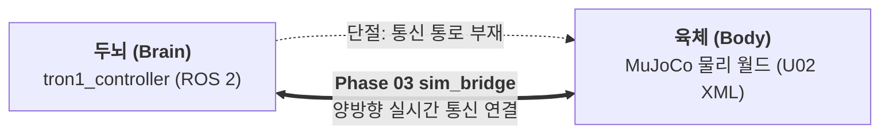
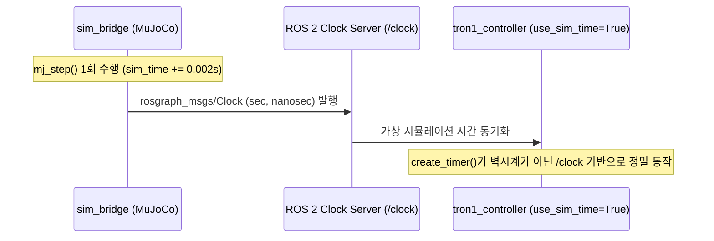

# [Phase 03 Guide] U02 씬 기반 ROS 2 - MuJoCo 시뮬레이션 통신 브리지 구축
# (ROS 2 - MuJoCo Native Simulation Bridge Architecture: sim_bridge)

* **문서 버전:** v1.2
* **작성일:** 2026-09-18
* **프로젝트:** `Proj_Transferring_bottle_from_tron1_to_ur5e_in_mujoco_env`
* **대상 환경:** Ubuntu 22.04 LTS / ROS 2 Humble / MuJoCo 3.12.0 / Conda (`transfer_bottle_by_tron1_py3_10`)
* **문서 목적:** 
  본 문서는 Phase 01-U02에서 물리 검증을 마친 **U02 샌드박스 씬(`xml_for_unit_test/phase01_u02_scene_unit_tron1_payload.xml`)**을 그대로 실행하면서, Phase 02에서 구축한 **Tron1 ROS 2 제어기(`tron1_controller`)와 MuJoCo 물리 엔진 간의 양방향 통신을 이어주는 시뮬레이션 브리지 패키지(`sim_bridge`)**를 구축하는 전체 과정을 다룹니다.
  개발자가 이론을 이해하고 한 단계씩 따라하며 직접 코드를 구현하고 검증할 수 있도록 **멀티스레딩 동기화, Sim Time(`/clock`), Site 기반 순방향 기구학(FK) 물병 자동 안착/격리 기법, 센서 I/O 매핑 및 패시브 뷰어 렌더링 파이프라인**을 상세히 제공합니다.

---

## 목차 (Table of Contents)

1. [왜 Phase 03(시뮬레이션 브리지)이 필요한가?](#1-왜-phase-03시뮬레이션-브리지가-필요한가)
2. [핵심 이론 및 아키텍처 설계](#2-핵심-이론-및-아키텍처-설계)
   * [2.1. 시뮬레이션 브리지의 역할과 SoC (관심사 분리)](#21-시뮬레이션-브리지의-역할과-soc-관심사-분리)
   * [2.2. MuJoCo 500Hz 물리 스레드 vs ROS 2 비동기 이벤트 스레드 동기화](#22-mujoco-500hz-물리-스레드-vs-ros-2-비동기-이벤트-스레드-동기화)
   * [2.3. 시뮬레이션 시간 동기화 메커니즘 (`/clock` & `use_sim_time`)](#23-시뮬레이션-시간-동기화-메커니즘-clock--use_sim_time)
   * [2.4. Site 기반 순방향 기구학(FK) 물병 자동 배치 및 지하 격리 원리](#24-site-기반-순방향-기구학fk-물병-자동-배치-및-지하-격리-원리)
   * [2.5. MuJoCo 센서 데이터 ➔ ROS 2 표준 메시지 매핑 체계](#25-mujoco-센서-데이터--ros-2-표준-메시지-매핑-체계)
   * [2.6. MuJoCo 패시브 뷰어(Passive Viewer) 메인 스레드 렌더링 원리](#26-mujoco-패시브-뷰어passive-viewer-메인-스레드-렌더링-원리)
3. [전체 통신 데이터 흐름도 (Data Flow Architecture)](#3-전체-통신-데이터-흐름도-data-flow-architecture)
4. [단계별 실습 (Step-by-Step Hands-on Guide)](#4-단계별-실습-step-by-step-hands-on-guide)
   * [Step 1: 브리지 패키지 (`sim_bridge`) 뼈대 생성](#step-1-브리지-패키지-sim_bridge-뼈대-생성)
     * [방법 A (권장): `ros2 pkg create` 명령어로 패키지 자동 생성](#방법-a-권장-ros2-pkg-create-명령어로-패키지-자동-생성)
     * [방법 B (학습용): 디렉토리 및 필수 파일 수동 생성 (내부 구조 이해)](#방법-b-학습용-디렉토리-및-필수-파일-수동-생성-내부-구조-이해)
   * [Step 2: 브리지 핵심 노드 (`mujoco_ros_bridge.py`) 파일 생성 및 소스 구현](#step-2-브리지-핵심-노드-mujoco_ros_bridgepy-파일-생성-및-소스-구현)
     * [2.1. 클래스 구조 및 초기화 흐름](#21-클래스-구조-및-초기화-흐름)
     * [2.2. Site 기반 물병 동기화 알고리즘 구현](#22-site-기반-물병-동기화-알고리즘-구현)
     * [2.3. 500Hz 물리 적분 스레드 및 센서 퍼블리시 구현](#23-500hz-물리-적분-스레드-및-센서-퍼블리시-구현)
     * [2.4. 액추에이터 구동 명령 서브스크라이버 구현](#24-액추에이터-구동-명령-서브스크라이버-구현)
     * [2.5. 메인 GUI 렌더링 루프 통합](#25-메인-gui-렌더링-루프-통합)
   * [Step 3: `setup.py`에 실행 진입점(Entry Point) 직접 등록](#step-3-setuppy에-실행-진입점entry-point-직접-등록)
   * [Step 4: 패키지 빌드 및 환경 로드](#step-4-패키지-빌드-및-환경-로드)
   * [Step 5: 단독 브리지 구동 및 ROS 2 토픽 정밀 검증](#step-5-단독-브리지-구동-및-ros-2-토픽-정밀-검증)
     * [5.1. 브리지 노드 실행 (Terminal 1)](#51-브리지-노드-실행-terminal-1)
     * [5.2. 토픽 목록 및 발행 주기 확인 (Terminal 2)](#52-토픽-목록-및-발행-주기-확인-terminal-2)
     * [5.3. `/clock` 및 센서 토픽 내용 확인 (Terminal 2)](#53-clock-및-센서-토픽-내용-확인-terminal-2)
     * [5.4. 수동 관절 명령 주입 및 로봇 거동 확인 (Terminal 2)](#54-수동-관절-명령-주입-및-로봇-거동-확인-terminal-2)
5. [트러블슈팅 및 성능 최적화 가이드](#5-트러블슈팅-및-성능-최적화-가이드)
6. [Phase 03 완성 체크리스트](#6-phase-03-완성-체크리스트)

---

## 1. 왜 Phase 03(시뮬레이션 브리지)이 필요한가?

지금까지 우리는 두 가지 중요한 단계를 완수했습니다:
* **Phase 01 (물리 검증):** 단일 파이썬 스크립트(`phase01_u02_test_tron1_payload.py`) 안에서 물리 연산, 키보드 제어, RL 인퍼런스를 모두 실행하여 **발 5cm 후퇴 3점 지지, Roll/Pitch 동시 수평화, 도킹 클램프**의 물리적 타당성을 검증했습니다.
* **Phase 02 (제어기 모듈화):** 이 물리 제어 로직을 ROS 2 노드인 **`tron1_controller`**와 표준 메시지인 **`Tron1Status.msg`**로 성공적으로 분리했습니다.

하지만 현재 상태의 `tron1_controller`는 실제 센서 값을 읽거나 모터를 돌릴 수 없는 **"신체 없는 두뇌"** 상태입니다. 반대로 MuJoCo XML 모델은 ROS 2 네트워크와 통신할 수 없는 **"영혼 없는 육체"**입니다.



### 왜 UR5e 로봇팔을 바로 올리지 않고 U02 환경 브리지를 먼저 만드는가?
1. **디버깅 변수 분리 (Isolation of Variables):**
   * 만약 UR5e 로봇팔, Robotiq 그리퍼, RealSense D435i 비전 카메라를 한꺼번에 올린 상태에서 ROS 2 브리지를 만들면, 통신 지연이나 제어 불안정이 발생했을 때 이것이 트론1 문제인지, 로봇팔 문제인지, 카메라 렌더링 문제인지 원인을 파악하기 불가능해집니다.
2. **단위 검증(Unit Test) 철학의 연장:**
   * 이미 물리적으로 완벽히 검증된 U02 환경(트론1 + 물병 3개 + 작업대)을 1:1로 ROS 2화하여 **[제어기 ↔ 브리지 ↔ MuJoCo]** 단독 루프를 먼저 완벽하게 가동(Phase 04)한 뒤, 검증된 기반 위에 로봇팔을 얹는 것(Phase 05)이 가장 안전하고 확실한 엔지니어링 접근법입니다.

---

## 2. 핵심 이론 및 아키텍처 설계

### 2.1. 시뮬레이션 브리지의 역할과 SoC (관심사 분리)

시뮬레이션 브리지(`mujoco_ros_bridge`)는 다음 세 가지 역할만 엄격히 수행하며, 제어 알고리즘이나 상태 머신(FSM)에는 절대 개입하지 않습니다:
1. **하드웨어 인터페이스 에뮬레이션:** 실제 로봇의 모터 엔코더, IMU 센서, 범퍼 압력 센서 드라이버 역할을 대신하여 MuJoCo의 물리 데이터를 ROS 2 표준 토픽으로 퍼블리시합니다.
2. **액추에이터 명령 전달:** 제어기가 발행한 조인트 목표 명령(`/tron1/joint_commands`)을 수신하여 MuJoCo의 `data.ctrl` 배열에 주입합니다.
3. **가상 환경 세팅:** 사용자가 지정한 파라미터(`spawn_pose`, `bottle_slots`)에 따라 로봇과 물병을 월드 좌표계에 정확히 배치합니다.

---

### 2.2. MuJoCo 500Hz 물리 스레드 vs ROS 2 비동기 이벤트 스레드 동기화

로봇 시뮬레이션 시스템에서 가장 까다로운 부분은 **서로 다른 시간 주기를 갖는 루프들을 충돌 없이 결합하는 것**입니다.

| 컴포넌트 | 주기 / 주파수 | 실행 스레드 | 주요 역할 |
| :--- | :--- | :--- | :--- |
| **MuJoCo Physics** | $dt = 0.002\,\text{s}$ (500Hz) | 백그라운드 물리 스레드 | 수치 적분(`mj_step`), 접촉력 계산, 센서 수치 갱신 |
| **ROS 2 Communication** | 이벤트 구동 (비동기) | ROS 2 Executor 스레드 | `/joint_states` 발행, `/tron1/joint_commands` 콜백 |
| **MuJoCo GUI Viewer** | ~60FPS (16.6ms) | **메인 스레드 (Main Thread)** | OpenGL 렌더링 창 디스플레이, 마우스/키보드 이벤트 처리 |

> [!WARNING]
> **OpenGL 렌더링 컨텍스트의 메인 스레드 제약:**  
> Linux 및 X11 환경에서 OpenGL 윈도우 및 MuJoCo 패시브 뷰어는 **반드시 프로세스의 메인 스레드(Main Thread)**에서 실행되어야 합니다. 보조 스레드에서 뷰어를 생성하면 세그멘테이션 오류(Segmentation Fault)가 발생합니다.

따라서 우리는 다음과 같은 **3-스레드 하이브리드 아키텍처**를 설계합니다:
1. **메인 스레드:** MuJoCo 패시브 뷰어 GUI 이벤트 루프 (`viewer.sync()`, `time.sleep(0.016)`) 전담.
2. **물리 적분 스레드 (`threading.Thread`):** `threading.Lock`을 통해 데이터 레이스(Data Race)를 방지하며 정확히 500Hz로 `mj_step`을 수행하고, `/clock` 및 고속 센서 토픽을 발행.
3. **ROS 2 스핀 스레드:** `rclpy.spin()`을 백그라운드에서 실행하여 토픽 서브스크립션 지연을 최소화.

---

### 2.3. 시뮬레이션 시간 동기화 메커니즘 (`/clock` & `use_sim_time`)

실제 하드웨어에서는 시스템 벽시계(Wall-clock Time)를 기준으로 모든 노드가 동작합니다. 그러나 시뮬레이션 환경에서는 컴퓨터 연산 부하에 따라 시뮬레이션 내부 시간(Sim Time)이 실제 시간보다 느리게 흐를 수 있습니다 (Real-Time Factor < 1.0).

만약 제어기 노드가 실제 벽시계를 사용하면, 시뮬레이터는 아직 0.5초밖에 흐르지 않았는데 제어기는 1.0초가 지난 것으로 착각하여 제어 주기 및 타임아웃 계산이 완전히 망가집니다.



* **`/clock` 토픽 규격:** `rosgraph_msgs/msg/Clock` (`builtin_interfaces/Time clock`)
* **제어기 노드 설정:** 모든 ROS 2 노드는 실행 시 `use_sim_time: true` 파라미터를 인가받아 벽시계 대신 `/clock` 토픽의 타임스탬프를 자신의 현재 시간(`node.get_clock().now()`)으로 사용해야 합니다.

---

### 2.4. Site 기반 순방향 기구학(FK) 물병 자동 배치 및 지하 격리 원리

사용자가 `config/tron1_params.yaml` 파일에서 트론1의 스폰 위치(`spawn_pose`)를 변경하거나 적재할 물병 개수(`bottle_slots`)를 바꿀 때, XML 파일을 직접 수정하지 않고도 물리 엔진 내부에서 0.000mm 오차로 물병을 동기화하는 기구학적 원리입니다.

```mermaid
flowchart TD
    Start["시뮬레이션 초기화 시작"] --> LoadXML["U02 XML 씬 로드"]
    LoadXML --> SetBase["1. Tron1 base_link qpos에 [x, y, z, quat] 대입"]
    SetBase --> FK["2. mujoco.mj_forward(model, data) 1회 실행<br/>(전신 순방향 기구학 FK 연산)"]
    FK --> QuerySites["3. 트레이 슬롯 사이트의 절대좌표 조회<br/>data.site_xpos['slot_left_site']<br/>data.site_xpos['slot_center_site']<br/>data.site_xpos['slot_right_site']"]
    
    QuerySites --> LoopSlots{"각 슬롯별 bottle_slots 마스크 확인"}
    LoopSlots -->|True (적재)| PlaceBottle["슬롯 사이트 좌표(X, Y, Z + 0.12m)에 물병 qpos 배치<br/>속도(qvel) = 0.0 초기화"]
    LoopSlots -->|False (미적재)| IsolateBottle["<b>지하 격리 (Virtual Isolation)</b><br/>물병 qpos를 바닥 저 아래 [0, 0, -10.0m]로 이동<br/>중력/충돌 간섭 완전 배제"]
    PlaceBottle --> Step["물리 적분 루프 시작 (500Hz)"]
    IsolateBottle --> Step
```

#### 왜 미적재 물병을 지하 깊은 곳($z = -10.0\,\text{m}$)으로 격리하는가?
MuJoCo에서는 시뮬레이션 도중 바디(Geom)를 동적으로 생성(`Add`)하거나 파괴(`Delete`)할 수 없습니다. 따라서 XML에는 최대 적재량인 3개의 물병(`bottle_1`, `bottle_2`, `bottle_3`)을 미리 정의해 두고, 사용자가 비활성화한 슬롯의 물병을 시뮬레이션 지면(Ground, $z=0$) 훨씬 아래인 $z = -10.0\,\text{m}$로 순간이동시켜 로봇과의 접촉 및 물리 연산에서 완전히 배제하는 **가상 격리(Virtual Isolation) 기법**을 사용합니다.

---

### 2.5. MuJoCo 센서 데이터 ➔ ROS 2 표준 메시지 매핑 체계

브리지는 MuJoCo의 내부 센서 배열(`data.sensordata`) 및 조인트 배열(`data.qpos`, `data.qvel`)을 ROS 2 표준 메시지 포맷으로 무손실 변환합니다:

| ROS 2 토픽명 | ROS 2 메시지 타입 | 발행 주기 | MuJoCo 내부 데이터 소스 및 변환 로직 |
| :--- | :--- | :--- | :--- |
| **`/clock`** | `rosgraph_msgs/msg/Clock` | 500Hz | `data.time` ➔ 초(`sec`) 및 나노초(`nanosec`) 분할 |
| **`/joint_states`** | `sensor_msgs/msg/JointState` | 100Hz | Tron1 하지 6개 관절의 이름, `data.qpos[7:13]`, `data.qvel[6:12]` |
| **`/tron1/imu`** | `sensor_msgs/msg/Imu` | 100Hz | base_link IMU 쿼터니언, 각속도(`gyro`), 선가속도(`accelerometer`) |
| **`/tron1/bumper_wrench`** | `geometry_msgs/msg/WrenchStamped` | 100Hz | 전면 범퍼 터치 센서 접촉력 ($F_z$) 및 토크 계측값 |

---

### 2.6. MuJoCo 패시브 뷰어(Passive Viewer) 메인 스레드 렌더링 원리

MuJoCo 3.x의 `mujoco.viewer.launch_passive`는 별도의 스레드를 띄우지 않고 사용자의 코드 루프 안에서 창을 업데이트하는 가벼운 패시브 뷰어입니다.
* 메인 스레드에서 `viewer.sync()`를 호출하면 현재 `data.qpos` 및 카메라 시점에 맞춰 씬이 화면에 렌더링됩니다.
* 사용자가 뷰어 창의 `X` 버튼을 누르면 `viewer.is_running()`이 `False`를 반환하므로, 백그라운드 물리 스레드와 ROS 2 노드를 안전하고 깔끔하게 종료(Graceful Shutdown)할 수 있습니다.

---

## 3. 전체 통신 데이터 흐름도 (Data Flow Architecture)

```mermaid
%%{init: {'theme': 'base', 'themeVariables': { 'fontSize': '13px' }}}%%
flowchart TD
    subgraph YAMLParams ["외부 설정 (tron1_params.yaml)"]
        P_SPAWN["spawn_pose: [-2.0, -2.0, 0.80, 90.0]"]
        P_SLOTS["bottle_slots: [true, true, true]"]
    end

    subgraph BridgeNode ["sim_bridge (mujoco_ros_bridge.py)"]
        direction TB
        subgraph ThreadMain ["메인 스레드 (Main Thread)"]
            GUI["MuJoCo Passive Viewer<br/>• viewer.sync() (60 FPS)<br/>• 사용자 인터랙션 처리"]
        end

        subgraph ThreadPhysics ["물리 스레드 (500Hz)"]
            M_STEP["mj_step(model, data)<br/>dt = 0.002s"]
            M_CLOCK["/clock 타임스탬프 계산"]
            M_SENSOR["센서 데이터 추출 (Joint, IMU, Bumper)"]
        end

        subgraph ThreadROS ["ROS 2 비동기 스핀 스레드"]
            SUB_CMD["/tron1/joint_commands 콜백<br/>➔ data.ctrl 버퍼 갱신"]
        end
    end

    subgraph ControllerNode ["tron1_locomotion (tron1_controller.py)"]
        C_FSM["7대 FSM 상태 머신 &<br/>LimX RL 정책 추론 (50Hz)"]
        C_STATUS["/tron1/status 퍼블리시 (10Hz)"]
    end

    YAMLParams -->|스폰 및 물병 마스크 전달| BridgeNode
    YAMLParams -->|스폰 및 주행 경유지 전달| ControllerNode

    M_CLOCK -->|/clock (rosgraph_msgs/Clock)| ControllerNode
    M_SENSOR -->|/joint_states (sensor_msgs/JointState)| ControllerNode
    M_SENSOR -->|/tron1/imu (sensor_msgs/Imu)| ControllerNode
    M_SENSOR -->|/tron1/bumper_wrench (geometry_msgs/WrenchStamped)| ControllerNode

    ControllerNode -->|/tron1/joint_commands (std_msgs/Float64MultiArray)| SUB_CMD
    SUB_CMD -->|목표 토크 인가| M_STEP
    M_STEP -->|qpos 동기화| GUI
```

---

## 4. 단계별 실습 (Step-by-Step Hands-on Guide)

이제 터미널을 열고 직접 따라하며 `sim_bridge` 패키지를 제작해 보겠습니다.

### Step 1: 브리지 패키지 (`sim_bridge`) 뼈대 생성

패키지 뼈대를 생성하는 방법은 **CLI 명령어로 한 번에 생성하는 [방법 A (권장)]**와, **ROS 2 패키지 내부 구조를 직접 확인하며 만드는 [방법 B (학습용)]** 중 원하는 방식을 선택할 수 있습니다.

---

#### 🔹 방법 A (권장): `ros2 pkg create` 명령어로 패키지 자동 생성

터미널에서 아래 명령어를 실행하면 디렉토리 구조, 의존성 선언(`package.xml`), `setup.py` 템플릿, 패키지 리소스 파일이 한 번에 자동으로 생성됩니다.

```bash
# 1. Conda 가상환경 활성화 및 ROS 2 소싱
conda activate transfer_bottle_by_tron1_py3_10
source /opt/ros/humble/setup.bash

# 2. 워크스페이스 src 폴더로 이동
cd .../Proj_Transferring_bottle_from_tron1_to_ur5e_in_mujoco_env/ros2_ws/src

# 3. sim_bridge 패키지 뼈대 생성 (6대 의존성 및 설명 지정)
ros2 pkg create --build-type ament_python sim_bridge \
  --dependencies rclpy rosgraph_msgs sensor_msgs geometry_msgs std_msgs tron1_interfaces \
  --description "MuJoCo Physics Simulation ROS 2 Bridge for Tron1 Payload Transport" \
  --maintainer-name "tae" \
  --maintainer-email "tae@todo.todo" \
  --license "Apache-2.0"
```

* **💡 `--node-name`을 생략한 이유:**
  * 특정 노드 이름을 자동으로 생성하지 않고, 패키지 기본 뼈대만 깔끔하게 구성하기 위함입니다.
  * 소스 파일(`mujoco_ros_bridge.py`)은 **Step 2**에서 직접 생성하고, 실행 진입점 등록은 **Step 3**에서 `setup.py`를 열어 직접 등록하는 정석적인 워크플로우로 진행합니다.

---

#### 🔹 방법 B (학습용): 디렉토리 및 필수 파일 수동 생성 (내부 구조 이해)

ROS 2의 Python 패키지(`ament_python`)가 어떤 원리로 동작하고 왜 이 파일들이 필요한지 **내부 메커니즘을 직접 이해**하고 싶다면 아래 순서대로 파일을 생성하고 분석해 봅니다.

##### 1) 디렉토리 뼈대 및 필수 마커 파일 생성:
```bash
cd .../Proj_Transferring_bottle_from_tron1_to_ur5e_in_mujoco_env/ros2_ws/src
mkdir -p sim_bridge/sim_bridge
mkdir -p sim_bridge/resource
touch sim_bridge/resource/sim_bridge
touch sim_bridge/sim_bridge/__init__.py
```

* **💡 생성된 파일 및 폴더의 핵심 역할:**
  * **`sim_bridge/sim_bridge/`**: 실제 파이썬 소스 코드(`*.py`)가 위치하는 패키지 모듈 디렉토리입니다.
  * **`__init__.py`**: 파이썬 인터프리터에게 이 디렉토리가 독립적인 **파이썬 패키지(네임스페이스)**임을 선언하는 표준 파일입니다. 이 파일이 없으면 외부에서 `import sim_bridge.mujoco_ros_bridge`와 같은 임포트가 불가능합니다.
  * **`resource/sim_bridge` (중요!)**: **ROS 2 Ament 인덱스(Ament Index) 시스템용 빈 마커 파일(Marker File)**입니다. 내용이 없는 0바이트 빈 파일이지만, 빌드(`colcon build`) 시 `install/share/ament_index/resource_index/packages/` 경로로 복사됩니다. ROS 2 CLI(`ros2 pkg list`, `ros2 run`)는 이 마커 파일을 스캔하여 "이 폴더가 정상적으로 설치된 ROS 2 패키지인가"를 판별합니다.

생성 후 디렉토리 구조:
```text
sim_bridge/
├── package.xml          # [메타데이터] 패키지 신분증 및 의존성 명세서
├── setup.py             # [설치 스크립트] 패키지 빌드, 데이터 파일 복사 및 실행 진입점 등록
├── setup.cfg            # [환경 설정] 실행 스크립트의 설치 경로 리다이렉트
├── resource/
│   └── sim_bridge       # [인덱스 마커] ROS 2가 패키지를 인식하기 위한 0바이트 마커
└── sim_bridge/
    └── __init__.py      # [파이썬 선언] 파이썬 모듈 네임스페이스 선언
```

---

##### 2) `sim_bridge/package.xml` 작성 및 코드 분석:

`package.xml`은 ROS 2 공식 규격(REP-149)에 따른 **패키지의 공식 신분증이자 의존성 명세서**입니다.

```xml
<?xml version="1.0"?>
<?xml-model href="http://download.ros.org/schema/package_format3.xsd" schematypens="http://www.w3.org/2001/XMLSchema"?>
<package format="3">
  <!-- 1. 패키지 기본 메타데이터 -->
  <name>sim_bridge</name>
  <version>1.0.0</version>
  <description>MuJoCo Physics Simulation ROS 2 Bridge for Tron1 Payload Transport</description>
  <maintainer email="tae@todo.todo">tae</maintainer>
  <license>Apache-2.0</license>

  <!-- 2. 빌드 도구 의존성: Python 패키지이므로 ament_python 선언 -->
  <buildtool_depend>ament_python</buildtool_depend>

  <!-- 3. 런타임 실행 의존성 (Execution Dependencies) -->
  <exec_depend>rclpy</exec_depend>               <!-- ROS 2 Python 클라이언트 라이브러리 코어 -->
  <exec_depend>rosgraph_msgs</exec_depend>         <!-- /clock (Sim Time) 메시지 타입 -->
  <exec_depend>sensor_msgs</exec_depend>           <!-- /joint_states, /tron1/imu 메시지 타입 -->
  <exec_depend>geometry_msgs</exec_depend>         <!-- /tron1/bumper_wrench 메시지 타입 -->
  <exec_depend>std_msgs</exec_depend>              <!-- /tron1/joint_commands (모터 토크 배열) -->
  <exec_depend>tron1_interfaces</exec_depend>      <!-- Phase 02에서 제작한 커스텀 인터페이스 -->

  <!-- 4. 단위 테스트 의존성 (PEP8 스타일, 린트 검사) -->
  <test_depend>ament_copyright</test_depend>
  <test_depend>ament_flake8</test_depend>
  <test_depend>ament_pep257</test_depend>
  <test_depend>python3-pytest</test_depend>

  <!-- 5. Colcon 빌드 시스템에게 패키지 유형을 ament_python으로 등록 -->
  <export>
    <build_type>ament_python</build_type>
  </export>
</package>
```

* **💡 `package.xml` 핵심 태그 상세 분석:**
  * `<buildtool_depend>ament_python</buildtool_depend>`: 이 패키지는 CMake(`ament_cmake`)로 컴파일하는 C++ 패키지가 아니라, 파이썬 setuptools 기반의 `ament_python`으로 빌드됨을 선언합니다.
  * `<exec_depend>`: 패키지가 런타임에 실행될 때 반드시 필요한 라이브러리 목록입니다. `rosdep install` 명령을 실행하면 이 태그들을 읽어서 누락된 시스템 패키지를 자동으로 설치해 줍니다.
  * `<export><build_type>ament_python</build_type></export>`: `colcon build` 도구가 빌드 파이프라인을 구성할 때 C++ 컴파일러를 호출하지 않고 파이썬 `setup.py` 빌드 체인을 실행하도록 지시합니다.

---

##### 3) `sim_bridge/setup.cfg` 작성 및 코드 분석:

`setup.cfg`는 파이썬 setuptools의 동작 옵션을 조정하여 **실행 파일의 설치 경로를 ROS 2 표준에 맞게 재정의(Override)**하는 설정 파일입니다.

```ini
[develop]
script_dir=$base/lib/sim_bridge
[install]
install_scripts=$base/lib/sim_bridge
```

* **💡 `setup.cfg` 설정의 이유와 메커니즘:**
  * 일반적인 Python 패키지는 실행 스크립트를 글로벌 `bin/` 폴더에 설치합니다.
  * 하지만 ROS 2는 서로 다른 패키지 간의 실행 파일 이름 충돌을 방지하기 위해, 모든 실행 파일을 반드시 **`install/<패키지명>/lib/<패키지명>/`** 경로에 격리하여 설치하도록 규정하고 있습니다.
  * 위 두 줄의 설정이 있어야만 `colcon build` 시 실행 파일이 `lib/sim_bridge/` 디렉토리에 정확히 생성되며, 결과적으로 `ros2 run sim_bridge sim_bridge` 명령어가 해당 바이너리를 찾아 실행할 수 있게 됩니다.

---

##### 4) `sim_bridge/setup.py` 기본 뼈대 작성:

```python
from setuptools import find_packages, setup

package_name = 'sim_bridge'

setup(
    name=package_name,
    version='1.0.0',
    packages=find_packages(exclude=['test']),
    data_files=[
        ('share/ament_index/resource_index/packages',
            ['resource/' + package_name]),
        ('share/' + package_name, ['package.xml']),
    ],
    install_requires=['setuptools'],
    zip_safe=True,
    maintainer='tae',
    maintainer_email='tae@todo.todo',
    description='MuJoCo Physics Simulation ROS 2 Bridge for Tron1 Payload Transport',
    license='Apache-2.0',
    tests_require=['pytest'],
    entry_points={
        'console_scripts': [
            # Step 3에서 실행 진입점을 직접 등록합니다.
        ],
    },
)
```

---

### Step 2: 브리지 핵심 노드 (`mujoco_ros_bridge.py`) 파일 생성 및 소스 구현

이제 브리지의 핵심 코드를 작성합니다. 먼저 소스 파일을 생성합니다:

```bash
touch .../Proj_Transferring_bottle_from_tron1_to_ur5e_in_mujoco_env/ros2_ws/src/sim_bridge/sim_bridge/mujoco_ros_bridge.py
```

생성한 파일(`sim_bridge/sim_bridge/mujoco_ros_bridge.py`)을 열고 아래 소스 코드를 작성합니다.

코드는 다음과 같은 5대 핵심 모듈로 구성됩니다:
1. **파라미터 로드:** `spawn_pose`, `bottle_slots`, XML 파일 경로.
2. **Site 기반 물병 순방향 기구학 동기화:** `setup_payload_and_robot()`.
3. **500Hz 물리 적분 스레드:** `physics_step()` 및 `physics_thread_loop()`.
4. **센서 데이터 토픽 퍼블리시:** `/clock`, `/joint_states`, `/tron1/imu`, `/tron1/bumper_wrench`.
5. **메인 렌더링 루프:** `mujoco.viewer.launch_passive`.

#### 💡 전체 소스 코드 (`mujoco_ros_bridge.py`):

```python
#!/usr/bin/env python3
# -*- coding: utf-8 -*-
"""
[mujoco_ros_bridge.py] MuJoCo Simulation ROS 2 Bridge Node
- U02 샌드박스 씬(xml_for_unit_test/phase01_u02_scene_unit_tron1_payload.xml) 실행
- 500Hz 물리 적분 루프 및 /clock 브로드캐스트 (Sim Time 동기화)
- Site 기반 순방향 기구학(FK) 물병 자동 안착 및 미적재 물병 지하(-10m) 격리
- 센서 토픽 퍼블리시: /joint_states, /tron1/imu, /tron1/bumper_wrench
- 조인트 목표 명령 서브스크립션: /tron1/joint_commands
- 메인 스레드 MuJoCo Passive Viewer 렌더링
"""

import os
import sys
import time
import math
import threading
import numpy as np

import rclpy
from rclpy.node import Node
from rclpy.executors import MultiThreadedExecutor
from rosgraph_msgs.msg import Clock
from sensor_msgs.msg import JointState, Imu
from geometry_msgs.msg import WrenchStamped
from std_msgs.msg import Float64MultiArray

import mujoco
import mujoco.viewer

# Tron1 하지 6개 구동 관절 이름 (URDF/XML 표준 명칭)
TRON1_JOINT_NAMES = [
    'abad_L_Joint', 'hip_L_Joint', 'knee_L_Joint',
    'abad_R_Joint', 'hip_R_Joint', 'knee_R_Joint'
]

class MujocoRosBridge(Node):
    def __init__(self):
        super().__init__('sim_bridge')
        self.get_logger().info("=== [MujocoRosBridge] 초기화 시작 ===")

        # -------------------------------------------------------------
        # 1. ROS 2 파라미터 선언 및 로드
        # -------------------------------------------------------------
        self.declare_parameter('scene_xml_path', 'xml_for_unit_test/phase01_u02_scene_unit_tron1_payload.xml')
        self.declare_parameter('spawn_pose', [-2.0, -2.0, 0.80, 90.0])
        self.declare_parameter('bottle_slots', [True, True, True])

        self.scene_xml_path = self.get_parameter('scene_xml_path').value
        self.spawn_pose = self.get_parameter('spawn_pose').value
        self.bottle_slots = self.get_parameter('bottle_slots').value

        # 상대 경로 처리 (프로젝트 루트 기준)
        if not os.path.isabs(self.scene_xml_path):
            proj_root = os.path.abspath(os.path.join(os.path.dirname(__file__), "../../../.."))
            candidate = os.path.join(proj_root, self.scene_xml_path)
            if os.path.exists(candidate):
                self.scene_xml_path = candidate

        self.get_logger().info(f"  * 씬 XML 경로: {self.scene_xml_path}")
        self.get_logger().info(f"  * Tron1 스폰 포즈: {self.spawn_pose}")
        self.get_logger().info(f"  * 물병 슬롯 마스크: {self.bottle_slots}")

        # -------------------------------------------------------------
        # 2. MuJoCo 모델 및 데이터 로드
        # -------------------------------------------------------------
        if not os.path.exists(self.scene_xml_path):
            self.get_logger().error(f"씬 파일을 찾을 수 없습니다: {self.scene_xml_path}")
            sys.exit(1)

        self.mj_model = mujoco.MjModel.from_xml_path(self.scene_xml_path)
        self.mj_data = mujoco.MjData(self.mj_model)
        self.dt = self.mj_model.opt.timestep  # 0.001s 또는 0.002s
        self.get_logger().info(f"  * MuJoCo 물리 모델 로드 성공 (dt = {self.dt:.4f}s, {int(1.0/self.dt)}Hz)")

        # 동기화 락 및 상태 제어 변수
        self.physics_lock = threading.Lock()
        self.is_running = True

        # 액추에이터 제어 명령 버퍼 (6개 관절 토크)
        self.cmd_ctrl = np.zeros(6, dtype=np.float64)

        # -------------------------------------------------------------
        # 3. 로봇 스폰 및 물병 Site FK 자동 안착/격리
        # -------------------------------------------------------------
        self.setup_payload_and_robot()

        # -------------------------------------------------------------
        # 4. 퍼블리셔 및 서브스크라이버 바인딩
        # -------------------------------------------------------------
        # Sim Time (/clock) 퍼블리셔 (500Hz 물리 스레드에서 직접 발행)
        self.clock_pub = self.create_publisher(Clock, '/clock', 10)

        # 센서 데이터 퍼블리셔 (100Hz 주기 타이머)
        self.joint_state_pub = self.create_publisher(JointState, '/joint_states', 10)
        self.imu_pub = self.create_publisher(Imu, '/tron1/imu', 10)
        self.bumper_pub = self.create_publisher(WrenchStamped, '/tron1/bumper_wrench', 10)

        # 제어 명령 서브스크라이버
        self.create_subscription(Float64MultiArray, '/tron1/joint_commands', self.joint_command_callback, 10)

        # 센서 퍼블리시 타이머 (100Hz = 0.01s)
        self.sensor_timer = self.create_timer(0.01, self.publish_sensors)

        self.get_logger().info("=== [MujocoRosBridge] ROS 2 통신 브리지 바인딩 완료 ===")

    def setup_payload_and_robot(self):
        """Site 기반 순방향 기구학(FK)을 이용한 Tron1 및 물병 초기 위치 자동 정렬"""
        with self.physics_lock:
            # 1. Tron1 base_link qpos 대입 [x, y, z, qw, qx, qy, qz]
            sx, sy, sz, syaw_deg = self.spawn_pose
            syaw_rad = math.radians(syaw_deg)
            # Z축 회전 쿼터니언 계산
            qw = math.cos(syaw_rad / 2.0)
            qz = math.sin(syaw_rad / 2.0)

            # 트론1 Freejoint(루트) qpos 인덱스: 0~6
            self.mj_data.qpos[0] = sx
            self.mj_data.qpos[1] = sy
            self.mj_data.qpos[2] = sz
            self.mj_data.qpos[3] = qw
            self.mj_data.qpos[4] = 0.0
            self.mj_data.qpos[5] = 0.0
            self.mj_data.qpos[6] = qz

            # 초기 기립 관절 각도 설정 (기본 스탠딩 자세)
            default_qpos = [0.0, 0.40, -0.80, 0.0, 0.40, -0.80]
            self.mj_data.qpos[7:13] = default_qpos

            # 2. 순방향 기구학(FK) 1회 갱신: 트레이 슬롯 사이트의 절대좌표 계산
            mujoco.mj_forward(self.mj_model, self.mj_data)

            # 3. 슬롯 사이트별 물병 배치
            slot_site_names = ['slot_left_site', 'slot_center_site', 'slot_right_site']
            bottle_body_names = ['bottle_1', 'bottle_2', 'bottle_3']

            for i in range(3):
                bottle_name = bottle_body_names[i]
                bid = mujoco.mj_name2id(self.mj_model, mujoco.mjtObj.mjOBJ_BODY, bottle_name)
                if bid == -1:
                    continue

                b_jntadr = self.mj_model.body_jntadr[bid]
                b_qposadr = self.mj_model.jnt_qposadr[b_jntadr]

                if self.bottle_slots[i]:
                    # 적재된 물병: 트레이 슬롯 사이트 좌표에 0.000mm 오차로 안착
                    sid = mujoco.mj_name2id(self.mj_model, mujoco.mjtObj.mjOBJ_SITE, slot_site_names[i])
                    if sid != -1:
                        site_pos = self.mj_data.site_xpos[sid]
                        # 슬롯 바닥면에서 물병 무게중심 높이 오프셋(+0.12m)
                        self.mj_data.qpos[b_qposadr:b_qposadr+3] = [site_pos[0], site_pos[1], site_pos[2] + 0.12]
                        self.mj_data.qpos[b_qposadr+3:b_qposadr+7] = [1.0, 0.0, 0.0, 0.0]
                        self.get_logger().info(f"  * 슬롯 {i+1} [{bottle_name}] 트레이 안착 완료: ({site_pos[0]:.2f}, {site_pos[1]:.2f}, {site_pos[2]+0.12:.2f})")
                else:
                    # 미적재 물병: 지하 -10.0m 가상 격리
                    self.mj_data.qpos[b_qposadr:b_qposadr+3] = [0.0, 0.0, -10.0]
                    self.mj_data.qpos[b_qposadr+3:b_qposadr+7] = [1.0, 0.0, 0.0, 0.0]
                    self.get_logger().info(f"  * 슬롯 {i+1} [{bottle_name}] 지하 가상 격리 완료 (z = -10.0m)")

            # 물병 속도(qvel) 초기화
            self.mj_data.qvel[:] = 0.0
            mujoco.mj_forward(self.mj_model, self.mj_data)

    def joint_command_callback(self, msg: Float64MultiArray):
        """Tron1 관절 명령 수신 콜백"""
        if len(msg.data) >= 6:
            with self.physics_lock:
                self.cmd_ctrl[:] = msg.data[:6]

    def publish_sensors(self):
        """100Hz 센서 데이터 토픽 퍼블리시 (JointState, IMU, Bumper)"""
        with self.physics_lock:
            sim_time = self.mj_data.time
            qpos = self.mj_data.qpos[7:13].copy()
            qvel = self.mj_data.qvel[6:12].copy()
            ctrl = self.mj_data.ctrl[:6].copy()

            # 범퍼 터치 센서 계측값 조회 (XML의 sensor name="touch_bumper")
            touch_sensor_id = mujoco.mj_name2id(self.mj_model, mujoco.mjtObj.mjOBJ_SENSOR, "touch_bumper")
            bumper_normal_force = 0.0
            if touch_sensor_id != -1:
                sens_adr = self.mj_model.sensor_adr[touch_sensor_id]
                bumper_normal_force = float(self.mj_data.sensordata[sens_adr])

            # IMU 센서 계측값 조회
            gyro_id = mujoco.mj_name2id(self.mj_model, mujoco.mjtObj.mjOBJ_SENSOR, "imu_gyro")
            acc_id = mujoco.mj_name2id(self.mj_model, mujoco.mjtObj.mjOBJ_SENSOR, "imu_acc")

            gyro_data = [0.0, 0.0, 0.0]
            if gyro_id != -1:
                g_adr = self.mj_model.sensor_adr[gyro_id]
                gyro_data = self.mj_data.sensordata[g_adr:g_adr+3].tolist()

            acc_data = [0.0, 0.0, -9.81]
            if acc_id != -1:
                a_adr = self.mj_model.sensor_adr[acc_id]
                acc_data = self.mj_data.sensordata[a_adr:a_adr+3].tolist()

        # 1. JointState 메시지 구성
        js_msg = JointState()
        js_msg.header.stamp = self.get_clock().now().to_msg()
        js_msg.name = TRON1_JOINT_NAMES
        js_msg.position = qpos.tolist()
        js_msg.velocity = qvel.tolist()
        js_msg.effort = ctrl.tolist()
        self.joint_state_pub.publish(js_msg)

        # 2. Imu 메시지 구성
        imu_msg = Imu()
        imu_msg.header.stamp = self.get_clock().now().to_msg()
        imu_msg.header.frame_id = "base_link"
        imu_msg.angular_velocity.x = gyro_data[0]
        imu_msg.angular_velocity.y = gyro_data[1]
        imu_msg.angular_velocity.z = gyro_data[2]
        imu_msg.linear_acceleration.x = acc_data[0]
        imu_msg.linear_acceleration.y = acc_data[1]
        imu_msg.linear_acceleration.z = acc_data[2]
        self.imu_pub.publish(imu_msg)

        # 3. Bumper WrenchStamped 메시지 구성
        wrench_msg = WrenchStamped()
        wrench_msg.header.stamp = self.get_clock().now().to_msg()
        wrench_msg.header.frame_id = "bumper_link"
        wrench_msg.wrench.force.z = bumper_normal_force
        self.bumper_pub.publish(wrench_msg)

    def publish_clock(self):
        """Sim Time (/clock) 발행"""
        clock_msg = Clock()
        sec = int(self.mj_data.time)
        nanosec = int((self.mj_data.time - sec) * 1e9)
        clock_msg.clock.sec = sec
        clock_msg.clock.nanosec = nanosec
        self.clock_pub.publish(clock_msg)

    def physics_step(self):
        """500Hz 물리 적분 1스텝 실행"""
        with self.physics_lock:
            # 제어 명령 인가
            self.mj_data.ctrl[:6] = self.cmd_ctrl[:]
            # 물리 적분
            mujoco.mj_step(self.mj_model, self.mj_data)

        # 클럭 브로드캐스트
        self.publish_clock()

def physics_thread_loop(bridge: MujocoRosBridge):
    """500Hz 정주기 물리 적분 백그라운드 스레드"""
    target_dt = bridge.dt
    while bridge.is_running and rclpy.ok():
        t_start = time.perf_counter()
        bridge.physics_step()
        t_elapsed = time.perf_counter() - t_start
        t_sleep = target_dt - t_elapsed
        if t_sleep > 0:
            time.sleep(t_sleep)

def main(args=None):
    rclpy.init(args=args)
    bridge = MujocoRosBridge()

    # 1. ROS 2 백그라운드 스핀 스레드 시작
    executor = MultiThreadedExecutor()
    executor.add_node(bridge)
    ros_thread = threading.Thread(target=executor.spin, daemon=True)
    ros_thread.start()

    # 2. 물리 적분 백그라운드 스레드 시작
    phy_thread = threading.Thread(target=physics_thread_loop, args=(bridge,), daemon=True)
    phy_thread.start()

    # 3. 메인 스레드: MuJoCo Passive Viewer GUI 렌더링 루프
    bridge.get_logger().info(">>> MuJoCo Passive Viewer 렌더링 창 시작 <<<")
    try:
        with mujoco.viewer.launch_passive(bridge.mj_model, bridge.mj_data) as viewer:
            while viewer.is_running() and rclpy.ok():
                step_start = time.perf_counter()

                # 물리 데이터와 뷰어 화면 동기화
                with bridge.physics_lock:
                    viewer.sync()

                # 약 60 FPS (16.6ms) 유지
                elapsed = time.perf_counter() - step_start
                sleep_time = 0.016 - elapsed
                if sleep_time > 0:
                    time.sleep(sleep_time)
    except KeyboardInterrupt:
        pass
    finally:
        bridge.is_running = False
        bridge.get_logger().info("=== [MujocoRosBridge] 종료 중... ===")
        rclpy.shutdown()
        ros_thread.join(timeout=1.0)
        phy_thread.join(timeout=1.0)
        bridge.get_logger().info("=== [MujocoRosBridge] 안전 종료 완료 ===")

if __name__ == '__main__':
    main()
```

---

### Step 3: `setup.py`에 실행 진입점(Entry Point) 직접 등록

`ros2_ws/src/sim_bridge/setup.py` 파일을 열고, Step 2에서 작성한 `mujoco_ros_bridge.py`의 `main()` 함수를 터미널에서 `sim_bridge`라는 명령어로 실행할 수 있도록 `entry_points` 항목에 직접 등록합니다.

```python
    entry_points={
        'console_scripts': [
            # [실행명령어] = [패키지폴더명].[파이썬파일명]:[호출할함수명]
            'sim_bridge = sim_bridge.mujoco_ros_bridge:main',
        ],
    },
```

#### 💡 전체 완성된 `sim_bridge/setup.py` 코드:

```python
from setuptools import find_packages, setup

package_name = 'sim_bridge'

setup(
    name=package_name,
    version='1.0.0',
    packages=find_packages(exclude=['test']),
    data_files=[
        ('share/ament_index/resource_index/packages',
            ['resource/' + package_name]),
        ('share/' + package_name, ['package.xml']),
    ],
    install_requires=['setuptools'],
    zip_safe=True,
    maintainer='tae',
    maintainer_email='tae@todo.todo',
    description='MuJoCo Physics Simulation ROS 2 Bridge for Tron1 Payload Transport',
    license='Apache-2.0',
    tests_require=['pytest'],
    entry_points={
        'console_scripts': [
            'sim_bridge = sim_bridge.mujoco_ros_bridge:main',
        ],
    },
)
```

* **💡 `entry_points` 등록의 핵심 원리:**
  * 이 설정이 완료되어야 추후 `colcon build` 시 ROS 2 빌드 시스템이 `sim_bridge`라는 실행 스크립트를 생성하고, 사용자가 터미널에서 **`ros2 run sim_bridge sim_bridge`** 명령어를 입력했을 때 해당 코드를 찾아 실행할 수 있게 됩니다.
  * 추후 패키지에 새로운 노드(예: `sim_monitor.py`)를 추가할 때도 `console_scripts` 리스트 안에 `'sim_monitor = sim_bridge.sim_monitor:main'`과 같이 한 줄씩 추가해 주면 됩니다.

---

### Step 4: 패키지 빌드 및 환경 로드

`colcon build` 명령을 사용하여 새로 작성한 `sim_bridge` 패키지를 컴파일하고 워크스페이스 환경을 오버레이합니다.

```bash
# 1. 워크스페이스 루트로 이동
cd .../Proj_Transferring_bottle_from_tron1_to_ur5e_in_mujoco_env/ros2_ws

# 2. sim_bridge 패키지만 선택 빌드
colcon build --packages-select sim_bridge

# 3. 빌드 결과 오버레이 소싱
source install/setup.bash
```

> [!TIP]
> `Summary: 1 package finished`가 출력되고 에러(`stderr`)가 없으면 정상적으로 빌드된 것입니다.

---

### Step 5: 단독 브리지 구동 및 ROS 2 토픽 정밀 검증

이제 터미널을 여러 개 열어 `sim_bridge`가 단독으로 정상 작동하는지, 시뮬레이션 데이터가 토픽으로 올바르게 발행되는지 검증합니다.

#### 5.1. 브리지 노드 실행 (Terminal 1)

```bash
conda activate transfer_bottle_by_tron1_py3_10
source /opt/ros/humble/setup.bash
cd .../Proj_Transferring_bottle_from_tron1_to_ur5e_in_mujoco_env/ros2_ws
source install/setup.bash

# 브리지 노드 실행
ros2 run sim_bridge sim_bridge
```

* **정상 동작 확인:**
  * 화면에 MuJoCo 3D 뷰어 창이 팝업됩니다.
  * U02 작업대 테이블 앞에 Tron1 로봇이 똑바로 서 있고, 트레이 3개 슬롯에 물병 3개가 안정적으로 안착되어 있어야 합니다.
  * 터미널에 `MuJoCo 물리 모델 로드 성공` 및 슬롯별 트레이 안착 완료 로그가 출력됩니다.

---

#### 5.2. 토픽 목록 및 발행 주기 확인 (Terminal 2)

새 터미널을 열고 토픽 목록을 조회합니다:

```bash
conda activate transfer_bottle_by_tron1_py3_10
source /opt/ros/humble/setup.bash

# 1. 활성 토픽 목록 확인
ros2 topic list
```

**예상 출력 결과:**
```text
/clock
/joint_states
/parameter_events
/rosout
/tron1/bumper_wrench
/tron1/imu
/tron1/joint_commands
```

토픽 발행 주기(`hz`)를 측정하여 실시간 동기화가 정상인지 확인합니다:

```bash
# Sim Time 클럭 주기 측정 (약 500Hz 전후)
ros2 topic hz /clock

# 관절 상태 토픽 주기 측정 (약 100Hz)
ros2 topic hz /joint_states
```

---

#### 5.3. `/clock` 및 센서 토픽 내용 확인 (Terminal 2)

```bash
# /clock 토픽 에코
ros2 topic echo /clock --once

# /joint_states 관절 6개 각도 에코
ros2 topic echo /joint_states --once
```

**예상 관절 출력 결과:**
```yaml
header:
  stamp:
    sec: 3
    nanosec: 450000000
name:
- abad_L_Joint
- hip_L_Joint
- knee_L_Joint
- abad_R_Joint
- hip_R_Joint
- knee_R_Joint
position:
- 0.0
- 0.40
- -0.80
- 0.0
- 0.40
- -0.80
```

---

#### 5.4. 수동 관절 명령 주입 및 로봇 거동 확인 (Terminal 2)

제어기 없이도 브리지가 명령을 정상 수신하는지 확인하기 위해, 터미널에서 6개 관절에 수동 토크 명령을 발행해 봅니다:

```bash
# 왼쪽/오른쪽 무릎 관절에 약간의 굽힘 토크 인가
ros2 topic pub --once /tron1/joint_commands std_msgs/msg/Float64MultiArray "{data: [0.0, 5.0, -10.0, 0.0, 5.0, -10.0]}"
```

* **확인 사항:** MuJoCo 뷰어 창에서 로봇이 토크 명령에 반응하여 관절을 움직이는지 확인합니다.

---

## 5. 트러블슈팅 및 성능 최적화 가이드

### Q1. `AttributeError: module 'mujoco' has no attribute 'viewer'` 에러가 발생합니다.
* **원인:** 구버전 MuJoCo 파이썬 바인딩이거나 `mujoco-python-viewer`와 패키지 네임스페이스가 꼬인 경우입니다.
* **해결법:**
  ```bash
  python -m pip install --upgrade mujoco
  ```
  Python 인터프리터에서 `import mujoco.viewer`가 정상 임포트되는지 확인합니다.

### Q2. 뷰어 창이 멈추거나(Freeze) 세그멘테이션 오류(Core Dumped)로 종료됩니다.
* **원인:** OpenGL 뷰어 루프(`viewer.sync()`)를 보조 스레드에서 돌렸거나, 물리 스레드에서 `mj_step`을 수행하는 도중에 뷰어가 `data` 배열을 읽어 데이터 충돌이 발생한 경우입니다.
* **해결법:**
  * 본 가이드의 코드와 같이 `viewer.sync()`는 반드시 **메인 스레드**에서만 호출해야 합니다.
  * `self.physics_lock`을 사용하여 `mj_step` 연산과 `viewer.sync()` 호출이 상호 배제(Mutex)되도록 보장합니다.

### Q3. 물병이 공중에서 덜덜 떨리거나 씬 시작 즉시 튕겨 나갑니다.
* **원인:** 물병의 초기 Z 높이가 트레이 슬롯 바닥면과 겹쳐(Interpenetration) 충돌 반발력이 폭발한 경우입니다.
* **해결법:** `setup_payload_and_robot()`에서 오프셋 높이를 `site_pos[2] + 0.12`로 지정하여 슬롯 바닥면에 살포시 안착되도록 높이를 미세 조정합니다.

---

## 6. Phase 03 완성 체크리스트

다음 5개 항목을 모두 통과하면 Phase 03이 성공적으로 완료된 것입니다:

- [ ] **패키지 생성 및 빌드:** `ros2_ws/src/sim_bridge` 패키지가 에러 없이 `colcon build` 완료됨.
- [ ] **MuJoCo GUI 뷰어 구동:** `ros2 run sim_bridge sim_bridge` 실행 시 3D 뷰어 창이 정상적으로 팝업되고 씬이 렌더링됨.
- [ ] **Site FK 물병 배치:** 파라미터(`spawn_pose`, `bottle_slots`)에 따라 트레이 3구에 물병이 정확히 안착됨.
- [ ] **Sim Time 동기화:** `ros2 topic hz /clock`이 약 500Hz로 끊김 없이 발행됨.
- [ ] **센서 I/O 바인딩:** `/joint_states`, `/tron1/imu`, `/tron1/bumper_wrench` 토픽이 100Hz로 정상 출력되며, `/tron1/joint_commands` 명령 수신 시 모터가 구동됨.

> **다음 단계 예고 (Phase 04):**  
> 이제 두뇌(`tron1_controller`)와 신체(`sim_bridge`)가 모두 준비되었습니다!  
> Phase 04에서는 **단일 통합 런치 파일(`tron1_sim_bringup.launch.py`)**을 통해 두 노드를 동시에 가동하고, 트론1이 자율 보행하여 테이블에 도킹한 후 `/tron1/status: READY_FOR_PICK`을 터미널에 브로드캐스트하는 **엔드-투-엔드(E2E) 자율 도킹 실전 검증**을 진행합니다.
