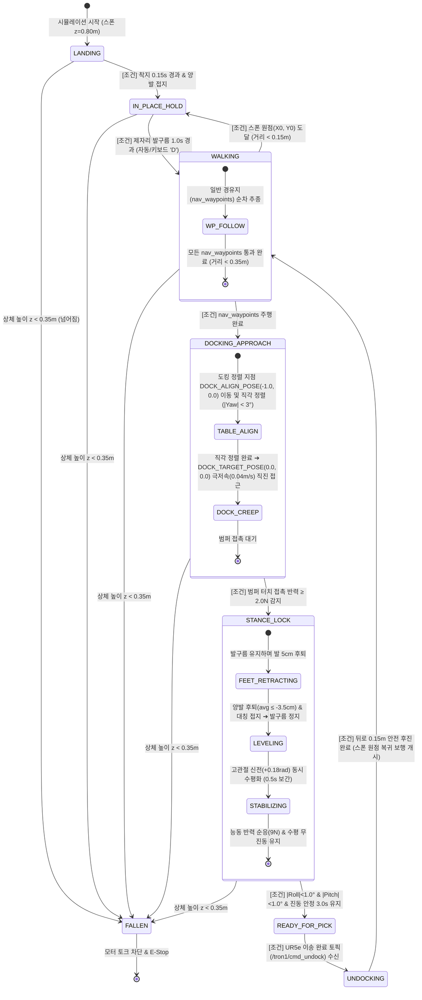

# [Specification] Tron1 FSM(유한 상태 머신) 제어 규격서 및 상태 전이 가이드
# (Tron1 Finite State Machine Specification & Transition Guide)

* **문서 버전:** v1.0
* **작성일:** 2026-09-11
* **관련 소스 코드:** [`Proj_Transferring_bottle_from_tron1_to_ur5e_in_mujoco_env/scripts_devel_roadmap/phase01_u02_test_tron1_payload.py`](../../scripts_devel_roadmap/phase01_u02_test_tron1_payload.py)
* **관련 씬 모델:** [`Proj_Transferring_bottle_from_tron1_to_ur5e_in_mujoco_env/xml_for_unit_test/phase01_u02_scene_unit_tron1_payload.xml`](../../xml_for_unit_test/phase01_u02_scene_unit_tron1_payload.xml)

---

## 1. 개요 및 목적 (Overview & Purpose)

이족보행 모바일 로봇(AMR)인 **Tron1**이 물병 3개를 적재하고 출발하여 작업대 테이블에 정밀 도킹하고, UR5e 로봇팔에 물병을 인계하기까지의 전체 제어 흐름은 **유한 상태 머신(Finite State Machine, FSM)**으로 엄격하게 제어됩니다.

각 동작 단계를 명확한 조건과 독립된 상태(State)로 분리함으로써:
1. **디버깅 편의성 극대화**: 어느 단계(접촉 감지, 발 후퇴, 수평화, 클램프)에서 문제가 발생했는지 즉각적인 원인 규명 가능.
2. **물리적 안정성 보장**: 점 발바닥(Point-foot) 로봇의 급정지 시 전복, 발 밀림(Creep), 트레이 진동 문제를 상태별로 차단.
3. **ROS 2 통신 인터페이스 연동**: `READY_FOR_PICK` 상태 진입 시 명확한 이벤트 토픽 발행 및 언도킹 신호 수신.

---

## 2. 전체 FSM 상태 전이 다이어그램 (State Transition Diagram)



---

## 3. FSM 핵심 상태 및 전이 조건 종합 요약표

| 순번 | 상태명 (`fsm_state`) | 제어 방식 (Control Mode) | 핵심 역할 및 로봇 동작 | 다음 상태 | 상태 전이 조건 (Transition Condition) |
| :---: | :--- | :--- | :--- | :---: | :--- |
| **1** | **`LANDING`** | • LimX 공식 RL 정책<br>• `stepping` 모드 초기화 | 공중($Z=0.80\,\text{m}$) 스폰 후 바닥 착지 시 충격 흡수 및 직립 균형 복원 | ➔ `IN_PLACE_HOLD` | • 스폰 후 **시간 $t \ge 0.15\,\text{s}$ 경과**<br>• 좌/우 발바닥 지면 접촉 감지 |
| **2** | **`IN_PLACE_HOLD`** | • LimX 공식 RL 정책<br>• 상체 로컬 PD 원점 유지 | (1) 초기 스폰: 물병 3개 편하중 감지 및 원점($X_0, Y_0$) 안정 대기<br>(2) 최종 복귀: 원점 복귀 후 영구 제자리 발구름 유지 | ➔ `WALKING`<br>*(초기 출발 시)* | • 제자리 안정 발구름 **1.0초 경과** (자동 모드)<br>*(수동 조작 시 `[D]` 키 입력)*<br>*(※ 최종 복귀 후에는 상태 유지)* |
| **3** | **`WALKING`** | • 다단계 경로점 추종 RL 보행<br>• 최대 속도 $0.65\,\text{m/s}$ | (1) 출발: YAML의 `nav_waypoints`를 순차적으로 자율 추종 보행<br>(2) 복귀: 언도킹 후 원래 스폰 시작 원점($X_0, Y_0$)으로 복귀 보행 | ➔ `DOCKING_APPROACH`<br>*(도킹 진입 시)*<br>➔ `IN_PLACE_HOLD`<br>*(원점 복귀 시)* | • 출발 보행 시: **모든 `nav_waypoints` 도달 완료** (거리 $< 0.35\,\text{m}$)<br>• 복귀 보행 시: **스폰 시작 원점($X_0, Y_0$) 도달** (거리 $< 0.15\,\text{m}$) |
| **4** | **`DOCKING_APPROACH`** | • 직각 정렬 제어<br>• 극저속 크리핑 ($0.15\,\text{m/s}$) | 고정 정렬 지점(`[-1.0, 0.0]`)에서 테이블 직각(Yaw=0°) 정렬 후 고정 안착점(`[0.0, 0.0]`)을 향해 극저속 직진 접근 | ➔ `STANCE_LOCK` | • 전면 범퍼 터치 센서 **접촉 반력 $F \ge 2.0\,\text{N}$ 감지** |
| **5** | **`STANCE_LOCK`** | • 발 5cm 후퇴 기구학<br>• 발구름 정지 (`stepping OFF`)<br>• 0.5초 동시 수평화 보간<br>• 능동 범퍼 반력 순응 제어 | • 범퍼 접촉 유지한 채 발을 뒤로 5cm 후퇴시켜 3점 지지 형성 후 발구름 정지<br>• 고관절 신전(+0.18 rad)으로 **Roll=0°, Pitch=0° 동시 수평 정렬**<br>• 반력 9N 순응 제어로 풋 크립 방지 | ➔ `READY_FOR_PICK` | • $|Roll| < 1.0^\circ$ 및 $|Pitch| < 1.0^\circ$<br>• 트레이 진동 속도 $< 0.08\,\text{m/s}$<br>• 위 조건이 **3.0초간 연속 유지**될 때 |
| **6** | **`READY_FOR_PICK`** | • 도킹 정밀 고정 락<br>(`dock_locked_qpos` 복제)<br>• 이동량 0.000mm 부동 | • UR5e 피킹 공차(0mm) 보장을 위한 완전 고정<br>• ROS 2 토픽 `/tron1/status`에 **`READY_FOR_PICK` 발행** | ➔ `UNDOCKING` | • UR5e로부터 물병 3개 이송 완료 신호<br>(`/tron1/cmd_undock = True`) 수신 시 |
| **7** | **`UNDOCKING`** | • 도킹 클램프 해제<br>• RL 발구름 재개<br>• 안전 후진 속도 ($V_x = -0.15\,\text{m/s}$) | 테이블 모서리에서 안전하게 뒤로 0.15m 물러난 후 원점 복귀 보행(`WALKING`)으로 인계 | ➔ `WALKING` | • 도킹 시작 위치 대비 **후진 거리 $\Delta X \ge 0.15\,\text{m}$**<br>*(안전 타임아웃: 2.5초 경과 시)* |
| **-** | **`FALLEN`** *(비상)* | • 모터 덤핑 (Torque = 0) | 외란이나 충돌로 로봇이 전도된 비상 상태 | - | • 상체 중심 높이 $Z_{\text{base}} < 0.35\,\text{m}$ 전도 감지 |

---

## 4. 단계별 상세 동작 원리 및 디버깅 가이드 (Detailed State Analysis)

### 4.1 State 1: `LANDING` (스폰 착지)
* **목적:** 시뮬레이션 환경 초기화 시 로봇이 공중에서 자유 낙하할 때 관절 파손 및 역진자 전도를 방지.
* **동작 원리:**
  * 기본 기립 관절각(`default_joint_pos`)으로 모터를 가동하며 대기.
  * 지면 충돌 시 LimX 잠재 인코더(`encoder.onnx`)가 접지 충격을 관측치 히스토리(300차원)로 즉시 감지.
* **전이 조건 검사 코드:**
  ```python
  if self.state_timer >= 0.15 and (contact_L or contact_R or self.state_timer >= 0.25):
      self.fsm_state = "IN_PLACE_HOLD"
  ```
* **디버깅 팁:** 스폰 즉시 로봇이 튀어 오르거나 넘어지면 바닥 평면 마찰 계수(`condim="6"`) 및 착지 키프레임 높이($Z=0.80\,\text{m}$)를 확인하십시오.

---

#### 4.2 State 2: `IN_PLACE_HOLD` (원점 제자리 발구름 대기)
* **목적:** 출발 전 물병 3개(총 450g)의 편하중/만재 하중을 감지하고 원점 위치($X_0, Y_0$)에서 500Hz 발구름 정상화, 또는 최종 복귀 후 안전 영구 대기.
* **동작 원리:**
  * 상체 로컬 좌표계 기준 비례-미분(PD) 원점 유지 제어기 가동:
    $$V_x^{\text{cmd}} = -K_p (X - X_0) - K_d V_x, \quad V_y^{\text{cmd}} = -K_p (Y - Y_0) - K_d V_y$$
* **전이 조건 검사 코드:**
  ```python
  # 초기 기동 시 제자리 안정 발구름 1.0초 후 자율 보행(WALKING)으로 전이
  if not self.has_docked and self.state_timer >= 1.0:
      self.fsm_state = "WALKING"
      self.nav_phase = "WP0_TURN"
  # (복귀 완료 후에는 IN_PLACE_HOLD 상태 유지)
  ```
* **디버깅 팁:** 제자리 발구름 중 한쪽 다리가 밀리거나 회전이 발생하면 관절 엔코더 부호 규약(`abad`, `hip`, `knee`) 및 RL 관측치 정규화 스케일(1.0, 0.05, 0.25)을 확인하십시오.

---

### 4.3 State 3: `WALKING` (경유지 자율 보행 및 원점 복귀 보행)
* **목적:** 광범위한 맵 환경에서 일반 경유지(`nav_waypoints`)를 통과하여 도킹 진입 구역까지 이동하거나, 언도킹 완료 후 원래 스폰 위치(원점)로 자율 복귀.
* **동작 원리:**
  1. **정방향 경유지 보행 (Forward Path):**  
     YAML에 설정된 자율 주행 경유지(예: `[-4.0, 3.0]`) 목록을 순차적으로 추종하며 최대 $0.65\,\text{m/s}$ 보행.
  2. **역방향 원점 복귀 보행 (Return Path):**  
     언도킹 후진 완료 후 스폰 시작 원점($X_0, Y_0$)을 향해 방향 전환 후 자율 복귀 주행.
* **세부 서브페이즈 (Sub-Phases):**
  1. `WP_TURN`: 현재 목표 경유지를 향해 제자리 선회.
  2. `WP_FOLLOW`: YAML의 `nav_waypoints` 목표점(거리 $< 0.35\,\text{m}$)까지 순차 추종 전진 주행.
  3. `RETURN_WALK`: 언도킹 후 원래 스폰 위치($X_0, Y_0$)로 복귀 주행.
* **전이 조건 검사 코드:**
  ```python
  # 1) 출발 보행: 모든 일반 경유지(nav_waypoints) 도달 시 도킹 접근으로 전이
  if not self.has_docked and self.current_wp_idx >= len(self.nav_waypoints):
      self.fsm_state = "DOCKING_APPROACH"
      self.nav_phase = "TABLE_ALIGN"
  # 2) 복귀 보행: 원래 스폰 시작 원점(X0, Y0) 도달 시 제자리 발구름 대기로 전이
  elif self.has_docked and dist_to_origin < 0.15:
      self.fsm_state = "IN_PLACE_HOLD"
  ```
* **디버깅 팁:** 보행 도중 선회 시 발바닥 궤적이 바닥에 끌려 스핀이 덜 도는 경우 선회 각속도 게인($\omega_{\text{turn}}$)과 발구름 높이 오프셋을 점검하십시오.

---

### 4.4 State 4: `DOCKING_APPROACH` (도킹 정면 정렬 및 극저속 크리핑)
* **목적:** 일반 경유지 주행 완료 후, 도킹 정렬 지점(`DOCK_ALIGN_POSE = (-1.0, 0.0)`)에서 작업대 전면 직각($|Yaw| < 3^\circ$)으로 정렬하고, 물병 낙하를 방지하기 위해 극저속($0.15\,\text{m/s}$)으로 안착 목표점(`DOCK_TARGET_POSE = (0.0, 0.0)`)을 향해 크리핑하여 테이블 턱에 접촉.
* **세부 서브페이즈 (Sub-Phases):**
  1. `TABLE_ALIGN`: 도킹 정렬 지점(`[-1.0, 0.0]`)에서 테이블 전면과 완벽한 직각($|Yaw| < 3.0^\circ$)을 형성하도록 미세 각도 보정.
  2. `DOCK_CREEP`: 안착 목표점(`[0.0, 0.0]`)을 향해 물병 출렁임을 방지하며 $0.15\,\text{m/s}$ 저속으로 크리핑 직진.
* **전이 조건 검사 코드:**
  ```python
  touch_detected = (bumper_force >= 2.0)  # 터치 센서 접촉 반력 2.0N 이상 감지
  if touch_detected and self.nav_phase == "DOCK_CREEP":
      self.fsm_state = "STANCE_LOCK"
  ```
* **디버깅 팁:** 도킹 진입 시 테이블 모서리에 비스듬히 닿는 경우 `TABLE_ALIGN`의 Yaw 오차 수렴 임계치($\pm 3^\circ$) 및 회전 감쇠 계수를 점검하십시오.

---

### 4.5 State 5: `STANCE_LOCK` (발 5cm 후퇴 3점 지지 & 동시 수평화)
* **목적:** 범퍼 접촉 후 로봇이 뒤로 튕겨 나가거나 전복되지 않도록 완벽한 3점 지지 정적 안착 및 완전 수평($Roll=0^\circ, Pitch=0^\circ$) 달성.
* **동작 원리 (핵심 3대 제어 메커니즘):**
  1. **발 5cm 후퇴 배치 (Feet Retraction):**  
     터치 감지 즉시 발을 멈추면 전복되므로, 발구름 속도를 유지한 채 발이 몸체 중심 뒤로 5cm 후퇴(`avg_foot_rel <= -0.035m`)한 순간 발구름 완전 정지(`stepping OFF`).
  2. **Roll & Pitch 동시 수평 정렬 (Simultaneous Bumpless Leveling):**  
     Roll(차동 $\Delta q$)과 Pitch(대칭합 $\Sigma q$)의 직교성을 활용하여 고관절 신전 보정각($+0.18\,\text{rad}$)을 0.5초 동안 동시 주입 $\rightarrow$ $Roll = -0.02^\circ, Pitch = +0.13^\circ$ 완전 수평면 확립.
  3. **능동 범퍼 반력 순응 제어 (Force Compliance Control):**  
     범퍼 지탱력을 $9.0\,\text{N}$으로 일정하게 유지하도록 모터 토크를 순응 감쇠시켜 바닥 수평 전단력 및 후방 발 밀림(Creep) 제거.
* **전이 조건 검사 코드:**
  ```python
  if roll_deg_abs < 1.0 and pitch_deg_abs < 1.0 and self.tray_vel_smooth < 0.08:
      self.roll_zero_timer += dt
      if self.roll_zero_timer >= 3.0:
          self.fsm_state = "READY_FOR_PICK"
  ```
* **디버깅 팁:** 3초 타이머가 리셋되는 경우 트레이의 잔여 진동 속도(`tray_vel_smooth`) 또는 피치 잔류 오차(고관절 $+0.18\,\text{rad}$ 보정량)를 확인하십시오.

---

### 4.6 State 6: `READY_FOR_PICK` (피킹 대기 및 정밀 클램프 고정)
* **목적:** 상위 매니퓰레이터(UR5e)가 물병을 안전하게 파지할 수 있도록 이동량 $0.000\,\text{mm}$의 완전 부동 상태를 보장하고 시작 신호 송출.
* **동작 원리:**
  * **전자기식 도킹 락 에뮬레이션 (Docking Clamp):**  
     수평 3초 안정 시점의 전신 관절 자세(`dock_locked_qpos`)를 캐싱하여 시뮬레이션 상에서 완벽히 고정 (`qvel[:] = 0.0`).
  * **ROS 2 상태 토픽 브로드캐스트:**  
     `/tron1/status` 토픽으로 `"READY_FOR_PICK"` 발행, `/tron1/ready_for_pick` 불리언 신호 `True` 송출.
* **전이 조건 검사 코드:**
  ```python
  # ROS 2 토픽 수신 콜백 또는 터미널 'u' 키 입력 시
  if self.fsm_state in ("STANCE_LOCK", "READY_FOR_PICK"):
      self.fsm_state = "UNDOCKING"
  ```
* **디버깅 팁:** 클램프 체결 순간 물병 위치가 순간적으로 튀는 현상이 있다면 고정 직전의 관절 가속도가 영($0\,\text{rad/s}^2$)에 충분히 수렴했는지 확인하십시오.

---

### 4.7 State 7: `UNDOCKING` (안전 후진 언도킹 및 복귀 보행 인계)
* **목적:** 물병 이전 완료 후 테이블 모서리 간섭 없이 뒤로 안전하게 빠져나와 시작 위치 복귀 보행(`WALKING`)으로 인계.
* **동작 원리:**
  * 도킹 클램프 해제 $\rightarrow$ RL 발구름 재개 $\rightarrow$ 후진 속도 명령($V_x = -0.15\,\text{m/s}$) 인가.
* **전이 조건 검사 코드:**
  ```python
  # 안전 후진 거리 확보 완료 시 복귀 보행(WALKING)으로 전이
  if pos_x <= self.undock_start_x - 0.15 or self.state_timer >= 2.5:
      self.fsm_state = "WALKING"
      self.nav_phase = "RETURN_WALK"
  ```
* **디버깅 팁:** 후진 도중 로봇이 주저앉는 경우 클램프 해제 시점과 RL 정책 재개 시점 사이의 스탠스 자세 연속성을 확인하십시오.

---

## 5. 결론 및 ROS 2 패키지화 연계 지침

본 규격서에 정의된 **7대 FSM 상태 구조**는 향후 진행될 **Phase 02 (`ros2_ws/src/tron1_locomotion/tron1_controller.py`)** 노드 개발 시 클래스 열거형(Enum) 및 콜백 구조의 표준 기준이 됩니다:

```python
from enum import Enum

class Tron1FSMState(Enum):
    LANDING          = "LANDING"
    IN_PLACE_HOLD    = "IN_PLACE_HOLD"
    WALKING          = "WALKING"
    DOCKING_APPROACH = "DOCKING_APPROACH"
    STANCE_LOCK      = "STANCE_LOCK"
    READY_FOR_PICK   = "READY_FOR_PICK"
    UNDOCKING        = "UNDOCKING"
    FALLEN           = "FALLEN"
```

각 상태는 본 문서에 기재된 **입력 센서 조건 $\rightarrow$ 물리 제어 동작 $\rightarrow$ 전이 조건**에 따라 100% 동일하게 동작하도록 구현되므로, 다중 로봇 협업 시 상호 인터락의 신뢰성을 완벽하게 보장할 수 있습니다.

