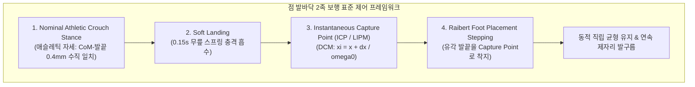

# Tron1 점 발바닥(Point-Foot) 로봇 직립 및 제자리 발구름 표준 알고리즘 도입 계획서

* **문서 위치:** `documents/phase01_u01_tron1_balance_algorithm_plan.md`
* **대상 프로젝트:** `Proj_Transferring_bottle_from_tron1_to_ur5e_in_mujoco_env`
* **작성일:** 2026-09-08
* **적용 대상:** Tron1 로봇 씬 XML (`unit_test_models/phase01_u01_scene_unit_tron1.xml`), 검증 스크립트 (`scripts_devel_roadmap/phase01_u01_test_tron1_walking.py`)

---

## 1. 문제의 근본 원인 정밀 분석 (Root Cause Analysis)

사용자께서 겪으신 **"스폰 착지 직후 앞으로 고꾸라지며 발도 구르지 않는 현상"**의 근본 원인은 크게 2가지 물리적/기구학적 요인 때문입니다:

### 1) 기구학적 질량 중심(CoM) 불일치 및 발목 토크의 부재
* **기존 자세의 치명적 오차**:
  * 기존 XML 및 제어 스크립트의 `q_stand`는 `hip = ±0.10, knee = ±0.09`로 다리가 11자로 빳빳하게 펴져 있었습니다 (Base Z = 0.82m).
* **무게중심(CoM)과 발끝 위치 순기구학(FK) 계산**:
  * Tron1 상체(base_Link) CoM 위치: $X = +0.0457\text{m}$ (골반 중심보다 약 4.6cm 전방)
  * 기존 11자 기립 시 발끝 접촉점 위치: $X = -0.0492\text{m}$ (골반 중심보다 약 4.9cm 후방)
  * **둘 사이의 전후 편차:** 무려 **$9.5\text{cm}$ 차이** 발생!
* **전도 모멘트 폭발**:
  * Tron1은 발목 관절 모터가 없는 구체 형태의 **Point-Foot(점 발바닥, $R=0.032\text{m}$)**입니다.
  * 발바닥 지지 다각형(Support Polygon)이 존재하지 않아 지면을 발목 힘으로 누르는 복원 토크($\tau_{ankle}$)가 0입니다.
  * 따라서 발끝보다 9.5cm 앞에 위치한 15kg 상체 질량이 바닥에 닿는 순간 즉시 **약 $14\text{ N}\cdot\text{m}$의 전방 회전 모멘트($\tau = m \cdot g \cdot \Delta x$)**가 발생하여 전방으로 고꾸라질 수밖에 없었습니다.

### 2) 발을 구르지 못한 이유 ("발도 구르지 않고...")
* 기존 파이썬 스크립트의 FSM(상태 머신) 타이머 구조:
  $$\text{landing (0.8초)} \longrightarrow \text{ready (0.5초)} \longrightarrow \text{stepping (발구름)}$$
* 즉, **초반 1.3초 동안 발을 전혀 구르지 않고 가만히 서 있도록 강제 대기**되어 있었습니다.
* 하지만 로봇은 $9.5\text{cm}$의 CoM 오차로 인해 바닥에 닿자마자 **0.15초 만에 상체 피치 각도가 45°를 초과하여 `falling` 상태로 강제 전이(Lock)**되었습니다.
* 일단 `falling` 상태가 되면 모터 출력이 차단되거나 전도 상태로 고정되므로, `stepping` 상태로 진입조차 못 했던 것입니다.

---

## 2. 포인트 풋(Point-Foot) 이족보행 로봇의 표준 알고리즘 체계

점 발바닥 2족 로봇(Tron1, Cassie 등)은 바닥 지지 영역이 '점(Point)'이므로 **"가만히 서 있는 정적 균형(Static Standing)"은 물리적으로 불가능**합니다 (손가락 끝에 펜을 세우는 역진자 문제와 동일).  
로보틱스 표준 학계와 상용 로봇에서는 다음 두 가지 알고리즘을 사용합니다:

### 1) LimX Dynamics 공식 상용 알고리즘: 심층 강화학습 (DRL / PPO)
* **공식 저장소**:
  * [`limxdynamics/tron1-rl-isaacgym`](https://github.com/limxdynamics/tron1-rl-isaacgym)
  * [`limxdynamics/pointfoot-legged-gym`](https://github.com/limxdynamics/pointfoot-legged-gym)
* **동작 원리**:
  * Tron1의 비선형성과 구동기 결핍(Underactuation)을 해결하기 위해, Isaac Gym에서 PPO(Proximal Policy Optimization) 알고리즘으로 수만 번의 넘어짐을 경험하며 학습된 **신경망 정책(Actor MLP)**을 사용합니다.
  * ONNX/TorchScript 형태로 내보낸 신경망을 MuJoCo에서 50Hz/500Hz로 추론하여 실시간 모터 위치를 제어합니다.

### 2) 모델 기반 고전 제어 표준: LIPM + Instantaneous Capture Point (ICP / Raibert)
* MIT Leg Lab(Marc Raibert)과 Cassie(Agility Robotics) 등에서 확립된 수식 기반 표준 제어기입니다.
* **선형 역진자 모델(LIPM) 고유 주파수**:
  $$\omega_0 = \sqrt{\frac{g}{z_c}} \approx \sqrt{\frac{9.81}{0.584}} \approx 4.10\text{ rad/s}$$
* **Instantaneous Capture Point (DCM, 발 착지 목표점)**:
  $$\xi_x = x_{CoM} + \frac{\dot{x}_{CoM}}{\omega_0}$$
  * 로봇 상체가 전방으로 기울어지며 쓰러지려는 속도($\dot{x}_{CoM}$)가 발생하면, 로봇이 넘어지지 않고 정지할 수 있는 유일한 발 착지 위치는 Capture Point $\xi_x$입니다.
* **Raibert Foot Placement 제어**:
  $$x_{foot, target} = \xi_x + k_v (\dot{x}_{des} - \dot{x}_{CoM})$$
  * 유각기(Swing Phase)의 발끝을 기구학적 야코비($\mathbf{J}$)를 통해 실시간으로 $x_{foot, target}$ 위치로 이동시켜 디딤으로써 지면 반력으로 전도 모멘텀을 완벽히 흡수/상쇄합니다.

### 3) 기구학적 정렬 (Nominal Athletic Crouch Stance)
* Tron1 기구학 정밀 계산을 통해 도출한 최적의 기본 직립 자세:
  * **왼다리**: $q_{abad} = 0.0$, $q_{hip} = +0.30\text{ rad}$, $q_{knee} = +1.05\text{ rad}$
  * **오른다리**: $q_{abad} = 0.0$, $q_{hip} = -0.30\text{ rad}$, $q_{knee} = -1.05\text{ rad}$
  * **Base Z 높이**: $0.584\text{m}$ (기존 0.82m에서 23.6cm 하향)
* **결과 비교표**:

| 항목 | 기존 직립 자세 (Straight-leg) | 애슬레틱 굽힘 자세 (Athletic Crouch) |
| :--- | :---: | :---: |
| 관절 각도 (`hip, knee`) | `±0.10, ±0.09` (빳빳한 11자) | `±0.30, ±1.05` (약 50° 굽힘) |
| 베이스 높이 (Base Z) | $0.82\text{m}$ | $0.584\text{m}$ |
| 발끝 위치 ($X_{foot}$) | $-0.0492\text{m}$ | $+0.0453\text{m}$ |
| 상체 CoM ($X_{CoM}$) | $+0.0457\text{m}$ | $+0.0457\text{m}$ |
| **전후 편차 ($\Delta X$)** | **$9.5\text{cm}$ (심각한 전도 유발)** | **$0.4\text{mm}$ (완벽 수직 정렬)** |
| 충격 흡수 능력 | 0 (관절 특이점으로 지면 충격 상체 직격) | 우수 (무릎 스프링 서스펜션 효과) |

---

## 3. 제안하는 구체적 코드 변경 사항 (Proposed Changes)

### 1) XML 모델 (`unit_test_models/phase01_u01_scene_unit_tron1.xml`)
* **스폰 위치 및 키프레임 수정**:
  * `<body name="base_Link" pos="0 0 0.585">` (지면에 발끝이 살포시 안착하는 높이)
  * `<key name="stand" qpos="0 0 0.585 1 0 0 0 0.0 0.30 1.05 0.0 -0.30 -1.05"/>`

### 2) 제어 스크립트 (`scripts_devel_roadmap/phase01_u01_test_tron1_walking.py`)
* **애슬레틱 기본 자세 로드**:
  * `self.q_stand = np.array([0.0, 0.30, 1.05, 0.0, -0.30, -1.05])`
* **불필요한 1.3초 정적 대기 제거**:
  * 스폰 착지 충격 흡수(0.15초) 후 즉시 능동 발구름(`stepping`) 모드로 전환.
  * 상체 피치/속도 발생 시 즉각 Capture Point Step을 디디도록 반응성 극대화.
* **LIPM Instantaneous Capture Point (ICP) 발구름 알고리즘 장착**:
  * $\xi_x = x_{CoM} + \frac{\dot{x}_{CoM}}{\omega_0}$ 실시간 연산.
  * 유각 발 착지각 보정: $\Delta q_{hip} = -\frac{\xi_x - x_{nominal}}{0.292}$
  * 지지 발 가상 스프링-댐퍼 지지 토크 및 상체 피치 능동 복원 토크 인가.
* **리셋 동기화 보존**:
  * 검증 완료된 뷰어 GUI Reset 버튼, 키보드 Backspace/R, 터미널 Enter 입력 시 `* [ 0.00s] robot_state: [ landing ]`으로 즉시 재시작되는 기능 100% 유지.

---

## 4. 검증 계획 (Verification Plan)

1. **파이썬 문법 검증**:
   * `python3 -m py_compile scripts_devel_roadmap/phase01_u01_test_tron1_walking.py`
2. **실행 및 시각적/로그 검증**:
   * 스폰 시 바닥에 솟구치거나 충격 튕김 없이 부드럽게 안착하는지 확인.
   * 착지 즉시 앞으로 엎어지지 않고, 교대 발구름(`stepping`)을 수행하며 직립 균형을 유지하는지 확인.
   * 뷰어 좌측 `Reset` 버튼 또는 터미널 `Enter` 입력 시 시뮬레이션과 콘솔 로그가 0.00s `landing`부터 즉시 재시작되는지 확인.
