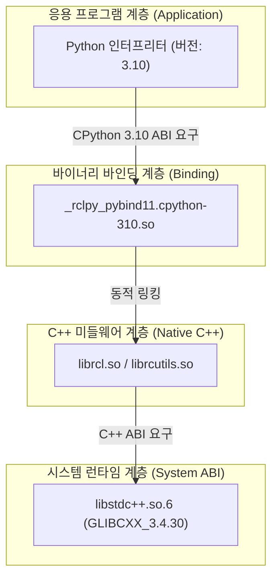

# [Study] 왜 ROS 2 Humble 프로젝트에서 Python 3.10을 사용해야 하는가?
# (Why Python 3.10 is Mandatory for ROS 2 Humble & CPython ABI Deep Dive)

* **문서 버전:** v1.0
* **작성일:** 2026-09-04
* **프로젝트:** `Proj_Transferring_bottle_from_tron1_to_ur5e_in_mujoco_env`
* **주제:** ROS 2 Humble 환경에서 Python 3.10 선택의 필연성, CPython C-API / ABI 호환성 메커니즘, 그리고 C++ 런타임(`GLIBCXX`)과의 독립적 관계 분석

---

## 1. 핵심 질문 및 흔한 오해

> **"Python 3.11이나 3.12 같은 최신 버전을 쓰면, 컴파일러도 더 최신화되어 `GLIBCXX` 버전 충돌도 안 나고 속도도 더 빠르지 않을까요?"**

로보틱스와 인공지능을 처음 접하는 많은 엔지니어들이 이와 같은 자연스러운 의문을 갖습니다.  
결론부터 말하자면, **ROS 2 Humble 환경에서는 사용자가 원하더라도 Python 3.10 외의 버전을 사용할 수 없습니다.**  
만약 가상환경을 Python 3.11이나 3.12로 생성하고 ROS 2를 사용하려고 하면, C++ 라이브러리 충돌을 겪기도 전에 **파이썬 모듈 로딩 단계에서 즉시 실행이 거부**됩니다.

이 문서에서는 왜 반드시 Python 3.10이어야만 하는지, 그 이면에 있는 **운영체제 설계, CPython 내부 아키텍처, 그리고 ABI(Application Binary Interface)**의 원리를 깊이 있게 학습합니다.

---

## 2. 결정적 이유 1: CPython ABI와 C-확장 모듈 (`cpython-310-*.so`)

### 2.1. 순수 파이썬(Pure Python) vs C-확장 모듈(C-Extension)
* **순수 파이썬 모듈 (`*.py`):**  
  텍스트 형태의 파이썬 코드로, 문법적인 하위 호환성만 유지된다면 Python 3.10에서 작성한 코드가 3.11, 3.12에서도 인터프리터에 의해 그대로 실행됩니다.
* **C-확장 모듈 (`*.so`):**  
  성능이 중요한 핵심 연산(로봇 통신, 물리 엔진, 이미지 처리)을 C/C++로 작성한 뒤 파이썬에서 불러쓸 수 있도록 **기계어 바이너리로 미리 컴파일한 공유 라이브러리**입니다. ROS 2의 핵심 클라이언트 라이브러리인 `rclpy`가 대표적인 C-확장 모듈입니다.

### 2.2. 바이너리 파일 이름에 숨겨진 비밀: `cpython-310`
우분투 시스템에 설치된 `rclpy`의 실제 모듈 파일을 터미널에서 찾아보면 다음과 같은 이름으로 되어 있습니다:

```text
/opt/ros/humble/lib/python3.10/site-packages/_rclpy_pybind11.cpython-310-x86_64-linux-gnu.so
                                                          ^^^^^^^^^^^
```

파일 이름 한가운데에 **`cpython-310`**이라는 태그가 명시되어 있습니다. 이것을 **PEP 3149 (ABI Version Tagging)**라고 부릅니다.

### 2.3. CPython ABI는 마이너 버전 간 호환되지 않는다
* CPython 인터프리터는 버전이 올라갈 때(예: `3.10` $\rightarrow$ `3.11`) 내부 C 구조체(`PyObject`, `PyTypeObject`)의 메모리 레이아웃, 필드 오프셋, 메모리 할당자 메커니즘을 과감하게 개선합니다.
* 따라서 `3.10`용 CPython 헤더 파일(`Python.h`)을 보고 컴파일된 기계어 코드는 `3.11` 인터프리터의 메모리 구조와 **단 1바이트의 오차도 허용하지 않는 바이너리 불일치(ABI Incompatibility)**를 일으킵니다.
* 만약 Python 3.11 인터프리터에서 `import rclpy`를 시도하면:
  1. Python 3.11 인터프리터는 자기 버전에 맞는 `_rclpy_pybind11.cpython-311-*.so` 파일을 찾습니다.
  2. 시스템(`/opt/ros/humble`)에는 `cpython-310` 파일밖에 없으므로 찾지 못합니다.
  3. 결과: `ModuleNotFoundError: No module named '_rclpy_pybind11'` 에러가 발생하며 즉시 중단됩니다.

---

## 3. 결정적 이유 2: Ubuntu 22.04 LTS와 ROS 2 Humble의 Tier 1 결합

ROS(Robot Operating System)의 공식 릴리즈는 Ubuntu의 LTS(Long Term Support) 릴리즈와 1:1로 강력하게 바인딩되어 있습니다:

| ROS 2 배포판 | 기본 대상 OS | 시스템 기본 Python 버전 | 지원 상태 |
| :--- | :--- | :--- | :--- |
| ROS 2 Foxy | Ubuntu 20.04 LTS | Python 3.8 | EOL (지원 종료) |
| ROS 2 Galactic | Ubuntu 20.04 LTS | Python 3.8 | EOL (지원 종료) |
| **ROS 2 Humble (현재)** | **Ubuntu 22.04 LTS** | **Python 3.10.x** | **Tier 1 (LTS 공식 표준)** |
| ROS 2 Iron | Ubuntu 22.04 LTS | Python 3.10.x | EOL |
| ROS 2 Jazzy | Ubuntu 24.04 LTS | Python 3.12.x | Tier 1 (최신 LTS) |

### 3.1. `apt` 패키지의 실체
우리가 `sudo apt install ros-humble-desktop`이나 `ros-humble-moveit`으로 다운로드받는 수백 개의 패키지는 Open Robotics 빌드 팜(Build Farm)에서 **Ubuntu 22.04의 기본 컴파일러(GCC 11.4)와 기본 파이썬(Python 3.10)을 기준으로 미리 빌드된 바이너리**입니다.

### 3.2. 다른 파이썬 버전을 쓰려면 치러야 하는 대가
만약 Conda에서 Python 3.11이나 3.12를 쓰면서 ROS 2 Humble을 구동하고 싶다면:
* `apt install`로 제공되는 모든 ROS 2 바이너리를 사용할 수 없습니다.
* ROS 2 미들웨어의 기반이 되는 수억 줄의 C/C++ 소스코드(rcl, rmw, fastdds, rclpy, tf2, moveit 등) 전체를 다운받아 **Python 3.11 헤더를 지정하고 직접 빌드(From Source Build)**해야 합니다.
* 빌드 시간만 수 시간이 소요될 뿐만 아니라, 이후 다른 라이브러리와의 연쇄 의존성 지옥에 빠지게 됩니다.

---

## 4. 결정적 이유 3: Python 버전과 C++ ABI(`GLIBCXX`)의 독립성

질문자께서 추론하셨던 중요한 포인트:
> *"Python 3.11이나 3.12를 쓰면 컴파일러나 GLIBCXX 버전도 더 최신이지 않을까?"*

이 부분에서 꼭 이해해야 하는 개념은 **"Python 버전과 C++ 컴파일러 런타임(libstdc++)은 서로 완전히 독립된 계층"**이라는 사실입니다.



1. **Python 버전이 결정하는 것:**  
   파이썬 문법, 표준 라이브러리, 그리고 `cpython-3XX` ABI 규격.
2. **C++ ABI(`GLIBCXX`)가 결정하는 것:**  
   C++ 코드가 기계어로 컴파일될 때 사용한 GCC 컴파일러의 C++ 표준 라이브러리 심볼 버전.

### 왜 Conda의 Python 3.10에 구버전 `GLIBCXX_3.4.26`이 있었을까?
* 그것은 Python 3.10이라서가 아닙니다!
* Conda 환경을 만들 때 기본 저장소(Channel) 설정에 따라 오래전에 빌드된 패키지 메타데이터가 끌려와서 GCC 9 시절의 C++ 런타임(`libstdc++.so.6`)이 가상환경 폴더에 복사되었기 때문입니다.
* **해결의 열쇠:**  
  파이썬 버전을 바꿀 필요가 전혀 없습니다.  
  Python 버전은 **ROS 2가 요구하는 `3.10`으로 철저히 유지**하면서, C++ 런타임만 **`conda install -c conda-forge libstdcxx-ng -y`**를 통해 최신 GCC 런타임(`GLIBCXX_3.4.30` 지원본)으로 교체해주면 됩니다!

---

## 5. 실습: 내 시스템의 CPython ABI 태그 직접 확인하기

터미널에서 파이썬 인터프리터가 요구하는 공식 확장자 태그를 직접 확인할 수 있습니다:

```bash
python -c "import sysconfig; print('현재 Python의 C-확장 모듈 확장자:', sysconfig.get_config_var('EXT_SUFFIX'))"
```

* **Python 3.10 환경에서의 출력:**
  ```text
  .cpython-310-x86_64-linux-gnu.so
  ```
* **Python 3.11 환경에서의 출력:**
  ```text
  .cpython-311-x86_64-linux-gnu.so
  ```

이처럼 인터프리터 수준에서 확장자 이름 자체를 분리해 두었기 때문에, 두 버전 간의 바이너리는 섞일 수 없습니다.

---

## 6. 요약 정리 (3줄 요약)

1. **CPython ABI 불일치:** ROS 2 Humble의 C-확장 바이너리는 `cpython-310` 전용으로 컴파일되어 있어, Python 3.11/3.12 인터프리터에서는 바이너리 구조가 달라 로드 자체가 불가능합니다.
2. **OS & 패키지 표준:** Ubuntu 22.04 LTS의 기본 파이썬이 3.10이며, `apt`로 제공되는 모든 ROS 2 바이너리가 Python 3.10 전용으로 배포되었습니다.
3. **독립적 해결:** C++ 런타임 심볼(`GLIBCXX`) 부족 문제는 파이썬 버전을 올리는 것이 아니라, **Python 3.10을 유지한 채 Conda의 `libstdcxx-ng` 런타임만 최신화**함으로써 가장 완벽하고 우아하게 해결할 수 있습니다.
