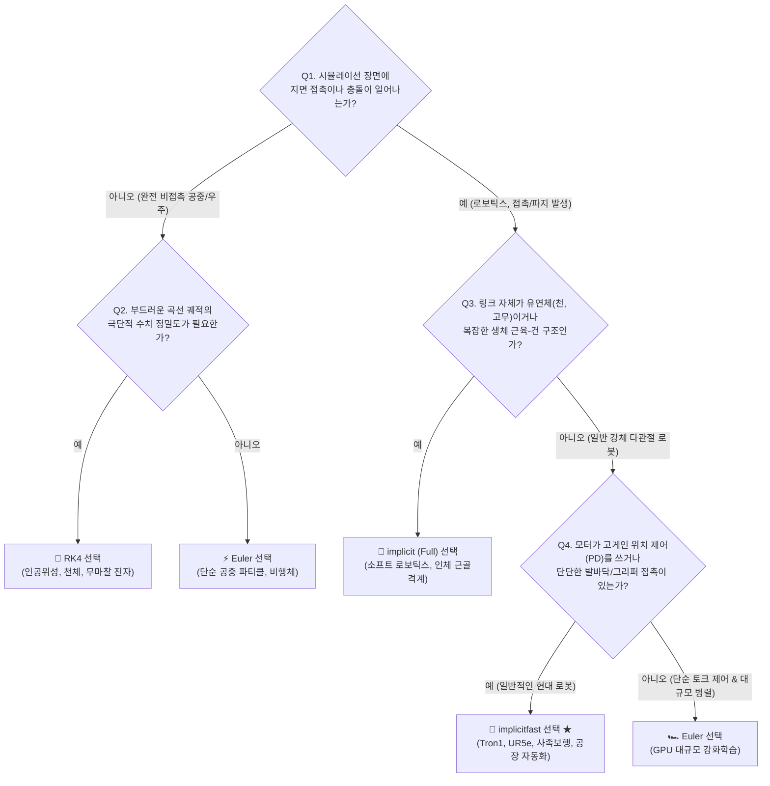

# [Study] MuJoCo 수치 적분기 원리와 implicitfast 심층 분석
# (Deep Dive: MuJoCo Numerical Integrators & Why implicitfast is Essential)

* **문서 버전:** v1.0
* **작성일:** 2026-09-04
* **프로젝트:** `Proj_Transferring_bottle_from_tron1_to_ur5e_in_mujoco_env`
* **주제:** 물리 시뮬레이션의 수치 적분(Numerical Integration) 원리, 양함수(Explicit) vs 음함수(Implicit) 해석 메커니즘, MuJoCo 4대 적분기(Euler, RK4, implicit, implicitfast) 비교 및 로봇 제어 안정성 분석

---

## 목차 (Table of Contents)

1. [물리 시뮬레이션에서 적분기(Integrator)의 본질적 역할](#1-물리-시뮬레이션에서-적분기integrator의-본질적-역할)
2. [양함수(Explicit) vs 음함수(Implicit) 수치 해석 메커니즘](#2-양함수explicit-vs-음함수implicit-수치-해석-메커니즘)
   * [2.1. 양함수 적분 (Explicit Euler): 미래를 보지 않는 직진](#21-양함수-적분-explicit-euler-미래를-보지-않는-직진)
   * [2.2. 음함수 적분 (Implicit Euler): 반작용을 미리 계산하는 완충](#22-음함수-적분-implicit-euler-반작용을-미리-계산하는-완충)
   * [2.3. 로봇 시뮬레이션의 강성(Stiffness) 문제와 수치 폭발](#23-로봇-시뮬레이션의-강성stiffness-문제와-수치-폭발)
3. [MuJoCo 4대 적분기 비교 및 아키텍처 특성](#3-mujoco-4대-적분기-비교-및-아키텍처-특성)
   * [3.1. Euler (Explicit Euler)](#31-euler-explicit-euler)
   * [3.2. RK4 (Runge-Kutta 4th Order)](#32-rk4-runge-kutta-4th-order)
   * [3.3. implicit (Full Implicit Euler)](#33-implicit-full-implicit-euler)
   * [3.4. implicitfast (Fast Implicit Euler)](#34-implicitfast-fast-implicit-euler)
   * [3.5. 4대 적분기 종합 비교 분석 표](#35-4대-적분기-종합-비교-분석-표)
   * [3.6. 적분기 선택을 위한 실무 의사결정 순서도 (Decision Tree)](#36-적분기-선택을-위한-실무-의사결정-순서도-decision-tree)
4. [DeepMind의 혁신: 왜 implicitfast인가?](#4-deepmind의-혁신-왜-implicitfast인가)
   * [4.1. 전수 미분(Full Derivatives)의 계산 병목 극복](#41-전수-미분full-derivatives의-계산-병목-극복)
   * [4.2. 관절 댐핑 및 액추에이터 PD 도함수 선별 완충 원리](#42-관절-댐핑-및-액추에이터-pd-도함수-선별-완충-원리)
5. [본 프로젝트(Tron1 + UR5e + 2F-85)에서의 실무적 적용 효과](#5-본-프로젝트tron1--ur5e--2f-85에서의-실무적-적용-효과)
   * [5.1. Tron1 이족보행 지면 충격 완충 및 발구름 안정화](#51-tron1-이족보행-지면-충격-완충-및-발구름-안정화)
   * [5.2. UR5e 매니퓰레이터의 고게인 위치 제어 안정화](#52-ur5e-매니퓰레이터의-고게인-위치-제어-안정화)
   * [5.3. Robotiq 2F-85 그리퍼의 단단한 파지 접촉 유지](#53-robotiq-2f-85-그리퍼의-단단한-파지-접촉-유지)
6. [요약 및 결론](#6-요약-및-결론)

---

## 1. 물리 시뮬레이션에서 적분기(Integrator)의 본질적 역할

로봇 물리 시뮬레이터(MuJoCo)는 매 타임스텝마다 뉴턴-오일러(Newton-Euler) 및 라그랑주(Lagrangian) 동역학 방정식을 계산합니다:

$$\mathbf{M}(\mathbf{q}) \ddot{\mathbf{q}} + \mathbf{c}(\mathbf{q}, \dot{\mathbf{q}}) = \boldsymbol{\tau} + \mathbf{J}^T \mathbf{f}_c$$

* $\mathbf{q}, \dot{\mathbf{q}}, \ddot{\mathbf{q}}$: 관절의 위치(각도), 속도, 가속도 벡터
* $\mathbf{M}(\mathbf{q})$: 다물체 관성 행렬 (Inertia Matrix)
* $\mathbf{c}(\mathbf{q}, \dot{\mathbf{q}})$: 코리올리 힘, 원심력 및 중력 벡터
* $\boldsymbol{\tau}$: 모터 액추에이터가 생성한 제어 토크
* $\mathbf{f}_c$: 지면 및 물체 간의 접촉 반발력/마찰력 (Contact Forces)

위 식을 풀면 현재 순간의 **가속도 $\ddot{\mathbf{q}} = \mathbf{a}$**를 완벽하게 얻을 수 있습니다.  
그러나 컴퓨터 그래픽 화면에 다음 프레임을 그리거나 제어기에 다음 상태를 전달하려면 가속도가 아니라 **속도($\mathbf{v} = \dot{\mathbf{q}}$)**와 **위치($\mathbf{x} = \mathbf{q}$)**가 필요합니다.

이때 **연속적인 미분방정식 세계를 작은 시간 간격($dt$)으로 이산화(Discretization)하여 가속도로부터 속도와 위치를 수치적으로 적분($\iint$)해내는 핵심 알고리즘**을 **수치 적분기(Numerical Integrator)**라고 합니다.

---

## 2. 양함수(Explicit) vs 음함수(Implicit) 수치 해석 메커니즘

수치 적분기는 미래의 상태를 계산할 때 **"어느 시점의 힘/가속도를 참조하느냐"**에 따라 양함수와 음함수로 양분됩니다.

### 2.1. 양함수 적분 (Explicit Euler): 미래를 보지 않는 직진
* **수식:**
  $$\mathbf{v}_{t+1} = \mathbf{v}_t + \mathbf{a}(t) \cdot dt$$
  $$\mathbf{q}_{t+1} = \mathbf{q}_t + \mathbf{v}_{t+1} \cdot dt$$
* **특징:**  
  현재 시점($t$)에서 계산된 힘과 가속도 $\mathbf{a}(t)$만 보고 미래 시점($t+1$)으로 상태를 그대로 밀어붙입니다.
* **장점:**  
  수식이 단순하여 매 스텝 연산 속도가 극도로 빠릅니다.
* **단점:**  
  현재 시점의 힘이 다음 순간에도 그대로 유지된다고 가정하므로, 급변하는 충돌이나 강한 스프링 힘을 만나면 에너지가 과도하게 주입되어 시스템이 튕겨 날아갑니다.

---

### 2.2. 음함수 적분 (Implicit Euler): 반작용을 미리 계산하는 완충
* **수식:**
  $$\mathbf{v}_{t+1} = \mathbf{v}_t + \mathbf{a}(t+1) \cdot dt$$
* **특징:**  
  미래 시점($t+1$)에 도착했을 때 작용하게 될 힘 $\mathbf{a}(t+1)$을 선반영하여 현재의 속도를 결정합니다.
* **수학적 전개 (테일러 전개):**  
  아직 가보지 않은 $\mathbf{a}(t+1)$을 구하기 위해 1차 테일러 전개(Taylor Expansion)를 적용합니다:
  $$\mathbf{a}(t+1) \approx \mathbf{a}(t) + \frac{\partial \mathbf{a}}{\partial \mathbf{q}} \Delta \mathbf{q} + \frac{\partial \mathbf{a}}{\partial \mathbf{v}} \Delta \mathbf{v}$$
  이를 정리하면 다음과 같은 대수적 연립방정식이 유도됩니다:
  $$\left( \mathbf{I} - dt \cdot \frac{\partial \mathbf{a}}{\partial \mathbf{v}} - dt^2 \cdot \frac{\partial \mathbf{a}}{\partial \mathbf{q}} \right) \Delta \mathbf{v} = \mathbf{a}(t) \cdot dt$$
* **핵심 원리:**  
  행렬의 역원 계산 과정에서 속도 변화율에 비례하는 저항 항($-dt \frac{\partial \mathbf{a}}{\partial \mathbf{v}}$)이 분모에 더해집니다. 이는 시스템에 **자연스러운 수치적 감쇠(Numerical Damping)**를 부여하여, 외부 충격이나 급격한 제어 입력이 들어와도 진동을 즉각 완충시킵니다.

---

### 2.3. 로봇 시뮬레이션의 강성(Stiffness) 문제와 수치 폭발

산업용 로봇이나 2족 보행 로봇은 정밀한 위치 추종을 위해 매우 높은 **비례 게인($K_p$)**을 사용합니다:
$$\tau = K_p (q_{\text{target}} - q) - K_d \dot{q}$$

* **강성(Stiffness) 폭발 시나리오 (Explicit Euler):**
  1. 목표 위치와 현재 위치의 오차가 아주 미세하게 발생합니다.
  2. 큰 $K_p$ 게인(예: $2000$)으로 인해 거대한 복원 토크 $\tau$가 발생합니다.
  3. 양함수 적분기는 이 거대한 가속도를 $dt$ 동안 그대로 적용하여 관절을 목표점 너머로 멀리 튕겨 보냅니다(Overshoot).
  4. 다음 스텝에서는 반대 방향으로 더 큰 오차가 발생하여 수 배의 역방향 토크가 걸립니다.
  5. 2~3스텝 만에 로봇 관절이 사시나무 떨듯 진동하다가 속도가 무한대로 발산(Numerical Explosion, NaN 발생)하며 화면 밖으로 날아갑니다.

이를 양함수(Euler)로 막으려면 타임스텝을 $dt = 0.0001\text{s}$ ($10,000\text{Hz}$) 수준으로 극단적으로 잘게 쪼개야 하므로 실시간 시뮬레이션이 불가능해집니다.

---

## 3. MuJoCo 4대 적분기 비교 및 아키텍처 특성

MuJoCo는 XML의 `<option integrator="...">` 설정을 통해 4가지 적분기를 제공합니다. 각 적분기는 지향하는 수학적 특성과 최적화된 산업/연구 도메인이 명확히 구분됩니다.

---

### 3.1. `Euler` (Explicit Euler: 1차 양함수 적분기)
가장 기본적인 1차 양함수 적분 방식으로, 현재 시점의 힘과 가속도만을 선형 투영하여 다음 상태를 계산합니다.

* **주요 적용 분야 및 실제 예시:**
  * **대규모 강화학습 병렬 시뮬레이션 (Massive Parallel RL):** MuJoCo XLA/MJX, Isaac Gym 등 GPU 상에서 수천~수만 개의 환경을 동시에 훈련할 때, 극단적인 처리량(Throughput, High FPS)이 보장되어야 하는 환경.
  * **단순 강체 동역학 및 아케이드 게임 물리:** 모터의 반발력이 크지 않고 복잡한 접촉 마찰이 배제된 환경 (예: 단순 당구공 충돌, 공 굴리기, 파티클 낙하 효과).
  * **토크 제어 기반 로봇 모델 (Direct Torque/Current Control):** 높은 위치 게인($K_p$) 없이 전류/토크를 직접 지령하여 기계적 강성(Stiffness)이 낮은 시스템.
* **언제 선택해야 하는가? (When to Use):**
  * 시뮬레이션의 물리적 정밀도보다 **"초당 연산 프레임 수(FPS)"**가 절대적으로 우선일 때.
  * 모터의 PD 게인이 매우 낮거나, 타임스텝을 극도로 잘게($dt \le 0.0005\text{s}$) 쪼갤 수 있는 고성능 컴퓨팅 자원이 확보되었을 때.
* **언제 피해야 하는가? (When NOT to Use):**
  * 높은 위치 비례 게인($K_p > 500$)을 사용하는 산업용 로봇팔(UR5e, KUKA 등).
  * 발바닥 충격량이 큰 2족/4족 보행 로봇. (수 스텝 만에 시스템 폭발 및 NaN 발생)

---

### 3.2. `RK4` (Runge-Kutta 4th Order: 4차 양함수 고정밀 적분기)
한 타임스텝($dt$)을 4개의 중간 지점으로 분할 샘플링하여 4차 다항식 가중 평균으로 곡선 궤적을 추정하는 고전 수학의 대표적인 고정밀 적분기입니다.

* **주요 적용 분야 및 실제 예시:**
  * **항공우주 및 궤도 동역학 (Aerospace & Astrodynamics):** 인공위성의 정밀 궤도 전파(Orbit Propagation), 우주 탐사선의 중력 도움(Gravity Assist) 비행 궤적 해석.
  * **비접촉 비선형 진동 및 카오스 이론 (Nonlinear Chaos Theory):** 이중 진자(Double Pendulum), 삼체 문제(Three-Body Problem), 자이로스코프(Gyroscope)의 세차 및 장동 운동.
  * **공중 무인 비행체 (UAV Aerodynamics):** 지면과의 접촉 없이 공기역학적 양력/항력만을 받으며 매끄러운 곡선 궤적으로 활공하는 고정익 드론 해석.
* **언제 선택해야 하는가? (When to Use):**
  * **"접촉과 충돌이 100% 배제된(Contact-free)"** 환경에서, 시간에 따른 위치/속도 궤적의 수치 오차를 최소화하고 에너지를 정밀하게 보존해야 할 때.
* **언제 피해야 하는가? (When NOT to Use):**
  * 바닥 접촉, 파지, 장애물 충돌 등 **불연속적인 충격량(Impulsive Force)이 발생하는 모든 로보틱스 환경.**
  * *이유:* 충돌 순간 힘이 수직 점프(Discontinuous)하므로, 4단계 중간 샘플링이 엉뚱한 기울기를 예측하여 오차 왜곡이 폭발적으로 증가하며, 연산 시간도 Euler 대비 4배 이상 느립니다.

---

### 3.3. `implicit` (Full Implicit Euler: 완전 음함수 적분기)
다물체 동역학의 모든 힘(코리올리 힘, 원심력, 관절 점성 마찰력, 중력 등)에 대해 위치 및 속도 편미분 행렬(자코비안)을 완벽하게 계산하여 음함수 연립방정식을 풉니다.

* **주요 적용 분야 및 실제 예시:**
  * **유연체 동역학 및 소프트 로보틱스 (Soft Robotics & Deformable Bodies):** 직물(Cloth), 고무 탄성체, 케이블/로프, 공압 인공 근육(Pneumatic Muscle) 시뮬레이션.
  * **인체 골격계 및 생체역학 (Biomechanics & Musculoskeletal Models):** 수십 개의 복합 근육-건(Muscle-Tendon)과 인대가 복잡한 비선형 탄성으로 연결된 정밀 인체 보행 분석 (OpenSim 연동 연구).
  * **극한의 비선형 외력이 작용하는 복합 다체 메커니즘:** 초고속 회전 원심기 내부의 다관절 기구, 복잡한 4절/6절 폐쇄 루프 링크 기구.
* **언제 선택해야 하는가? (When to Use):**
  * 모터 제어기뿐만 아니라 **로봇의 몸체 링크 자체에 복합적인 비선형 스프링, 댐퍼, 탄성 텐던이 깊게 결합**되어 있어 전수 미분을 통한 완벽한 물리적 완충이 불가피할 때.
* **언제 피해야 하는가? (When NOT to Use):**
  * 일반적인 강체(Rigid Body) 다관절 로봇에서 실시간($1.0\times$) 이상의 시뮬레이션 속도를 유지해야 할 때 (자유도가 늘어날수록 행렬 계산량 $\mathcal{O}(n^3)$ 폭증).

---

### 3.4. `implicitfast` (Fast Implicit Euler: 선별적 고속 음함수 적분기) ★ [본 프로젝트 표준]
구글 딥마인드 MuJoCo 2.3+에서 도입된 혁신적 적분기입니다. 수치 불안정을 일으키는 주범이 복잡한 코리올리 힘이 아니라 **"모터 액추에이터의 PD 게인"**과 **"관절 댐핑"**이라는 점에 착안하여, 필요한 도함수만을 추출해 고속 음함수 처리합니다.

* **주요 적용 분야 및 실제 예시:**
  * **산업용 로봇팔 및 정밀 조작 (Industrial Manipulation & Pick-and-Place):**  
    Universal Robots (UR3e/UR5e/UR10e), Franka Emika Panda, KUKA LBR iiwa 등 고게인 위치 서보와 평행 그리퍼(Robotiq 2F-85)를 활용한 물체 조작.
  * **이족 / 사족 보행 로봇 (Bipedal & Quadruped Locomotion):**  
    LimX Dynamics Tron1, Boston Dynamics Spot, Unitree Go2/Aliengo, ANYbotics ANYmal 등 발바닥이 지면을 고속으로 반복 타격하며 높은 관절 강성을 유지해야 하는 이동 로봇.
  * **모바일 매니퓰레이터 (Mobile Manipulation):**  
    보행 베이스의 거친 진동과 로봇팔의 정밀 모션이 상호 간섭하는 복합 다중 로봇 협업 시스템.
* **언제 선택해야 하는가? (When to Use):**
  * **현대 로보틱스 시뮬레이션의 95% 이상에서 무조건 1순위 기본값(Default Choice)!**
  * 관절 액추에이터가 단단한 PD 위치 제어기를 탑재하고 있으며, 지면 접촉 및 물체 파지가 빈번하게 발생하고, 실시간 이상의 고속 시뮬레이션 성능이 동시에 요구될 때.
* **언제 피해야 하는가? (When NOT to Use):**
  * 모터가 없는 천체 궤도 해석이나, 링크 자체가 고무처럼 변형되는 유연체 해석이 핵심일 때.

---

### 3.5. 4대 적분기 종합 비교 분석 표

| 적분기 (`integrator`) | 수치 해석 방식 | 상대 연산 속도 | 수치 안정성 (발산 방지) | 고게인 PD / 접촉 진동 억제 | 접촉 역학 적합성 | 대표 적용 분야 및 예시 | 최적 선택 시나리오 |
| :--- | :---: | :---: | :---: | :---: | :---: | :--- | :--- |
| **`Euler`** | 명시적 (양함수 1차) | **가장 빠름**<br>($1.0\times$) | 낮음 | 취약 (진동/폭발) | 보통 | 대규모 GPU 병렬 RL (MJX, Isaac Gym), 단순 당구공 물리 | 연산 속도(FPS)가 최우선이고 관절 게인이 낮을 때 |
| **`RK4`** | 명시적 (양함수 4차) | **가장 느림**<br>(약 $4.0\times$) | 중간 | 극히 취약 (오차 왜곡) | **부적합**<br>(비접촉 전용) | 인공위성 궤도 해석, 이중 진자 카오스 해석, 공중 활공 드론 | **접촉/충돌이 전혀 없고** 부드러운 곡선 궤적 정밀도가 생명일 때 |
| **`implicit`** | 완전 음함수 | 다소 느림<br>(약 $1.5 \sim 2.0\times$) | **최고** | **완벽** | 우수 | 소프트 로보틱스(천, 고무), 인체 근골격계 생체역학 모델 | 링크 자체가 유연체이거나 복합 비선형 스프링/건 구조일 때 |
| **`implicitfast`**<br>★ **(권장 표준)** | 선별적 고속 음함수 | **매우 빠름**<br>(약 $1.05\times$) | **최고** | **완벽**<br>(진동 100% 흡수) | **최상** | **Tron1 이족보행, UR5e 로봇팔, 2F-85 그리퍼, 모바일 매니퓰레이터** | **단단한 관절 모터와 잦은 접촉/파지가 공존하는 현대 로봇 공학** |

---

### 3.6. 적분기 선택을 위한 실무 의사결정 순서도 (Decision Tree)



---

## 4. DeepMind의 혁신: 왜 `implicitfast`인가?

### 4.1. 전수 미분(Full Derivatives)의 계산 병목 극복
전통적인 `implicit` 방식은 아래 식의 모든 편미분 항을 계산해야 합니다:
$$\frac{\partial \mathbf{a}}{\partial \mathbf{q}}, \quad \frac{\partial \mathbf{a}}{\partial \mathbf{v}}$$
로봇의 관절 수가 많아질수록 이 행렬 계산 비용은 자유도의 세제곱($\mathcal{O}(n^3)$)에 비례하여 급격히 증가합니다.

### 4.2. 관절 댐핑 및 액추에이터 PD 도함수 선별 완충 원리
딥마인드 연구진은 산업용 매니퓰레이터와 보행 로봇의 시뮬레이션 불안정성이 99% 이상 액추에이터 제어 루프에서 발생한다는 점을 발견했습니다.

MuJoCo 액추에이터의 일반적인 출력 식:
$$\tau_{\text{act}} = \text{gain} \cdot u + \text{bias}_0 + \text{bias}_1 \cdot q + \text{bias}_2 \cdot \dot{q}$$
이 식에서 속도와 위치에 대한 도함수는 아주 단순한 대각 성분(Diagonal element)으로 주어집니다:
$$\frac{\partial \tau_{\text{act}}}{\partial \dot{q}} = \text{bias}_2 = -K_d, \quad \frac{\partial \tau_{\text{act}}}{\partial q} = \text{bias}_1 = -K_p$$

`implicitfast`는 이 대각 행렬 정보만을 관성 행렬 $\mathbf{M}$에 더하여 유효 관성(Effective Inertia)을 보정합니다:
$$\hat{\mathbf{M}} = \mathbf{M} - dt \cdot \text{diag}(\text{bias}_2) - dt^2 \cdot \text{diag}(\text{bias}_1)$$
이 연산은 행렬 구조를 복잡하게 만들지 않으므로, **추가 연산량이 거의 0에 수렴하면서도 고게인 PD 제어에 의한 반발 에너지를 완벽하게 흡수**할 수 있습니다.

---

## 5. 본 프로젝트(Tron1 + UR5e + 2F-85)에서의 실무적 적용 효과

본 프로젝트의 모든 시뮬레이션 환경에 `implicitfast`가 필수적인 이유는 3개 핵심 하드웨어의 물리적 특성과 직결됩니다.

### 5.1. Tron1 이족보행 지면 충격 완충 및 발구름 안정화
* **문제:** 포인트 풋(Point-foot) 이족보행 로봇은 착지 시 발끝 작은 구체(Sphere, $r=0.032\text{m}$)에 로봇 전체 하중($\sim 15\text{kg}$)이 집중됩니다.
* **효과:** `implicitfast`는 착지 순간 발생하는 충격량을 관절 댐핑과 함께 부드럽게 흡수하여, 로봇이 바닥에서 통통 튀거나 미세 발구름(Tremor)을 일으키는 현상을 원천 차단합니다.

### 5.2. UR5e 매니퓰레이터의 고게인 위치 제어 안정화
* **문제:** `model_ori/universal_robots_ur5e/ur5e.xml`의 액추에이터 설정을 보면:
  ```xml
  <general gainprm="2000" biasprm="0 -2000 -400" forcerange="-150 150"/>
  ```
  $K_p = 2000, K_d = 400$이라는 극도로 단단한 산업용 서보 모터 게인이 하드코딩되어 있습니다.
* **효과:** `Euler` 적분기에서는 이 게인으로 인해 로봇팔 링크들이 사시나무 떨듯 진동하지만, `implicitfast`를 적용하면 실제 UR5e 협동로봇처럼 묵직하고 정숙하게 목표 궤적을 추종합니다.

### 5.3. Robotiq 2F-85 그리퍼의 단단한 파지 접촉 유지
* **문제:** 물병(150g, 지름 66mm)을 2개의 평행 핑거로 파지할 때, 실리콘 패드와 플라스틱 표면 간의 강한 압착력과 마찰력이 발생합니다.
* **효과:** 손가락 링크가 물병 표면을 뚫고 들어가는 침투(Penetration) 현상을 방지하고, 리프트 모션 시 병이 미끄러지지 않도록 단단한 물리적 구속을 유지합니다.

---

## 6. 요약 및 결론

1. **수치 적분기**는 로봇의 가속도로부터 속도와 위치를 시간($dt$)에 따라 갱신하는 물리 엔진의 심장입니다.
2. **양함수(Euler, RK4)**는 단순하고 빠르지만, 단단한 접촉과 고게인 제어 환경에서 수치가 쉽게 폭발하거나 고주파 진동을 일으킵니다.
3. **음함수(implicit)**는 완벽한 안정성을 제공하지만 계산량이 무겁습니다.
4. **`implicitfast`**는 수치 불안정의 핵심 원인인 **관절 댐핑 및 모터 PD 게인 도함수만을 선별하여 초고속으로 완충**하는 최신 혁신 적분기입니다.
5. 따라서 본 프로젝트의 공통 단위 샌드박스(`phase01_u00_scene_unit_base.xml`)와 향후 통합 씬 전체는 **`integrator="implicitfast"` ($dt=0.002\text{s}, 500\text{Hz}$)**를 기본 표준으로 채택하여 최고의 물리적 충실도와 제어 안정성을 확보합니다.
