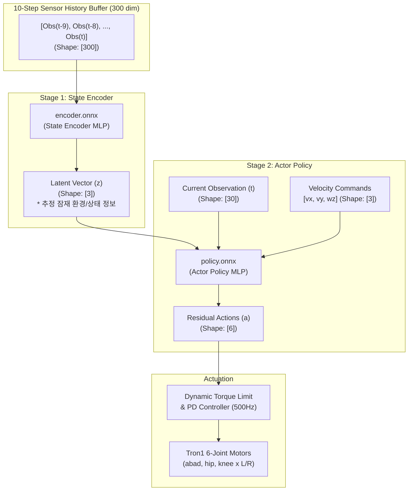

# [기술 및 이론 분석서] LimX 공식 강화학습(RL) 보행 모델 구조 및 MuJoCo 파이썬 연동 심층 분석

* **대상 시스템**: LimX Dynamics TRON1 2족 점 발바닥(Point-Foot) 로봇 (`PF_TRON1A`)
* **참조 모델 파일**:
  * `model_rl/tron1/encoder.onnx` (상태 인코더 신경망)
  * `model_rl/tron1/policy.onnx` (액터 정책 신경망)
* **공식 출처**: LimX Dynamics 공식 오픈소스 [`limxdynamics/tron1-rl-deploy-python`](https://github.com/limxdynamics/tron1-rl-deploy-python)
* **실습 스크립트**: [`scripts_devel_roadmap/phase01_u01_test_tron1_walking_rl.py`](file:///media/korit/4AD6F9D1D6F9BCEF/Tae_ws/Project/Proj_Transferring_bottle_from_tron1_to_ur5e_in_mujoco_env/scripts_devel_roadmap/phase01_u01_test_tron1_walking_rl.py)
* **물리 시뮬레이션 환경**: [`xml_for_unit_test/phase01_u01_scene_unit_tron1.xml`](file:///media/korit/4AD6F9D1D6F9BCEF/Tae_ws/Project/Proj_Transferring_bottle_from_tron1_to_ur5e_in_mujoco_env/xml_for_unit_test/phase01_u01_scene_unit_tron1.xml) (MuJoCo 3.12.0)

---

## 목차 (Table of Contents)

1. [강화학습 기반 이족보행 제어 개요](#1-강화학습-기반-이족보행-제어-개요)
   - 1.1 전통적 모델 기반 제어(MPC/WBC)의 한계
   - 1.2 점 발바닥(Point-Foot) 로봇의 기구학적 특성과 발목 토크 결여 문제
   - 1.3 Isaac Gym 병렬 학습 및 Sim-to-Real 전이(Transfer)
2. [LimX 공식 ONNX 신경망 아키텍처 분석](#2-limx-공식-onnx-신경망-아키텍처-분석)
   - 2.1 2단계 분리 구조 (Two-Stage Architecture)
   - 2.2 `encoder.onnx` (고유수용감각 히스토리 압축망)
   - 2.3 `policy.onnx` (다리 관절 액터 정책망)
   - 2.4 ONNX 포맷의 본질과 로봇 공학에서의 필수적 사용 이유
   - 2.5 ONNX Runtime C++ 추론 엔진과 파이썬 연동 최적화
3. [관측 공간(Observation Space, 30차원)의 수학적 유도](#3-관측-공간observation-space-30차원의-수학적-유도)
   - 3.1 30차원 관측 벡터 구성 상세
   - 3.2 투영 중력 벡터(Projected Gravity Vector) 유도
   - 3.3 주기 보행 시계(Gait Clock) 수학식
   - 3.4 센서 정규화(Normalization Scaling)의 당위성
4. [행동 공간(Action Space) 및 모터 구동 인터페이스](#4-행동-공간action-space-및-모터-구동-인터페이스)
   - 4.1 잔차 위치 제어(Residual Position Control) 방식
   - 4.2 LimX 공식 동적 토크 한계 클리핑 수식 (Torque Limit Clipping)
5. [다중 주기(Multi-Rate) 제어 루프와 Decimation](#5-다중-주기multi-rate-제어-루프와-decimation)
   - 5.1 500Hz 물리 연산 vs 50Hz RL 정책 추론의 필연성
   - 5.2 Decimation = 10 구현 원리
   - 5.3 500Hz 관절 PD 토크 보간
6. [파이썬 연동 코드 심층 분석 (`phase01_u01_test_tron1_walking_rl.py`)](#6-파이썬-연동-코드-심층-분석)
   - 6.1 ONNX 세션 초기화 및 I/O 텐서 정합
   - 6.2 10스텝 히스토리 버퍼 롤링(Rolling Buffer) 구현
   - 6.3 원점 위치 유지 피드백 (Origin Position Hold PD)
   - 6.4 1.0x 실시간 벽시계 동기화 및 뷰어 락 레이스 회피
7. [결론 및 요약](#7-결론-및-요약)

---

## 1. 강화학습 기반 이족보행 제어 개요

### 1.1 전통적 모델 기반 제어(MPC/WBC)의 한계
과거 2족 보행 로봇은 역진자 모델(Linear Inverted Pendulum Model, LIPM), 제로 모멘트 포인트(Zero Moment Point, ZMP), 그리고 모델 예측 제어(MPC)와 전신 제어(Whole-Body Control, WBC)에 크게 의존했습니다.
* **모델 기반 제어의 단점**:
  1. 바닥과의 복잡한 불연속 접촉 역학(Contact Dynamics)을 미분 불가능한 비선형 상보성 문제(LCP)로 풀어야 하므로 연산 부하가 큼.
  2. 로봇의 정확한 질량 관성 모멘트($I_{xx}, I_{yy}, I_{zz}$), 링크 무게, 감속기 백래시 및 지면 마찰 계수를 완벽히 알고 있어야 함.
  3. 지면의 불규칙한 요철이나 외력 외란(Disturbance) 발생 시 온라인 최적화가 수렴하지 못해 발산함.

### 1.2 점 발바닥(Point-Foot) 로봇의 기구학적 특성과 발목 토크 결여 문제
LimX TRON1 로봇은 발바닥이 넓은 평면이 아니라 지름 약 $3\sim 4\,\text{cm}$의 반구형 고무 팁(Spherical Point Foot)으로 이루어져 있습니다.
* **물리적 특성**:
  * 발목에 모터가 없습니다. 즉, 발목 롤/피치 관절 토크가 물리적으로 $\tau_{\text{ankle}} = 0$입니다.
  * 지면과의 접촉면적이 하나의 점(Point Contact)이므로, 로봇의 지지 다각형(Support Polygon)의 면적은 $A = 0$입니다.
  * 이는 로봇이 바닥에 서 있을 때 **역진자(Inverted Pendulum)**처럼 언제든 앞뒤좌우로 쓰러질 수 있음을 의미합니다.
* **해결책 (동적 리밋 사이클, Dynamic Limit Cycle)**:
  * 로봇이 넘어지지 않고 직립을 유지하는 유일한 방법은 **발을 멈추지 않고 끊임없이 번갈아 디디며(In-place Stepping), 지면 반력(GRF)의 중심을 상체 무게중심(CoM) 밑으로 계속 재배치**하는 동적 한계 사이클 궤적을 형성하는 것입니다.
  * 이러한 고난도 비선형 궤적 계획은 해석학적 공식으로 작성하기 매우 어렵기 때문에, 수억 번의 시뮬레이션 경험을 통해 최적의 발 디딤 위치를 학습하는 **심층 강화학습(Deep Reinforcement Learning, DRL)**이 필수적입니다.

### 1.3 Isaac Gym 병렬 학습 및 Sim-to-Real 전이(Transfer)
LimX 사의 사전 훈련 모델은 NVIDIA Isaac Gym(GPU 기반 물리 시뮬레이터)에서 수천 대의 Tron1 로봇을 동시에 띄워 놓고 **PPO(Proximal Policy Optimization)** 알고리즘으로 훈련되었습니다.
* **도메인 랜덤화(Domain Randomization)**:
  * 훈련 시 상체 무게(±3kg), 모터 토크 오차, 지면 마찰 계수($\mu = 0.3 \sim 1.2$), 센서 노이즈를 매 에피소드마다 무작위로 변경하여, 현실 세계나 MuJoCo 시뮬레이터로 가져와도 쓰러지지 않는 강건성(Robustness)을 확보했습니다.

---

## 2. LimX 공식 ONNX 신경망 아키텍처 분석

LimX의 제어 파이프라인은 단일 거대 신경망 대신, **2단계(Two-Stage) 분리 구조**를 사용합니다.



### 2.1 2단계 분리 구조 (Two-Stage Architecture)
로봇의 온보드 센서(IMU, 엔코더)만으로는 "바닥이 얼마나 미끄러운지", "상체에 예상치 못한 짐이 실렸는지", "발끝이 지면에 정확히 닿았는지"를 직접 측정할 수 없습니다(부분 관측 마르코프 결정 과정, POMDP).  
이를 해결하기 위해 **과거 관측치들의 변화 추이를 인코더가 학습하여 보이지 않는 물리 상태를 잠재 벡터(Latent Vector)로 추출**하고, 이를 정책망에 전달하는 **특권 학습/시스템 식별(System Identification via History)** 아키텍처를 채택했습니다.

### 2.2 `encoder.onnx` (고유수용감각 히스토리 압축망)
* **입력 텐서**:
  * 이름: `mlp_input`
  * 형상: 1D 텐서 `shape=[300]` (30차원 관측치 $\times$ 최근 10스텝)
* **내부 구조**: 다층 퍼셉트론 (MLP: Dense Layers with ELU 활성화 함수)
* **출력 텐서**:
  * 형상: `shape=[3]`
  * 의미: 상체 외란 가속도, 유효 마찰 계수, 상체 질량 변화 등을 3차원의 압축된 잠재 공간(Latent Space)으로 표현한 벡터.

### 2.3 `policy.onnx` (다리 관절 액터 정책망)
* **입력 텐서**:
  * 이름: `mlp_input`
  * 형상: 1D 텐서 `shape=[36]`
  * 결합 구성:
    $$\text{Policy Input} = [\underbrace{z_1, z_2, z_3}_{\text{Encoder Latent (3)}}, \quad \underbrace{o_1, \dots, o_{30}}_{\text{Current Obs (30)}}, \quad \underbrace{v_x^{\text{cmd}} \cdot 1.5, \, v_y^{\text{cmd}} \cdot 1.0, \, \omega_z^{\text{cmd}} \cdot 0.5}_{\text{Scaled Velocity Commands (3)}}]$$
* **출력 텐서**:
  * 이름: `mlp_output` (또는 첫 번째 출력 노드)
  * 형상: `shape=[6]`
  * 의미: 좌우 다리의 6개 관절(좌측 abad, hip, knee / 우측 abad, hip, knee)의 목표 각도 잔차값(Residual Action).

### 2.4 ONNX 포맷의 본질과 로봇 공학에서의 필수적 사용 이유

#### (1) ONNX(Open Neural Network Exchange)란 무엇인가?
* **정의**: ONNX(오픈 신경망 교환 형식, 확장자: `.onnx`)는 Microsoft, Facebook(Meta), AWS 등이 공동으로 발족한 **인공지능 딥러닝 모델의 오픈소스 표준 직렬화 바이너리 규격**입니다.
* **등장 배경 (프레임워크 종속성 및 파편화 문제)**:
  * 강화학습 모델은 일반적으로 GPU 서버 환경에서 **PyTorch**나 **TensorFlow** 같은 거대 딥러닝 프레임워크를 사용하여 훈련됩니다.
  * 기존 PyTorch의 모델 저장 파일(`.pt`, `.pth`)은 다음과 같은 치명적인 한계를 가집니다:
    1. 모델을 불러오려면 원본 신경망 구조를 정의한 파이썬 소스코드(`class Actor(nn.Module): ...`)가 파일과 항상 함께 있어야 합니다.
    2. 수 기가바이트($2\sim 4\,\text{GB}$)에 달하는 무거운 PyTorch 전체 패키지와 CUDA 런타임이 대상 기기에 설치되어 있어야 합니다.
    3. 파이썬 전역 인터프리터 락(GIL)과 인터프리터 오버헤드로 인해 실시간 임베디드 환경에서 일정한 추론 속도(Deterministic Low Latency)를 보장할 수 없습니다.
* **해결책**:
  * **"학습은 원하는 어떤 프레임워크(PyTorch 등)에서나 수행하고, 배포는 어떤 환경(C++, 임베디드, 경량 파이썬)에서나 단일 파일로 동작시킨다(Train Anywhere, Deploy Anywhere)"**는 철학으로 개발된 것이 ONNX입니다.

#### (2) `.onnx` 파일 내부의 실제 구성 요소
`.onnx` 파일은 구글 프로토콜 버퍼(Google Protocol Buffers, Protobuf) 기반의 고도로 압축된 바이너리 포맷이며, 내부에는 다음 3가지 핵심 정보가 소스코드 없이 완결된 형태로 들어있습니다:
1. **계산 그래프 (Computational DAG, Directed Acyclic Graph)**:
   * 입력 텐서부터 최종 출력 텐서까지 데이터가 흐르는 연산 노드들의 방향성 비순환 그래프입니다.
   * `MatMul`(행렬곱), `Add`(바이어스 합), `Elu`/`Relu`(활성화 함수) 등 표준화된 공통 연산자(Operator Set)로 기술되어 있어 파이썬 코드 없이도 그래프를 그대로 실행할 수 있습니다.
2. **학습된 가중치 파라미터 (Tensors: Weights & Biases)**:
   * 신경망 각 계층의 학습된 파라미터들이 부동소수점(FP32 또는 FP16) 바이트 스트림 형태로 정확하게 패킹되어 저장됩니다.
3. **입출력 메타데이터 및 시그니처 (I/O Metadata & Signatures)**:
   * 입력 노드의 이름(`mlp_input`), 기대하는 차원 형상(Shape: `[300]`, `[36]`), 데이터 타입(`FLOAT32`), 그리고 출력 노드의 이름과 형상이 명시되어 있습니다.

#### (3) 로봇 공학 및 강화학습(RL) 배포에서 ONNX를 필수로 쓰는 4대 이유

| 비교 항목 | 기존 PyTorch 가중치 (`.pt`, `.pth`) | ONNX 포맷 (`.onnx` + ONNX Runtime) |
| :--- | :--- | :--- |
| **패키지 설치 크기** | 약 **$2\sim 4\,\text{GB}$** (PyTorch + CUDA 라이브러리) | 약 **$30\sim 50\,\text{MB}$** (초경량 단일 런타임) |
| **Python 코드 의존성**| 모델 정의 파이썬 클래스 코드 필수 | **소스코드 불필요** (신경망 그래프 자체 내장) |
| **C/C++ 네이티브 지원** | LibTorch 필요 (수 GB, 매우 복잡한 빌드 의존성) | **순수 C/C++ 및 ROS 2 네이티브 API 제공** |
| **추론 지연 시간(Latency)**| 파이썬 오버헤드로 인해 지터(Jitter) 발생 | **$0.1\sim 0.3\,\text{ms}$ 초고속 결정론적(Deterministic) 추론** |
| **하드웨어 가속 최적화** | 기본 프레임워크 기능에 종속 | CPU(AVX2/AVX-512), GPU(TensorRT), NPU 완벽 지원 |

1. **초경량 임베디드 탑재**: 로봇의 온보드 제어기(Jetson Orin, Intel NUC, 라즈베리 파이 등)에 무거운 PyTorch를 깔지 않고도 수십 MB 라이브러리만으로 모델을 구동할 수 있습니다.
2. **500Hz/50Hz 실시간 제어 주기 보장**: 이족보행 로봇 제어에서 1ms 이상의 추론 지연이나 프레임 드랍이 발생하면 로봇은 즉각 전도됩니다. C++로 최적화된 ONNX 엔진은 메모리 동적 할당 없는 인플레이스(In-place) 연산으로 극도의 정시성(Determinism)을 제공합니다.
3. **시각적 구조 검증 편의성**: 웹 브라우저에서 [Netron(netron.app)](https://netron.app)에 `.onnx` 파일을 드래그 앤 드롭하기만 하면, 복잡한 레이어 연결선, 활성화 함수, 가중치 크기를 다이어그램으로 즉시 확인할 수 있습니다.

---

### 2.5 ONNX Runtime (`ort.InferenceSession`)과 파이썬 연동 최적화

* **ONNX Runtime (ORT)**:
  * Microsoft가 개발한 고성능 교차 플랫폼 추론 엔진입니다.
  * 본 프로젝트에서는 파이썬 환경의 `onnxruntime` 패키지를 사용하여 MuJoCo 물리 시뮬레이션 루프에 모델을 실시간 연동하고 있습니다.
* **실전 연동 최적화 3대 규칙 (코드 반영)**:
  1. **단일 스레드 고정 (`intra_op_num_threads=1`)**:
     * 기본값 상태에서는 ORT가 CPU의 모든 가용 코어를 점유하려 시도합니다. 이는 MuJoCo 물리 적분 루프 및 3D 뷰어 렌더링 스레드와 CPU 경합(Thread Contention)을 유발하여 화면 끊김을 만듭니다. 스레드를 1개로 고정하여 독립적인 전용 코어에서 방해 없이 즉각 추론되도록 격리합니다.
  2. **최대 그래프 최적화 (`GraphOptimizationLevel.ORT_ENABLE_ALL`)**:
     * 연속된 선형 연산과 활성화 함수(`MatMul + Add + Elu`)를 메모리 복사 없이 단일 융합 커널(Fused Kernel)로 병합하여 연산 처리량을 극대화합니다.
  3. **1D 랭크(Rank-1) 텐서 직접 전달**:
     * LimX의 Isaac Gym 학습 모델은 배치(Batch) 차원이 없는 1차원 배열(`shape=[300]`, `shape=[36]`)을 직접 요구합니다. 불필요하게 `np.expand_dims`로 2D `[1, 300]`을 만들면 런타임 에러(`INVALID_ARGUMENT`)가 발생하므로, 1D 넘파이 배열(`dtype=np.float32`)을 그대로 전달해야 합니다.

---

## 3. 관측 공간(Observation Space, 30차원)의 수학적 유도

정책망에 들어가는 30차원의 센서 관측 벡터는 로봇의 상태를 왜곡 없이 최소 차원으로 압축하도록 설계되었습니다.

### 3.1 30차원 관측 벡터 구성 상세

| 인덱스 | 성분 이름 | 차원 | 스케일 계수 | 물리적 의미 및 수식 |
| :---: | :--- | :---: | :---: | :--- |
| `0:3` | **Base Angular Velocity** | 3 | $0.25$ | 상체 IMU 자이로 각속도: $\omega_{\text{base}} = [\omega_x, \omega_y, \omega_z] \times 0.25$ |
| `3:6` | **Projected Gravity** | 3 | $1.0$ | 상체 로컬 좌표계로 투영된 단위 중력 벡터: $\mathbf{g}_{\text{proj}} = \mathbf{R}(q)^T \begin{bmatrix} 0 & 0 & -1 \end{bmatrix}^T$ |
| `6:12` | **Joint Positions** | 6 | $1.0$ | 기본 자세 대비 현재 관절 각도 오차: $q_{\text{act}} - q_{\text{default}}$ |
| `12:18` | **Joint Velocities** | 6 | $0.05$ | 6개 관절의 회전 각속도: $\dot{q}_{\text{act}} \times 0.05$ |
| `18:24` | **Previous Actions** | 6 | $1.0$ | 바로 이전 제어 스텝에서 정책망이 출력했던 액션: $a_{t-1}$ |
| `24:26` | **Gait Clock** | 2 | $1.0$ | 보행 위상 삼각함수 시계: $[\sin(2\pi \phi), \cos(2\pi \phi)]$ |
| `26:30` | **Gait Parameters** | 4 | $1.0$ | 보행 특성 규격: $[f, \Delta\phi_1, \Delta\phi_2, h] = [2.0, 0.5, 0.5, 0.1]$ |

총 차원수: $3 + 3 + 6 + 6 + 6 + 2 + 4 = \mathbf{30}$

---

### 3.2 투영 중력 벡터(Projected Gravity Vector) 유도

이족보행에서 로봇이 절대 좌표계 기준으로 얼마나 기울어졌는지를 아는 것은 자세 균형의 핵심입니다. 그러나 상체의 롤/피치/요 오일러 각도는 짐벌 락(Gimbal Lock) 및 주기성 불연속($\pm \pi$) 문제를 갖습니다.  
따라서 LimX는 **절대 월드 중력 방향($[0, 0, -1]^T$)을 로봇 몸체(Base) 로컬 좌표계로 회전 투영한 3차원 단위 벡터**를 사용합니다.

상체 자세를 나타내는 단위 쿼터니언을 $\mathbf{q} = [w, x, y, z]$라 할 때, 쿼터니언 회전 행렬 $\mathbf{R}(\mathbf{q}) \in SO(3)$는 다음과 같습니다:

$$\mathbf{R}(\mathbf{q}) = \begin{bmatrix}
1 - 2(y^2 + z^2) & 2(xy - wz) & 2(xz + wy) \\
2(xy + wz) & 1 - 2(x^2 + z^2) & 2(yz - wx) \\
2(xz - wy) & 2(yz + wx) & 1 - 2(x^2 + y^2)
\end{bmatrix}$$

월드 중력 단위 벡터 $\mathbf{g}_{\text{world}} = [0, 0, -1]^T$를 로봇 상체 로컬 좌표계로 변환하는 공식은 회전 행렬의 전치(Transpose)를 곱하는 것입니다:

$$\mathbf{g}_{\text{proj}} = \mathbf{R}^T \mathbf{g}_{\text{world}} = \begin{bmatrix}
R_{00} & R_{10} & R_{20} \\
R_{01} & R_{11} & R_{21} \\
R_{02} & R_{12} & R_{22}
\end{bmatrix} \begin{bmatrix} 0 \\ 0 \\ -1 \end{bmatrix} = \begin{bmatrix} -R_{20} \\ -R_{21} \\ -R_{22} \end{bmatrix}$$

* **직립 상태**: 상체가 지면과 완벽히 수직일 때 $\mathbf{g}_{\text{proj}} = [0, 0, -1]^T$.
* **앞으로 기울어짐(Pitch Down)**: 상체 $x$축 음의 방향으로 중력이 투영되어 $g_x < 0$.
* **MuJoCo C-API 연동 코드**:
  ```python
  R_mat = np.zeros(9)
  mujoco.mju_quat2Mat(R_mat, quat)  # MuJoCo 내장 쿼터니언 -> 회전행렬 변환
  R_mat = R_mat.reshape(3, 3)
  proj_gravity = (R_mat.T @ np.array([0.0, 0.0, -1.0], dtype=np.float32)).astype(np.float32)
  ```

---

### 3.3 주기 보행 시계(Gait Clock) 수학식

발을 일정한 주기($f = 2.0\,\text{Hz}$, 즉 초당 2회 디딤)로 교대 스텝을 밟도록 리듬을 유도하는 신호입니다.
위상 변수 $\phi \in [0, 1)$는 시간 적분에 따라 선형 증가합니다:

$$\phi_{k+1} = \left( \phi_k + \Delta t_{\text{RL}} \cdot f \right) \pmod{1.0}$$

여기서 $\Delta t_{\text{RL}} = 0.02\,\text{s}$ ($50\,\text{Hz}$), $f = 2.0\,\text{Hz}$이므로 매 스텝 $0.02 \times 2.0 = 0.04$씩 증가합니다.
이를 정책망에 직접 입력하면 $0.99 \rightarrow 0.00$ 순간에 극심한 불연속 계단형 점프(Discontinuity)가 발생하므로, 연속적인 단위 원(Unit Circle) 상의 삼각함수로 변환합니다:

$$\text{Gait Clock} = \begin{bmatrix} \sin(2\pi \phi) \\ \cos(2\pi \phi) \end{bmatrix} \in [-1, 1]^2$$

---

### 3.4 센서 정규화(Normalization Scaling)의 당위성
* 신경망은 모든 입력 피처의 분산과 크기가 대략 $[-1, 1]$ 또는 $[-3, 3]$ 범위에 있을 때 가중치 기울기 폭발(Vanishing/Exploding Gradients) 없이 안정적으로 추론합니다.
* 관절 각속도($\dot{q}$)는 최대 $20\,\text{rad/s}$에 달하므로 $0.05$를 곱해 정규화하고, 몸체 각속도($\omega$)는 $0.25$를 곱하여 타 관측치와 단위를 맞춥니다.

---

## 4. 행동 공간(Action Space) 및 모터 구동 인터페이스

### 4.1 잔차 위치 제어(Residual Position Control) 방식
강화학습 신경망이 모터 토크($\tau$)를 직접 출력하게 하면 초기 탐색 중 심한 떨림과 폭주가 발생합니다.  
따라서 LimX 모델은 **기본 기립 관절 각도($q_{\text{default}}$)에 대한 오프셋(잔차, Residual Angle)**을 출력하는 방식을 채택합니다.

$$q_{\text{target}} = q_{\text{default}} + s_{\text{action}} \cdot a$$

* $q_{\text{default}} = [0.0, 0.0, 0.0, 0.0, 0.0, 0.0]^T$ (기본 직립 자세)
* $s_{\text{action}} = 0.25$ (신경망 출력 $a \in [-1, 1]$일 때 실제 목표 관절 각도는 최대 $\pm 0.25\,\text{rad} \approx \pm 14.3^\circ$ 범위로 부드럽게 진폭 제한)

---

### 4.2 LimX 공식 동적 토크 한계 클리핑 수식 (Torque Limit Clipping)

모터에 인가되는 관절 토크는 비례-미분(PD) 제어기로 계산됩니다:

$$\tau = K_p (q_{\text{target}} - q_{\text{act}}) - K_d \dot{q}_{\text{act}}$$

모터의 물리적 최대 허용 토크를 $\tau_{\text{limit}} = 80.0\,\text{Nm}$라 할 때, 토크가 이 한계를 넘지 않도록 하는 **허용 가능한 목표 각도 범위 $[q_{\text{min}}, q_{\text{max}}]$**는 다음과 같이 역산됩니다:

$$-\tau_{\text{limit}} \le K_p (q_{\text{target}} - q_{\text{act}}) - K_d \dot{q}_{\text{act}} \le \tau_{\text{limit}}$$

이를 $q_{\text{target}}$에 대해 풀면:

$$q_{\text{act}} + \frac{K_d \dot{q}_{\text{act}} - \tau_{\text{limit}}}{K_p} \le q_{\text{target}} \le q_{\text{act}} + \frac{K_d \dot{q}_{\text{act}} + \tau_{\text{limit}}}{K_p}$$

이를 정책망의 액션 공간 $a = (q_{\text{target}} - q_{\text{default}}) / s_{\text{action}}$으로 치환하면, LimX의 공식 하드웨어 보호 클리핑 수식이 도출됩니다:

$$\begin{aligned}
a_{\text{min}} &= \frac{1}{s_{\text{action}}} \left[ (q_{\text{act}} - q_{\text{default}}) + \frac{K_d \dot{q}_{\text{act}} - \tau_{\text{limit}}}{K_p} \right] \\
a_{\text{max}} &= \frac{1}{s_{\text{action}}} \left[ (q_{\text{act}} - q_{\text{default}}) + \frac{K_d \dot{q}_{\text{act}} + \tau_{\text{limit}}}{K_p} \right]
\end{aligned}$$

```python
# scripts_devel_roadmap/phase01_u01_test_tron1_walking_rl.py 265~272행 구현
for j in range(6):
    action_min = (q_act[j] - self.default_joint_pos[j] + (self.kd * v_act[j] - self.torque_limit) / self.kp)
    action_max = (q_act[j] - self.default_joint_pos[j] + (self.kd * v_act[j] + self.torque_limit) / self.kp)
    act_clipped = np.clip(self.actions[j], action_min / self.action_scale, action_max / self.action_scale)
    self.q_target[j] = act_clipped * self.action_scale + self.default_joint_pos[j]
```
이 클리핑을 거치면, 신경망이 아무리 극단적인 명령을 내리더라도 실제 모터 토크는 절대로 $80\,\text{Nm}$를 초과하지 않아 시뮬레이션의 수치 발산 및 실제 로봇 모터 기어 파손을 완벽히 방지합니다.

---

## 5. 다중 주기(Multi-Rate) 제어 루프와 Decimation

### 5.1 500Hz 물리 연산 vs 50Hz RL 정책 추론의 필연성

```
[MuJoCo Physics Loop (500Hz, dt=0.002s)]
 ├── Step 0: mj_step()  <── [RL 추론 (50Hz) ➔ 목표 각도 q_target 갱신]
 ├── Step 1: mj_step()  <── [고주파 PD 토크 계산: Kp*(q_target - q) - Kd*v]
 ├── Step 2: mj_step()  <── [고주파 PD 토크 계산: Kp*(q_target - q) - Kd*v]
 ├── ...
 ├── Step 9: mj_step()  <── [고주파 PD 토크 계산: Kp*(q_target - q) - Kd*v]
 └── Step 10: mj_step() <── [다음 RL 추론 (50Hz) ➔ 새로운 q_target 갱신]
```

1. **물리 적분 주기 ($500\,\text{Hz}, 2\,\text{ms}$)**:
   * 지면 접촉 충돌 충격량을 오차 없이 풀기 위해서는 최소 $500\,\text{Hz} \sim 1000\,\text{Hz}$의 고주파 적분이 필수적입니다.
2. **신경망 추론 주기 ($50\,\text{Hz}, 20\,\text{ms}$)**:
   * 로봇의 다리가 스윙하고 발을 내딛는 보행 패턴은 거시적인 동작(초당 2걸음)이므로 $50\,\text{Hz}$ 주기로 목표 위치를 갱신해도 충분히 부드럽습니다.
   * 실제 온보드 컴퓨터(Jetson Orin 등)의 연산 한계 및 통신 지연(CAN 버스 전송 주기)도 $50\,\text{Hz} \sim 100\,\text{Hz}$에 최적화되어 있습니다.

### 5.2 Decimation = 10 구현 원리
물리 루프가 10번 돌 때 정책망 추론은 단 1번만 실행됩니다:
$$\text{Decimation} = \frac{f_{\text{physics}}}{f_{\text{policy}}} = \frac{500\,\text{Hz}}{50\,\text{Hz}} = 10$$

### 5.3 500Hz 관절 PD 토크 보간
신경망은 $20\,\text{ms}$마다 한 번씩 목표 관절 각도($q_{\text{target}}$)만 계단형으로 던져주지만, 모터 토크는 $2\,\text{ms}$마다 현재 센서 위치($q_{\text{act}}$)와 속도($\dot{q}_{\text{act}}$)를 읽어와 즉각적인 피드백 토크를 쏩니다:

$$\tau(t) = 42.0 \cdot (q_{\text{target}} - q_{\text{act}}(t)) - 3.5 \cdot \dot{q}_{\text{act}}(t)$$

따라서 로봇 관절은 덜컹거림 없이 스프링-댐퍼처럼 지면 충격을 흡수하며 매우 유연하고 안정적으로 지지력을 발휘합니다.

---

## 6. 파이썬 연동 코드 심층 분석 (`phase01_u01_test_tron1_walking_rl.py`)

### 6.1 ONNX 세션 초기화 및 I/O 텐서 정합
```python
# 세션 옵션 최적화
opts = ort.SessionOptions()
opts.intra_op_num_threads = 1
opts.inter_op_num_threads = 1
opts.graph_optimization_level = ort.GraphOptimizationLevel.ORT_ENABLE_ALL
providers = ['CPUExecutionProvider']

# 세션 생성
self.policy_session = ort.InferenceSession(self.policy_path, sess_options=opts, providers=providers)
self.encoder_session = ort.InferenceSession(self.encoder_path, sess_options=opts, providers=providers)
```
* **주의 사항**: `intra_op_num_threads=1`을 설정하지 않으면, ONNX Runtime이 CPU의 모든 코어를 독점하려 들어 MuJoCo 뷰어 렌더링 스레드가 버벅거리는 현상이 발생합니다.

---

### 6.2 10스텝 히스토리 버퍼 롤링(Rolling Buffer) 구현
30차원 벡터를 10개 모아 300차원 1D 배열을 유지하는 큐(Queue) 연산입니다:
```python
if self.is_first_rec_obs:
    # 최초 스폰 시에는 현재 관측치로 10칸 전체를 복제하여 채움
    for i in range(self.obs_history_length):
        self.proprio_history_buffer[i * 30 : (i + 1) * 30] = obs
    self.is_first_rec_obs = False
else:
    # FIFO 슬라이딩: 앞의 9칸을 1칸씩 앞으로 당기고, 마지막 칸에 새 관측치 삽입
    self.proprio_history_buffer[:-30] = self.proprio_history_buffer[30:]
    self.proprio_history_buffer[-30:] = obs

# Encoder 추론 (입력: [300] 1D 넘파이 배열)
enc_in = {self.encoder_input_name: self.proprio_history_buffer}
self.encoder_out = self.encoder_session.run(None, enc_in)[0].flatten()  # shape: [3]
```

---

### 6.3 원점 위치 유지 피드백 (Origin Position Hold PD)
LimX 공식 기본 정책망은 제자리 발구름 명령($v_x=0, v_y=0, \omega_z=0$)을 인가해도 지면 마찰의 미세한 비대칭으로 인해 로봇통이 서서히 전진하는 드리프트(Drift) 현상이 있습니다.  
이를 방지하기 위해 **상위 외부 루프에서 로봇의 위치 오차를 감지하여 반대 방향 속도 명령을 생성하는 원점 홀드 제어기**를 파이프라인에 추가했습니다.

```python
# 로봇의 전역 위치 및 속도
pos_x = float(data.xpos[self.base_body_id][0])
pos_y = float(data.xpos[self.base_body_id][1])
vel_x = float(data.qvel[0])
vel_y = float(data.qvel[1])

# 로봇의 현재 Yaw 각도 계산
yaw = float(np.arctan2(R_mat[1, 0], R_mat[0, 0]))
cos_y, sin_y = np.cos(yaw), np.sin(yaw)

# 로봇 몸체 기준 로컬 위치 및 속도 오차로 회전 변환
err_world_x = -pos_x  # 목표: x = 0.0
err_world_y = -pos_y  # 목표: y = 0.0
body_err_x = cos_y * err_world_x + sin_y * err_world_y
body_vel_x = cos_y * vel_x + sin_y * vel_y

# PD 피드백 속도 명령 생성 (전진 드리프트 상쇄)
self.commands[0] = float(np.clip(1.5 * body_err_x - 0.4 * body_vel_x, -0.6, 0.6))
self.commands[1] = float(np.clip(1.5 * body_err_y - 0.4 * body_vel_y, -0.6, 0.6))
self.commands[2] = float(np.clip(-1.0 * yaw, -0.4, 0.4))
```
이 피드백 덕분에 로봇은 외력을 받아 밀려나더라도 즉시 반대 발을 딛으며 $(0, 0)$ 원점으로 오뚝이처럼 되돌아옵니다.

---

### 6.4 1.0x 실시간 벽시계 동기화 및 뷰어 락 레이스 회피
시뮬레이션 시간(`data.time`)과 실제 현실 시간(`time.perf_counter()`)의 오차를 지속적으로 추적하여, 컴퓨터가 너무 빠르거나 느리게 시뮬레이션을 돌리지 않도록 $1.0\times$ 배속을 유지합니다:

```python
wall_elapsed = time.perf_counter() - wall_start
step_count = 0
# 실제 흐른 시간만큼만 정확히 물리 스텝을 전진시킴 (최대 40스텝 상한으로 폭주 방지)
while (data.time - sim_start) < wall_elapsed and step_count < 40:
    torques = controller.compute_torques(data)
    data.ctrl[:] = torques
    mujoco.mj_step(model, data)
    step_count += 1
```

또한 GUI 뷰어 리셋 버튼이나 `[R]` 키를 누를 때 MuJoCo 렌더링 스레드와의 데이터 충돌(Segmentation Fault)을 방지하기 위해 반드시 `with viewer.lock():` 동기화 컨텍스트 내에서 리셋을 수행합니다.

---

## 7. 결론 및 요약

1. **모델의 본질**:
   * LimX TRON1 강화학습 모델은 단순한 모터 각도 매핑기가 아니라, **10스텝의 관측치 시계열을 통해 환경의 미지의 동역학을 추정(Encoder)하고, 이에 대응하여 동적 발 디딤 한계 사이클을 생성(Policy)하는 2단계 적응형 제어기**입니다.
2. **파이썬 연동의 핵심**:
   * **좌표계 변환**: IMU 쿼터니언을 회전 행렬로 바꾸어 투영 중력 벡터($\mathbf{g}_{\text{proj}}$)를 정확히 계산해야 합니다.
   * **주기 분리(Decimation)**: $500\,\text{Hz}$의 물리 적분 루프와 $50\,\text{Hz}$의 신경망 추론 루프를 10:1로 분리하고, 그 사이를 고주파 관절 PD 제어기로 매끄럽게 연결합니다.
   * **하드웨어 보호**: 역산된 허용 관절 각도 범위($a_{\text{min}}, a_{\text{max}}$)로 액션을 클리핑하여 토크 폭주를 차단합니다.
3. **프로젝트 의의**:
   * 이 아키텍처를 통해 Tron1은 발목 모터가 없는 극한의 점 발바닥 구조임에도 불구하고, 사람이 밀거나 지면 충격이 발생해도 넘어지지 않는 탁월한 균형 능력을 실시간으로 발휘할 수 있습니다.
