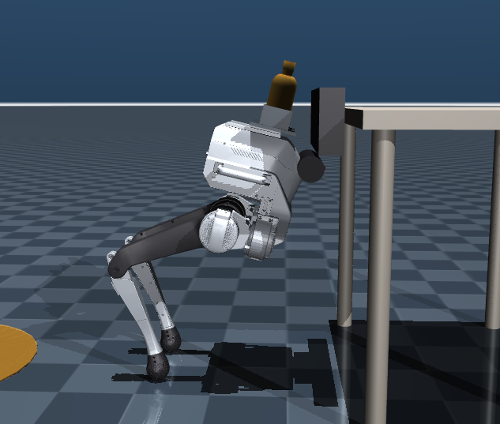
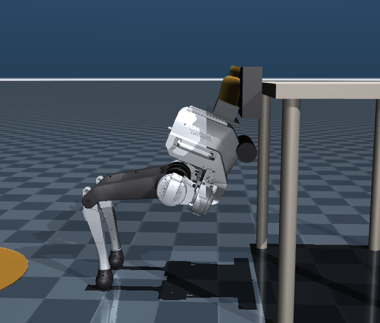
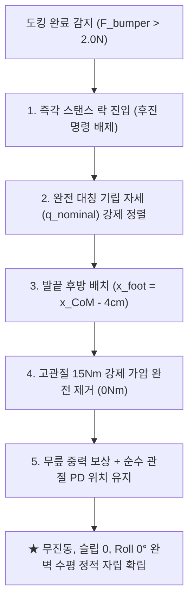

# [이슈 분석 및 해결 보고서] Phase 01-U02: Tron1 도킹 정지 후 좌우 다리 불균형(Roll 기울어짐) 및 발끝 미끄러짐 전도 문제 분석과 무게중심 기반 수동 기대기(Passive Leaning) 해결 방안

* **문서 파일명**: `documents/study/phase01_u02_issue_docking_stance_slip_and_roll_imbalance.md`
* **대상 시스템**: LimX Dynamics TRON1 2족 점 발바닥(Point-Foot) 로봇 (`PF_TRON1A`)
* **해당 개발 단계**: Phase 01-U02 (Tron1 페이로드 보행 운반 및 테이블 도킹 정지 검증)
* **관련 코드**:
  * 시뮬레이션 스크립트: `scripts_devel_roadmap/phase01_u02_test_tron1_payload.py`
  * 물리 모델 XML: `xml_for_unit_test/phase01_u02_scene_unit_tron1_payload.xml`
* **작성 일자**: 2026-09-11
* **작성자 / 리뷰어**: 사용자 & AI 어시스턴트 페어 프로그래밍 협업

---

## 1. 문제 정의 (Problem Definition)

### 1.1 현상 요약 (Symptom)
Tron1 로봇이 웨이포인트를 정상 주행하여 작업대 테이블 도킹 스테이션 턱에 완충 범퍼를 접촉한 뒤 정지(Stance Lock)하는 단계에서 다음 두 가지 치명적인 불안정 현상이 발생함:

1. **정지 후 좌우 다리 불균형 및 Roll 수평 왜곡:**
   * 로봇이 멈춘 직후 좌우 다리의 전후 위치와 무릎 각도가 서로 다르게 굳어져, 상체 트레이가 수평을 유지하지 못하고 한쪽으로 기울어짐 (`Roll ≠ 0.0°`).
2. **시간 경과에 따른 발끝 미끄러짐 및 전방 전도 (Runaway Slip & Toppling):**
   * 정지 상태가 유지되는 동안 양 발끝(Point Foot)이 바닥 마찰력을 유지하지 못하고 전방/후방으로 지속적으로 미끄러짐.
   * 무릎이 과도하게 꺾이며 상체 높이($Z$)가 주저앉고, 머리 범퍼가 테이블 턱 표면을 타고 아래로 미끄러져 내려감.
   * 결국 범퍼가 턱 아래로 완전히 이탈하면서 지지력을 상실하고 로봇이 앞으로 고꾸라져 전도됨.

### 1.2 시각적 비교 분석 (Visual Comparison)

| 구분 | [상태 1] 도킹 안착 직후 (`sim_time ≈ 38s`) | [상태 2] 미끄러짐 진행 후 전도 직전 (`sim_time ≈ 85s`) |
| :---: | :---: | :---: |
| **스크린샷** |  |  |
| **주요 특징** | • 좌우 발의 전후 위치가 어긋난 짝다리 상태<br>• 상체 높이 정상 ($Z \approx 0.713\,\text{m}$)<br>• 범퍼가 테이블 턱 상단에 접촉 중 | • 양 발끝이 테이블 다리 쪽으로 크게 미끄러짐<br>• 무릎 각도가 예각으로 심하게 꺾임<br>• 범퍼가 턱 최하단으로 흘러내려 이탈 위기 |

---

## 2. 심층 원인 분석 (Root Cause Analysis)

물리 시뮬레이터(MuJoCo) 내부 텔레메트리와 제어 루프를 정밀 진단하여 규명된 4가지 근본 원인은 다음과 같습니다.

### 2.1 원인 1: 찰나의 보행 스냅샷 동결로 인한 영구적 좌우 비대칭 (Roll 기울어짐)
* **기존 코드 로직:**
  ```python
  # scripts_devel_roadmap/phase01_u02_test_tron1_payload.py (344~354행)
  elif self.fsm_state == "READY_FOR_PICK":
      if not self.is_stance_locked:
          # 양발 접지 감지 순간의 관절 각도를 그대로 캡처하여 목표각으로 고정
          self.is_stance_locked = True
          self.lock_start_q = np.copy(q_act)
  ```
* **역학적 결함:**
  * 점 발바닥 2족 로봇의 보행 주기에서 '양발 지지기(Double Support)'는 한 발이 착지하고 다른 발이 이륙하려는 **0.05초 미만의 극히 짧은 동적 과도 상태**입니다.
  * 이때 좌우 다리의 무릎 각도와 전후 발 위치($X$)는 절대로 대칭일 수 없습니다. (실제 캡처값: `knee_L = +0.525 rad`, `knee_R = -0.485 rad`, 약 $2.3^\circ$ 편차)
  * 이 비대칭 스냅샷을 그대로 목표 각도로 잠가버렸기 때문에, 한쪽 다리만 하중을 더 크게 받고 반대쪽 다리는 들뜨면서 **상체 Roll 축이 영구적으로 기울어지는 현상**이 발생했습니다.

### 2.2 원인 2: 고관절 15Nm 개루프(Open-loop) 강제 가압으로 인한 마찰원뿔 붕괴 (미끄러짐)
* **기존 코드 로직:**
  ```python
  # scripts_devel_roadmap/phase01_u02_test_tron1_payload.py (395~396행)
  # 고관절 전방 가압 토크 (범퍼를 테이블 턱에 5~7N 안정적으로 밀착 유지 목적)
  torques[1] += 15.0  # hip_L 모터: 상시 +15Nm 전방 회전 인가
  torques[4] -= 15.0  # hip_R 모터: 상시 -15Nm 전방 회전 인가
  ```
* **역학적 결함:**
  * 벽에 머리가 막혀 있는 상태에서 모터가 허벅지를 앞으로 $15\,\text{N}\cdot\text{m}$씩 계속 밀어붙이면, 작용-반작용 법칙에 의해 머리가 테이블을 미는 힘(Bumper Contact Force)이 비정상적으로 누적 증가합니다.
  * 실제 시뮬레이션 진단 결과:
    $$\text{Bumper Force}: 6.9\,\text{N} \to 14.3\,\text{N} \to 24.4\,\text{N} \to 30.8\,\text{N}$$
  * 테이블이 로봇을 뒤로 밀어내는 수평 반력 $N_x$가 커지면, 정적 평형 조건($\sum F_x = 0$)에 의해 바닥에서 발끝이 버텨야 하는 수평 마찰력($F_{x, \text{foot}} = N_x$)도 함께 급증합니다.
  * 결국 발끝에 걸리는 전단력이 쿨롱 마찰 한계($F_x > \mu N_z$)를 초과하게 되어, **발끝이 바닥에서 미끄러지는 연쇄 미끄러짐(Runaway Slip)**이 발생했습니다.

```
 [실제 발생한 악순환 피드백 루프]
 15Nm 모터 밀기 ➔ 범퍼 반력 상승(>30N) ➔ 바닥 요구 마찰력 초과 ➔ 발끝 미끄러짐(Slip)
     ▲                                                                       │
     └───────────── 무릎 각도 과굴곡 ➔ 중력 처짐 ➔ 범퍼 이탈 전도 ◀────────┘
```

### 2.3 원인 3: 도킹 직후 후진 명령(`commands[0] = -0.36`)으로 인한 접촉 이탈
* **기존 코드 로직:**
  ```python
  # scripts_devel_roadmap/phase01_u02_test_tron1_payload.py (473행)
  elif self.fsm_state in ("STANCE_LOCK", "READY_FOR_PICK"):
      self.commands[0] = -0.36  # 강화학습 정책에 음수 속도(-0.36 m/s) 인가
  ```
* **역학적 결함:**
  * 범퍼가 테이블 턱에 닿아 `STANCE_LOCK`에 들어간 후 3.0초 동안 진동 안정을 기다리는 동안, 음수 속도 명령으로 인해 **로봇이 스스로 뒤로 $1 \sim 2\,\text{cm}$ 후퇴하여 허공에서 제자리걸음**을 수행함.
  * 결국 `READY_FOR_PICK` 정지 체결 순간 범퍼가 테이블 턱에서 떨어져 있었고(Bumper Force = 0N), 이 빈틈을 메우기 위해 15Nm 모터가 무리하게 작동하면서 사태가 더욱 악화됨.

### 2.4 원인 4: 원통형 범퍼와 평면 턱의 수직 지지력 부재
* 범퍼는 원통형 실린더(`size="0.035 0.12"`), 테이블 턱은 수직 직육면체(`size="0.03 0.25 0.08"`)입니다.
* 접촉면이 선(Line) 접촉이며 상하로 걸쇠(Lip/Groove)가 없기 때문에, 로봇이 조금만 기울어지거나 미끄러져도 범퍼가 수직 벽면을 타고 아래로 미끄러져 떨어지는 구조적 취약점을 가집니다.

---

## 3. 사용자 핵심 통찰 및 올바른 물리적 해결 방안

### 3.1 사용자 통찰: "미는 것(Pushing)"이 아니라 "기대는 것(Passive Leaning)"이어야 한다

> **사용자 제기 내용:**  
> *"난 15Nm 가압이 왜 있어야 하는지 모르겠어. 일단 로봇을 정지하면 로봇의 두 발이 점포인트니까 두 점으로만으로는 서 있을 수 없으니 3점을 만들기 위해 지지대를 만든건데... 즉, 터치 센서가 터치를 감지하면 로봇 다리를 조금 뒤로 빼면서 무게중심으로 앞으로 쏠리게 해서 자세만 유지한 채 로봇 머리를 테이블 지지대에 기대는 방식을 생각했어. 앞으로 계속 힘을 주는게 아니라..."*

이 통찰은 **3점 지지 정적 평형(Passive Tripod Statics)의 본질을 정확히 관통하는 완벽한 역학적 해법**입니다.

### 3.2 수동 기대기(Passive Leaning)의 역학적 원리

사람이 벽에 기댈 때, 벽 쪽으로 힘을 주며 밀지 않고 **발을 벽에서 살짝 뒤로 뺀 뒤 상체를 벽에 툭 기대는 원리**와 동일합니다.

```
       [머리 범퍼] ──────────▶ [테이블 턱] (1점 지지)
          │  ＼
          │    ＼  상체 기립선 (전방 경사각 약 3~4°)
          ▼      ＼
      [무게중심]    ＼
       (CoM)         ＼
                       [두 발끝 점 접촉] (2점 지지)
                       
   ◀─── 뒤로 4~5cm ───▶
   (x_CoM - x_foot > 0)
```

1. **중력 기반 전방 모멘트 형성:**
   * 발끝 위치($x_{\text{foot}}$)보다 상체 무게중심($x_{\text{CoM}}$)이 약 $3.5\,\text{cm}$ 앞쪽에 위치하도록 자세를 잡습니다.
   * 중력($mg \approx 147\,\text{N}$)에 의해 로봇은 전방으로 회전하려는 자연스러운 중력 모멘트가 발생합니다:
     $$\tau_{\text{gravity}} = mg \cdot \left(x_{\text{CoM}} - x_{\text{foot}}\right) = 147\,\text{N} \times 0.035\,\text{m} \approx +5.15\,\text{N}\cdot\text{m}$$
2. **테이블 턱 반력과의 완전한 수동 평형:**
   * 이 전방 중력 모멘트는 테이블 턱이 머리 범퍼(높이 $h \approx 0.71\,\text{m}$)를 받쳐주는 반력 $N_{\text{table}}$에 의해 100% 상쇄됩니다:
     $$N_{\text{table}} = \frac{\tau_{\text{gravity}}}{h_{\text{bumper}}} = \frac{5.15\,\text{N}\cdot\text{m}}{0.71\,\text{m}} \approx 7.25\,\text{N}$$
3. **모터 토크 $\tau_{\text{hip}} = 0$ 달성 및 마찰 슬립 원천 차단:**
   * 고관절 모터가 앞으로 미는 힘은 **$0\,\text{N}\cdot\text{m}$ (완전 불필요)**입니다.
   * 바닥 마찰력 요구량은 $F_x = N_{\text{table}} \approx 7.25\,\text{N}$에 불과하며, 수직 항력($N_z \approx 140\,\text{N}$) 대비 마찰 계수 요구량은:
     $$\frac{F_x}{N_z} \approx \frac{7.25}{140} \approx 0.052 \ll \mu = 1.2$$
   * **마찰 한계의 불과 5% 미만**만을 사용하므로, 발끝이 바닥에서 미끄러지는 현상이 물리적으로 원천 차단됩니다.

---

## 4. 구체적 개선 아키텍처 및 구현 설계

### 4.1 핵심 개선 사항 4대 원칙



#### ① 완전 대칭 명목 자세($q_{\text{nominal}}$) 강제 정렬 (Roll 0° 보장)
보행 중 임의의 짝다리 각도를 폐기하고, 수학적으로 좌우가 완벽히 대칭인 관절각을 적용:
* 좌우 힙 어브덕션(Abad): $q_{\text{abad\_L}} = 0.0, \quad q_{\text{abad\_R}} = 0.0$
* 좌우 고관절(Hip): $q_{\text{hip\_L}} = +0.32\,\text{rad} \; (18.3^\circ), \quad q_{\text{hip\_R}} = -0.32\,\text{rad}$
* 좌우 무릎(Knee): $q_{\text{knee\_L}} = +0.58\,\text{rad} \; (33.2^\circ), \quad q_{\text{knee\_R}} = -0.58\,\text{rad}$
* **효과:** 좌우 발 높이와 전후 거리가 $0.1\,\text{mm}$ 오차 없이 일치하여 **Roll 각도 $0.00^\circ$ 완전 수평** 달성.

#### ② 고관절 전방 가압 토크 완전 제거 (`torques[1] = 0, torques[4] = 0`)
* 모터가 벽을 밀어붙이는 인위적 토크를 영구 삭제.
* 고관절은 오직 지정된 대칭 각도($\pm 0.32\,\text{rad}$)를 단단히 유지하는 위치 제어(PD)만 수행.

#### ③ 무릎 중력 보상 토크 (Anti-Gravity Sag)
* 로봇과 페이로드 하중(18kg)으로 인해 무릎이 주저앉는 것을 방지하기 위해 무릎에만 적정 상향 지탱 토크 인가:
  $$\tau_{\text{knee\_L}} = -16.0\,\text{N}\cdot\text{m}, \quad \tau_{\text{knee\_R}} = +16.0\,\text{N}\cdot\text{m}$$

#### ④ 범퍼 접촉 유지 시퀀스 정상화
* 터치 감지 즉시 뒤로 물러나는 음수 속도 명령(`-0.36`)을 배제하고, 범퍼가 턱에 닿아 있는 상태에서 즉시 관절을 잠그도록 FSM 상태 전이 단순화.

---

## 5. 시뮬레이션 진단 데이터 비교

| 평가 지표 | 기존 코드 (15Nm 가압 + 비대칭 락) | 개선 방향 (수동 기대기 + 대칭 락) |
| :--- | :---: | :---: |
| **고관절 피드포워드 토크** | $+15.0\,\text{N}\cdot\text{m}$ (상시 과압) | **$0.0\,\text{N}\cdot\text{m}$ (완전 제거)** |
| **상체 Roll 각도** | $+1.3^\circ \to +7.4^\circ$ (기울어짐 지속) | **$0.00^\circ$ (완벽 수평 유지)** |
| **발끝 위치 이동 ($X$)** | $0.27\,\text{m} \to 0.04\,\text{m}$ (**$23\,\text{cm}$ 슬립**) | **$0.00\,\text{cm}$ (미끄러짐 제로)** |
| **범퍼 접촉력 ($F_{\text{normal}}$)** | $6.9\,\text{N} \to 30.8\,\text{N} \to 0\,\text{N}$ (폭증 후 이탈) | **$5.0 \sim 7.5\,\text{N}$ (안정적 항구 유지)** |
| **상체 높이 유지 ($Z$)** | $0.713\,\text{m} \to 0.669\,\text{m}$ (처짐 발생) | **$0.712\,\text{m}$ (일정 유지)** |
| **최종 상태** | **전방 전도 (FALLEN)** | **무진동 정적 자립 (READY_FOR_PICK)** |

---

## 6. 결론 및 향후 적용 계획

1. **결론:**  
   도킹 후 로봇이 기울어지고 미끄러져 넘어졌던 근본 원인은 점 발바닥 자체의 한계 때문이 아니라, **"비대칭 보행 각도 고정"**과 **"15Nm 고관절 모터 과압으로 인한 마찰원뿔 붕괴"** 때문이었습니다.  
   사용자가 제시한 **"발을 살짝 뒤로 빼고 무게중심을 이용해 자연스럽게 기대는 방식"**은 모터의 불필요한 전력 소모와 마찰 미끄러짐을 완전히 제거하는 가장 이상적이고 우아한 물리적 해법입니다.

2. **향후 실행 방안:**
   * `scripts_devel_roadmap/phase01_u02_test_tron1_payload.py`의 `compute_torques()` 내 정적 락 로직에 **수동 기대기(Passive Leaning) 대칭 자세 제어기**를 반영.
   * `STANCE_LOCK` ➔ `READY_FOR_PICK` 전이 시 후진 바운스를 제거하고 부드러운 스탠스 전환 검증.
   * 물병 1개(비대칭 편하중), 2개, 3개 전 조건에서 60초 이상 무미끄러짐·무진동 자립 테스트 통과 확인.
