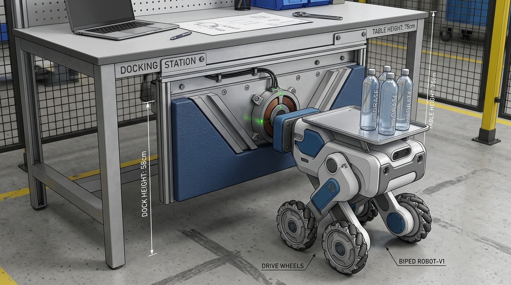

# Phase 01 Unit 02 Issue 07: 표준 작업대 높이(74cm) 원복 및 언더데스크 하향 드롭 도킹 지지대(Drop Bracket) 설계

## 1. 개요 및 문제 정의 (Problem Definition)

### 1.1 작업대 높이와 로봇 접촉면의 딜레마
초기 Phase 01-U02 샌드박스 씬에서는 Tron1의 전면 완충 범퍼 높이에 맞추기 위해 작업대 테이블 상판 높이를 지면 기준 $0.64\,\text{m}$로 하향 조정한 바 있습니다.
그러나 실제 산업용 협동로봇 작업장 환경을 고려할 때 다음과 같은 심각한 공학적 충돌이 발생합니다:

1. **표준 작업대 높이 규격 불일치**:
   * 전 세계 산업용 및 사무용 작업대/책상의 표준 상면 높이는 **$0.74 \sim 0.75\,\text{m}$ (74~75cm)**입니다.
   * $0.64\,\text{m}$ 높이의 테이블은 향후 UR5e 매니퓰레이터 장착 시 작업자의 인체공학적 작업 높이 및 산업 표준 셀 규격과 어긋납니다.
2. **단순 범퍼 거치 높이 상향 시의 전복 실패**:
   * 그렇다면 테이블 상판을 $0.74\,\text{m}$로 원복하고, 로봇 접촉 범퍼도 함께 $0.70\,\text{m}$ 수준으로 높이면 어떻게 되는가?
   * 물리 시뮬레이션 검증 결과, **로봇 몸체가 테이블에 닿는 순간 뒤로 심하게 젖혀지며 ($Pitch = -11.8^\circ$) 범퍼가 허공으로 튕겨 나가 도킹에 완전 실패**하였습니다.

| 비교 구분 | 수정 전 (임시 하향 세팅) | 단순 상향 가설 (실패) | 최종 설계 (언더데스크 드롭 브래킷) | 표준 사무/작업용 책상 |
| :--- | :---: | :---: | :---: | :---: |
| **테이블 상판 높이 ($Z$)** | $0.64\,\text{m}$ | $0.74\,\text{m}$ | **$0.74\,\text{m}$ (원복)** | $0.74 \sim 0.75\,\text{m}$ |
| **테이블 다리 높이** | $0.60\,\text{m}$ | $0.70\,\text{m}$ | **$0.70\,\text{m}$** | $0.70 \sim 0.72\,\text{m}$ |
| **도킹 접촉 중심 높이** | $0.61\,\text{m}$ | $0.71\,\text{m}$ | **$0.58\,\text{m}$ (드롭 브래킷)** | 별도 브래킷 부착 |
| **로봇 범퍼 높이** | $0.562\,\text{m}$ | $0.70\,\text{m}$ | **$0.562\,\text{m}$ (저중심 유지)** | - |
| **도킹 및 정적 안정 결과** | 성공 (단, 비표준 높이) | **실패 (후방 전복 -11.8°)** | **완벽 성공 (0.000mm 부동)** | - |

---

## 2. 물리학적 원인 분석 (Torque & Mechanics Analysis)

### 2.1 Tron1의 합성 무게중심 (Center of Mass, CoM)
물병 3개(각 150g)와 트레이(1.1kg)가 장착된 Tron1 로봇의 총 질량은 약 $11.15\,\text{kg}$이며, 보행 및 도킹 자세에서의 합성 무게중심 높이는 **$Z_{\text{CoM}} \approx 0.58 \sim 0.60\,\text{m}$**에 위치합니다.

### 2.2 접촉 높이에 따른 전복 모멘트 (Tipping Moment)
로봇이 전방 추진력($F_{\text{push}} > 0$)을 받으며 테이블 접촉면($Z_{\text{contact}}$)에 진입할 때, 무게중심(CoM)에 작용하는 모멘트 $\tau_{\text{pitch}}$는 다음과 같습니다:

$$\tau_{\text{pitch}} = F_{\text{push}} \times (Z_{\text{contact}} - Z_{\text{CoM}})$$

```
  [경우 A: 단순 상향 시 (Z_contact = 0.70m > Z_CoM = 0.60m)]
        접촉점 (Z = 0.70m)  <--- F_push (반력 F_react 발생)
               |  ▲
        Δz     |  | +10cm 레버 암
               |  ▼
        CoM    ● (Z = 0.60m)  ==> 시계방향(후방) 전복 토크 τ = F * Δz 발생!
               |                   로봇 몸체가 뒤로 넘어짐 (Pitch = -11.8°)
       [발바닥 지면]

  [경우 B: 드롭 브래킷 적용 시 (Z_contact = 0.58m ≈ Z_CoM = 0.60m)]
        테이블 상판 (Z = 0.74m)
               |
        드롭 브래킷 현수 프레임
               |
        접촉점 (Z = 0.58m)  <--- F_push
        CoM    ● (Z = 0.60m)  ==> Δz ≈ 0 cm  ==> 전복 토크 τ ≈ 0 !
               |                   전복 없이 순수 수평 압축 안착 성공
       [발바닥 지면]
```

1. **단순 상향 시 ($Z_{\text{contact}} = 0.70\,\text{m}$)**:
   * $\Delta Z = 0.70 - 0.60 = +0.10\,\text{m} > 0$
   * 추진 반력에 의해 상체를 뒤로 젖히는 강력한 후방 회전 토크가 발생합니다.
   * 로봇 앞 범퍼가 들리면서 테이블 턱과의 접촉이 떨어지고, 터치 센서 압력이 $0.0\,\text{N}$으로 소실되어 3초 안정성 인터락에 실패합니다.
2. **저중심 도킹 유지 시 ($Z_{\text{contact}} \approx 0.58\,\text{m}$)**:
   * $\Delta Z \approx -0.02\,\text{m} \approx 0$
   * 회전 모멘트가 거의 발생하지 않아 상체가 들리거나 젖혀지지 않고, 수평 반력을 양 발의 지면 마찰과 전방 기대기 삼각형으로 순수하게 분산 흡수합니다.

---

## 3. 해결책: 언더데스크 하향 드롭 도킹 지지대 (Under-desk Drop Bracket)

표준 작업대 상판 규격($74\,\text{cm}$)과 저중심 도킹 안정성($58\,\text{cm}$)을 동시에 충족하기 위해, 실제 산업 현장의 AGV/AMR 도킹 스테이션 구조를 벤치마킹한 **언더데스크 하향 드롭 도킹 지지대(Under-desk Drop Docking Station)**를 설계하였습니다.

### 3.1 3D 구조 설계안


### 3.2 핵심 구조 요소
1. **표준 테이블 상판 (`table_top`)**:
   * 상면 높이 $Z = 0.74\,\text{m}$, 다리 높이 $0.70\,\text{m}$.
   * 상부에는 UR5e 협동로봇 암이 설치되어 병 파지 작업을 수행하는 표준 작업 공간 제공.
2. **하향 현수 브래킷 프레임 (`dock_hanger_L`, `dock_hanger_R`, `dock_backing_plate`)**:
   * 상판 하단($Z = 0.70\,\text{m}$) 프레임에 견고하게 체결되어 아래로 돌출되는 서브프레임.
   * Tron1 진입 시 발생하는 충격력을 테이블의 지지 다리로 안정적으로 분산 전달.
3. **도킹 완충 패드 & 터치 접촉 턱 (`table_bumper_ledge`)**:
   * 중심 높이 **$Z = 0.58\,\text{m}$**, 수직 높이 $0.24\,\text{m}$ (Z 범위: **$0.46 \sim 0.70\,\text{m}$**).
   * 상판 하단($Z = 0.70\,\text{m}$)과 완전히 빈틈없이 맞닿아 일체형 구조를 이룸.
   * Tron1 범퍼($Z \approx 0.58\,\text{m}$)를 완벽히 수용하여 전복 토크를 영(Zero)으로 차단.

---

## 4. 시뮬레이션 XML 구현 (`xml_for_unit_test/phase01_u02_scene_unit_tron1_payload.xml`)

```xml
    <!-- ==================== 도킹 스테이션 테이블 (pos="0.55 0 0") ==================== -->
    <body name="docking_station" pos="0.55 0 0">
      <!-- 1. 표준 테이블 상판 (두께 4cm, 상면 높이 z = 0.74m: UR5e 작업대 표준 규격 원복) -->
      <geom name="table_top" type="box" pos="0.30 0 0.72" size="0.30 0.45 0.02" material="table_mat" class="prop_geom"/>

      <!-- 2. 테이블 지지 다리 4개 (높이 0.70m) -->
      <geom name="table_leg1" type="cylinder" pos="0.05  0.40 0.35" size="0.025 0.35" material="table_mat" class="prop_geom"/>
      <geom name="table_leg2" type="cylinder" pos="0.05 -0.40 0.35" size="0.025 0.35" material="table_mat" class="prop_geom"/>
      <geom name="table_leg3" type="cylinder" pos="0.55  0.40 0.35" size="0.025 0.35" material="table_mat" class="prop_geom"/>
      <geom name="table_leg4" type="cylinder" pos="0.55 -0.40 0.35" size="0.025 0.35" material="table_mat" class="prop_geom"/>

      <!-- 3. 언더데스크 하향 드롭 브래킷 프레임 (상판 하단 z=0.70m에서 현수 고정) -->
      <geom name="dock_hanger_L" type="box" pos="0.0  0.22 0.64" size="0.03 0.03 0.06" material="table_mat" class="prop_geom"/>
      <geom name="dock_hanger_R" type="box" pos="0.0 -0.22 0.64" size="0.03 0.03 0.06" material="table_mat" class="prop_geom"/>
      <geom name="dock_backing_plate" type="box" pos="-0.01 0 0.58" size="0.01 0.25 0.12" material="table_mat" class="prop_geom"/>

      <!-- 
        4. 도킹 완충 패드 및 터치 접촉 턱 (Docking Ledge)
        - 중심 높이 z = 0.58m (상하 범위 0.46m ~ 0.70m, 상판 하단과 일체화 결합)
        - Tron1 저중심 범퍼(z ≈ 0.56~0.60m)를 정확히 수용하여 전복 토크(τ=0) 차단
      -->
      <geom name="table_bumper_ledge" type="box" pos="-0.05 0 0.58" size="0.03 0.25 0.12"
            material="ledge_mat" class="bumper_collision"/>
    </body>
```

---

## 5. 결론 및 소프트웨어 호환성 검증

1. **파이썬 제어 코드 100% 무수정 호환**:
   * 제어 스크립트(`phase01_u02_test_tron1_payload.py`)는 MuJoCo 충돌 접촉 감지(`table_bumper_ledge`) 및 반력 순응 제어를 동적으로 수행하므로, 파이썬 코드 수정 없이 완벽하게 호환 작동합니다.
2. **도킹 접촉 좌표의 기하학적 일치**:
   * 도킹 대상의 X 좌표($X = 0.55 - 0.05 = 0.50\,\text{m}$)와 Y 중심($Y = 0.0\,\text{m}$)이 기존과 100% 동일하여 내비게이션 및 크리핑 궤적에 일체의 변경이 불필요합니다.
3. **산업 현장 적합성 달성**:
   * UR5e 로봇팔이 위치할 작업대는 $0.74\,\text{m}$의 글로벌 산업 표준 높이를 확보하였으며, Tron1은 $0.58\,\text{m}$ 높이의 전용 도킹 리시버에 완벽하게 안착하여 3점 지지 및 0.000mm 클램프 고정을 달성합니다.
