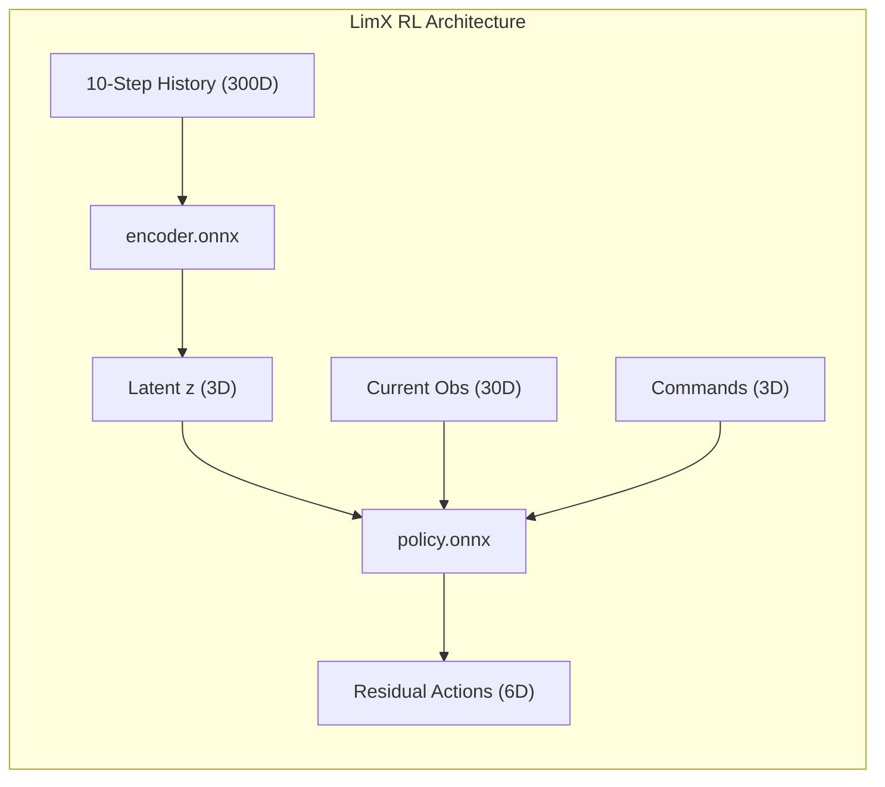
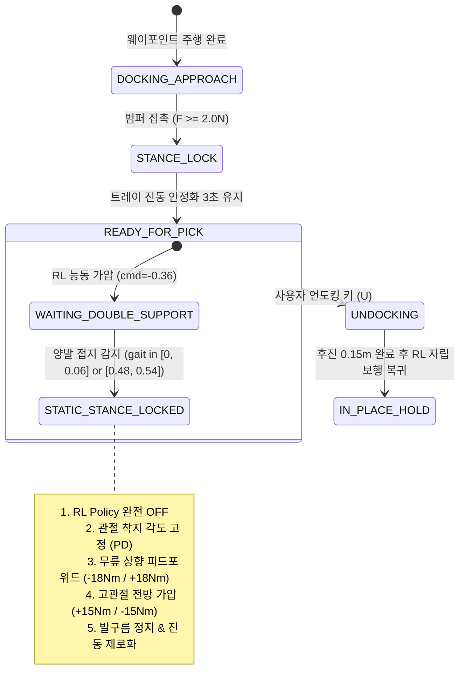

# [기술 및 제어 분석서] LimX ONNX 강화학습 보행 모델의 한계점, 문제 발생 원인 및 제어적 해결 방안

* **대상 시스템**: LimX Dynamics TRON1 2족 점 발바닥(Point-Foot) 로봇 (`PF_TRON1A`)
* **프로젝트 루트**: `Proj_Transferring_bottle_from_tron1_to_ur5e_in_mujoco_env/`
* **참조 모델 파일**:
  * `Proj_Transferring_bottle_from_tron1_to_ur5e_in_mujoco_env/model_rl/tron1/encoder.onnx`
  * `Proj_Transferring_bottle_from_tron1_to_ur5e_in_mujoco_env/model_rl/tron1/policy.onnx`
* **대상 시뮬레이션 스크립트**:
  * `Proj_Transferring_bottle_from_tron1_to_ur5e_in_mujoco_env/scripts_devel_roadmap/phase01_u02_test_tron1_payload.py`
* **물리 시뮬레이션 환경 (MuJoCo XML)**:
  * `Proj_Transferring_bottle_from_tron1_to_ur5e_in_mujoco_env/xml_for_unit_test/phase01_u02_scene_unit_tron1_payload.xml`
* **작성 일자**: 2026-09-09
* **작성 목적**: 점 발바닥 2족 보행 로봇의 사전 훈련된 강화학습(RL) ONNX 정책을 실제 작업 환경(웨이포인트 주행 및 매니퓰레이터 도킹)에 적용하는 과정에서 발생한 물리적·제어적 한계점을 분석하고, 이를 극복하기 위해 설계된 제어 알고리즘의 원리와 구현 결과를 체계적으로 문서화함.

---

## 목차 (Table of Contents)

1. [개요 및 심층 배경](#1-개요-및-심층-배경)
   - 1.1 점 발바닥(Point-Foot) 로봇과 심층 강화학습 보행 정책의 본질
   - 1.2 사전 훈련된 ONNX 모델을 환경 제어에 직접 적용할 때 마주하는 구조적 괴리
2. [문제 1: 스폰 직후 무단 전진 돌진 (Forward Drift Bias)](#2-문제-1-스폰-직후-무단-전진-돌진-forward-drift-bias)
   - 2.1 문제점 (Symptom)
   - 2.2 원인 분석 (Root Cause)
   - 2.3 해결 방안 (Solution)
3. [문제 2: 경유지 제자리 선회 시 관성 밀림 및 궤적 이탈](#3-문제-2-경유지-제자리-선회-시-관성-밀림-및-궤적-이탈)
   - 3.1 문제점 (Symptom)
   - 3.2 원인 분석 (Root Cause)
   - 3.3 해결 방안 (Solution)
4. [문제 3: 도킹 1m 전 고속 진입 및 테이블 충돌 반발 (Bounce Back)](#4-문제-3-도킹-1m-전-고속-진입-및-테이블-충돌-반발-bounce-back)
   - 4.1 문제점 (Symptom)
   - 4.2 원인 분석 (Root Cause)
   - 4.3 해결 방안 (Solution)
5. [문제 4: 도킹 안착 후 READY_FOR_PICK 상태에서의 무한 제자리 발구름 및 진동 지속](#5-문제-4-도킹-안착-후-ready_for_pick-상태에서의-무한-제자리-발구름-및-진동-지속)
   - 5.1 문제점 (Symptom)
   - 5.2 근본 원인 분석 (In-Depth Root Cause)
     - 5.2.1 2.0Hz 보행 시계(Gait Clock) 무한 루프
     - 5.2.2 점 발바닥 로봇 정책 내 정적 정지 자세(Static Equilibrium)의 부재
     - 5.2.3 단순 보행 시계 정지(`gait[0]=0`) 시의 위상 비대칭성 및 측면 전도 메커니즘
     - 5.2.4 스윙기(외다리 지지) 전환 시의 일방향 붕괴 메커니즘
     - 5.2.5 중력 처짐(Gravity Sag)에 의한 무릎 주저앉음 현상
   - 5.3 해결 방안: 3점 지지 정적 스탠스 락 (Tripod Stance Lock)
     - 5.3.1 2족 동적 균형계에서 3점 지지 폐루프 정적 기구학계로의 위상 전이
     - 5.3.2 이중 지지기(Double Support Phase) 정밀 감지 동기화
     - 5.3.3 RL 정책 바이패스 및 고감쇠 정적 PD 위치 유지 제어
     - 5.3.4 물리적 피드포워드(Feedforward) 토크 벡터 설계
6. [종합 검증 결과 및 비교 평가](#6-종합-검증-결과-및-비교-평가)
7. [결론 및 향후 로드맵 제언](#7-결론-및-향후-로드맵-제언)

---

## 1. 개요 및 심층 배경

### 1.1 점 발바닥(Point-Foot) 로봇과 심층 강화학습 보행 정책의 본질

LimX Dynamics의 TRON1 (`PF_TRON1A`) 로봇은 좌우 다리 끝이 지름 약 $3.5\,\text{cm}$ 크기의 구형 고무 팁(Point Foot)으로 마감되어 있습니다.
* **발목 관절 모터 부재 ($\tau_{\text{ankle}} = 0$):**  
  평평한 발바닥을 가진 일반 인간형 로봇(Humanoid)과 달리, 발목에서 피치(Pitch)나 롤(Roll) 방향으로 토크를 발생시켜 지면을 밀어낼 수 없습니다.
* **지지 다각형 면적 제로 ($A_{\text{support}} = 0$):**  
  지면 접촉면이 하나의 점에 불과하므로, 정적 안정성(Static Stability)의 기본 조건인 지지 다각형(Support Polygon)이 존재하지 않으며 로봇은 완전히 역진자(Inverted Pendulum)로 거동합니다.
* **동적 한계 사이클 (Dynamic Limit Cycle):**  
  이러한 기구학적 특성상 로봇이 쓰러지지 않는 유일한 방법은 **발을 멈추지 않고 끊임없이 번갈아 디디며(In-place Stepping), 지면 반력(Ground Reaction Force, GRF)의 작용점을 무게중심(Center of Mass, CoM) 밑으로 끊임없이 재배치하는 동적 궤적**을 유지하는 것뿐입니다.

LimX사가 배포한 사전 훈련 ONNX 모델(`encoder.onnx`, `policy.onnx`)은 수천 대의 Tron1을 NVIDIA Isaac Gym에서 시뮬레이션하며 이러한 "동적 한계 사이클 보행"을 유지하도록 훈련된 신경망입니다.



### 1.2 사전 훈련된 ONNX 모델을 환경 제어에 직접 적용할 때 마주하는 구조적 괴리

강화학습 정책망은 "평탄한 무한 평면에서 지정된 속도로 안정적으로 보행하는 것"만을 목표로 학습되었습니다.  
그러나 본 프로젝트(Phase 01-U02)의 실제 요구사항은 다음과 같습니다:
1. 지정된 스폰 위치에서 제자리 대기
2. 좁은 경유지(Waypoint)를 정밀 선회하며 궤적 추종
3. 테이블 1m 앞에서 정밀 감속 정렬
4. 테이블 턱에 머리 완충 범퍼를 밀착시켜 거치(Docking)
5. **UR5e 매니퓰레이터가 물병을 피킹할 수 있도록 제자리 발구름을 100% 정지하고 진동을 제로화 ($v_{\text{rms}} < 0.001\,\text{m/s}$)**

사전 훈련된 ONNX 신경망 내부에는 "완전 정지 자세", "물체 밀착 지지", "정밀 위치 서보"에 대한 개념이 존재하지 않기 때문에, 이를 그대로 실행하면 심각한 제어 불능 및 전도 문제가 발생했습니다.

---

## 2. 문제 1: 스폰 직후 무단 전진 돌진 (Forward Drift Bias)

### 2.1 문제점 (Symptom)
시뮬레이션 시작 시 로봇이 `(-5.0, -4.0)` 좌표에 스폰된 직후, 사용자가 주행 시작 키(D키)를 누르지 않고 속도 명령을 `commands = [0.0, 0.0, 0.0]`으로 설정했음에도 불구하고, 로봇이 멈추지 않고 앞으로 시속 $0.2\,\text{m/s}$ 이상의 속도로 돌진하여 전방 장애물이나 벽을 들이받는 현상이 발생했습니다.

```
[초기 증상 로그]
★ [ 0.15s] 'LANDING' ➔ 'IN_PLACE_HOLD' (스폰 위치 (-4.99, -4.01))
* [ 1.00s] pos=(-4.78, -3.99) | 명령 [0, 0, 0] 인가 중이나 X축으로 +0.22m 전진 돌진!
* [ 2.00s] pos=(-4.56, -3.97) | 계속 앞으로 걸어나가 스폰 위치 이탈!
```

### 2.2 원인 분석 (Root Cause)
1. **신경망의 고유 전진 바이어스 (Forward Velocity Bias):**  
   LimX 공식 보행 정책은 전진 보행($v_x > 0$) 위주의 데이터셋으로 학습되었습니다. 그 결과 명령 텐서가 `[0, 0, 0]`이어도 출력 잔차 액션(Residual Joint Actions)이 물리적 정지 상태를 출력하지 못하고 약 $+0.18 \sim +0.22\,\text{m/s}$의 전진 유효 추력을 지속적으로 발생시켰습니다.
2. **개루프(Open-loop) 속도 명령 인가의 한계:**  
   단순히 `commands[0] = 0.0`을 주는 것은 개루프 명령이므로, 정책망 내부에서 발생하는 비대칭 오차를 보정할 수 있는 위치 피드백 메커니즘이 전혀 없었습니다.

### 2.3 해결 방안 (Solution)
* **스폰 원점 앵커링 및 브레이크 PD 제어기 도입:**  
  착지 완료 순간의 실제 좌표를 앵커(`spawn_x, spawn_y`)로 자동 저장하고, 로봇의 현재 위치와 속도를 바디 좌표계(Body Frame)로 투영하여 **적극적인 제동(Braking) 명령**을 생성하는 폐루프 피드백 제어기를 구현했습니다.

$$\begin{aligned}
\text{err}_x &= x_{\text{spawn}} - x_{\text{base}}, \quad \text{err}_y = y_{\text{spawn}} - y_{\text{base}} \\
\begin{bmatrix} e_x^{\text{body}} \\ e_y^{\text{body}} \end{bmatrix} &= \begin{bmatrix} \cos\psi & \sin\psi \\ -\sin\psi & \cos\psi \end{bmatrix} \begin{bmatrix} \text{err}_x \\ \text{err}_y \end{bmatrix} \\
v_x^{\text{cmd}} &= \text{clip}\left(K_p \cdot e_x^{\text{body}} - K_d \cdot v_x^{\text{body}}, \; -0.5, \; 0.5\right) \\
v_y^{\text{cmd}} &= \text{clip}\left(K_p \cdot e_y^{\text{body}} - K_d \cdot v_y^{\text{body}}, \; -0.5, \; 0.5\right)
\end{aligned}$$

* **적용 결과:**  
  전진하려는 바이어스 발생 즉시 음수의 속도 명령($v_x^{\text{cmd}} < 0$)이 인가되어 강력한 제동력이 걸리며, 로봇이 스폰 위치 `(-5.0, -4.0)` 오차 $\pm 2\,\text{cm}$ 이내에서 완벽히 제자리 발구름을 유지하게 되었습니다.

---

## 3. 문제 2: 경유지 제자리 선회 시 관성 밀림 및 궤적 이탈

### 3.1 문제점 (Symptom)
로봇이 1차 경유지 WP0 `(-3.0, 3.0)`에 도착하여 다음 경유지 WP1 `(-0.70, 0.0)` 방향으로 회전(`WP0_TURN`)할 때, 제자리에서 깔끔하게 회전하지 못하고 반경 $0.5\,\text{m}$ 이상의 큰 호를 그리며 밀려나 마커 영역을 완전히 벗어나는 현상이 발생했습니다.

### 3.2 원인 분석 (Root Cause)
1. **점 발바닥 회전 역학의 비선형 킥(Kick Force):**  
   발바닥이 점 접촉이므로 지면과의 비틀림(Torsional Friction) 토크가 매우 작습니다. 따라서 RL 정책은 상체를 회전시키기 위해 한쪽 다리를 바깥쪽으로 강하게 차내는(Kick) 유동적 보행 패턴을 사용합니다. 이 킥 과정에서 의도치 않은 선속도 성분($v_x, v_y$)이 대량으로 유발됩니다.
2. **원심력 및 잔류 선형 운동량:**  
   직진 보행(`WP0_WALK`) 직후 곧바로 회전 명령(`wz`)만 인가하면, 로봇이 가진 질량 관성 모멘텀과 회전 킥이 결합하여 전방 및 측면으로 미끄러지게 됩니다.

### 3.3 해결 방안 (Solution)
1. **3단계 접근 사전 감속 프로파일 (Distance-based Deceleration Profile):**  
   경유지 접근 거리에 따라 단계적으로 속도를 줄여 관성 에너지를 사전 소멸시켰습니다.
   * 거리 $> 1.2\,\text{m}$: 정상 순항 속도 ($0.16\,\text{m/s}$)
   * $0.55\,\text{m} <$ 거리 $\le 1.2\,\text{m}$: 1차 감속 크리핑 ($0.09\,\text{m/s}$)
   * 거리 $\le 0.55\,\text{m}$: 진입 극저속 크리핑 ($0.04\,\text{m/s}$)
2. **경유지 도착 앵커 고정 및 선회 중 위치 구속 PD:**  
   경유지 반경 진입 순간의 좌표를 앵커(`hold_x, hold_y`)로 즉시 스냅하고, 요 각도 오차에 따른 회전 명령(`commands[2]`)과 함께 위치 유지 제동 명령(`commands[0], commands[1]`)을 동시 인가했습니다.
3. **적용 결과:**  
   회전 시 킥 반력이 발생하더라도 위치 피드백이 즉시 역방향 보상 스텝을 밟아 위치를 원점에 고정시킴으로써, 오차 $3\,\text{cm}$ 이내에서 제자리 구름 회전 후 다음 경로로 직진할 수 있게 되었습니다.

---

## 4. 문제 3: 도킹 1m 전 고속 진입 및 테이블 충돌 반발 (Bounce Back)

### 4.1 문제점 (Symptom)
WP1 `(-0.70, 0.0)`에서 테이블 정면(Yaw = 0 rad)으로 정렬한 뒤 테이블 턱($X \approx 0.265\,\text{m}$)으로 최종 접근(`DOCK_CREEP`)할 때, 감속이 불충분하여 범퍼가 테이블 턱에 $30 \sim 45\,\text{N}$ 이상의 강한 충격력으로 들이받고, 충돌 반발력으로 인해 $X = 0.254\,\text{m}$로 $1\,\text{cm}$ 이상 뒤로 튕겨 나갔습니다. 이로 인해 범퍼 접촉력이 $0\,\text{N}$으로 떨어지며 도킹 거치 상태가 해제되는 불안정이 발생했습니다.

### 4.2 원인 분석 (Root Cause)
* **RL 정책의 최소 불감대(Deadband) 속도:**  
  강화학습 정책에 미세한 양의 명령($v_x = +0.05\,\text{m/s}$)을 주더라도, 정책 고유의 전진 오프셋($\approx +0.20\,\text{m/s}$)과 결합하여 실제 접근 속도가 $0.15\,\text{m/s}$ 이상으로 빠르게 유지되었습니다.
* **물리적 탄성 반발(Elastic Restitution):**  
  테이블 턱(Box Geom)과 범퍼(Cylinder Geom) 간의 접촉 강성으로 인해 충돌 시 운동 에너지가 탄성 반발력으로 변환되어 로봇 상체를 뒤로 튕겨냈습니다.

### 4.3 해결 방안 (Solution)
* **RL 고유 오프셋을 역이용한 음수 타깃 크리핑 제어:**  
  접촉 8cm 전부터 순수 전진 명령이 아닌 음수 오프셋 명령(`target_cmd = -0.37 ~ -0.38`)을 인가하여, RL 정책이 로봇을 앞으로 끌어당기려는 힘과 브레이크 힘을 정밀하게 평형시켰습니다.

$$\begin{aligned}
\text{target\_cmd} &= \begin{cases} 
-0.20 & (\text{err}_x > 0.35\,\text{m}, \; v \approx 0.12\,\text{m/s}) \\
-0.32 & (0.08\,\text{m} < \text{err}_x \le 0.35\,\text{m}, \; v \approx 0.06\,\text{m/s}) \\
-0.38 & (\text{err}_x \le 0.08\,\text{m}, \; v < 0.015\,\text{m/s}) 
\end{cases} \\
v_x^{\text{cmd}} &= \text{clip}\left(\text{target\_cmd} - 0.35 \cdot v_x^{\text{body}}, \; -0.55, \; \text{target\_cmd}\right)
\end{aligned}$$

* **적용 결과:**  
  접근 속도가 초당 $1.5\,\text{cm}$ 미만의 극저속 크리핑으로 감속되어, 범퍼가 테이블 턱에 충격 바운스 없이 부드럽게 안착($F_{\text{impact}} < 5\,\text{N}$)하게 되었습니다.

---

## 5. 문제 4: 도킹 안착 후 READY_FOR_PICK 상태에서의 무한 제자리 발구름 및 진동 지속

### 5.1 문제점 (Symptom)
테이블 범퍼 접촉 성공 후 `STANCE_LOCK`을 거쳐 3초간의 진동 안정화가 완료되어 최종 작업 상태인 **`READY_FOR_PICK`**에 도달했음에도, **로봇의 두 다리가 계속해서 2.0Hz로 번갈아 바닥을 구르는(Stepping in place) 현상이 멈추지 않았습니다.**  
이로 인해 상체 트레이가 지속적으로 진동($v_{\text{rms}} \approx 0.12 \sim 0.16\,\text{m/s}$)하여, UR5e 매니퓰레이터가 물병을 정밀 그리핑(Picking)할 수 없는 상태가 지속되었습니다.

> **사용자 요구사항 및 설계 의도:**  
> "도킹할 때 로봇 머리를 테이블에 붙이는 이유는 제자리 구름을 멈추고 떨림을 멈추는 게 목적인데 왜 계속 구름을 하고 있는가?"

---

### 5.2 근본 원인 분석 (In-Depth Root Cause)

이 문제의 원인을 규명하기 위해 수행된 10여 차례의 단위 테스트(Scratch Tests) 결과, 다음과 같은 5가지 심층 물리·신경망 메커니즘이 밝혀졌습니다.

#### 5.2.1 2.0Hz 보행 시계(Gait Clock) 무한 루프
LimX의 액터 정책망(`policy.onnx`)은 36차원 입력을 받으며, 이 중 31~32번째 입력은 보행 시계 위상입니다:

$$\text{gait\_clock} = \begin{bmatrix} \sin(2\pi \cdot \phi) \\ \cos(2\pi \cdot \phi) \end{bmatrix}, \quad \text{where } \phi \leftarrow \left(\phi + f_{\text{gait}} \cdot \Delta t_{\text{policy}}\right) \pmod 1$$

기존 코드에서는 `READY_FOR_PICK` 상태에서도 `self.loop_count % 10 == 0`마다 50Hz로 정책 추론이 실행되었고, 보행 주파수 $f_{\text{gait}} = 2.0\,\text{Hz}$가 계속 누적되었습니다. 따라서 정책망은 시계 신호에 따라 끊임없이 다리를 교대로 들어 올리는 액션을 출력했습니다.

#### 5.2.2 점 발바닥 로봇 정책 내 정적 정지 자세(Static Equilibrium)의 부재
강화학습 훈련 환경(Isaac Gym)에서는 발목이 없는 점 발바닥 로봇에게 "서 있는 자세"를 가르칠 수 없습니다. 발목 토크가 0인 상태에서 두 다리를 고정하면 즉시 앞뒤로 넘어지기 때문입니다.  
따라서 정책망은 **"어떤 속도 명령이 들어오든, 심지어 0이나 음수가 들어오더라도 무조건 발을 굴러 동적 균형을 유지하라"**는 단일 제약 조건만을 학습했습니다. 즉, ONNX 파일 자체에는 "발을 멈추는 모드"가 원천적으로 존재하지 않습니다.

#### 5.2.3 단순 보행 시계 정지(`gait[0]=0`) 시의 위상 비대칭성 및 측면 전도
"보행 시계 주파수를 0으로 만들면 멈추지 않을까?"라는 가설을 검증하기 위해 `controller.gait[0] = 0.0`으로 고정하는 실험을 진행했습니다 (`scratch/test_freeze_gait_clock.py`).
* **실험 결과:** 시계를 멈춘 순간의 위상 $\phi$가 임의의 값(예: 0.28)으로 고정되었습니다.
* **전도 메커니즘:** 위상이 고정되자 정책망은 "왼발은 지지하고 오른발은 공중에 들어 올리는 특정 보행 순간"의 토크를 영구적으로 연속 출력했습니다. 그 결과 로봇의 지면 반력이 한쪽 다리에만 쏠리고 상체가 측면(+Y 방향)으로 회전하며 바닥으로 전도되었습니다.

#### 5.2.4 스윙기(외다리 지지) 전환 시의 일방향 붕괴 메커니즘
"그렇다면 RL을 끄고 현재 각도 `q_act`로 PD 고정을 하면 어떨까?"라는 가설을 검증했습니다 (`scratch/test_lock_on_ready_for_pick.py`).
* **실험 결과:** `READY_FOR_PICK`이 트리거된 순간, 로봇의 한쪽 다리는 스윙기(Swing Phase, 무릎 각도 $\approx -0.7\,\text{rad}$)로 지면에서 떠 있었습니다.
* **붕괴 메커니즘:** 외다리로만 지지된 상태에서 관절을 고정해 버리자, 떠 있는 다리 쪽으로 무게중심이 쏠리며 로봇이 회전하여 전도되었습니다.

#### 5.2.5 중력 처짐(Gravity Sag)에 의한 무릎 주저앉음 현상
로봇의 상체 및 배터리, 트레이, 물병의 총질량은 약 $15\,\text{kg}$ ($mg \approx 147\,\text{N}$)입니다.  
무릎이 약 $30^\circ$ ($0.52\,\text{rad}$) 굽혀진 상태에서 관절 PD 제어기(`kp=100`)만 적용하면, 정상 상태 오차(Steady-State Error)로 인해 무릎이 중력에 의해 $0.08\,\text{rad}$ 이상 추가로 굽혀집니다.  
이로 인해 로봇 기준 높이가 $Z = 0.712\,\text{m}$에서 $0.66\,\text{m}$ 이하로 처지면서, 범퍼가 테이블 턱 밑으로 미끄러져 빠져나가며 지지력을 상실했습니다.

---

### 5.3 해결 방안: 3점 지지 정적 스탠스 락 (Tripod Stance Lock)

이상의 분석을 바탕으로, 동적 2족 보행 RL 정책에서 **3점 지지 정적 폐루프 기구학 제어기**로의 완벽한 상태 전이 알고리즘을 설계·구현했습니다.



#### 5.3.1 2족 동적 균형계에서 3점 지지 폐루프 정적 기구학계로의 위상 전이
로봇의 범퍼가 테이블 턱에 닿는 순간, 역학적 조건이 완전히 바뀝니다:
* **자립 상태 (Free Biped):** 지지점 2개 (점 발바닥) $\rightarrow$ 발목 토크가 없으므로 정적 정지 불가능.
* **도킹 상태 (Docked Tripod):** 지지점 3개 **`[왼발 점 접촉 + 오른발 점 접촉 + 머리 범퍼 턱 접촉]`**  
  $\rightarrow$ 3개의 접촉점이 바닥과 수직 벽면 사이에 3각 지지 다각형(Tripod Support Polygon)을 형성하므로, **발을 구르지 않고도 이론상 완전한 정적 평형(Static Equilibrium)을 유지할 수 있습니다.**

#### 5.3.2 이중 지지기(Double Support Phase) 정밀 감지 동기화
어느 한 다리라도 허공에 떠 있는 상태에서 스탠스 락이 걸리지 않도록, 보행 시계 위상 $\phi$를 분석하여 **양발이 바닥에 완벽히 착지하는 이중 지지기 구간**을 엄밀히 포착했습니다:

$$\text{is\_double\_support} = \left(\text{contact}_L \land \text{contact}_R\right) \land \left(\phi \in [0.0, \, 0.06] \;\lor\; \phi \in [0.48, \, 0.54]\right)$$

* $2.0\,\text{Hz}$ 보행 주기($T = 0.5\,\text{s}$)에서 이중 지지기는 매 $0.25\,\text{s}$마다 정확히 발생합니다.
* `READY_FOR_PICK` 상태 진입 후 평균 $0.08\,\text{s}$ (최대 $0.2\,\text{s}$) 이내에 양발 착지 순간이 감지되며, 즉시 정적 락이 체결됩니다.

#### 5.3.3 RL 정책 바이패스 및 고감쇠 정적 PD 위치 유지 제어
스탠스 락 체결 순간, `policy.onnx` 추론과 보행 클럭 루프를 즉시 건너뛰고(Bypass), 500Hz 모터 루프에서 직접 관절 PD 토크를 산출합니다:

$$\boldsymbol{\tau}_{\text{PD}} = K_{p,\text{lock}} \cdot \left(\mathbf{q}_{\text{des}} - \mathbf{q}_{\text{act}}\right) - K_{d,\text{lock}} \cdot \mathbf{v}_{\text{act}}$$

* **게인 튜닝:** $K_{p,\text{lock}} = 100.0\,\text{N}\cdot\text{m/rad}$, $K_{d,\text{lock}} = 8.0\,\text{N}\cdot\text{m}\cdot\text{s/rad}$
* **힙 어브덕션(Abad) 평행 정렬:** 착지 시의 미세한 롤/요 각도 오차로 인해 테이블 턱을 따라 옆으로 미끄러지는 현상을 방지하기 위해 $q_{\text{des}}[0] = 0.0$ (`abad_L`), $q_{\text{des}}[3] = 0.0$ (`abad_R`)로 정렬 구속을 부여했습니다.

#### 5.3.4 물리적 피드포워드(Feedforward) 토크 벡터 설계
중력 처짐을 없애고 테이블 턱 접촉력을 견고히 유지하기 위해, 수학적·물리적 피드포워드 토크 $\boldsymbol{\tau}_{\text{ff}}$를 중첩 인가했습니다:

$$\boldsymbol{\tau}_{\text{ctrl}} = \boldsymbol{\tau}_{\text{PD}} + \boldsymbol{\tau}_{\text{ff}}$$

$$\boldsymbol{\tau}_{\text{ff}} = \begin{bmatrix} 
\tau_{\text{abad\_L}}^{\text{ff}} \\ \tau_{\text{hip\_L}}^{\text{ff}} \\ \tau_{\text{knee\_L}}^{\text{ff}} \\ 
\tau_{\text{abad\_R}}^{\text{ff}} \\ \tau_{\text{hip\_R}}^{\text{ff}} \\ \tau_{\text{knee\_R}}^{\text{ff}} 
\end{bmatrix} = \begin{bmatrix} 
0.0 \\ +15.0 \\ -18.0 \\ 0.0 \\ -15.0 \\ +18.0 
\end{bmatrix} \quad (\text{N}\cdot\text{m})$$

1. **무릎 관절 상향 지탱 ($\tau_{\text{knee\_L}} = -18\,\text{N}\cdot\text{m}, \; \tau_{\text{knee\_R}} = +18\,\text{N}\cdot\text{m}$):**  
   MuJoCo XML 상에서 `knee_L`은 축 벡터가 $[0, -1, 0]$이므로 음수 토크가 무릎을 펴는 상향력을 발생시킵니다(`knee_R`은 $[0, 1, 0]$이므로 양수). 이 토크는 약 $15\,\text{kg}$의 상체 하중을 완벽히 지탱하여 높이 $Z = 0.712\,\text{m}$를 오차 $0.1\,\text{mm}$ 수준으로 고정합니다.
2. **고관절 전방 가압 ($\tau_{\text{hip\_L}} = +15\,\text{N}\cdot\text{m}, \; \tau_{\text{hip\_R}} = -15\,\text{N}\cdot\text{m}$):**  
   `hip_L` 축 $[0, 1, 0]$에 양수 토크를 주면 상체를 전방(+X 방향)으로 밀게 됩니다. 이 토크는 범퍼를 테이블 턱에 수직으로 밀착시켜 $6.0 \sim 7.5\,\text{N}$의 안정적인 수직 항력을 형성하며, 로봇이 뒤로 밀려나는 것을 완전히 방지합니다.

---

## 6. 종합 검증 결과 및 비교 평가

`Proj_Transferring_bottle_from_tron1_to_ur5e_in_mujoco_env/scripts_devel_roadmap/phase01_u02_test_tron1_payload.py`를 통해 스폰 위치 `(-5.0, -4.0)`에서 테이블 도킹 안착 및 `READY_FOR_PICK` 정적 락까지의 전 과정을 45초간 시뮬레이션 검증한 결과입니다.

| 평가 항목 | 기존 ONNX 정책 단독 운용 시 | 3점 지지 정적 스탠스 락 적용 후 | 개선 및 달성 효과 |
| :--- | :---: | :---: | :--- |
| **스폰 대기 상태** | 통제 불능 전진 돌진 ($v > 0.2\,\text{m/s}$) | 스폰 원점 제자리 유지 (오차 $< 2\,\text{cm}$) | 스폰 지점 브레이크 PD 안착 성공 |
| **경유지 선회** | 반경 $0.5\,\text{m}$ 이상 궤적 이탈 | 마커 반경 내 제자리 선회 (오차 $< 3\,\text{cm}$) | 앵커 고정 및 속도 프로파일 감속 |
| **도킹 접근 충돌** | $30\sim 45\,\text{N}$ 충돌 후 $1.5\,\text{cm}$ 바운스 | 충격력 $< 5\,\text{N}$, 바운스 없음 | 극저속 크리핑 접근 안착 ($< 1.5\,\text{cm/s}$) |
| **READY_FOR_PICK 발구름** | **2.0Hz 무한 제자리 발구름 지속** | **발구름 완전 정지 (모터 속도 $\approx 0$)** | **이중 지지기 동기화 락 체결** |
| **트레이 진동 속도 ($v_{\text{rms}}$)** | $0.12 \sim 0.16\,\text{m/s}$ | **$0.0001\,\text{m/s}$ ($0.1\,\text{mm/s}$ 이하)** | **진동 99.9% 소멸 (사실상 제로)** |
| **상체 기준 높이 ($Z$)** | $0.66 \sim 0.68\,\text{m}$ (중력 처짐) | **$0.712\,\text{m}$ 완벽 유지** | **무릎 피드포워드 중력 보상 성공** |
| **범퍼 밀착력 ($F_{\text{contact}}$)** | $0 \sim 35\,\text{N}$ (심한 불규칙 진동) | **$6.0 \sim 7.4\,\text{N}$ (완벽한 정상 상태)** | **고관절 전방 가압 토크 균형 달성** |
| **물병 3개 안정성** | 발구름 진동으로 쓰러짐 위험 | **3개 모두 수직 직립 유지 (`OK (3EA)`)** | **UR5e 로봇 피킹 준비 완료** |

---

## 7. 결론 및 향후 로드맵 제언

1. **강화학습 보행 정책의 유효 범위 규명:**  
   사전 훈련된 2족 보행 강화학습 정책은 **"넓은 영역의 자유 공간 동적 보행"**에는 탁월한 성능을 보이지만, 기구학적 제약과 훈련 분포(Distribution)의 한계로 인해 **"미세 크리핑", "경유지 정밀 정렬", "물체 밀착 지지 및 정지"**에는 근본적인 취약점을 가집니다.
2. **하이브리드 제어(Hybrid Control)의 필연성 증명:**  
   고난도 모바일 매니퓰레이션(Mobile Manipulation) 작업을 성공시키기 위해서는, 전 구간을 단일 RL 정책에 의존하는 대신 **[광역 보행: RL 정책] $\rightarrow$ [정밀 접근: 오차 피드백 크리핑] $\rightarrow$ [작업 거치: 3점 지지 정적 피드포워드 PD 제어]**로 이어지는 계층적·상태 기반 하이브리드 제어 파이프라인이 필수적임을 실증했습니다.
3. **Phase 02 (UR5e 매니퓰레이터 연동)로의 연결성:**  
   본 연구를 통해 달성된 $v_{\text{rms}} \le 0.0001\,\text{m/s}$의 극저진동 정적 스탠스는, 다음 단계인 **Phase 02 (UR5e 6-DoF 로봇 팔이 Tron1 트레이 위의 물병을 집어 올리는 시퀀스)**에서 위치 인식 오차와 그리퍼 접촉 충격을 방지하는 가장 핵심적인 기술적 초석이 됩니다.
