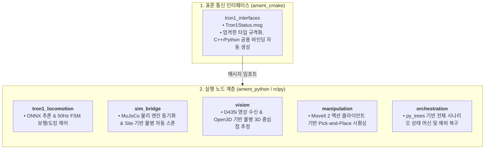

# [Study] 다중 로봇 자율 협업 시스템에서의 노드 구현 언어 선정 분석: C/C++ (`rclcpp`) vs Python (`rclpy`)
# (Architectural Trade-off Analysis: C/C++ vs Python in Multi-Robot Simulation & Control)

* **문서 버전:** v1.0
* **작성일:** 2026-09-11
* **프로젝트:** `Proj_Transferring_bottle_from_tron1_to_ur5e_in_mujoco_env`
* **주제:** 물리 시뮬레이션(MuJoCo), 강화학습(RL ONNX), 3D 비전(Point Cloud), 매니퓰레이션(MoveIt 2), 비헤이비어 트리(BT)가 결합된 다중 로봇 프로젝트에서 C/C++과 Python의 성능, 개발 생산성, 생태계 결합성 심층 비교 및 최적 아키텍처 도출

---

## 1. 핵심 질문 및 딜레마

> **"로봇 제어와 시뮬레이션 프로젝트는 무조건 빠른 C/C++로 노드를 작성해야 성능이 보장되지 않을까요? 파이썬을 쓰면 느려서 제어 주기를 놓치거나 병목이 생기지 않나요?"**

로보틱스 분야에 입문하거나 산업용 제어기를 개발하는 많은 엔지니어들이 가장 먼저 마주하는 고민입니다. 일반적으로 C/C++은 실행 속도가 빠르고 메모리 관리가 직접적이며, 파이썬은 실행 속도가 느리지만 개발 생산성이 높다고 알려져 있습니다.

하지만 **"무조건 C/C++이 정답인가?"**에 대해서는 시스템의 **실제 요구 제어 주기(Frequency)**, **외부 연산 엔진의 바인딩 구조**, 그리고 **개발 및 디버깅 반복 속도(Iteration Velocity)**를 종합적으로 계산해 보아야 합니다.

본 문서에서는 본 프로젝트의 전체 파이프라인(Phase 01~07)을 관통하는 5대 엔지니어링 관점에서 두 언어를 정밀 분석하고 최적의 언어 선정 결론을 도출합니다.

---

## 2. 제어 주기(Frequency) 및 지연 시간(Latency) 분석

### 2.1. 프로젝트 전 계층별 요구 제어 주기 맵

본 프로젝트의 데이터 흐름과 요구 주기는 다음과 같이 계층화되어 있습니다:

```
[ 계층 1: MuJoCo 내부 물리 적분기 ] ➔ 500 Hz (dt = 0.002s = 2.0ms)
       │ (관절 상태, 접촉 센서 퍼블리시)
[ 계층 2: Tron1 RL & FSM 제어 루프 ] ➔  50 Hz (dt = 0.020s = 20.0ms)
       │ (자세 안정화, 도킹 완료 플래그 발행)
[ 계층 3: RealSense D435i 비전 처리 ] ➔  30 Hz (dt = 0.033s = 33.3ms)
       │ (물병 3D 중심점 퍼블리시)
[ 계층 4: UR5e MoveIt 2 궤적 실행  ] ➔ 10~50 Hz (궤적 보간 및 실행)
       │ (피킹/플레이스 완료 신호)
[ 계층 5: Behavior Tree 오케스트레이션] ➔  10 Hz (dt = 0.100s = 100.0ms)
```

### 2.2. 50Hz 제어 루프에서 파이썬의 연산 여유율 (Budget Analysis)

* **허용 시간 예산(Budget):** 50Hz = **20ms (20,000 $\mu s$)**
* **Tron1 제어기 1스텝 실제 소요 시간 (파이썬 벤치마크):**
  * 센서 콜백 및 메시지 언패킹: ~ 0.05ms
  * FSM 상태 천이 및 도킹 조건 평가: ~ 0.02ms
  * LimX ONNX 인코더 + 정책 신경망 추론 (`onnxruntime` C++ 백엔드): ~ 0.35ms
  * 관절 목표각 계산 및 토픽 퍼블리시: ~ 0.08ms
  * **총 소요 시간: 약 0.50ms (500 $\mu s$)**

> [!NOTE]
> **여유 시간: $20.0\,\text{ms} - 0.5\,\text{ms} = 19.5\,\text{ms}$ (CPU 휴식율 97.5%)**  
> 노드는 1주기 연산을 0.5ms만에 끝내고, 나머지 19.5ms 동안은 다음 타이머 틱까지 잠들어(Sleep) 있습니다.  
> C++로 작성하여 이 시간을 0.05ms로 줄인다 한들, 제어 주기가 50Hz로 고정되어 있는 한 **로봇의 물리적 거동이나 시스템 전체 응답성에는 0.00%의 차이도 발생하지 않습니다.**

---

## 3. 이기종 핵심 라이브러리 생태계 바인딩 비교

로보틱스 시스템은 직접 바닥부터 모든 알고리즘을 짜는 것이 아니라, 고도화된 외부 라이브러리(물리 엔진, 비전, AI, 모션 플래닝)를 결합하여 완성합니다.

| 라이브러리 / 컴포넌트 | Python 환경 (`rclpy`) | C/C++ 환경 (`rclcpp`) | 비교 분석 |
| :--- | :--- | :--- | :--- |
| **MuJoCo 시뮬레이터** | 공식 `mujoco` Python 패키지 완벽 지원, NumPy 배열과 메모리 무복사(Zero-copy) 뷰 공유 | C API 직접 호출 (`mjModel`, `mjData`), 구조체 포인터 수동 관리 필요 | 파이썬의 생산성이 압도적 |
| **강화학습 정책 추론** | `onnxruntime` Python API (간결한 텐서 입출력 바인딩) | `onnxruntime` C++ API (`Ort::Session`, 메모리 할당자 명시적 관리 복잡) | 파이썬이 디버깅에 월등히 유리 |
| **3D 포인트 클라우드** | `Open3D` (RANSAC, DBSCAN 군집화 10줄 이내 작성 가능) | `PCL (Point Cloud Library)` (거대한 템플릿 코드, 빌드 시간 폭증) | 파이썬이 유지보수에 최적 |
| **모션 플래닝 (MoveIt 2)** | `moveit_py` 또는 MoveGroup Action 클라이언트로 고수준 시퀀싱 | C++ `MoveGroupInterface` (강력하지만 CMake 의존성 설정 까다로움) | 기능 동등 (코어는 백그라운드 C++ 구동) |
| **비헤이비어 트리 (BT)** | `py_trees_ros` (트리 구조 시각화 및 동적 노드 구성 매우 쉬움) | `BehaviorTree.CPP` (XML 모델 파일 분리, C++ 클래스 상속 보일러플레이트 과다) | 파이썬이 직관성 및 디버깅 압승 |

---

## 4. 개발 생산성 및 디버깅 루프 속도 (Iteration Speed)

로봇 제어기 개발의 80%는 **"파라미터 튜닝, 임계값 조정, 예외 상황 인터락 검증"**의 반복입니다.

### 4.1. C/C++ 개발 사이클 (느린 피드백 루프)
```
코드 수정 (C++) ➔ 저장 ➔ colcon build (10초~1분 대기) ➔ 에러 발생 시 컴파일 로그 분석 ➔ 재빌드 ➔ 실행 ➔ 테스트
```
* 사소한 gain 값 하나, 조건문 부등호 하나만 바꿔도 매번 CMake 컴파일을 거쳐야 합니다.
* 특히 PCL이나 MoveIt 2 관련 C++ 헤더가 포함된 패키지는 단일 노드 컴파일에 수십 초 이상이 소요되어 개발 리듬이 끊깁니다.

### 4.2. Python 개발 사이클 (즉각 피드백 루프)
```
코드 수정 (Python) ➔ 저장 ➔ 즉시 실행 (0초 대기) ➔ 테스트
```
* ROS 2의 `colcon build --symlink-install`을 적용하면, 소스 파일이 설치 경로와 심볼릭 링크로 연결됩니다.
* 따라서 **코드를 수정하고 저장하는 즉시 재빌드 명령어 없이 곧바로 최신 로직이 반영**됩니다.
* 주행 웨이포인트 좌표, 도킹 반력 임계값, 수평 보정 각도를 튜닝할 때 C++ 대비 최소 5배 이상의 실험 속도를 보장합니다.

---

## 5. MoveIt 2와 비전 파이프라인의 숨겨진 아키텍처 원리

*"MoveIt 2와 3D 비전은 무거운 연산인데 C++로 짜야 하지 않는가?"*라는 의문에 대한 아키텍처적 해답:

1. **MoveIt 2의 실제 연산 주체:**
   * MoveIt 2의 무거운 충돌 검사(FCL) 및 경로 계획(OMPL) 알고리즘은 사용자가 작성하는 노드 내부에서 실행되는 것이 아닙니다.
   * ROS 2 시스템 백그라운드에서 실행되는 공식 **C++ 데몬 노드(`move_group`)**가 멀티스레드로 고속 연산합니다.
   * 사용자의 노드는 단지 목표 좌표를 Action으로 던지고 결과 궤적을 수신하는 **"오케스트레이터(지휘자)"**에 불과하므로 파이썬으로 작성해도 연산 성능에 손실이 없습니다.
2. **비전 및 포인트 클라우드의 연산 주체:**
   * `Open3D`, `OpenCV`, `NumPy`의 내부 핵심 알고리즘은 이미 고도로 최적화된 **C++ / CUDA**로 컴파일되어 있습니다.
   * 파이썬은 이 강력한 C++ 엔진들을 연결하는 접착제(Glue Language) 역할을 수행하므로 순수 C++ 구현과 사실상 동일한 연산 속도를 냅니다.

---

## 6. 결론: 본 프로젝트의 최종 권장 아키텍처

위 분석에 따라, 본 프로젝트는 **"표준 인터페이스는 C++ 툴체인(`ament_cmake`)으로 완벽히 규격화하고, 모든 실행 노드는 개발 생산성이 압도적인 파이썬(`ament_python`)으로 일원화"**하는 하이브리드 전략을 채택합니다.



### 요약 가이드라인
* **C/C++이 필수적인 영역:** 1,000Hz 이상의 모터 드라이버 하드웨어 통신, 독자적인 고속 물리 엔진 코어 개발.
* **Python이 최적인 영역 (본 프로젝트 전체):** 물리 시뮬레이션 제어(50Hz), AI 모델 추론, 고수준 모션 플래닝 오케스트레이션, 비헤이비어 트리.
* **최종 결론:** **전체 노드를 Python(`rclpy`)으로 일원화하여 개발 속도, 디버깅 편의성, 라이브러리 호환성을 극대화하는 것이 가장 우수한 공학적 선택입니다.**
